# Curriculum-Review Pack — Coordinate geometry & straight-line graphs (SVG)

Generator: `gen.geometry.coordinate-lines` v`1.0.0`. Stage: SPI-Math Middle School -> Geometry/Algebra bridge (strand `coordinate-geometry-straight-line-graphs`). Generated by `oracle/make_review_pack_coordinate_lines.py`.

> **Review purpose.** Machine-validated coordinate-geometry items with exact-rational answers and deterministic, to-scale Cartesian figures. Every figure is built from the same parameters as the prompt, answer, solution, and accessibility description; coordinates are integers under one round-half-up rule; the figure is byte-for-byte identical between the Python oracle and the TypeScript app. Advancing any item past `machine-validated` is the curriculum authority's decision.

## Objectives under review

| Task | Objective | Canonical answer type |
| --- | --- | --- |
| read_point | `SPI.MIDDLE.GEO.COORD.READ_POINT.01` | coordinate |
| plot_point | `SPI.MIDDLE.GEO.COORD.PLOT_POINT.01` | coordinate |
| gradient_two_points | `SPI.MIDDLE.GEO.COORD.GRADIENT_TWO_POINTS.01` | integer / exact-rational |
| midpoint | `SPI.MIDDLE.GEO.COORD.MIDPOINT.01` | ordered-pair |
| interpret_mx_c | `SPI.MIDDLE.GEO.COORD.INTERPRET_MX_C.01` | equation (m, c) |
| equation_from_graph | `SPI.MIDDLE.GEO.COORD.EQUATION_FROM_GRAPH.01` | equation |
| equation_from_two_points | `SPI.MIDDLE.GEO.COORD.EQUATION_FROM_2PTS.01` | equation |

## read_point — `SPI.MIDDLE.GEO.COORD.READ_POINT.01`

_all four quadrants; scaffolded (with projection guides, lower band) and unscaffolded_

### seed 1 (multiple-choice, band 2)

**Prompt.** Write the coordinates of the point P shown on the grid, as an ordered pair.

_Alt text._ A single point P plotted on a labelled Cartesian grid with equal x and y scales.

**Answer** (coordinate): `(3, -10)`

Options: A. `(-10, 3)`  B. `(3, -10)`  ✓  C. `(3, 10)`  D. `(-3, -10)`

Distractors:

- `(-10, 3)` — MISC.COORD.AXIS_SWAP: Write the x-coordinate first, then the y-coordinate: (x, y).
- `(3, 10)` — MISC.COORD.POINT_REFLECT_X: Read the y-coordinate by its height above or below the x-axis; below the axis is negative.
- `(-3, -10)` — MISC.COORD.POINT_REFLECT_Y: Read the x-coordinate by its distance left or right of the y-axis; left of the axis is negative.

Worked solution: (1) Read across to the y-axis for x, then up or down to the x-axis for y → (3, -10)

Validation: **pass**. Reproduce: `generate(1, {'task': 'read_point', 'interactionType': 'multiple-choice'})`.

### seed 2 (multiple-choice, band 1)

**Prompt.** Write the coordinates of the point P shown on the grid, as an ordered pair.

_Alt text._ A single point P plotted on a labelled Cartesian grid with equal x and y scales.

**Answer** (coordinate): `(5, -4)`

Options: A. `(5, -4)`  ✓  B. `(-4, 5)`  C. `(-5, -4)`  D. `(5, 4)`

Distractors:

- `(-4, 5)` — MISC.COORD.AXIS_SWAP: Write the x-coordinate first, then the y-coordinate: (x, y).
- `(5, 4)` — MISC.COORD.POINT_REFLECT_X: Read the y-coordinate by its height above or below the x-axis; below the axis is negative.
- `(-5, -4)` — MISC.COORD.POINT_REFLECT_Y: Read the x-coordinate by its distance left or right of the y-axis; left of the axis is negative.

Worked solution: (1) Read across to the y-axis for x, then up or down to the x-axis for y → (5, -4)

Validation: **pass**. Reproduce: `generate(2, {'task': 'read_point', 'interactionType': 'multiple-choice'})`.

### seed 5 (multiple-choice, band 2)

**Prompt.** Write the coordinates of the point P shown on the grid, as an ordered pair.

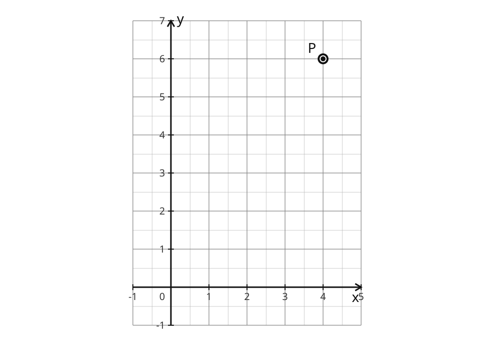

_Alt text._ A single point P plotted on a labelled Cartesian grid with equal x and y scales.

**Answer** (coordinate): `(4, 6)`

Options: A. `(-4, 6)`  B. `(6, 4)`  C. `(4, 6)`  ✓  D. `(4, -6)`

Distractors:

- `(6, 4)` — MISC.COORD.AXIS_SWAP: Write the x-coordinate first, then the y-coordinate: (x, y).
- `(4, -6)` — MISC.COORD.POINT_REFLECT_X: Read the y-coordinate by its height above or below the x-axis; below the axis is negative.
- `(-4, 6)` — MISC.COORD.POINT_REFLECT_Y: Read the x-coordinate by its distance left or right of the y-axis; left of the axis is negative.

Worked solution: (1) Read across to the y-axis for x, then up or down to the x-axis for y → (4, 6)

Validation: **pass**. Reproduce: `generate(5, {'task': 'read_point', 'interactionType': 'multiple-choice'})`.

### seed 7 (multiple-choice, band 2)

**Prompt.** Write the coordinates of the point P shown on the grid, as an ordered pair.

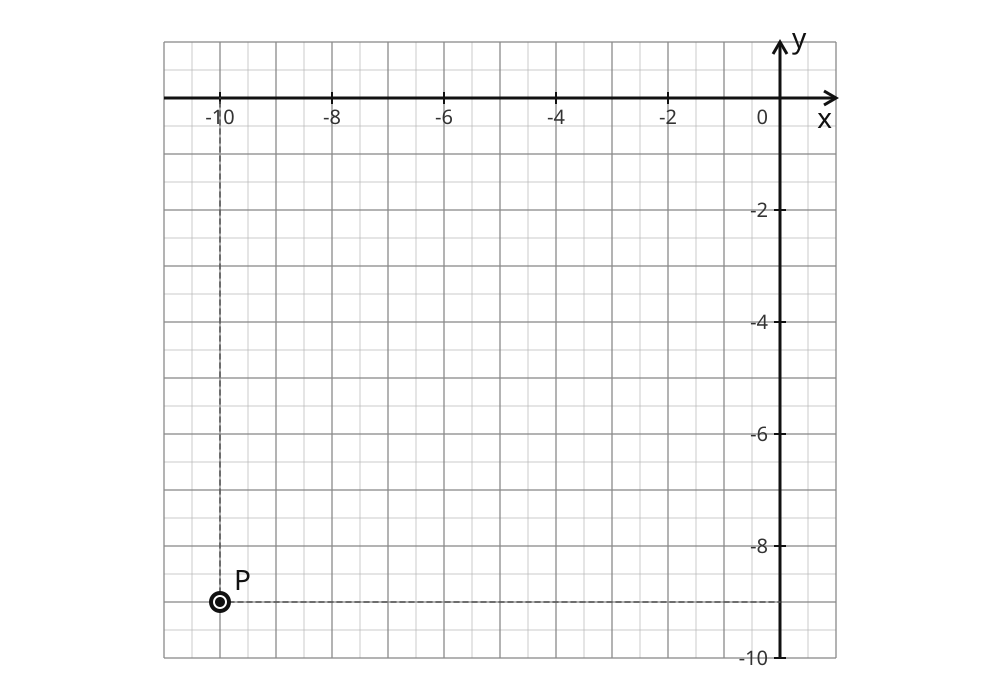

_Alt text._ A single point P plotted on a labelled Cartesian grid with equal x and y scales.

**Answer** (coordinate): `(-10, -9)`

Options: A. `(10, -9)`  B. `(-10, -9)`  ✓  C. `(-9, -10)`  D. `(-10, 9)`

Distractors:

- `(-9, -10)` — MISC.COORD.AXIS_SWAP: Write the x-coordinate first, then the y-coordinate: (x, y).
- `(-10, 9)` — MISC.COORD.POINT_REFLECT_X: Read the y-coordinate by its height above or below the x-axis; below the axis is negative.
- `(10, -9)` — MISC.COORD.POINT_REFLECT_Y: Read the x-coordinate by its distance left or right of the y-axis; left of the axis is negative.

Worked solution: (1) Read across to the y-axis for x, then up or down to the x-axis for y → (-10, -9)

Validation: **pass**. Reproduce: `generate(7, {'task': 'read_point', 'interactionType': 'multiple-choice'})`.

### seed 8 (multiple-choice, band 2)

**Prompt.** Write the coordinates of the point P shown on the grid, as an ordered pair.

_Alt text._ A single point P plotted on a labelled Cartesian grid with equal x and y scales.

**Answer** (coordinate): `(-7, 3)`

Options: A. `(7, 3)`  B. `(-7, 3)`  ✓  C. `(3, -7)`  D. `(-7, -3)`

Distractors:

- `(3, -7)` — MISC.COORD.AXIS_SWAP: Write the x-coordinate first, then the y-coordinate: (x, y).
- `(-7, -3)` — MISC.COORD.POINT_REFLECT_X: Read the y-coordinate by its height above or below the x-axis; below the axis is negative.
- `(7, 3)` — MISC.COORD.POINT_REFLECT_Y: Read the x-coordinate by its distance left or right of the y-axis; left of the axis is negative.

Worked solution: (1) Read across to the y-axis for x, then up or down to the x-axis for y → (-7, 3)

Validation: **pass**. Reproduce: `generate(8, {'task': 'read_point', 'interactionType': 'multiple-choice'})`.

### seed 11 (multiple-choice, band 1)

**Prompt.** Write the coordinates of the point P shown on the grid, as an ordered pair.

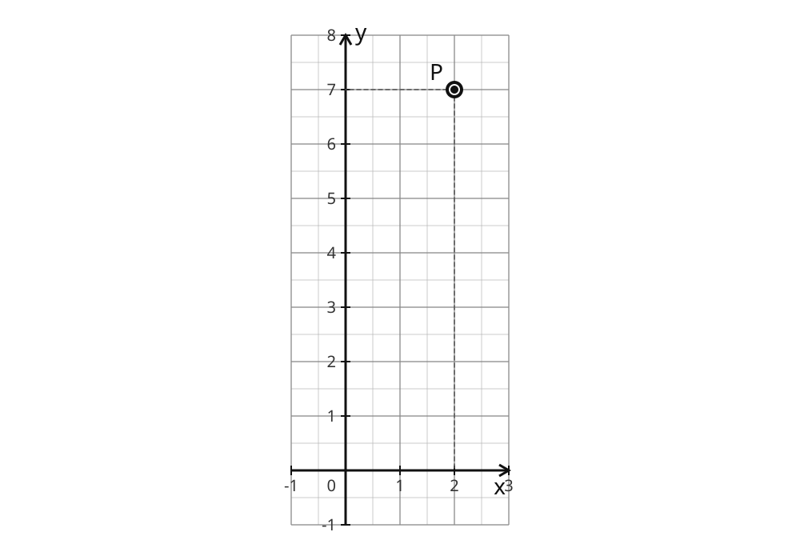

_Alt text._ A single point P plotted on a labelled Cartesian grid with equal x and y scales.

**Answer** (coordinate): `(2, 7)`

Options: A. `(-2, 7)`  B. `(2, -7)`  C. `(7, 2)`  D. `(2, 7)`  ✓

Distractors:

- `(7, 2)` — MISC.COORD.AXIS_SWAP: Write the x-coordinate first, then the y-coordinate: (x, y).
- `(2, -7)` — MISC.COORD.POINT_REFLECT_X: Read the y-coordinate by its height above or below the x-axis; below the axis is negative.
- `(-2, 7)` — MISC.COORD.POINT_REFLECT_Y: Read the x-coordinate by its distance left or right of the y-axis; left of the axis is negative.

Worked solution: (1) Read across to the y-axis for x, then up or down to the x-axis for y → (2, 7)

Validation: **pass**. Reproduce: `generate(11, {'task': 'read_point', 'interactionType': 'multiple-choice'})`.

## plot_point — `SPI.MIDDLE.GEO.COORD.PLOT_POINT.01`

_free-response only; the student SVG is a blank labelled grid (target point ABSENT); the correct point appears only in the answer key / worked solution_

### seed 1 (free-response, band 2)

**Prompt.** Plot the point (3, -10) on the grid.

_Alt text._ A blank labelled Cartesian grid for plotting a point.

**Answer** (coordinate): `(3, -10)`

Worked solution: (1) Count along the x-axis, then up or down the y-axis, and mark the point → (3, -10)

Validation: **pass**. Reproduce: `generate(1, {'task': 'plot_point', 'interactionType': 'free-response'})`.

### seed 2 (free-response, band 2)

**Prompt.** Plot the point (5, -4) on the grid.

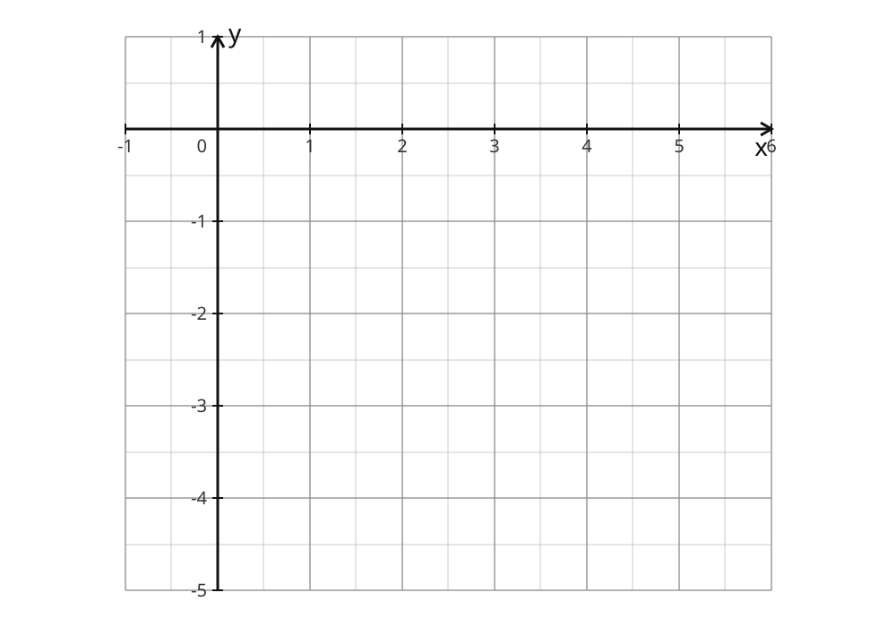

_Alt text._ A blank labelled Cartesian grid for plotting a point.

**Answer** (coordinate): `(5, -4)`

Worked solution: (1) Count along the x-axis, then up or down the y-axis, and mark the point → (5, -4)

Validation: **pass**. Reproduce: `generate(2, {'task': 'plot_point', 'interactionType': 'free-response'})`.

### seed 3 (free-response, band 2)

**Prompt.** Plot the point (5, -10) on the grid.

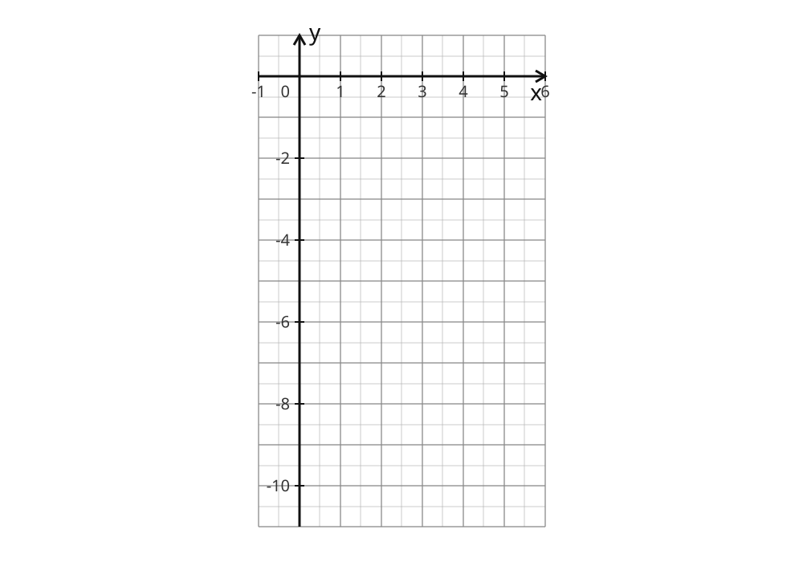

_Alt text._ A blank labelled Cartesian grid for plotting a point.

**Answer** (coordinate): `(5, -10)`

Worked solution: (1) Count along the x-axis, then up or down the y-axis, and mark the point → (5, -10)

Validation: **pass**. Reproduce: `generate(3, {'task': 'plot_point', 'interactionType': 'free-response'})`.

### seed 4 (free-response, band 2)

**Prompt.** Plot the point (9, -4) on the grid.

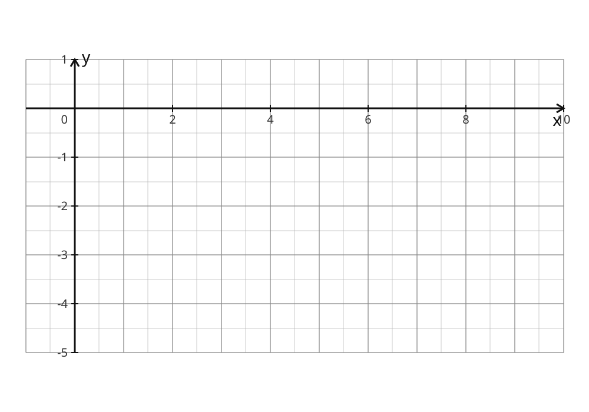

_Alt text._ A blank labelled Cartesian grid for plotting a point.

**Answer** (coordinate): `(9, -4)`

Worked solution: (1) Count along the x-axis, then up or down the y-axis, and mark the point → (9, -4)

Validation: **pass**. Reproduce: `generate(4, {'task': 'plot_point', 'interactionType': 'free-response'})`.

## gradient_two_points — `SPI.MIDDLE.GEO.COORD.GRADIENT_TWO_POINTS.01`

_positive/negative/zero, integer + fractional gradients; zero gradient is FREE-RESPONSE ONLY; one scaffolded figure (unlabelled rise/run step)_

### seed 4 (multiple-choice, band 3)

**Prompt.** Find the gradient of the line through A (8, -1) and B (-4, -4).

_Alt text._ Two points A and B plotted on a labelled Cartesian grid with equal x and y scales.

**Answer** (exact-rational): `1/4`

Options: A. `4`  B. `1/4`  ✓  C. `-5/4`  D. `-1/4`

Distractors:

- `4` — MISC.COORD.GRADIENT_INVERTED: Gradient is rise over run: divide the change in y by the change in x.
- `-1/4` — MISC.COORD.GRADIENT_SIGN: Subtract the x-coordinates and the y-coordinates in the SAME order; keep the signs consistent.
- `-5/4` — MISC.COORD.GRADIENT_SUM_BOTH: Gradient uses the DIFFERENCES: (y2 - y1) divided by (x2 - x1), not the sums.

Worked solution: (1) Find the rise (change in y) and the run (change in x) → rise = -3, run = -12 (2) Divide the rise by the run and simplify → gradient = 1/4

Validation: **pass**. Reproduce: `generate(4, {'task': 'gradient_two_points', 'interactionType': 'multiple-choice'})`.

### seed 5 (multiple-choice, band 3)

**Prompt.** Find the gradient of the line through A (4, -5) and B (1, -9).

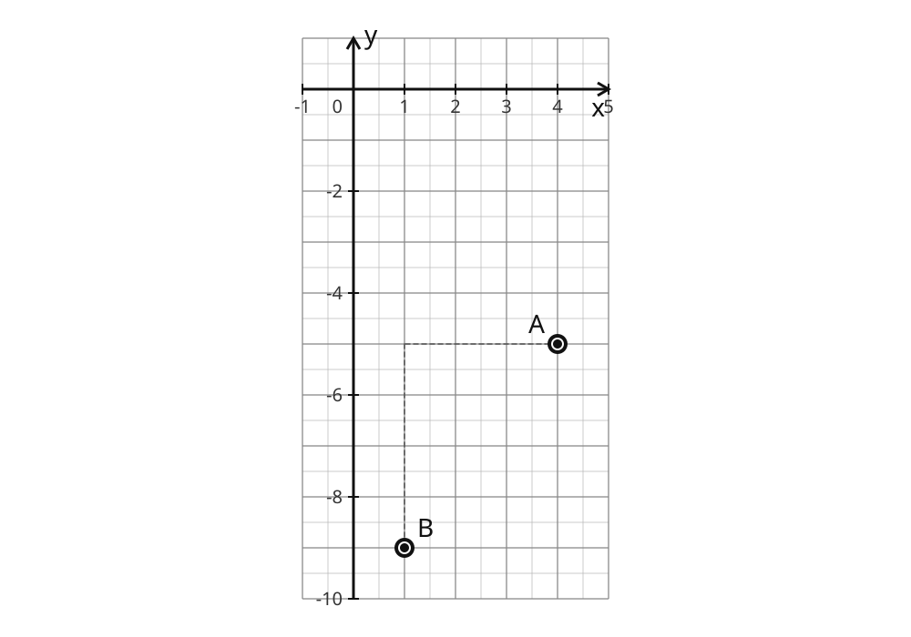

_Alt text._ Two points A and B plotted on a labelled Cartesian grid with equal x and y scales.

**Answer** (exact-rational): `4/3`

Options: A. `-14/5`  B. `4/3`  ✓  C. `-4/3`  D. `3/4`

Distractors:

- `3/4` — MISC.COORD.GRADIENT_INVERTED: Gradient is rise over run: divide the change in y by the change in x.
- `-4/3` — MISC.COORD.GRADIENT_SIGN: Subtract the x-coordinates and the y-coordinates in the SAME order; keep the signs consistent.
- `-14/5` — MISC.COORD.GRADIENT_SUM_BOTH: Gradient uses the DIFFERENCES: (y2 - y1) divided by (x2 - x1), not the sums.

Worked solution: (1) Find the rise (change in y) and the run (change in x) → rise = -4, run = -3 (2) Divide the rise by the run and simplify → gradient = 4/3

Validation: **pass**. Reproduce: `generate(5, {'task': 'gradient_two_points', 'interactionType': 'multiple-choice'})`.

### seed 1 (multiple-choice, band 3)

**Prompt.** Find the gradient of the line through A (4, 10) and B (10, 0).

_Alt text._ Two points A and B plotted on a labelled Cartesian grid with equal x and y scales.

**Answer** (exact-rational): `-5/3`

Options: A. `-5/3`  ✓  B. `5/7`  C. `-3/5`  D. `5/3`

Distractors:

- `-3/5` — MISC.COORD.GRADIENT_INVERTED: Gradient is rise over run: divide the change in y by the change in x.
- `5/3` — MISC.COORD.GRADIENT_SIGN: Subtract the x-coordinates and the y-coordinates in the SAME order; keep the signs consistent.
- `5/7` — MISC.COORD.GRADIENT_SUM_BOTH: Gradient uses the DIFFERENCES: (y2 - y1) divided by (x2 - x1), not the sums.

Worked solution: (1) Find the rise (change in y) and the run (change in x) → rise = -10, run = 6 (2) Divide the rise by the run and simplify → gradient = -5/3

Validation: **pass**. Reproduce: `generate(1, {'task': 'gradient_two_points', 'interactionType': 'multiple-choice'})`.

### seed 2 (multiple-choice, band 3)

**Prompt.** Find the gradient of the line through A (2, 6) and B (-1, 8).

_Alt text._ Two points A and B plotted on a labelled Cartesian grid with equal x and y scales.

**Answer** (exact-rational): `-2/3`

Options: A. `14`  B. `-2/3`  ✓  C. `2/3`  D. `-3/2`

Distractors:

- `-3/2` — MISC.COORD.GRADIENT_INVERTED: Gradient is rise over run: divide the change in y by the change in x.
- `2/3` — MISC.COORD.GRADIENT_SIGN: Subtract the x-coordinates and the y-coordinates in the SAME order; keep the signs consistent.
- `14` — MISC.COORD.GRADIENT_SUM_BOTH: Gradient uses the DIFFERENCES: (y2 - y1) divided by (x2 - x1), not the sums.

Worked solution: (1) Find the rise (change in y) and the run (change in x) → rise = 2, run = -3 (2) Divide the rise by the run and simplify → gradient = -2/3

Validation: **pass**. Reproduce: `generate(2, {'task': 'gradient_two_points', 'interactionType': 'multiple-choice'})`.

### seed 7 (multiple-choice, band 2)

**Prompt.** Find the gradient of the line through A (2, 9) and B (5, -9).

_Alt text._ Two points A and B plotted on a labelled Cartesian grid with equal x and y scales.

**Answer** (integer): `-6`

Options: A. `0`  B. `6`  C. `-1/6`  D. `-6`  ✓

Distractors:

- `-1/6` — MISC.COORD.GRADIENT_INVERTED: Gradient is rise over run: divide the change in y by the change in x.
- `6` — MISC.COORD.GRADIENT_SIGN: Subtract the x-coordinates and the y-coordinates in the SAME order; keep the signs consistent.
- `0` — MISC.COORD.GRADIENT_SUM_BOTH: Gradient uses the DIFFERENCES: (y2 - y1) divided by (x2 - x1), not the sums.

Worked solution: (1) Find the rise (change in y) and the run (change in x) → rise = -18, run = 3 (2) Divide the rise by the run and simplify → gradient = -6

Validation: **pass**. Reproduce: `generate(7, {'task': 'gradient_two_points', 'interactionType': 'multiple-choice'})`.

### seed 35 (free-response, band 2)

**Prompt.** Find the gradient of the line through A (5, -2) and B (8, -2).

_Alt text._ Two points A and B plotted on a labelled Cartesian grid with equal x and y scales.

**Answer** (integer): `0`

Worked solution: (1) Find the rise (change in y) and the run (change in x) → rise = 0, run = 3 (2) Divide the rise by the run and simplify → gradient = 0

Validation: **pass**. Reproduce: `generate(35, {'task': 'gradient_two_points', 'interactionType': 'free-response'})`.

### seed 1 (free-response, band 3)

**Prompt.** Find the gradient of the line through A (4, 10) and B (10, 0).

_Alt text._ Two points A and B plotted on a labelled Cartesian grid with equal x and y scales.

**Answer** (exact-rational): `-5/3`

Worked solution: (1) Find the rise (change in y) and the run (change in x) → rise = -10, run = 6 (2) Divide the rise by the run and simplify → gradient = -5/3

Validation: **pass**. Reproduce: `generate(1, {'task': 'gradient_two_points', 'interactionType': 'free-response'})`.

## midpoint — `SPI.MIDDLE.GEO.COORD.MIDPOINT.01`

_integer and half-integer midpoints; the midpoint is NOT marked in the figure (endpoints only)_

### seed 1 (multiple-choice, band 2)

**Prompt.** Find the midpoint of the line segment joining A (3, -10) and B (1, 10).

_Alt text._ Two endpoints A and B of a segment plotted on a labelled Cartesian grid with equal x and y scales.

**Answer** (ordered-pair): `(2, 0)`

Options: A. `(4, 0)`  B. `(-1, 10)`  C. `(2, 0)`  ✓  D. `(0, 2)`

Distractors:

- `(-1, 10)` — MISC.COORD.MIDPOINT_DIFFERENCE: Midpoint averages the coordinates: add them and divide by 2, do not subtract.
- `(4, 0)` — MISC.COORD.MIDPOINT_SUM_NO_HALF: After adding each pair of coordinates, divide by 2 to find the midpoint.
- `(0, 2)` — MISC.COORD.AXIS_SWAP: Write the x-coordinate first, then the y-coordinate: (x, y).

Worked solution: (1) Average the x-coordinates → (3 + 1) / 2 = 2 (2) Average the y-coordinates → (-10 + 10) / 2 = 0 (3) Write the midpoint as an ordered pair → (2, 0)

Validation: **pass**. Reproduce: `generate(1, {'task': 'midpoint', 'interactionType': 'multiple-choice'})`.

### seed 6 (multiple-choice, band 2)

**Prompt.** Find the midpoint of the line segment joining A (1, -10) and B (3, -6).

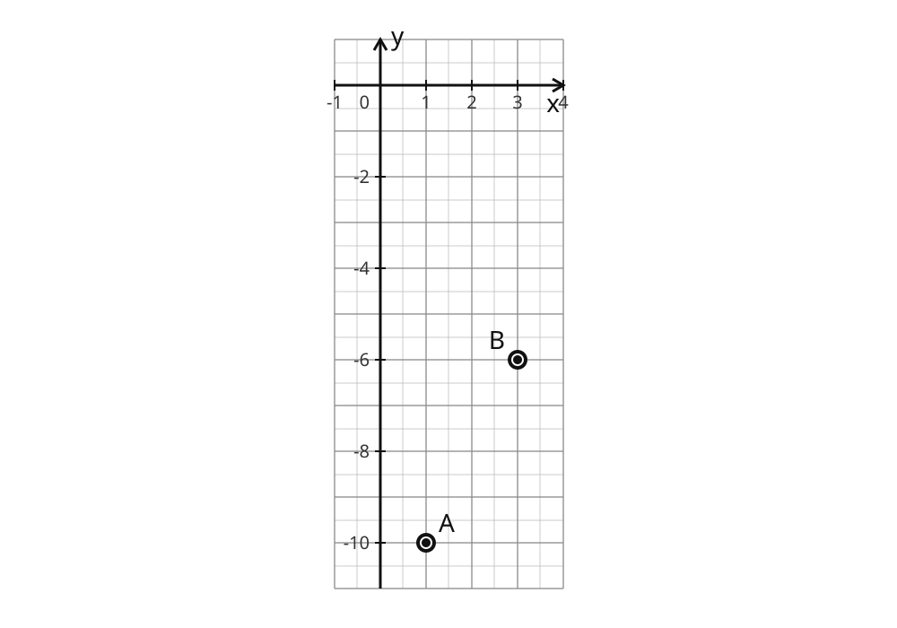

_Alt text._ Two endpoints A and B of a segment plotted on a labelled Cartesian grid with equal x and y scales.

**Answer** (ordered-pair): `(2, -8)`

Options: A. `(1, 2)`  B. `(-8, 2)`  C. `(2, -8)`  ✓  D. `(4, -16)`

Distractors:

- `(1, 2)` — MISC.COORD.MIDPOINT_DIFFERENCE: Midpoint averages the coordinates: add them and divide by 2, do not subtract.
- `(4, -16)` — MISC.COORD.MIDPOINT_SUM_NO_HALF: After adding each pair of coordinates, divide by 2 to find the midpoint.
- `(-8, 2)` — MISC.COORD.AXIS_SWAP: Write the x-coordinate first, then the y-coordinate: (x, y).

Worked solution: (1) Average the x-coordinates → (1 + 3) / 2 = 2 (2) Average the y-coordinates → (-10 + -6) / 2 = -8 (3) Write the midpoint as an ordered pair → (2, -8)

Validation: **pass**. Reproduce: `generate(6, {'task': 'midpoint', 'interactionType': 'multiple-choice'})`.

### seed 2 (multiple-choice, band 2)

**Prompt.** Find the midpoint of the line segment joining A (5, -4) and B (-5, 1).

_Alt text._ Two endpoints A and B of a segment plotted on a labelled Cartesian grid with equal x and y scales.

**Answer** (ordered-pair): `(0, -3/2)`

Options: A. `(0, -3)`  B. `(0, -3/2)`  ✓  C. `(-5, 5/2)`  D. `(-3/2, 0)`

Distractors:

- `(-5, 5/2)` — MISC.COORD.MIDPOINT_DIFFERENCE: Midpoint averages the coordinates: add them and divide by 2, do not subtract.
- `(0, -3)` — MISC.COORD.MIDPOINT_SUM_NO_HALF: After adding each pair of coordinates, divide by 2 to find the midpoint.
- `(-3/2, 0)` — MISC.COORD.AXIS_SWAP: Write the x-coordinate first, then the y-coordinate: (x, y).

Worked solution: (1) Average the x-coordinates → (5 + -5) / 2 = 0 (2) Average the y-coordinates → (-4 + 1) / 2 = -3/2 (3) Write the midpoint as an ordered pair → (0, -3/2)

Validation: **pass**. Reproduce: `generate(2, {'task': 'midpoint', 'interactionType': 'multiple-choice'})`.

### seed 3 (multiple-choice, band 3)

**Prompt.** Find the midpoint of the line segment joining A (5, -10) and B (-1, -9).

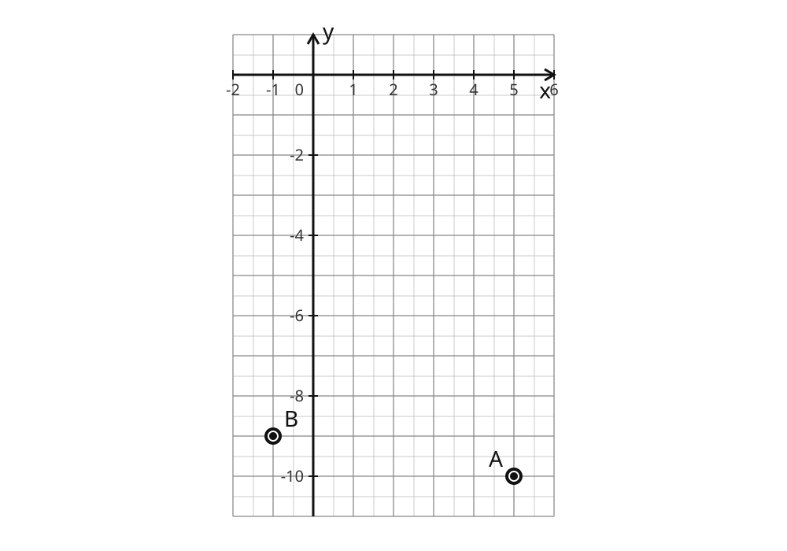

_Alt text._ Two endpoints A and B of a segment plotted on a labelled Cartesian grid with equal x and y scales.

**Answer** (ordered-pair): `(2, -19/2)`

Options: A. `(4, -19)`  B. `(2, -19/2)`  ✓  C. `(-3, 1/2)`  D. `(-19/2, 2)`

Distractors:

- `(-3, 1/2)` — MISC.COORD.MIDPOINT_DIFFERENCE: Midpoint averages the coordinates: add them and divide by 2, do not subtract.
- `(4, -19)` — MISC.COORD.MIDPOINT_SUM_NO_HALF: After adding each pair of coordinates, divide by 2 to find the midpoint.
- `(-19/2, 2)` — MISC.COORD.AXIS_SWAP: Write the x-coordinate first, then the y-coordinate: (x, y).

Worked solution: (1) Average the x-coordinates → (5 + -1) / 2 = 2 (2) Average the y-coordinates → (-10 + -9) / 2 = -19/2 (3) Write the midpoint as an ordered pair → (2, -19/2)

Validation: **pass**. Reproduce: `generate(3, {'task': 'midpoint', 'interactionType': 'multiple-choice'})`.

### seed 4 (multiple-choice, band 3)

**Prompt.** Find the midpoint of the line segment joining A (9, -4) and B (-6, -9).

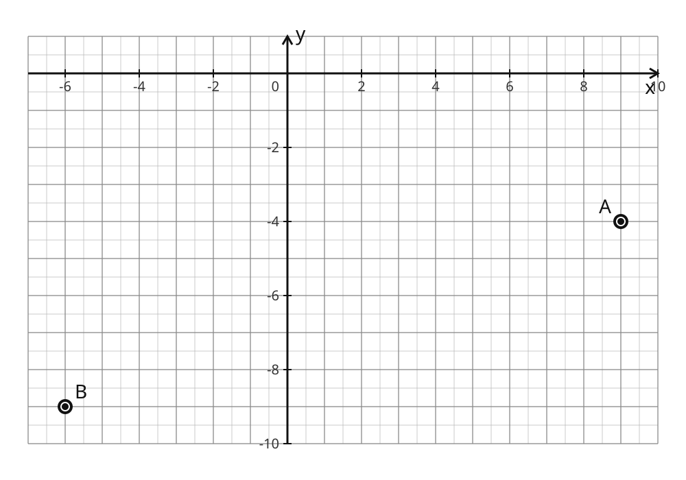

_Alt text._ Two endpoints A and B of a segment plotted on a labelled Cartesian grid with equal x and y scales.

**Answer** (ordered-pair): `(3/2, -13/2)`

Options: A. `(3, -13)`  B. `(-13/2, 3/2)`  C. `(-15/2, -5/2)`  D. `(3/2, -13/2)`  ✓

Distractors:

- `(-15/2, -5/2)` — MISC.COORD.MIDPOINT_DIFFERENCE: Midpoint averages the coordinates: add them and divide by 2, do not subtract.
- `(3, -13)` — MISC.COORD.MIDPOINT_SUM_NO_HALF: After adding each pair of coordinates, divide by 2 to find the midpoint.
- `(-13/2, 3/2)` — MISC.COORD.AXIS_SWAP: Write the x-coordinate first, then the y-coordinate: (x, y).

Worked solution: (1) Average the x-coordinates → (9 + -6) / 2 = 3/2 (2) Average the y-coordinates → (-4 + -9) / 2 = -13/2 (3) Write the midpoint as an ordered pair → (3/2, -13/2)

Validation: **pass**. Reproduce: `generate(4, {'task': 'midpoint', 'interactionType': 'multiple-choice'})`.

## interpret_mx_c — `SPI.MIDDLE.GEO.COORD.INTERPRET_MX_C.01`

_text-only (no figure); integer + fractional gradients, negative intercept, and the constant case y = c; answer displayed as 'm = .., c = ..'_

### seed 7 (multiple-choice, band 3)

**Prompt.** For the straight line y = -6x + 9, write down the gradient m and the y-intercept c.

**Answer** (equation): `m = -6, c = 9`

Options: A. `m = -6, c = 3/2`  B. `m = -6, c = 9`  ✓  C. `m = 9, c = -6`  D. `m = -6, c = -9`

Distractors:

- `m = 9, c = -6` — MISC.COORD.MC_SWAPPED: In y = mx + c the gradient m multiplies x; the intercept c is the constant term.
- `m = -6, c = -9` — MISC.COORD.INTERCEPT_SIGN: Read the y-intercept where the line crosses the y-axis, keeping its sign (below the origin is negative).
- `m = -6, c = 3/2` — MISC.COORD.READS_X_INTERCEPT: The y-intercept c is where the line meets the y-axis (x = 0), not where it meets the x-axis.

Worked solution: (1) The gradient m is the coefficient of x → m = -6 (2) The y-intercept c is the constant term → c = 9

Validation: **pass**. Reproduce: `generate(7, {'task': 'interpret_mx_c', 'interactionType': 'multiple-choice'})`.

### seed 1 (multiple-choice, band 3)

**Prompt.** For the straight line y = (-5/3)x + 1, write down the gradient m and the y-intercept c.

**Answer** (equation): `m = -5/3, c = 1`

Options: A. `m = 1, c = -5/3`  B. `m = -5/3, c = 1`  ✓  C. `m = -5/3, c = -1`  D. `m = -5/3, c = 3/5`

Distractors:

- `m = 1, c = -5/3` — MISC.COORD.MC_SWAPPED: In y = mx + c the gradient m multiplies x; the intercept c is the constant term.
- `m = -5/3, c = -1` — MISC.COORD.INTERCEPT_SIGN: Read the y-intercept where the line crosses the y-axis, keeping its sign (below the origin is negative).
- `m = -5/3, c = 3/5` — MISC.COORD.READS_X_INTERCEPT: The y-intercept c is where the line meets the y-axis (x = 0), not where it meets the x-axis.

Worked solution: (1) The gradient m is the coefficient of x → m = -5/3 (2) The y-intercept c is the constant term → c = 1

Validation: **pass**. Reproduce: `generate(1, {'task': 'interpret_mx_c', 'interactionType': 'multiple-choice'})`.

### seed 2 (multiple-choice, band 3)

**Prompt.** For the straight line y = (-2/3)x - 4, write down the gradient m and the y-intercept c.

**Answer** (equation): `m = -2/3, c = -4`

Options: A. `m = -2/3, c = -4`  ✓  B. `m = -4, c = -2/3`  C. `m = -2/3, c = -6`  D. `m = -2/3, c = 4`

Distractors:

- `m = -4, c = -2/3` — MISC.COORD.MC_SWAPPED: In y = mx + c the gradient m multiplies x; the intercept c is the constant term.
- `m = -2/3, c = 4` — MISC.COORD.INTERCEPT_SIGN: Read the y-intercept where the line crosses the y-axis, keeping its sign (below the origin is negative).
- `m = -2/3, c = -6` — MISC.COORD.READS_X_INTERCEPT: The y-intercept c is where the line meets the y-axis (x = 0), not where it meets the x-axis.

Worked solution: (1) The gradient m is the coefficient of x → m = -2/3 (2) The y-intercept c is the constant term → c = -4

Validation: **pass**. Reproduce: `generate(2, {'task': 'interpret_mx_c', 'interactionType': 'multiple-choice'})`.

### seed 2 (multiple-choice, band 3)

**Prompt.** For the straight line y = (-2/3)x - 4, write down the gradient m and the y-intercept c.

**Answer** (equation): `m = -2/3, c = -4`

Options: A. `m = -2/3, c = -4`  ✓  B. `m = -4, c = -2/3`  C. `m = -2/3, c = -6`  D. `m = -2/3, c = 4`

Distractors:

- `m = -4, c = -2/3` — MISC.COORD.MC_SWAPPED: In y = mx + c the gradient m multiplies x; the intercept c is the constant term.
- `m = -2/3, c = 4` — MISC.COORD.INTERCEPT_SIGN: Read the y-intercept where the line crosses the y-axis, keeping its sign (below the origin is negative).
- `m = -2/3, c = -6` — MISC.COORD.READS_X_INTERCEPT: The y-intercept c is where the line meets the y-axis (x = 0), not where it meets the x-axis.

Worked solution: (1) The gradient m is the coefficient of x → m = -2/3 (2) The y-intercept c is the constant term → c = -4

Validation: **pass**. Reproduce: `generate(2, {'task': 'interpret_mx_c', 'interactionType': 'multiple-choice'})`.

### seed 35 (free-response, band 2)

**Prompt.** For the straight line y = 4, write down the gradient m and the y-intercept c.

**Answer** (equation): `m = 0, c = 4`

Worked solution: (1) The gradient m is the coefficient of x → m = 0 (2) The y-intercept c is the constant term → c = 4

Validation: **pass**. Reproduce: `generate(35, {'task': 'interpret_mx_c', 'interactionType': 'free-response'})`.

## equation_from_graph — `SPI.MIDDLE.GEO.COORD.EQUATION_FROM_GRAPH.01`

_the line carries a NEUTRAL label 'l' (no equation/gradient/intercept shown); positive/negative gradient, positive/negative/zero intercept (through the origin), fractional gradient_

### seed 10 (multiple-choice, band 4)

**Prompt.** Find the equation of the line l shown on the grid, in the form y = mx + c.

_Alt text._ A straight line drawn on a labelled Cartesian grid with equal x and y scales.

**Answer** (equation): `y = (5/3)x + 3`

Options: A. `y = (5/3)x - 3`  B. `y = (5/3)x + 3`  ✓  C. `y = (3/5)x + 3`  D. `y = (5/3)x - 9/5`

Distractors:

- `y = (3/5)x + 3` — MISC.COORD.GRADIENT_INVERTED: Gradient is rise over run: divide the change in y by the change in x.
- `y = (5/3)x - 3` — MISC.COORD.INTERCEPT_SIGN: Read the y-intercept where the line crosses the y-axis, keeping its sign (below the origin is negative).
- `y = (5/3)x - 9/5` — MISC.COORD.READS_X_INTERCEPT: The y-intercept c is where the line meets the y-axis (x = 0), not where it meets the x-axis.

Worked solution: (1) Read the gradient as rise over run between two lattice points → m = 5/3 (2) Read where the line crosses the y-axis for the intercept → c = 3 (3) Write the equation in the form y = mx + c → y = (5/3)x + 3

Validation: **pass**. Reproduce: `generate(10, {'task': 'equation_from_graph', 'interactionType': 'multiple-choice'})`.

### seed 2 (multiple-choice, band 4)

**Prompt.** Find the equation of the line l shown on the grid, in the form y = mx + c.

_Alt text._ A straight line drawn on a labelled Cartesian grid with equal x and y scales.

**Answer** (equation): `y = (-2/3)x - 3`

Options: A. `y = (-2/3)x - 3`  ✓  B. `y = (-3/2)x - 3`  C. `y = (-2/3)x - 9/2`  D. `y = (-2/3)x + 3`

Distractors:

- `y = (-3/2)x - 3` — MISC.COORD.GRADIENT_INVERTED: Gradient is rise over run: divide the change in y by the change in x.
- `y = (-2/3)x + 3` — MISC.COORD.INTERCEPT_SIGN: Read the y-intercept where the line crosses the y-axis, keeping its sign (below the origin is negative).
- `y = (-2/3)x - 9/2` — MISC.COORD.READS_X_INTERCEPT: The y-intercept c is where the line meets the y-axis (x = 0), not where it meets the x-axis.

Worked solution: (1) Read the gradient as rise over run between two lattice points → m = -2/3 (2) Read where the line crosses the y-axis for the intercept → c = -3 (3) Write the equation in the form y = mx + c → y = (-2/3)x - 3

Validation: **pass**. Reproduce: `generate(2, {'task': 'equation_from_graph', 'interactionType': 'multiple-choice'})`.

### seed 1 (free-response, band 4)

**Prompt.** Find the equation of the line l shown on the grid, in the form y = mx + c.

_Alt text._ A straight line drawn on a labelled Cartesian grid with equal x and y scales.

**Answer** (equation): `y = (-5/3)x`

Worked solution: (1) Read the gradient as rise over run between two lattice points → m = -5/3 (2) Read where the line crosses the y-axis for the intercept → c = 0 (3) Write the equation in the form y = mx + c → y = (-5/3)x

Validation: **pass**. Reproduce: `generate(1, {'task': 'equation_from_graph', 'interactionType': 'free-response'})`.

## equation_from_two_points — `SPI.MIDDLE.GEO.COORD.EQUATION_FROM_2PTS.01`

_the two given points are plotted (A, B) with the line through them; no equation label_

### seed 5 (multiple-choice, band 5)

**Prompt.** Find the equation of the line through A (4, -5) and B (1, -9), in the form y = mx + c.

_Alt text._ Two points A and B plotted on a labelled Cartesian grid with equal x and y scales. A straight line is drawn through them.

**Answer** (equation): `y = (4/3)x - 31/3`

Options: A. `y = (4/3)x - 31/3`  ✓  B. `y = (4/3)x + 31/3`  C. `y = (3/4)x - 31/3`  D. `y = (-4/3)x - 31/3`

Distractors:

- `y = (3/4)x - 31/3` — MISC.COORD.GRADIENT_INVERTED: Gradient is rise over run: divide the change in y by the change in x.
- `y = (-4/3)x - 31/3` — MISC.COORD.GRADIENT_SIGN: Subtract the x-coordinates and the y-coordinates in the SAME order; keep the signs consistent.
- `y = (4/3)x + 31/3` — MISC.COORD.INTERCEPT_SIGN: Read the y-intercept where the line crosses the y-axis, keeping its sign (below the origin is negative).

Worked solution: (1) Find the gradient from the two points → m = 4/3 (2) Substitute one point to find the y-intercept c → c = -31/3 (3) Write the equation in the form y = mx + c → y = (4/3)x - 31/3

Validation: **pass**. Reproduce: `generate(5, {'task': 'equation_from_two_points', 'interactionType': 'multiple-choice'})`.

### seed 8 (multiple-choice, band 3)

**Prompt.** Find the equation of the line through A (3, 1) and B (4, 3), in the form y = mx + c.

_Alt text._ Two points A and B plotted on a labelled Cartesian grid with equal x and y scales. A straight line is drawn through them.

**Answer** (equation): `y = 2x - 5`

Options: A. `y = -2x - 5`  B. `y = (1/2)x - 5`  C. `y = 2x - 5`  ✓  D. `y = 2x + 5`

Distractors:

- `y = (1/2)x - 5` — MISC.COORD.GRADIENT_INVERTED: Gradient is rise over run: divide the change in y by the change in x.
- `y = -2x - 5` — MISC.COORD.GRADIENT_SIGN: Subtract the x-coordinates and the y-coordinates in the SAME order; keep the signs consistent.
- `y = 2x + 5` — MISC.COORD.INTERCEPT_SIGN: Read the y-intercept where the line crosses the y-axis, keeping its sign (below the origin is negative).

Worked solution: (1) Find the gradient from the two points → m = 2 (2) Substitute one point to find the y-intercept c → c = -5 (3) Write the equation in the form y = mx + c → y = 2x - 5

Validation: **pass**. Reproduce: `generate(8, {'task': 'equation_from_two_points', 'interactionType': 'multiple-choice'})`.

### seed 1 (multiple-choice, band 5)

**Prompt.** Find the equation of the line through A (4, 10) and B (10, 0), in the form y = mx + c.

_Alt text._ Two points A and B plotted on a labelled Cartesian grid with equal x and y scales. A straight line is drawn through them.

**Answer** (equation): `y = (-5/3)x + 50/3`

Options: A. `y = (-3/5)x + 50/3`  B. `y = (-5/3)x + 50/3`  ✓  C. `y = (-5/3)x - 50/3`  D. `y = (5/3)x + 50/3`

Distractors:

- `y = (-3/5)x + 50/3` — MISC.COORD.GRADIENT_INVERTED: Gradient is rise over run: divide the change in y by the change in x.
- `y = (5/3)x + 50/3` — MISC.COORD.GRADIENT_SIGN: Subtract the x-coordinates and the y-coordinates in the SAME order; keep the signs consistent.
- `y = (-5/3)x - 50/3` — MISC.COORD.INTERCEPT_SIGN: Read the y-intercept where the line crosses the y-axis, keeping its sign (below the origin is negative).

Worked solution: (1) Find the gradient from the two points → m = -5/3 (2) Substitute one point to find the y-intercept c → c = 50/3 (3) Write the equation in the form y = mx + c → y = (-5/3)x + 50/3

Validation: **pass**. Reproduce: `generate(1, {'task': 'equation_from_two_points', 'interactionType': 'multiple-choice'})`.

### seed 2 (multiple-choice, band 5)

**Prompt.** Find the equation of the line through A (2, 6) and B (-1, 8), in the form y = mx + c.

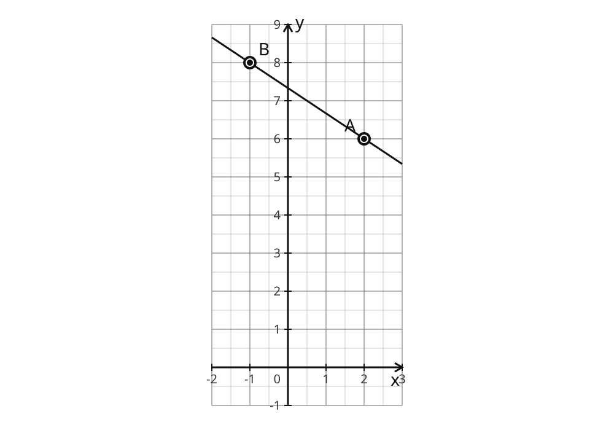

_Alt text._ Two points A and B plotted on a labelled Cartesian grid with equal x and y scales. A straight line is drawn through them.

**Answer** (equation): `y = (-2/3)x + 22/3`

Options: A. `y = (-2/3)x + 22/3`  ✓  B. `y = (2/3)x + 22/3`  C. `y = (-2/3)x - 22/3`  D. `y = (-3/2)x + 22/3`

Distractors:

- `y = (-3/2)x + 22/3` — MISC.COORD.GRADIENT_INVERTED: Gradient is rise over run: divide the change in y by the change in x.
- `y = (2/3)x + 22/3` — MISC.COORD.GRADIENT_SIGN: Subtract the x-coordinates and the y-coordinates in the SAME order; keep the signs consistent.
- `y = (-2/3)x - 22/3` — MISC.COORD.INTERCEPT_SIGN: Read the y-intercept where the line crosses the y-axis, keeping its sign (below the origin is negative).

Worked solution: (1) Find the gradient from the two points → m = -2/3 (2) Substitute one point to find the y-intercept c → c = 22/3 (3) Write the equation in the form y = mx + c → y = (-2/3)x + 22/3

Validation: **pass**. Reproduce: `generate(2, {'task': 'equation_from_two_points', 'interactionType': 'multiple-choice'})`.

## Diagnostics

- **Difficulty bands reached (per task):** {'read_point': [1, 2], 'plot_point': [1, 2], 'gradient_two_points': [2, 3, 4], 'midpoint': [2, 3], 'interpret_mx_c': [2, 3], 'equation_from_graph': [3, 4], 'equation_from_two_points': [3, 4, 5]}
- **Gradient coverage:** {'positive': 283, 'negative': 275, 'zero': 7, 'integer': 150, 'fractional': 415}
- **Midpoint coverage:** {'integer': 141, 'halfInteger': 454}
- **Misconception rules exemplified:** 11 of 11 — ['MISC.COORD.AXIS_SWAP', 'MISC.COORD.GRADIENT_INVERTED', 'MISC.COORD.GRADIENT_SIGN', 'MISC.COORD.GRADIENT_SUM_BOTH', 'MISC.COORD.INTERCEPT_SIGN', 'MISC.COORD.MC_SWAPPED', 'MISC.COORD.MIDPOINT_DIFFERENCE', 'MISC.COORD.MIDPOINT_SUM_NO_HALF', 'MISC.COORD.POINT_REFLECT_X', 'MISC.COORD.POINT_REFLECT_Y', 'MISC.COORD.READS_X_INTERCEPT']
- **Multiple-choice 3-distinct-distractor invariant:** 4000/4000 items
- **Monochrome (canonical SVG):** colours ['#111', '#333', '#555', '#888', '#bbb', '#fff']; no colour-only information; sweep 4000
- **Answer-leakage violations (figure text contains a coordinate/fraction/equation):** 0
- **High-resolution raster export:** 6000×4200 (scale 6) derived from the canonical SVG; the SVG remains the authoritative 8K-like deliverable.
