# Curriculum-Review Pack — Geometry: Angles, Lines & Triangles (SVG diagrams)

Generator: `gen.geometry.angles-figures` v`1.2.2`. Stage: SPI-Math Middle School -> Geometry -> Ch.21 (Angles, Lines, Triangles). Generated by `oracle/make_review_pack_geometry.py`.

> **Review purpose.** Machine-validated diagram items with exact integer-degree answers. Advancing any item or objective to `curriculum-reviewed` / `approved` / `published` is the curriculum authority's decision. The diagram IS the question: every figure is built from the same parameters as the prompt and answer, ray directions come from a committed integer table (no runtime trigonometry), coordinates use one round-half-up rule, and the SVG is byte-for-byte identical between the Python oracle and the TypeScript app. All figures are **NOT TO SCALE**.

## Objectives under review (one task each)

| Task | Family | Objective | MC? |
| --- | --- | --- | --- |
| straight_line_missing_angle | F1 | `SPI.MIDDLE.GEO.ANGLES_STRAIGHT_LINE.01` | yes |
| triangle_missing_angle | F2 | `SPI.MIDDLE.GEO.TRIANGLE_ANGLE_SUM.01` | yes |
| isosceles_base_angle | F2 | `SPI.MIDDLE.GEO.ISOSCELES_BASE_ANGLES.01` | yes |
| vertically_opposite_angle | F3 | `SPI.MIDDLE.GEO.VERTICALLY_OPPOSITE_ANGLES.01` | no (free-response only in the current approved scope) |
| angles_at_point_missing | F3 | `SPI.MIDDLE.GEO.ANGLES_AT_POINT.01` | yes |

## Platform-gate summaries

- **Distractor collision / deterministic regeneration:** over a 10,000-seed MC sweep, **10,000** items had exactly three distinct, formula-backed distractors; **0** violations. When three cannot be formed, the generator deterministically regenerates parameters (same seed -> same item).
- **To-scale fidelity (non-blocking diagnostic):** across 2,000 vertically-opposite items, the worst drawn-ray error is **0.1186 deg** (tolerance 0.5 deg). This diagnostic is the only place `atan2` is used; it never gates generation or validation.
- **Monochrome / no colour-only information:** across 2,000 items the only colours used are `#111, #444` (near-black inks); no information is conveyed by colour alone.
- **Multi-item export:** Multiple inline SVGs in one exported worksheet have NO duplicate DOM ids, each carries role=img + aria-label + <title>/<desc>, and no answer appears in any accessibility text. Enforced by apps/generator-studio/a11y.test.ts.

## Misconception rule coverage (MC distractor rules)

| ID | Misconception | Formula (teacher) | Example (seed · task -> distractor vs answer) | Student feedback |
| --- | --- | --- | --- | --- |
| `MISC.GEOM.LINE.USES_360` | Uses 360 on a straight line | `360 - sum(givens)` | 1 · straight_line_missing_angle -> 261° (correct 81°) | Angles on a straight line sum to 180 degrees, not 360. Subtract the given angles from 180. |
| `MISC.GEOM.LINE.RETURNS_SUM_GIVENS` | Returns the sum of the givens | `sum(givens)` | 1 · straight_line_missing_angle -> 99° (correct 81°) | You added the given angles. Subtract their total from 180 to find the unknown. |
| `MISC.GEOM.LINE.FORGOT_ONE_GIVEN` | Forgot one given angle | `180 - sum(all but one given)` | 1 · straight_line_missing_angle -> 170° (correct 81°) | Include every given angle. Subtract the total of all of them from 180. |
| `MISC.GEOM.TRI.USES_360` | Uses 360 for a triangle | `360 - A - B` | 1 · triangle_missing_angle -> 246° (correct 66°) | The interior angles of a triangle sum to 180 degrees, not 360. |
| `MISC.GEOM.TRI.RETURNS_SUM_GIVENS` | Returns the sum of the givens | `A + B` | 1 · triangle_missing_angle -> 114° (correct 66°) | You added the two known angles. Subtract their total from 180. |
| `MISC.GEOM.TRI.SUBTRACTS_ONLY_ONE_GIVEN` | Subtracts only one given | `180 - A` | 1 · triangle_missing_angle -> 76° (correct 66°) | Subtract both known angles from 180, not just one. |
| `MISC.GEOM.ISO.FORGOT_TO_HALVE` | Forgot to halve | `180 - apex` | 1 · isosceles_base_angle -> 160° (correct 80°) | After subtracting the apex from 180, share the result equally between the two base angles (divide by 2). |
| `MISC.GEOM.ISO.HALVES_180_ONLY` | Halved 180 instead of (180 - apex) | `90 - apex` | 1 · isosceles_base_angle -> 70° (correct 80°) | Subtract the apex from 180 first, then divide by 2. |
| `MISC.GEOM.ISO.APEX_EQUALS_BASE` | Base equals apex | `apex` | 1 · isosceles_base_angle -> 20° (correct 80°) | The base angles are not equal to the apex; use base = (180 - apex) divided by 2. |
| `MISC.GEOM.POINT.USES_180` | Uses 180 around a point | `180 - sum(givens)` | 1 · angles_at_point_missing -> 83° (correct 263°) | Angles around a point sum to 360 degrees, not 180. |
| `MISC.GEOM.POINT.RETURNS_SUM_GIVENS` | Returns the sum of the givens | `sum(givens)` | 1 · angles_at_point_missing -> 97° (correct 263°) | You added the given angles. Subtract their total from 360. |
| `MISC.GEOM.POINT.FORGOT_ONE_GIVEN` | Forgot one given angle | `360 - sum(all but one given)` | 1 · angles_at_point_missing -> 328° (correct 263°) | Include every given angle; subtract their total from 360. |
| `MISC.GEOM.VO.USES_SUPPLEMENTARY` | Uses the supplementary angle | `180 - theta` | — (diagnostic-only) | — |

_`MISC.GEOM.VO.USES_SUPPLEMENTARY` is diagnostic-only: vertically-opposite is free-response in v1.0.0, so it is never used to build a multiple-choice distractor._

## straight_line_missing_angle · free-response — 5 examples  (F1, `SPI.MIDDLE.GEO.ANGLES_STRAIGHT_LINE.01`)

### straight_line_missing_angle / free-response #1 — band 2 (floor 1, range [1, 3])

- **Objective:** `SPI.MIDDLE.GEO.ANGLES_STRAIGHT_LINE.01`  ·  **Family:** F1  ·  **Calculator:** calculator-not-required
- **Interaction type:** free-response  ·  **Answer type:** integer  ·  **Units:** degrees
- **Canonical value:** `num=81, den=1` -> `81°`  ·  **Givens:** `[10, 89]`
- **Seed:** `1`  ·  **Generator:** v`1.2.2`  ·  **Parameters:** `{"task": "straight_line_missing_angle", "regions": [10, 89, 81], "unknownIndex": 2}`
- **Difficulty axes:** `{"numericalComplexity": 0.5, "reasoningSteps": 0.5, "representation": 0.6, "abstraction": 0.5}`  ·  **Band:** 2
- **To scale:** False (figure is NOT drawn to scale)
- **Reproduce:** `generate(1, {"task": "straight_line_missing_angle", "interactionType": "free-response"})` on v`1.2.2`

**Question**

> Find the size of the unknown angle x, in degrees.

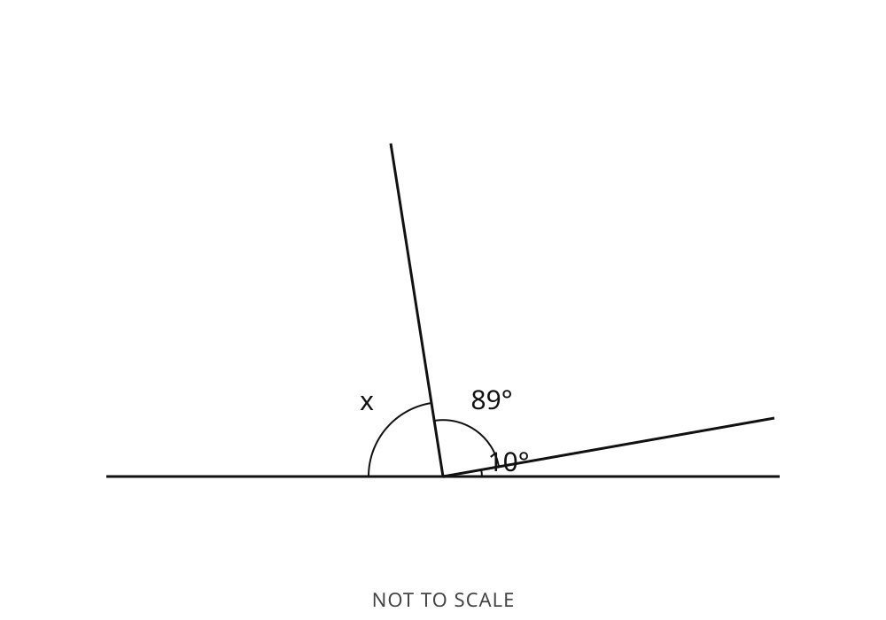

<details><summary>Inline SVG (source)</summary>

```xml
<svg xmlns="http://www.w3.org/2000/svg" viewBox="0 0 1000 700" role="img" aria-label="Diagram: angles adjacent on one side of a straight line, with an unknown angle x.">
<title>Angles on a straight line</title>
<desc>Angles of 10 degrees, 89 degrees and an unknown angle x are adjacent, in order, along one side of a straight line.</desc>
<style>.gl{stroke:#111;stroke-width:3;fill:none}.ga{stroke:#111;stroke-width:2;fill:none}.gt{stroke:#111;stroke-width:3}.gx{stroke:#111;stroke-width:3}.gv{fill:#111}text{font-family:sans-serif;font-size:30px;fill:#111}.gn{font-size:22px;fill:#444;letter-spacing:1px}</style>
<line class="gl" x1="880" y1="538" x2="120" y2="538"/>
<line class="gl" x1="500" y1="538" x2="874" y2="472"/>
<line class="gl" x1="500" y1="538" x2="441" y2="162"/>
<path class="ga" d="M 544 538 A 44 44 0 0 0 543 530"/>
<path class="ga" d="M 563 527 A 64 64 0 0 0 490 475"/>
<path class="ga" d="M 487 455 A 84 84 0 0 0 416 538"/>
<line class="gx" x1="552" y1="533" x2="562" y2="506"/>
<text x="575" y="475" text-anchor="middle">10°</text>
<text x="578" y="431" text-anchor="middle">89°</text>
<text x="409" y="459" text-anchor="middle">x</text>
<text class="gn" x="500" y="685" text-anchor="middle">NOT TO SCALE</text>
</svg>
```

</details>

**Alt text:** Diagram: angles adjacent on one side of a straight line, with an unknown angle x.

**Long description:** Angles of 10 degrees, 89 degrees and an unknown angle x are adjacent, in order, along one side of a straight line.

**Data-table fallback**

| angle | value |
| --- | --- |
| angle 1 | 10 degrees |
| angle 2 | 89 degrees |
| x | unknown |

**Answer:** `x = 81°`

**Worked solution**

1. State the angle fact — `Angles on a straight line sum to 180 degrees`
2. Form the equation — `x = 180 - (10 + 89)`
3. Evaluate — `x = 81°`

_Free-response: no distractors._

**Diagram-to-data validation:** `svg-realises-data`=pass  `arc-region-measure-agreement`=pass  `arc-large-flag-correct`=pass  `arc-sweep-correct`=pass  `arc-matches-cyclic-region`=pass  `label-inside-intended-region`=pass  `reflex-region-rendered-correctly`=pass  `no-theorem-revealing-markers`=n/a  `target-region-unambiguous`=n/a  `labels-non-overlapping`=pass  `not-to-scale`=pass  `no-answer-leakage`=pass  `media-present`=pass

**Accessibility validation:** `a11y-fields-present`=pass  `a11y-no-answer-in-text`=pass  `a11y-equivalent-information`=pass  `nonColorIndicators`=True

**Overall validation:** pass

**Curriculum decision:** [ ] approve  [ ] revise  [ ] reject — notes: ____

---

### straight_line_missing_angle / free-response #2 — band 3 (floor 1, range [1, 3])

- **Objective:** `SPI.MIDDLE.GEO.ANGLES_STRAIGHT_LINE.01`  ·  **Family:** F1  ·  **Calculator:** calculator-not-required
- **Interaction type:** free-response  ·  **Answer type:** integer  ·  **Units:** degrees
- **Canonical value:** `num=41, den=1` -> `41°`  ·  **Givens:** `[55, 37, 47]`
- **Seed:** `2`  ·  **Generator:** v`1.2.2`  ·  **Parameters:** `{"task": "straight_line_missing_angle", "regions": [55, 37, 47, 41], "unknownIndex": 3}`
- **Difficulty axes:** `{"numericalComplexity": 0.75, "reasoningSteps": 0.5, "representation": 0.6, "abstraction": 0.5}`  ·  **Band:** 3
- **To scale:** False (figure is NOT drawn to scale)
- **Reproduce:** `generate(2, {"task": "straight_line_missing_angle", "interactionType": "free-response"})` on v`1.2.2`

**Question**

> Find the size of the unknown angle x, in degrees.


<details><summary>Inline SVG (source)</summary>

```xml
<svg xmlns="http://www.w3.org/2000/svg" viewBox="0 0 1000 700" role="img" aria-label="Diagram: angles adjacent on one side of a straight line, with an unknown angle x.">
<title>Angles on a straight line</title>
<desc>Angles of 55 degrees, 37 degrees, 47 degrees and an unknown angle x are adjacent, in order, along one side of a straight line.</desc>
<style>.gl{stroke:#111;stroke-width:3;fill:none}.ga{stroke:#111;stroke-width:2;fill:none}.gt{stroke:#111;stroke-width:3}.gx{stroke:#111;stroke-width:3}.gv{fill:#111}text{font-family:sans-serif;font-size:30px;fill:#111}.gn{font-size:22px;fill:#444;letter-spacing:1px}</style>
<line class="gl" x1="880" y1="540" x2="120" y2="540"/>
<line class="gl" x1="500" y1="540" x2="718" y2="229"/>
<line class="gl" x1="500" y1="540" x2="487" y2="160"/>
<line class="gl" x1="500" y1="540" x2="213" y2="291"/>
<path class="ga" d="M 544 540 A 44 44 0 0 0 525 504"/>
<path class="ga" d="M 537 488 A 64 64 0 0 0 498 476"/>
<path class="ga" d="M 497 456 A 84 84 0 0 0 437 485"/>
<path class="ga" d="M 422 472 A 104 104 0 0 0 396 540"/>
<text x="586" y="496" text-anchor="middle">55°</text>
<text x="534" y="429" text-anchor="middle">37°</text>
<text x="449" y="431" text-anchor="middle">47°</text>
<text x="369" y="490" text-anchor="middle">x</text>
<text class="gn" x="500" y="685" text-anchor="middle">NOT TO SCALE</text>
</svg>
```

</details>

**Alt text:** Diagram: angles adjacent on one side of a straight line, with an unknown angle x.

**Long description:** Angles of 55 degrees, 37 degrees, 47 degrees and an unknown angle x are adjacent, in order, along one side of a straight line.

**Data-table fallback**

| angle | value |
| --- | --- |
| angle 1 | 55 degrees |
| angle 2 | 37 degrees |
| angle 3 | 47 degrees |
| x | unknown |

**Answer:** `x = 41°`

**Worked solution**

1. State the angle fact — `Angles on a straight line sum to 180 degrees`
2. Form the equation — `x = 180 - (55 + 37 + 47)`
3. Evaluate — `x = 41°`

_Free-response: no distractors._

**Diagram-to-data validation:** `svg-realises-data`=pass  `arc-region-measure-agreement`=pass  `arc-large-flag-correct`=pass  `arc-sweep-correct`=pass  `arc-matches-cyclic-region`=pass  `label-inside-intended-region`=pass  `reflex-region-rendered-correctly`=pass  `no-theorem-revealing-markers`=n/a  `target-region-unambiguous`=n/a  `labels-non-overlapping`=pass  `not-to-scale`=pass  `no-answer-leakage`=pass  `media-present`=pass

**Accessibility validation:** `a11y-fields-present`=pass  `a11y-no-answer-in-text`=pass  `a11y-equivalent-information`=pass  `nonColorIndicators`=True

**Overall validation:** pass

**Curriculum decision:** [ ] approve  [ ] revise  [ ] reject — notes: ____

---

### straight_line_missing_angle / free-response #3 — band 3 (floor 1, range [1, 3])

- **Objective:** `SPI.MIDDLE.GEO.ANGLES_STRAIGHT_LINE.01`  ·  **Family:** F1  ·  **Calculator:** calculator-not-required
- **Interaction type:** free-response  ·  **Answer type:** integer  ·  **Units:** degrees
- **Canonical value:** `num=78, den=1` -> `78°`  ·  **Givens:** `[15, 72, 15]`
- **Seed:** `3`  ·  **Generator:** v`1.2.2`  ·  **Parameters:** `{"task": "straight_line_missing_angle", "regions": [15, 72, 15, 78], "unknownIndex": 3}`
- **Difficulty axes:** `{"numericalComplexity": 0.75, "reasoningSteps": 0.5, "representation": 0.6, "abstraction": 0.5}`  ·  **Band:** 3
- **To scale:** False (figure is NOT drawn to scale)
- **Reproduce:** `generate(3, {"task": "straight_line_missing_angle", "interactionType": "free-response"})` on v`1.2.2`

**Question**

> Find the size of the unknown angle x, in degrees.


<details><summary>Inline SVG (source)</summary>

```xml
<svg xmlns="http://www.w3.org/2000/svg" viewBox="0 0 1000 700" role="img" aria-label="Diagram: angles adjacent on one side of a straight line, with an unknown angle x.">
<title>Angles on a straight line</title>
<desc>Angles of 15 degrees, 72 degrees, 15 degrees and an unknown angle x are adjacent, in order, along one side of a straight line.</desc>
<style>.gl{stroke:#111;stroke-width:3;fill:none}.ga{stroke:#111;stroke-width:2;fill:none}.gt{stroke:#111;stroke-width:3}.gx{stroke:#111;stroke-width:3}.gv{fill:#111}text{font-family:sans-serif;font-size:30px;fill:#111}.gn{font-size:22px;fill:#444;letter-spacing:1px}</style>
<line class="gl" x1="880" y1="540" x2="120" y2="540"/>
<line class="gl" x1="500" y1="540" x2="867" y2="441"/>
<line class="gl" x1="500" y1="540" x2="520" y2="160"/>
<line class="gl" x1="500" y1="540" x2="421" y2="168"/>
<path class="ga" d="M 544 540 A 44 44 0 0 0 542 529"/>
<path class="ga" d="M 562 523 A 64 64 0 0 0 503 476"/>
<path class="ga" d="M 504 456 A 84 84 0 0 0 483 458"/>
<path class="ga" d="M 478 438 A 104 104 0 0 0 396 540"/>
<text x="761" y="508" text-anchor="middle">15°</text>
<text x="563" y="462" text-anchor="middle">72°</text>
<text x="481" y="262" text-anchor="middle">15°</text>
<text x="391" y="452" text-anchor="middle">x</text>
<text class="gn" x="500" y="685" text-anchor="middle">NOT TO SCALE</text>
</svg>
```

</details>

**Alt text:** Diagram: angles adjacent on one side of a straight line, with an unknown angle x.

**Long description:** Angles of 15 degrees, 72 degrees, 15 degrees and an unknown angle x are adjacent, in order, along one side of a straight line.

**Data-table fallback**

| angle | value |
| --- | --- |
| angle 1 | 15 degrees |
| angle 2 | 72 degrees |
| angle 3 | 15 degrees |
| x | unknown |

**Answer:** `x = 78°`

**Worked solution**

1. State the angle fact — `Angles on a straight line sum to 180 degrees`
2. Form the equation — `x = 180 - (15 + 72 + 15)`
3. Evaluate — `x = 78°`

_Free-response: no distractors._

**Diagram-to-data validation:** `svg-realises-data`=pass  `arc-region-measure-agreement`=pass  `arc-large-flag-correct`=pass  `arc-sweep-correct`=pass  `arc-matches-cyclic-region`=pass  `label-inside-intended-region`=pass  `reflex-region-rendered-correctly`=pass  `no-theorem-revealing-markers`=n/a  `target-region-unambiguous`=n/a  `labels-non-overlapping`=pass  `not-to-scale`=pass  `no-answer-leakage`=pass  `media-present`=pass

**Accessibility validation:** `a11y-fields-present`=pass  `a11y-no-answer-in-text`=pass  `a11y-equivalent-information`=pass  `nonColorIndicators`=True

**Overall validation:** pass

**Curriculum decision:** [ ] approve  [ ] revise  [ ] reject — notes: ____

---

### straight_line_missing_angle / free-response #4 — band 2 (floor 1, range [1, 3])

- **Objective:** `SPI.MIDDLE.GEO.ANGLES_STRAIGHT_LINE.01`  ·  **Family:** F1  ·  **Calculator:** calculator-not-required
- **Interaction type:** free-response  ·  **Answer type:** integer  ·  **Units:** degrees
- **Canonical value:** `num=10, den=1` -> `10°`  ·  **Givens:** `[110, 60]`
- **Seed:** `6`  ·  **Generator:** v`1.2.2`  ·  **Parameters:** `{"task": "straight_line_missing_angle", "regions": [10, 110, 60], "unknownIndex": 0}`
- **Difficulty axes:** `{"numericalComplexity": 0.5, "reasoningSteps": 0.5, "representation": 0.6, "abstraction": 0.3}`  ·  **Band:** 2
- **To scale:** False (figure is NOT drawn to scale)
- **Reproduce:** `generate(6, {"task": "straight_line_missing_angle", "interactionType": "free-response"})` on v`1.2.2`

**Question**

> Find the size of the unknown angle x, in degrees.


<details><summary>Inline SVG (source)</summary>

```xml
<svg xmlns="http://www.w3.org/2000/svg" viewBox="0 0 1000 700" role="img" aria-label="Diagram: angles adjacent on one side of a straight line, with an unknown angle x.">
<title>Angles on a straight line</title>
<desc>Angles of 110 degrees, 60 degrees and an unknown angle x are adjacent, in order, along one side of a straight line.</desc>
<style>.gl{stroke:#111;stroke-width:3;fill:none}.ga{stroke:#111;stroke-width:2;fill:none}.gt{stroke:#111;stroke-width:3}.gx{stroke:#111;stroke-width:3}.gv{fill:#111}text{font-family:sans-serif;font-size:30px;fill:#111}.gn{font-size:22px;fill:#444;letter-spacing:1px}</style>
<line class="gl" x1="880" y1="515" x2="120" y2="515"/>
<line class="gl" x1="500" y1="515" x2="874" y2="448"/>
<line class="gl" x1="500" y1="515" x2="310" y2="185"/>
<path class="ga" d="M 544 515 A 44 44 0 0 0 543 507"/>
<path class="ga" d="M 563 504 A 64 64 0 0 0 468 460"/>
<path class="ga" d="M 458 442 A 84 84 0 0 0 416 515"/>
<line class="gx" x1="552" y1="510" x2="564" y2="495"/>
<text x="578" y="480" text-anchor="middle">x</text>
<text x="542" y="424" text-anchor="middle">110°</text>
<text x="396" y="455" text-anchor="middle">60°</text>
<text class="gn" x="500" y="685" text-anchor="middle">NOT TO SCALE</text>
</svg>
```

</details>

**Alt text:** Diagram: angles adjacent on one side of a straight line, with an unknown angle x.

**Long description:** Angles of 110 degrees, 60 degrees and an unknown angle x are adjacent, in order, along one side of a straight line.

**Data-table fallback**

| angle | value |
| --- | --- |
| angle 1 | 110 degrees |
| angle 2 | 60 degrees |
| x | unknown |

**Answer:** `x = 10°`

**Worked solution**

1. State the angle fact — `Angles on a straight line sum to 180 degrees`
2. Form the equation — `x = 180 - (110 + 60)`
3. Evaluate — `x = 10°`

_Free-response: no distractors._

**Diagram-to-data validation:** `svg-realises-data`=pass  `arc-region-measure-agreement`=pass  `arc-large-flag-correct`=pass  `arc-sweep-correct`=pass  `arc-matches-cyclic-region`=pass  `label-inside-intended-region`=pass  `reflex-region-rendered-correctly`=pass  `no-theorem-revealing-markers`=n/a  `target-region-unambiguous`=n/a  `labels-non-overlapping`=pass  `not-to-scale`=pass  `no-answer-leakage`=pass  `media-present`=pass

**Accessibility validation:** `a11y-fields-present`=pass  `a11y-no-answer-in-text`=pass  `a11y-equivalent-information`=pass  `nonColorIndicators`=True

**Overall validation:** pass

**Curriculum decision:** [ ] approve  [ ] revise  [ ] reject — notes: ____

---

### straight_line_missing_angle / free-response #5 — band 1 (floor 1, range [1, 3])

- **Objective:** `SPI.MIDDLE.GEO.ANGLES_STRAIGHT_LINE.01`  ·  **Family:** F1  ·  **Calculator:** calculator-not-required
- **Interaction type:** free-response  ·  **Answer type:** integer  ·  **Units:** degrees
- **Canonical value:** `num=110, den=1` -> `110°`  ·  **Givens:** `[70]`
- **Seed:** `8`  ·  **Generator:** v`1.2.2`  ·  **Parameters:** `{"task": "straight_line_missing_angle", "regions": [110, 70], "unknownIndex": 0}`
- **Difficulty axes:** `{"numericalComplexity": 0.25, "reasoningSteps": 0.5, "representation": 0.6, "abstraction": 0.3}`  ·  **Band:** 1
- **To scale:** False (figure is NOT drawn to scale)
- **Reproduce:** `generate(8, {"task": "straight_line_missing_angle", "interactionType": "free-response"})` on v`1.2.2`

**Question**

> Find the size of the unknown angle x, in degrees.

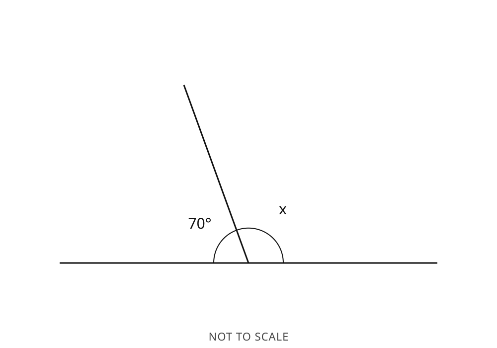

<details><summary>Inline SVG (source)</summary>

```xml
<svg xmlns="http://www.w3.org/2000/svg" viewBox="0 0 1000 700" role="img" aria-label="Diagram: angles adjacent on one side of a straight line, with an unknown angle x.">
<title>Angles on a straight line</title>
<desc>Angles of 70 degrees and an unknown angle x are adjacent, in order, along one side of a straight line.</desc>
<style>.gl{stroke:#111;stroke-width:3;fill:none}.ga{stroke:#111;stroke-width:2;fill:none}.gt{stroke:#111;stroke-width:3}.gx{stroke:#111;stroke-width:3}.gv{fill:#111}text{font-family:sans-serif;font-size:30px;fill:#111}.gn{font-size:22px;fill:#444;letter-spacing:1px}</style>
<line class="gl" x1="880" y1="529" x2="120" y2="529"/>
<line class="gl" x1="500" y1="529" x2="370" y2="171"/>
<path class="ga" d="M 544 529 A 44 44 0 0 0 485 488"/>
<path class="ga" d="M 478 469 A 64 64 0 0 0 436 529"/>
<text x="546" y="463" text-anchor="middle">x</text>
<text x="418" y="472" text-anchor="middle">70°</text>
<text class="gn" x="500" y="685" text-anchor="middle">NOT TO SCALE</text>
</svg>
```

</details>

**Alt text:** Diagram: angles adjacent on one side of a straight line, with an unknown angle x.

**Long description:** Angles of 70 degrees and an unknown angle x are adjacent, in order, along one side of a straight line.

**Data-table fallback**

| angle | value |
| --- | --- |
| angle 1 | 70 degrees |
| x | unknown |

**Answer:** `x = 110°`

**Worked solution**

1. State the angle fact — `Angles on a straight line sum to 180 degrees`
2. Form the equation — `x = 180 - (70)`
3. Evaluate — `x = 110°`

_Free-response: no distractors._

**Diagram-to-data validation:** `svg-realises-data`=pass  `arc-region-measure-agreement`=pass  `arc-large-flag-correct`=pass  `arc-sweep-correct`=pass  `arc-matches-cyclic-region`=pass  `label-inside-intended-region`=pass  `reflex-region-rendered-correctly`=pass  `no-theorem-revealing-markers`=n/a  `target-region-unambiguous`=n/a  `labels-non-overlapping`=pass  `not-to-scale`=pass  `no-answer-leakage`=pass  `media-present`=pass

**Accessibility validation:** `a11y-fields-present`=pass  `a11y-no-answer-in-text`=pass  `a11y-equivalent-information`=pass  `nonColorIndicators`=True

**Overall validation:** pass

**Curriculum decision:** [ ] approve  [ ] revise  [ ] reject — notes: ____

---

## straight_line_missing_angle · multiple-choice — 5 examples  (F1, `SPI.MIDDLE.GEO.ANGLES_STRAIGHT_LINE.01`)

### straight_line_missing_angle / multiple-choice #1 — band 2 (floor 1, range [1, 3])

- **Objective:** `SPI.MIDDLE.GEO.ANGLES_STRAIGHT_LINE.01`  ·  **Family:** F1  ·  **Calculator:** calculator-not-required
- **Interaction type:** multiple-choice  ·  **Answer type:** integer  ·  **Units:** degrees
- **Canonical value:** `num=81, den=1` -> `81°`  ·  **Givens:** `[10, 89]`
- **Seed:** `1`  ·  **Generator:** v`1.2.2`  ·  **Parameters:** `{"task": "straight_line_missing_angle", "regions": [10, 89, 81], "unknownIndex": 2}`
- **Difficulty axes:** `{"numericalComplexity": 0.5, "reasoningSteps": 0.5, "representation": 0.6, "abstraction": 0.5}`  ·  **Band:** 2
- **To scale:** False (figure is NOT drawn to scale)
- **Reproduce:** `generate(1, {"task": "straight_line_missing_angle", "interactionType": "multiple-choice"})` on v`1.2.2`

**Question**

> Find the size of the unknown angle x, in degrees.


<details><summary>Inline SVG (source)</summary>

```xml
<svg xmlns="http://www.w3.org/2000/svg" viewBox="0 0 1000 700" role="img" aria-label="Diagram: angles adjacent on one side of a straight line, with an unknown angle x.">
<title>Angles on a straight line</title>
<desc>Angles of 10 degrees, 89 degrees and an unknown angle x are adjacent, in order, along one side of a straight line.</desc>
<style>.gl{stroke:#111;stroke-width:3;fill:none}.ga{stroke:#111;stroke-width:2;fill:none}.gt{stroke:#111;stroke-width:3}.gx{stroke:#111;stroke-width:3}.gv{fill:#111}text{font-family:sans-serif;font-size:30px;fill:#111}.gn{font-size:22px;fill:#444;letter-spacing:1px}</style>
<line class="gl" x1="880" y1="538" x2="120" y2="538"/>
<line class="gl" x1="500" y1="538" x2="874" y2="472"/>
<line class="gl" x1="500" y1="538" x2="441" y2="162"/>
<path class="ga" d="M 544 538 A 44 44 0 0 0 543 530"/>
<path class="ga" d="M 563 527 A 64 64 0 0 0 490 475"/>
<path class="ga" d="M 487 455 A 84 84 0 0 0 416 538"/>
<line class="gx" x1="552" y1="533" x2="562" y2="506"/>
<text x="575" y="475" text-anchor="middle">10°</text>
<text x="578" y="431" text-anchor="middle">89°</text>
<text x="409" y="459" text-anchor="middle">x</text>
<text class="gn" x="500" y="685" text-anchor="middle">NOT TO SCALE</text>
</svg>
```

</details>

**Alt text:** Diagram: angles adjacent on one side of a straight line, with an unknown angle x.

**Long description:** Angles of 10 degrees, 89 degrees and an unknown angle x are adjacent, in order, along one side of a straight line.

**Data-table fallback**

| angle | value |
| --- | --- |
| angle 1 | 10 degrees |
| angle 2 | 89 degrees |
| x | unknown |

**Answer:** `x = 81°`

**Worked solution**

1. State the angle fact — `Angles on a straight line sum to 180 degrees`
2. Form the equation — `x = 180 - (10 + 89)`
3. Evaluate — `x = 81°`

**MC option order:** A. 99°  B. 261°  C. 81° (correct)  D. 170°

**Distractor calculations (each a distinct misconception pathway)**

| Value | Formula (teacher) | Misconception | Rationale | Student feedback |
| --- | --- | --- | --- | --- |
| `261°` | `360 - sum(givens)` | Uses 360 on a straight line (`MISC.GEOM.LINE.USES_360`) | Subtracted from 360 instead of 180. | Angles on a straight line sum to 180 degrees, not 360. Subtract the given angles from 180. |
| `99°` | `sum(givens)` | Returns the sum of the givens (`MISC.GEOM.LINE.RETURNS_SUM_GIVENS`) | Gave the sum of the given angles. | You added the given angles. Subtract their total from 180 to find the unknown. |
| `170°` | `180 - sum(all but one given)` | Forgot one given angle (`MISC.GEOM.LINE.FORGOT_ONE_GIVEN`) | Left out one of the given angles. | Include every given angle. Subtract the total of all of them from 180. |

**Diagram-to-data validation:** `svg-realises-data`=pass  `arc-region-measure-agreement`=pass  `arc-large-flag-correct`=pass  `arc-sweep-correct`=pass  `arc-matches-cyclic-region`=pass  `label-inside-intended-region`=pass  `reflex-region-rendered-correctly`=pass  `no-theorem-revealing-markers`=n/a  `target-region-unambiguous`=n/a  `labels-non-overlapping`=pass  `not-to-scale`=pass  `no-answer-leakage`=pass  `media-present`=pass

**Accessibility validation:** `a11y-fields-present`=pass  `a11y-no-answer-in-text`=pass  `a11y-equivalent-information`=pass  `nonColorIndicators`=True

**Overall validation:** pass

**Curriculum decision:** [ ] approve  [ ] revise  [ ] reject — notes: ____

---

### straight_line_missing_angle / multiple-choice #2 — band 3 (floor 1, range [1, 3])

- **Objective:** `SPI.MIDDLE.GEO.ANGLES_STRAIGHT_LINE.01`  ·  **Family:** F1  ·  **Calculator:** calculator-not-required
- **Interaction type:** multiple-choice  ·  **Answer type:** integer  ·  **Units:** degrees
- **Canonical value:** `num=41, den=1` -> `41°`  ·  **Givens:** `[55, 37, 47]`
- **Seed:** `2`  ·  **Generator:** v`1.2.2`  ·  **Parameters:** `{"task": "straight_line_missing_angle", "regions": [55, 37, 47, 41], "unknownIndex": 3}`
- **Difficulty axes:** `{"numericalComplexity": 0.75, "reasoningSteps": 0.5, "representation": 0.6, "abstraction": 0.5}`  ·  **Band:** 3
- **To scale:** False (figure is NOT drawn to scale)
- **Reproduce:** `generate(2, {"task": "straight_line_missing_angle", "interactionType": "multiple-choice"})` on v`1.2.2`

**Question**

> Find the size of the unknown angle x, in degrees.

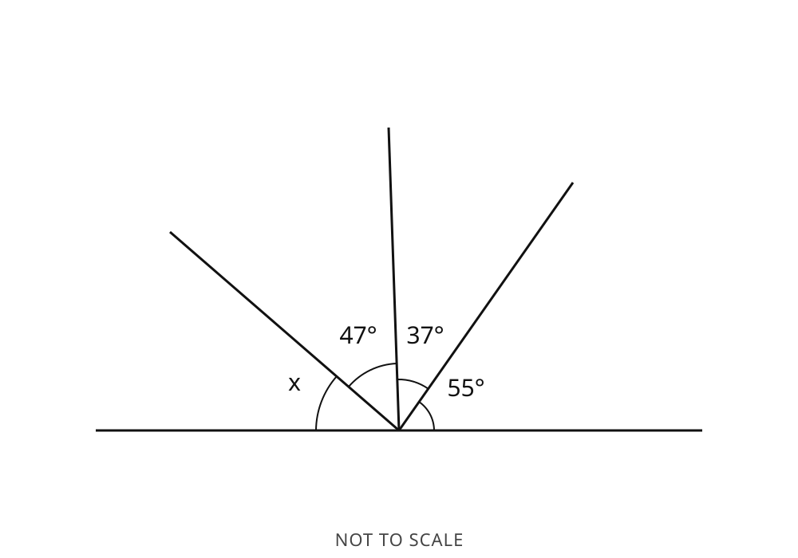

<details><summary>Inline SVG (source)</summary>

```xml
<svg xmlns="http://www.w3.org/2000/svg" viewBox="0 0 1000 700" role="img" aria-label="Diagram: angles adjacent on one side of a straight line, with an unknown angle x.">
<title>Angles on a straight line</title>
<desc>Angles of 55 degrees, 37 degrees, 47 degrees and an unknown angle x are adjacent, in order, along one side of a straight line.</desc>
<style>.gl{stroke:#111;stroke-width:3;fill:none}.ga{stroke:#111;stroke-width:2;fill:none}.gt{stroke:#111;stroke-width:3}.gx{stroke:#111;stroke-width:3}.gv{fill:#111}text{font-family:sans-serif;font-size:30px;fill:#111}.gn{font-size:22px;fill:#444;letter-spacing:1px}</style>
<line class="gl" x1="880" y1="540" x2="120" y2="540"/>
<line class="gl" x1="500" y1="540" x2="718" y2="229"/>
<line class="gl" x1="500" y1="540" x2="487" y2="160"/>
<line class="gl" x1="500" y1="540" x2="213" y2="291"/>
<path class="ga" d="M 544 540 A 44 44 0 0 0 525 504"/>
<path class="ga" d="M 537 488 A 64 64 0 0 0 498 476"/>
<path class="ga" d="M 497 456 A 84 84 0 0 0 437 485"/>
<path class="ga" d="M 422 472 A 104 104 0 0 0 396 540"/>
<text x="586" y="496" text-anchor="middle">55°</text>
<text x="534" y="429" text-anchor="middle">37°</text>
<text x="449" y="431" text-anchor="middle">47°</text>
<text x="369" y="490" text-anchor="middle">x</text>
<text class="gn" x="500" y="685" text-anchor="middle">NOT TO SCALE</text>
</svg>
```

</details>

**Alt text:** Diagram: angles adjacent on one side of a straight line, with an unknown angle x.

**Long description:** Angles of 55 degrees, 37 degrees, 47 degrees and an unknown angle x are adjacent, in order, along one side of a straight line.

**Data-table fallback**

| angle | value |
| --- | --- |
| angle 1 | 55 degrees |
| angle 2 | 37 degrees |
| angle 3 | 47 degrees |
| x | unknown |

**Answer:** `x = 41°`

**Worked solution**

1. State the angle fact — `Angles on a straight line sum to 180 degrees`
2. Form the equation — `x = 180 - (55 + 37 + 47)`
3. Evaluate — `x = 41°`

**MC option order:** A. 88°  B. 41° (correct)  C. 221°  D. 139°

**Distractor calculations (each a distinct misconception pathway)**

| Value | Formula (teacher) | Misconception | Rationale | Student feedback |
| --- | --- | --- | --- | --- |
| `221°` | `360 - sum(givens)` | Uses 360 on a straight line (`MISC.GEOM.LINE.USES_360`) | Subtracted from 360 instead of 180. | Angles on a straight line sum to 180 degrees, not 360. Subtract the given angles from 180. |
| `139°` | `sum(givens)` | Returns the sum of the givens (`MISC.GEOM.LINE.RETURNS_SUM_GIVENS`) | Gave the sum of the given angles. | You added the given angles. Subtract their total from 180 to find the unknown. |
| `88°` | `180 - sum(all but one given)` | Forgot one given angle (`MISC.GEOM.LINE.FORGOT_ONE_GIVEN`) | Left out one of the given angles. | Include every given angle. Subtract the total of all of them from 180. |

**Diagram-to-data validation:** `svg-realises-data`=pass  `arc-region-measure-agreement`=pass  `arc-large-flag-correct`=pass  `arc-sweep-correct`=pass  `arc-matches-cyclic-region`=pass  `label-inside-intended-region`=pass  `reflex-region-rendered-correctly`=pass  `no-theorem-revealing-markers`=n/a  `target-region-unambiguous`=n/a  `labels-non-overlapping`=pass  `not-to-scale`=pass  `no-answer-leakage`=pass  `media-present`=pass

**Accessibility validation:** `a11y-fields-present`=pass  `a11y-no-answer-in-text`=pass  `a11y-equivalent-information`=pass  `nonColorIndicators`=True

**Overall validation:** pass

**Curriculum decision:** [ ] approve  [ ] revise  [ ] reject — notes: ____

---

### straight_line_missing_angle / multiple-choice #3 — band 3 (floor 1, range [1, 3])

- **Objective:** `SPI.MIDDLE.GEO.ANGLES_STRAIGHT_LINE.01`  ·  **Family:** F1  ·  **Calculator:** calculator-not-required
- **Interaction type:** multiple-choice  ·  **Answer type:** integer  ·  **Units:** degrees
- **Canonical value:** `num=78, den=1` -> `78°`  ·  **Givens:** `[15, 72, 15]`
- **Seed:** `3`  ·  **Generator:** v`1.2.2`  ·  **Parameters:** `{"task": "straight_line_missing_angle", "regions": [15, 72, 15, 78], "unknownIndex": 3}`
- **Difficulty axes:** `{"numericalComplexity": 0.75, "reasoningSteps": 0.5, "representation": 0.6, "abstraction": 0.5}`  ·  **Band:** 3
- **To scale:** False (figure is NOT drawn to scale)
- **Reproduce:** `generate(3, {"task": "straight_line_missing_angle", "interactionType": "multiple-choice"})` on v`1.2.2`

**Question**

> Find the size of the unknown angle x, in degrees.

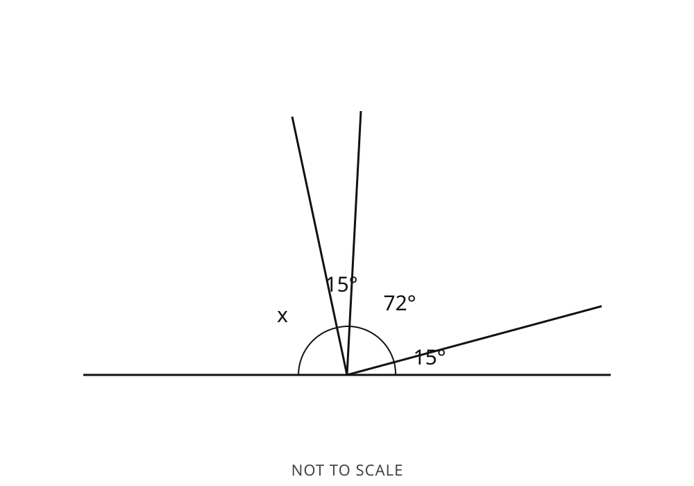

<details><summary>Inline SVG (source)</summary>

```xml
<svg xmlns="http://www.w3.org/2000/svg" viewBox="0 0 1000 700" role="img" aria-label="Diagram: angles adjacent on one side of a straight line, with an unknown angle x.">
<title>Angles on a straight line</title>
<desc>Angles of 15 degrees, 72 degrees, 15 degrees and an unknown angle x are adjacent, in order, along one side of a straight line.</desc>
<style>.gl{stroke:#111;stroke-width:3;fill:none}.ga{stroke:#111;stroke-width:2;fill:none}.gt{stroke:#111;stroke-width:3}.gx{stroke:#111;stroke-width:3}.gv{fill:#111}text{font-family:sans-serif;font-size:30px;fill:#111}.gn{font-size:22px;fill:#444;letter-spacing:1px}</style>
<line class="gl" x1="880" y1="540" x2="120" y2="540"/>
<line class="gl" x1="500" y1="540" x2="867" y2="441"/>
<line class="gl" x1="500" y1="540" x2="520" y2="160"/>
<line class="gl" x1="500" y1="540" x2="421" y2="168"/>
<path class="ga" d="M 544 540 A 44 44 0 0 0 542 529"/>
<path class="ga" d="M 562 523 A 64 64 0 0 0 503 476"/>
<path class="ga" d="M 504 456 A 84 84 0 0 0 483 458"/>
<path class="ga" d="M 478 438 A 104 104 0 0 0 396 540"/>
<text x="761" y="508" text-anchor="middle">15°</text>
<text x="563" y="462" text-anchor="middle">72°</text>
<text x="481" y="262" text-anchor="middle">15°</text>
<text x="391" y="452" text-anchor="middle">x</text>
<text class="gn" x="500" y="685" text-anchor="middle">NOT TO SCALE</text>
</svg>
```

</details>

**Alt text:** Diagram: angles adjacent on one side of a straight line, with an unknown angle x.

**Long description:** Angles of 15 degrees, 72 degrees, 15 degrees and an unknown angle x are adjacent, in order, along one side of a straight line.

**Data-table fallback**

| angle | value |
| --- | --- |
| angle 1 | 15 degrees |
| angle 2 | 72 degrees |
| angle 3 | 15 degrees |
| x | unknown |

**Answer:** `x = 78°`

**Worked solution**

1. State the angle fact — `Angles on a straight line sum to 180 degrees`
2. Form the equation — `x = 180 - (15 + 72 + 15)`
3. Evaluate — `x = 78°`

**MC option order:** A. 102°  B. 78° (correct)  C. 93°  D. 258°

**Distractor calculations (each a distinct misconception pathway)**

| Value | Formula (teacher) | Misconception | Rationale | Student feedback |
| --- | --- | --- | --- | --- |
| `258°` | `360 - sum(givens)` | Uses 360 on a straight line (`MISC.GEOM.LINE.USES_360`) | Subtracted from 360 instead of 180. | Angles on a straight line sum to 180 degrees, not 360. Subtract the given angles from 180. |
| `102°` | `sum(givens)` | Returns the sum of the givens (`MISC.GEOM.LINE.RETURNS_SUM_GIVENS`) | Gave the sum of the given angles. | You added the given angles. Subtract their total from 180 to find the unknown. |
| `93°` | `180 - sum(all but one given)` | Forgot one given angle (`MISC.GEOM.LINE.FORGOT_ONE_GIVEN`) | Left out one of the given angles. | Include every given angle. Subtract the total of all of them from 180. |

**Diagram-to-data validation:** `svg-realises-data`=pass  `arc-region-measure-agreement`=pass  `arc-large-flag-correct`=pass  `arc-sweep-correct`=pass  `arc-matches-cyclic-region`=pass  `label-inside-intended-region`=pass  `reflex-region-rendered-correctly`=pass  `no-theorem-revealing-markers`=n/a  `target-region-unambiguous`=n/a  `labels-non-overlapping`=pass  `not-to-scale`=pass  `no-answer-leakage`=pass  `media-present`=pass

**Accessibility validation:** `a11y-fields-present`=pass  `a11y-no-answer-in-text`=pass  `a11y-equivalent-information`=pass  `nonColorIndicators`=True

**Overall validation:** pass

**Curriculum decision:** [ ] approve  [ ] revise  [ ] reject — notes: ____

---

### straight_line_missing_angle / multiple-choice #4 — band 2 (floor 1, range [1, 3])

- **Objective:** `SPI.MIDDLE.GEO.ANGLES_STRAIGHT_LINE.01`  ·  **Family:** F1  ·  **Calculator:** calculator-not-required
- **Interaction type:** multiple-choice  ·  **Answer type:** integer  ·  **Units:** degrees
- **Canonical value:** `num=10, den=1` -> `10°`  ·  **Givens:** `[110, 60]`
- **Seed:** `6`  ·  **Generator:** v`1.2.2`  ·  **Parameters:** `{"task": "straight_line_missing_angle", "regions": [10, 110, 60], "unknownIndex": 0}`
- **Difficulty axes:** `{"numericalComplexity": 0.5, "reasoningSteps": 0.5, "representation": 0.6, "abstraction": 0.3}`  ·  **Band:** 2
- **To scale:** False (figure is NOT drawn to scale)
- **Reproduce:** `generate(6, {"task": "straight_line_missing_angle", "interactionType": "multiple-choice"})` on v`1.2.2`

**Question**

> Find the size of the unknown angle x, in degrees.

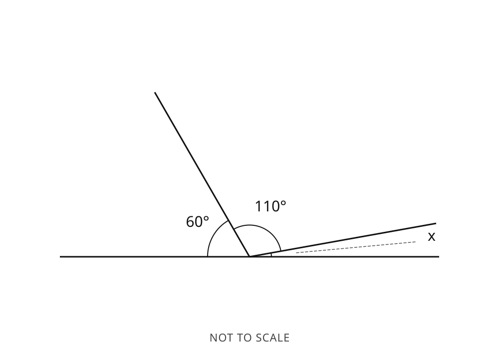

<details><summary>Inline SVG (source)</summary>

```xml
<svg xmlns="http://www.w3.org/2000/svg" viewBox="0 0 1000 700" role="img" aria-label="Diagram: angles adjacent on one side of a straight line, with an unknown angle x.">
<title>Angles on a straight line</title>
<desc>Angles of 110 degrees, 60 degrees and an unknown angle x are adjacent, in order, along one side of a straight line.</desc>
<style>.gl{stroke:#111;stroke-width:3;fill:none}.ga{stroke:#111;stroke-width:2;fill:none}.gt{stroke:#111;stroke-width:3}.gx{stroke:#111;stroke-width:3}.gv{fill:#111}text{font-family:sans-serif;font-size:30px;fill:#111}.gn{font-size:22px;fill:#444;letter-spacing:1px}</style>
<line class="gl" x1="880" y1="515" x2="120" y2="515"/>
<line class="gl" x1="500" y1="515" x2="874" y2="448"/>
<line class="gl" x1="500" y1="515" x2="310" y2="185"/>
<path class="ga" d="M 544 515 A 44 44 0 0 0 543 507"/>
<path class="ga" d="M 563 504 A 64 64 0 0 0 468 460"/>
<path class="ga" d="M 458 442 A 84 84 0 0 0 416 515"/>
<line class="gx" x1="552" y1="510" x2="564" y2="495"/>
<text x="578" y="480" text-anchor="middle">x</text>
<text x="542" y="424" text-anchor="middle">110°</text>
<text x="396" y="455" text-anchor="middle">60°</text>
<text class="gn" x="500" y="685" text-anchor="middle">NOT TO SCALE</text>
</svg>
```

</details>

**Alt text:** Diagram: angles adjacent on one side of a straight line, with an unknown angle x.

**Long description:** Angles of 110 degrees, 60 degrees and an unknown angle x are adjacent, in order, along one side of a straight line.

**Data-table fallback**

| angle | value |
| --- | --- |
| angle 1 | 110 degrees |
| angle 2 | 60 degrees |
| x | unknown |

**Answer:** `x = 10°`

**Worked solution**

1. State the angle fact — `Angles on a straight line sum to 180 degrees`
2. Form the equation — `x = 180 - (110 + 60)`
3. Evaluate — `x = 10°`

**MC option order:** A. 190°  B. 70°  C. 10° (correct)  D. 170°

**Distractor calculations (each a distinct misconception pathway)**

| Value | Formula (teacher) | Misconception | Rationale | Student feedback |
| --- | --- | --- | --- | --- |
| `190°` | `360 - sum(givens)` | Uses 360 on a straight line (`MISC.GEOM.LINE.USES_360`) | Subtracted from 360 instead of 180. | Angles on a straight line sum to 180 degrees, not 360. Subtract the given angles from 180. |
| `170°` | `sum(givens)` | Returns the sum of the givens (`MISC.GEOM.LINE.RETURNS_SUM_GIVENS`) | Gave the sum of the given angles. | You added the given angles. Subtract their total from 180 to find the unknown. |
| `70°` | `180 - sum(all but one given)` | Forgot one given angle (`MISC.GEOM.LINE.FORGOT_ONE_GIVEN`) | Left out one of the given angles. | Include every given angle. Subtract the total of all of them from 180. |

**Diagram-to-data validation:** `svg-realises-data`=pass  `arc-region-measure-agreement`=pass  `arc-large-flag-correct`=pass  `arc-sweep-correct`=pass  `arc-matches-cyclic-region`=pass  `label-inside-intended-region`=pass  `reflex-region-rendered-correctly`=pass  `no-theorem-revealing-markers`=n/a  `target-region-unambiguous`=n/a  `labels-non-overlapping`=pass  `not-to-scale`=pass  `no-answer-leakage`=pass  `media-present`=pass

**Accessibility validation:** `a11y-fields-present`=pass  `a11y-no-answer-in-text`=pass  `a11y-equivalent-information`=pass  `nonColorIndicators`=True

**Overall validation:** pass

**Curriculum decision:** [ ] approve  [ ] revise  [ ] reject — notes: ____

---

### straight_line_missing_angle / multiple-choice #5 — band 1 (floor 1, range [1, 3])

- **Objective:** `SPI.MIDDLE.GEO.ANGLES_STRAIGHT_LINE.01`  ·  **Family:** F1  ·  **Calculator:** calculator-not-required
- **Interaction type:** multiple-choice  ·  **Answer type:** integer  ·  **Units:** degrees
- **Canonical value:** `num=95, den=1` -> `95°`  ·  **Givens:** `[15, 70]`
- **Seed:** `87`  ·  **Generator:** v`1.2.2`  ·  **Parameters:** `{"task": "straight_line_missing_angle", "regions": [15, 95, 70], "unknownIndex": 1}`
- **Difficulty axes:** `{"numericalComplexity": 0.5, "reasoningSteps": 0.5, "representation": 0.6, "abstraction": 0.3}`  ·  **Band:** 1
- **To scale:** False (figure is NOT drawn to scale)
- **Reproduce:** `generate(87, {"task": "straight_line_missing_angle", "interactionType": "multiple-choice"})` on v`1.2.2`

**Question**

> Find the size of the unknown angle x, in degrees.

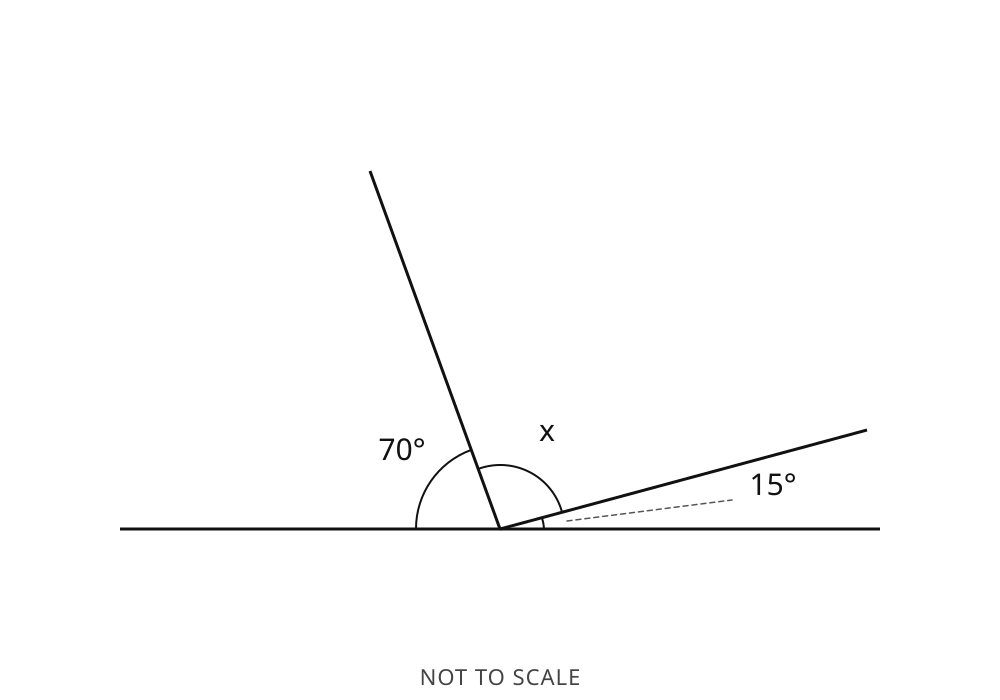

<details><summary>Inline SVG (source)</summary>

```xml
<svg xmlns="http://www.w3.org/2000/svg" viewBox="0 0 1000 700" role="img" aria-label="Diagram: angles adjacent on one side of a straight line, with an unknown angle x.">
<title>Angles on a straight line</title>
<desc>Angles of 15 degrees, 70 degrees and an unknown angle x are adjacent, in order, along one side of a straight line.</desc>
<style>.gl{stroke:#111;stroke-width:3;fill:none}.ga{stroke:#111;stroke-width:2;fill:none}.gt{stroke:#111;stroke-width:3}.gx{stroke:#111;stroke-width:3}.gv{fill:#111}text{font-family:sans-serif;font-size:30px;fill:#111}.gn{font-size:22px;fill:#444;letter-spacing:1px}</style>
<line class="gl" x1="880" y1="529" x2="120" y2="529"/>
<line class="gl" x1="500" y1="529" x2="867" y2="430"/>
<line class="gl" x1="500" y1="529" x2="370" y2="171"/>
<path class="ga" d="M 544 529 A 44 44 0 0 0 542 518"/>
<path class="ga" d="M 562 512 A 64 64 0 0 0 478 469"/>
<path class="ga" d="M 471 450 A 84 84 0 0 0 416 529"/>
<text x="761" y="497" text-anchor="middle">15°</text>
<text x="547" y="441" text-anchor="middle">x</text>
<text x="402" y="460" text-anchor="middle">70°</text>
<text class="gn" x="500" y="685" text-anchor="middle">NOT TO SCALE</text>
</svg>
```

</details>

**Alt text:** Diagram: angles adjacent on one side of a straight line, with an unknown angle x.

**Long description:** Angles of 15 degrees, 70 degrees and an unknown angle x are adjacent, in order, along one side of a straight line.

**Data-table fallback**

| angle | value |
| --- | --- |
| angle 1 | 15 degrees |
| angle 2 | 70 degrees |
| x | unknown |

**Answer:** `x = 95°`

**Worked solution**

1. State the angle fact — `Angles on a straight line sum to 180 degrees`
2. Form the equation — `x = 180 - (15 + 70)`
3. Evaluate — `x = 95°`

**MC option order:** A. 85°  B. 95° (correct)  C. 165°  D. 275°

**Distractor calculations (each a distinct misconception pathway)**

| Value | Formula (teacher) | Misconception | Rationale | Student feedback |
| --- | --- | --- | --- | --- |
| `275°` | `360 - sum(givens)` | Uses 360 on a straight line (`MISC.GEOM.LINE.USES_360`) | Subtracted from 360 instead of 180. | Angles on a straight line sum to 180 degrees, not 360. Subtract the given angles from 180. |
| `85°` | `sum(givens)` | Returns the sum of the givens (`MISC.GEOM.LINE.RETURNS_SUM_GIVENS`) | Gave the sum of the given angles. | You added the given angles. Subtract their total from 180 to find the unknown. |
| `165°` | `180 - sum(all but one given)` | Forgot one given angle (`MISC.GEOM.LINE.FORGOT_ONE_GIVEN`) | Left out one of the given angles. | Include every given angle. Subtract the total of all of them from 180. |

**Diagram-to-data validation:** `svg-realises-data`=pass  `arc-region-measure-agreement`=pass  `arc-large-flag-correct`=pass  `arc-sweep-correct`=pass  `arc-matches-cyclic-region`=pass  `label-inside-intended-region`=pass  `reflex-region-rendered-correctly`=pass  `no-theorem-revealing-markers`=n/a  `target-region-unambiguous`=n/a  `labels-non-overlapping`=pass  `not-to-scale`=pass  `no-answer-leakage`=pass  `media-present`=pass

**Accessibility validation:** `a11y-fields-present`=pass  `a11y-no-answer-in-text`=pass  `a11y-equivalent-information`=pass  `nonColorIndicators`=True

**Overall validation:** pass

**Curriculum decision:** [ ] approve  [ ] revise  [ ] reject — notes: ____

---

## triangle_missing_angle · free-response — 5 examples  (F2, `SPI.MIDDLE.GEO.TRIANGLE_ANGLE_SUM.01`)

### triangle_missing_angle / free-response #1 — band 3 (floor 2, range [2, 3])

- **Objective:** `SPI.MIDDLE.GEO.TRIANGLE_ANGLE_SUM.01`  ·  **Family:** F2  ·  **Calculator:** calculator-not-required
- **Interaction type:** free-response  ·  **Answer type:** integer  ·  **Units:** degrees
- **Canonical value:** `num=66, den=1` -> `66°`  ·  **Givens:** `[104, 10]`
- **Seed:** `1`  ·  **Generator:** v`1.2.2`  ·  **Parameters:** `{"task": "triangle_missing_angle", "A": 104, "B": 10}`
- **Difficulty axes:** `{"numericalComplexity": 0.5, "reasoningSteps": 0.5, "representation": 0.6, "abstraction": 0.5}`  ·  **Band:** 3
- **To scale:** False (figure is NOT drawn to scale)
- **Reproduce:** `generate(1, {"task": "triangle_missing_angle", "interactionType": "free-response"})` on v`1.2.2`

**Question**

> Find the size of the unknown angle x, in degrees.

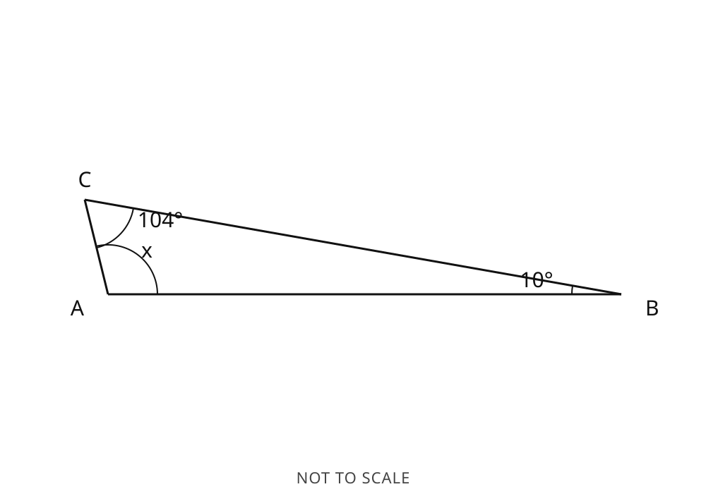

<details><summary>Inline SVG (source)</summary>

```xml
<svg xmlns="http://www.w3.org/2000/svg" viewBox="0 0 1000 700" role="img" aria-label="Diagram: a triangle with two known angles and an unknown angle x.">
<title>Triangle ABC</title>
<desc>Triangle ABC has an interior angle of 104 degrees at A, an interior angle of 10 degrees at B, and an unknown interior angle x at C.</desc>
<style>.gl{stroke:#111;stroke-width:3;fill:none}.ga{stroke:#111;stroke-width:2;fill:none}.gt{stroke:#111;stroke-width:3}.gx{stroke:#111;stroke-width:3}.gv{fill:#111}text{font-family:sans-serif;font-size:30px;fill:#111}.gn{font-size:22px;fill:#444;letter-spacing:1px}</style>
<line class="gl" x1="153" y1="417" x2="880" y2="417"/>
<line class="gl" x1="153" y1="417" x2="120" y2="283"/>
<line class="gl" x1="880" y1="417" x2="120" y2="283"/>
<path class="ga" d="M 194 417 A 41 41 0 0 0 143 377"/>
<path class="ga" d="M 825 407 A 56 56 0 0 0 824 417"/>
<path class="ga" d="M 130 323 A 41 41 0 0 0 160 290"/>
<line class="gx" x1="816" y1="411" x2="800" y2="435"/>
<line class="gx" x1="156" y1="316" x2="215" y2="284"/>
<text x="119" y="447" text-anchor="end">A</text>
<text x="914" y="447" text-anchor="start">B</text>
<text x="120" y="265" text-anchor="middle">C</text>
<text x="200" y="356" text-anchor="middle">104°</text>
<text x="783" y="465" text-anchor="middle">10°</text>
<text x="233" y="275" text-anchor="middle">x</text>
<text class="gn" x="500" y="685" text-anchor="middle">NOT TO SCALE</text>
</svg>
```

</details>

**Alt text:** Diagram: a triangle with two known angles and an unknown angle x.

**Long description:** Triangle ABC has an interior angle of 104 degrees at A, an interior angle of 10 degrees at B, and an unknown interior angle x at C.

**Data-table fallback**

| angle | value |
| --- | --- |
| angle 1 | 104 degrees |
| angle 2 | 10 degrees |
| x | unknown |

**Answer:** `x = 66°`

**Worked solution**

1. State the angle fact — `The interior angles of a triangle sum to 180 degrees`
2. Form the equation — `x = 180 - (104 + 10)`
3. Evaluate — `x = 66°`

_Free-response: no distractors._

**Diagram-to-data validation:** `svg-realises-data`=pass  `arc-region-measure-agreement`=pass  `arc-large-flag-correct`=pass  `arc-sweep-correct`=pass  `arc-matches-cyclic-region`=n/a  `label-inside-intended-region`=pass  `reflex-region-rendered-correctly`=pass  `no-theorem-revealing-markers`=n/a  `target-region-unambiguous`=n/a  `labels-non-overlapping`=pass  `not-to-scale`=pass  `no-answer-leakage`=pass  `media-present`=pass

**Accessibility validation:** `a11y-fields-present`=pass  `a11y-no-answer-in-text`=pass  `a11y-equivalent-information`=pass  `nonColorIndicators`=True

**Overall validation:** pass

**Curriculum decision:** [ ] approve  [ ] revise  [ ] reject — notes: ____

---

### triangle_missing_angle / free-response #2 — band 3 (floor 2, range [2, 3])

- **Objective:** `SPI.MIDDLE.GEO.TRIANGLE_ANGLE_SUM.01`  ·  **Family:** F2  ·  **Calculator:** calculator-not-required
- **Interaction type:** free-response  ·  **Answer type:** integer  ·  **Units:** degrees
- **Canonical value:** `num=37, den=1` -> `37°`  ·  **Givens:** `[120, 23]`
- **Seed:** `2`  ·  **Generator:** v`1.2.2`  ·  **Parameters:** `{"task": "triangle_missing_angle", "A": 120, "B": 23}`
- **Difficulty axes:** `{"numericalComplexity": 0.5, "reasoningSteps": 0.5, "representation": 0.6, "abstraction": 0.5}`  ·  **Band:** 3
- **To scale:** False (figure is NOT drawn to scale)
- **Reproduce:** `generate(2, {"task": "triangle_missing_angle", "interactionType": "free-response"})` on v`1.2.2`

**Question**

> Find the size of the unknown angle x, in degrees.


<details><summary>Inline SVG (source)</summary>

```xml
<svg xmlns="http://www.w3.org/2000/svg" viewBox="0 0 1000 700" role="img" aria-label="Diagram: a triangle with two known angles and an unknown angle x.">
<title>Triangle ABC</title>
<desc>Triangle ABC has an interior angle of 120 degrees at A, an interior angle of 23 degrees at B, and an unknown interior angle x at C.</desc>
<style>.gl{stroke:#111;stroke-width:3;fill:none}.ga{stroke:#111;stroke-width:2;fill:none}.gt{stroke:#111;stroke-width:3}.gx{stroke:#111;stroke-width:3}.gv{fill:#111}text{font-family:sans-serif;font-size:30px;fill:#111}.gn{font-size:22px;fill:#444;letter-spacing:1px}</style>
<line class="gl" x1="306" y1="511" x2="880" y2="511"/>
<line class="gl" x1="306" y1="511" x2="120" y2="189"/>
<line class="gl" x1="880" y1="511" x2="120" y2="189"/>
<path class="ga" d="M 362 511 A 56 56 0 0 0 278 463"/>
<path class="ga" d="M 828 489 A 56 56 0 0 0 824 511"/>
<path class="ga" d="M 148 237 A 56 56 0 0 0 172 211"/>
<line class="gx" x1="817" y1="498" x2="799" y2="520"/>
<text x="272" y="541" text-anchor="end">A</text>
<text x="914" y="541" text-anchor="start">B</text>
<text x="120" y="171" text-anchor="middle">C</text>
<text x="352" y="431" text-anchor="middle">120°</text>
<text x="778" y="547" text-anchor="middle">23°</text>
<text x="200" y="261" text-anchor="middle">x</text>
<text class="gn" x="500" y="685" text-anchor="middle">NOT TO SCALE</text>
</svg>
```

</details>

**Alt text:** Diagram: a triangle with two known angles and an unknown angle x.

**Long description:** Triangle ABC has an interior angle of 120 degrees at A, an interior angle of 23 degrees at B, and an unknown interior angle x at C.

**Data-table fallback**

| angle | value |
| --- | --- |
| angle 1 | 120 degrees |
| angle 2 | 23 degrees |
| x | unknown |

**Answer:** `x = 37°`

**Worked solution**

1. State the angle fact — `The interior angles of a triangle sum to 180 degrees`
2. Form the equation — `x = 180 - (120 + 23)`
3. Evaluate — `x = 37°`

_Free-response: no distractors._

**Diagram-to-data validation:** `svg-realises-data`=pass  `arc-region-measure-agreement`=pass  `arc-large-flag-correct`=pass  `arc-sweep-correct`=pass  `arc-matches-cyclic-region`=n/a  `label-inside-intended-region`=pass  `reflex-region-rendered-correctly`=pass  `no-theorem-revealing-markers`=n/a  `target-region-unambiguous`=n/a  `labels-non-overlapping`=pass  `not-to-scale`=pass  `no-answer-leakage`=pass  `media-present`=pass

**Accessibility validation:** `a11y-fields-present`=pass  `a11y-no-answer-in-text`=pass  `a11y-equivalent-information`=pass  `nonColorIndicators`=True

**Overall validation:** pass

**Curriculum decision:** [ ] approve  [ ] revise  [ ] reject — notes: ____

---

### triangle_missing_angle / free-response #3 — band 3 (floor 2, range [2, 3])

- **Objective:** `SPI.MIDDLE.GEO.TRIANGLE_ANGLE_SUM.01`  ·  **Family:** F2  ·  **Calculator:** calculator-not-required
- **Interaction type:** free-response  ·  **Answer type:** integer  ·  **Units:** degrees
- **Canonical value:** `num=51, den=1` -> `51°`  ·  **Givens:** `[118, 11]`
- **Seed:** `3`  ·  **Generator:** v`1.2.2`  ·  **Parameters:** `{"task": "triangle_missing_angle", "A": 118, "B": 11}`
- **Difficulty axes:** `{"numericalComplexity": 0.5, "reasoningSteps": 0.5, "representation": 0.6, "abstraction": 0.5}`  ·  **Band:** 3
- **To scale:** False (figure is NOT drawn to scale)
- **Reproduce:** `generate(3, {"task": "triangle_missing_angle", "interactionType": "free-response"})` on v`1.2.2`

**Question**

> Find the size of the unknown angle x, in degrees.


<details><summary>Inline SVG (source)</summary>

```xml
<svg xmlns="http://www.w3.org/2000/svg" viewBox="0 0 1000 700" role="img" aria-label="Diagram: a triangle with two known angles and an unknown angle x.">
<title>Triangle ABC</title>
<desc>Triangle ABC has an interior angle of 118 degrees at A, an interior angle of 11 degrees at B, and an unknown interior angle x at C.</desc>
<style>.gl{stroke:#111;stroke-width:3;fill:none}.ga{stroke:#111;stroke-width:2;fill:none}.gt{stroke:#111;stroke-width:3}.gx{stroke:#111;stroke-width:3}.gv{fill:#111}text{font-family:sans-serif;font-size:30px;fill:#111}.gn{font-size:22px;fill:#444;letter-spacing:1px}</style>
<line class="gl" x1="198" y1="424" x2="880" y2="424"/>
<line class="gl" x1="198" y1="424" x2="120" y2="276"/>
<line class="gl" x1="880" y1="424" x2="120" y2="276"/>
<path class="ga" d="M 248 424 A 50 50 0 0 0 175 380"/>
<path class="ga" d="M 825 413 A 56 56 0 0 0 824 424"/>
<path class="ga" d="M 143 320 A 50 50 0 0 0 169 286"/>
<line class="gx" x1="816" y1="417" x2="801" y2="440"/>
<text x="164" y="454" text-anchor="end">A</text>
<text x="914" y="454" text-anchor="start">B</text>
<text x="120" y="258" text-anchor="middle">C</text>
<text x="242" y="350" text-anchor="middle">118°</text>
<text x="783" y="470" text-anchor="middle">11°</text>
<text x="189" y="328" text-anchor="middle">x</text>
<text class="gn" x="500" y="685" text-anchor="middle">NOT TO SCALE</text>
</svg>
```

</details>

**Alt text:** Diagram: a triangle with two known angles and an unknown angle x.

**Long description:** Triangle ABC has an interior angle of 118 degrees at A, an interior angle of 11 degrees at B, and an unknown interior angle x at C.

**Data-table fallback**

| angle | value |
| --- | --- |
| angle 1 | 118 degrees |
| angle 2 | 11 degrees |
| x | unknown |

**Answer:** `x = 51°`

**Worked solution**

1. State the angle fact — `The interior angles of a triangle sum to 180 degrees`
2. Form the equation — `x = 180 - (118 + 11)`
3. Evaluate — `x = 51°`

_Free-response: no distractors._

**Diagram-to-data validation:** `svg-realises-data`=pass  `arc-region-measure-agreement`=pass  `arc-large-flag-correct`=pass  `arc-sweep-correct`=pass  `arc-matches-cyclic-region`=n/a  `label-inside-intended-region`=pass  `reflex-region-rendered-correctly`=pass  `no-theorem-revealing-markers`=n/a  `target-region-unambiguous`=n/a  `labels-non-overlapping`=pass  `not-to-scale`=pass  `no-answer-leakage`=pass  `media-present`=pass

**Accessibility validation:** `a11y-fields-present`=pass  `a11y-no-answer-in-text`=pass  `a11y-equivalent-information`=pass  `nonColorIndicators`=True

**Overall validation:** pass

**Curriculum decision:** [ ] approve  [ ] revise  [ ] reject — notes: ____

---

### triangle_missing_angle / free-response #4 — band 3 (floor 2, range [2, 3])

- **Objective:** `SPI.MIDDLE.GEO.TRIANGLE_ANGLE_SUM.01`  ·  **Family:** F2  ·  **Calculator:** calculator-not-required
- **Interaction type:** free-response  ·  **Answer type:** integer  ·  **Units:** degrees
- **Canonical value:** `num=20, den=1` -> `20°`  ·  **Givens:** `[100, 60]`
- **Seed:** `25`  ·  **Generator:** v`1.2.2`  ·  **Parameters:** `{"task": "triangle_missing_angle", "A": 100, "B": 60}`
- **Difficulty axes:** `{"numericalComplexity": 0.5, "reasoningSteps": 0.5, "representation": 0.6, "abstraction": 0.3}`  ·  **Band:** 3
- **To scale:** False (figure is NOT drawn to scale)
- **Reproduce:** `generate(25, {"task": "triangle_missing_angle", "interactionType": "free-response"})` on v`1.2.2`

**Question**

> Find the size of the unknown angle x, in degrees.

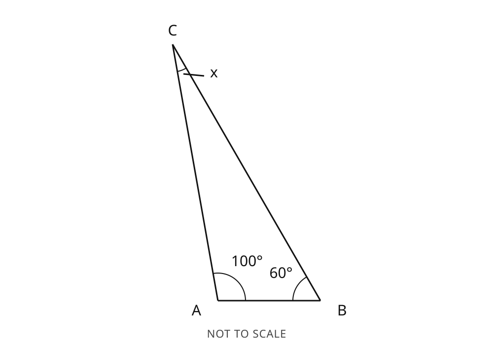

<details><summary>Inline SVG (source)</summary>

```xml
<svg xmlns="http://www.w3.org/2000/svg" viewBox="0 0 1000 700" role="img" aria-label="Diagram: a triangle with two known angles and an unknown angle x.">
<title>Triangle ABC</title>
<desc>Triangle ABC has an interior angle of 100 degrees at A, an interior angle of 60 degrees at B, and an unknown interior angle x at C.</desc>
<style>.gl{stroke:#111;stroke-width:3;fill:none}.ga{stroke:#111;stroke-width:2;fill:none}.gt{stroke:#111;stroke-width:3}.gx{stroke:#111;stroke-width:3}.gv{fill:#111}text{font-family:sans-serif;font-size:30px;fill:#111}.gn{font-size:22px;fill:#444;letter-spacing:1px}</style>
<line class="gl" x1="442" y1="610" x2="650" y2="610"/>
<line class="gl" x1="442" y1="610" x2="350" y2="90"/>
<line class="gl" x1="650" y1="610" x2="350" y2="90"/>
<path class="ga" d="M 498 610 A 56 56 0 0 0 432 555"/>
<path class="ga" d="M 622 562 A 56 56 0 0 0 594 610"/>
<path class="ga" d="M 360 145 A 56 56 0 0 0 378 138"/>
<line class="gx" x1="372" y1="150" x2="414" y2="154"/>
<text x="408" y="640" text-anchor="end">A</text>
<text x="684" y="640" text-anchor="start">B</text>
<text x="350" y="72" text-anchor="middle">C</text>
<text x="501" y="540" text-anchor="middle">100°</text>
<text x="570" y="564" text-anchor="middle">60°</text>
<text x="434" y="157" text-anchor="middle">x</text>
<text class="gn" x="500" y="685" text-anchor="middle">NOT TO SCALE</text>
</svg>
```

</details>

**Alt text:** Diagram: a triangle with two known angles and an unknown angle x.

**Long description:** Triangle ABC has an interior angle of 100 degrees at A, an interior angle of 60 degrees at B, and an unknown interior angle x at C.

**Data-table fallback**

| angle | value |
| --- | --- |
| angle 1 | 100 degrees |
| angle 2 | 60 degrees |
| x | unknown |

**Answer:** `x = 20°`

**Worked solution**

1. State the angle fact — `The interior angles of a triangle sum to 180 degrees`
2. Form the equation — `x = 180 - (100 + 60)`
3. Evaluate — `x = 20°`

_Free-response: no distractors._

**Diagram-to-data validation:** `svg-realises-data`=pass  `arc-region-measure-agreement`=pass  `arc-large-flag-correct`=pass  `arc-sweep-correct`=pass  `arc-matches-cyclic-region`=n/a  `label-inside-intended-region`=pass  `reflex-region-rendered-correctly`=pass  `no-theorem-revealing-markers`=n/a  `target-region-unambiguous`=n/a  `labels-non-overlapping`=pass  `not-to-scale`=pass  `no-answer-leakage`=pass  `media-present`=pass

**Accessibility validation:** `a11y-fields-present`=pass  `a11y-no-answer-in-text`=pass  `a11y-equivalent-information`=pass  `nonColorIndicators`=True

**Overall validation:** pass

**Curriculum decision:** [ ] approve  [ ] revise  [ ] reject — notes: ____

---

### triangle_missing_angle / free-response #5 — band 2 (floor 2, range [2, 3])

- **Objective:** `SPI.MIDDLE.GEO.TRIANGLE_ANGLE_SUM.01`  ·  **Family:** F2  ·  **Calculator:** calculator-not-required
- **Interaction type:** free-response  ·  **Answer type:** integer  ·  **Units:** degrees
- **Canonical value:** `num=85, den=1` -> `85°`  ·  **Givens:** `[85, 10]`
- **Seed:** `98`  ·  **Generator:** v`1.2.2`  ·  **Parameters:** `{"task": "triangle_missing_angle", "A": 85, "B": 10}`
- **Difficulty axes:** `{"numericalComplexity": 0.5, "reasoningSteps": 0.5, "representation": 0.6, "abstraction": 0.3}`  ·  **Band:** 2
- **To scale:** False (figure is NOT drawn to scale)
- **Reproduce:** `generate(98, {"task": "triangle_missing_angle", "interactionType": "free-response"})` on v`1.2.2`

**Question**

> Find the size of the unknown angle x, in degrees.

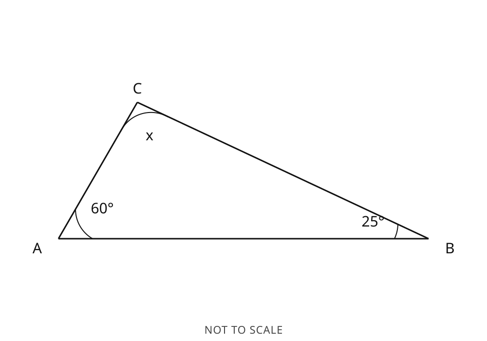

<details><summary>Inline SVG (source)</summary>

```xml
<svg xmlns="http://www.w3.org/2000/svg" viewBox="0 0 1000 700" role="img" aria-label="Diagram: a triangle with two known angles and an unknown angle x.">
<title>Triangle ABC</title>
<desc>Triangle ABC has an interior angle of 85 degrees at A, an interior angle of 10 degrees at B, and an unknown interior angle x at C.</desc>
<style>.gl{stroke:#111;stroke-width:3;fill:none}.ga{stroke:#111;stroke-width:2;fill:none}.gt{stroke:#111;stroke-width:3}.gx{stroke:#111;stroke-width:3}.gv{fill:#111}text{font-family:sans-serif;font-size:30px;fill:#111}.gn{font-size:22px;fill:#444;letter-spacing:1px}</style>
<line class="gl" x1="120" y1="416" x2="880" y2="416"/>
<line class="gl" x1="120" y1="416" x2="131" y2="284"/>
<line class="gl" x1="880" y1="416" x2="131" y2="284"/>
<path class="ga" d="M 159 416 A 39 39 0 0 0 123 377"/>
<path class="ga" d="M 825 406 A 56 56 0 0 0 824 416"/>
<path class="ga" d="M 128 323 A 39 39 0 0 0 169 291"/>
<line class="gx" x1="816" y1="410" x2="800" y2="434"/>
<line class="gx" x1="159" y1="322" x2="246" y2="284"/>
<text x="86" y="446" text-anchor="end">A</text>
<text x="914" y="446" text-anchor="start">B</text>
<text x="131" y="266" text-anchor="middle">C</text>
<text x="176" y="366" text-anchor="middle">85°</text>
<text x="783" y="464" text-anchor="middle">10°</text>
<text x="265" y="277" text-anchor="middle">x</text>
<text class="gn" x="500" y="685" text-anchor="middle">NOT TO SCALE</text>
</svg>
```

</details>

**Alt text:** Diagram: a triangle with two known angles and an unknown angle x.

**Long description:** Triangle ABC has an interior angle of 85 degrees at A, an interior angle of 10 degrees at B, and an unknown interior angle x at C.

**Data-table fallback**

| angle | value |
| --- | --- |
| angle 1 | 85 degrees |
| angle 2 | 10 degrees |
| x | unknown |

**Answer:** `x = 85°`

**Worked solution**

1. State the angle fact — `The interior angles of a triangle sum to 180 degrees`
2. Form the equation — `x = 180 - (85 + 10)`
3. Evaluate — `x = 85°`

_Free-response: no distractors._

**Diagram-to-data validation:** `svg-realises-data`=pass  `arc-region-measure-agreement`=pass  `arc-large-flag-correct`=pass  `arc-sweep-correct`=pass  `arc-matches-cyclic-region`=n/a  `label-inside-intended-region`=pass  `reflex-region-rendered-correctly`=pass  `no-theorem-revealing-markers`=n/a  `target-region-unambiguous`=n/a  `labels-non-overlapping`=pass  `not-to-scale`=pass  `no-answer-leakage`=pass  `media-present`=pass

**Accessibility validation:** `a11y-fields-present`=pass  `a11y-no-answer-in-text`=pass  `a11y-equivalent-information`=pass  `nonColorIndicators`=True

**Overall validation:** pass

**Curriculum decision:** [ ] approve  [ ] revise  [ ] reject — notes: ____

---

## triangle_missing_angle · multiple-choice — 5 examples  (F2, `SPI.MIDDLE.GEO.TRIANGLE_ANGLE_SUM.01`)

### triangle_missing_angle / multiple-choice #1 — band 3 (floor 2, range [2, 3])

- **Objective:** `SPI.MIDDLE.GEO.TRIANGLE_ANGLE_SUM.01`  ·  **Family:** F2  ·  **Calculator:** calculator-not-required
- **Interaction type:** multiple-choice  ·  **Answer type:** integer  ·  **Units:** degrees
- **Canonical value:** `num=66, den=1` -> `66°`  ·  **Givens:** `[104, 10]`
- **Seed:** `1`  ·  **Generator:** v`1.2.2`  ·  **Parameters:** `{"task": "triangle_missing_angle", "A": 104, "B": 10}`
- **Difficulty axes:** `{"numericalComplexity": 0.5, "reasoningSteps": 0.5, "representation": 0.6, "abstraction": 0.5}`  ·  **Band:** 3
- **To scale:** False (figure is NOT drawn to scale)
- **Reproduce:** `generate(1, {"task": "triangle_missing_angle", "interactionType": "multiple-choice"})` on v`1.2.2`

**Question**

> Find the size of the unknown angle x, in degrees.


<details><summary>Inline SVG (source)</summary>

```xml
<svg xmlns="http://www.w3.org/2000/svg" viewBox="0 0 1000 700" role="img" aria-label="Diagram: a triangle with two known angles and an unknown angle x.">
<title>Triangle ABC</title>
<desc>Triangle ABC has an interior angle of 104 degrees at A, an interior angle of 10 degrees at B, and an unknown interior angle x at C.</desc>
<style>.gl{stroke:#111;stroke-width:3;fill:none}.ga{stroke:#111;stroke-width:2;fill:none}.gt{stroke:#111;stroke-width:3}.gx{stroke:#111;stroke-width:3}.gv{fill:#111}text{font-family:sans-serif;font-size:30px;fill:#111}.gn{font-size:22px;fill:#444;letter-spacing:1px}</style>
<line class="gl" x1="153" y1="417" x2="880" y2="417"/>
<line class="gl" x1="153" y1="417" x2="120" y2="283"/>
<line class="gl" x1="880" y1="417" x2="120" y2="283"/>
<path class="ga" d="M 194 417 A 41 41 0 0 0 143 377"/>
<path class="ga" d="M 825 407 A 56 56 0 0 0 824 417"/>
<path class="ga" d="M 130 323 A 41 41 0 0 0 160 290"/>
<line class="gx" x1="816" y1="411" x2="800" y2="435"/>
<line class="gx" x1="156" y1="316" x2="215" y2="284"/>
<text x="119" y="447" text-anchor="end">A</text>
<text x="914" y="447" text-anchor="start">B</text>
<text x="120" y="265" text-anchor="middle">C</text>
<text x="200" y="356" text-anchor="middle">104°</text>
<text x="783" y="465" text-anchor="middle">10°</text>
<text x="233" y="275" text-anchor="middle">x</text>
<text class="gn" x="500" y="685" text-anchor="middle">NOT TO SCALE</text>
</svg>
```

</details>

**Alt text:** Diagram: a triangle with two known angles and an unknown angle x.

**Long description:** Triangle ABC has an interior angle of 104 degrees at A, an interior angle of 10 degrees at B, and an unknown interior angle x at C.

**Data-table fallback**

| angle | value |
| --- | --- |
| angle 1 | 104 degrees |
| angle 2 | 10 degrees |
| x | unknown |

**Answer:** `x = 66°`

**Worked solution**

1. State the angle fact — `The interior angles of a triangle sum to 180 degrees`
2. Form the equation — `x = 180 - (104 + 10)`
3. Evaluate — `x = 66°`

**MC option order:** A. 66° (correct)  B. 246°  C. 76°  D. 114°

**Distractor calculations (each a distinct misconception pathway)**

| Value | Formula (teacher) | Misconception | Rationale | Student feedback |
| --- | --- | --- | --- | --- |
| `246°` | `360 - A - B` | Uses 360 for a triangle (`MISC.GEOM.TRI.USES_360`) | Used a 360-degree sum for a triangle. | The interior angles of a triangle sum to 180 degrees, not 360. |
| `114°` | `A + B` | Returns the sum of the givens (`MISC.GEOM.TRI.RETURNS_SUM_GIVENS`) | Gave the sum of the two known angles. | You added the two known angles. Subtract their total from 180. |
| `76°` | `180 - A` | Subtracts only one given (`MISC.GEOM.TRI.SUBTRACTS_ONLY_ONE_GIVEN`) | Subtracted only one known angle from 180. | Subtract both known angles from 180, not just one. |

**Diagram-to-data validation:** `svg-realises-data`=pass  `arc-region-measure-agreement`=pass  `arc-large-flag-correct`=pass  `arc-sweep-correct`=pass  `arc-matches-cyclic-region`=n/a  `label-inside-intended-region`=pass  `reflex-region-rendered-correctly`=pass  `no-theorem-revealing-markers`=n/a  `target-region-unambiguous`=n/a  `labels-non-overlapping`=pass  `not-to-scale`=pass  `no-answer-leakage`=pass  `media-present`=pass

**Accessibility validation:** `a11y-fields-present`=pass  `a11y-no-answer-in-text`=pass  `a11y-equivalent-information`=pass  `nonColorIndicators`=True

**Overall validation:** pass

**Curriculum decision:** [ ] approve  [ ] revise  [ ] reject — notes: ____

---

### triangle_missing_angle / multiple-choice #2 — band 3 (floor 2, range [2, 3])

- **Objective:** `SPI.MIDDLE.GEO.TRIANGLE_ANGLE_SUM.01`  ·  **Family:** F2  ·  **Calculator:** calculator-not-required
- **Interaction type:** multiple-choice  ·  **Answer type:** integer  ·  **Units:** degrees
- **Canonical value:** `num=37, den=1` -> `37°`  ·  **Givens:** `[120, 23]`
- **Seed:** `2`  ·  **Generator:** v`1.2.2`  ·  **Parameters:** `{"task": "triangle_missing_angle", "A": 120, "B": 23}`
- **Difficulty axes:** `{"numericalComplexity": 0.5, "reasoningSteps": 0.5, "representation": 0.6, "abstraction": 0.5}`  ·  **Band:** 3
- **To scale:** False (figure is NOT drawn to scale)
- **Reproduce:** `generate(2, {"task": "triangle_missing_angle", "interactionType": "multiple-choice"})` on v`1.2.2`

**Question**

> Find the size of the unknown angle x, in degrees.

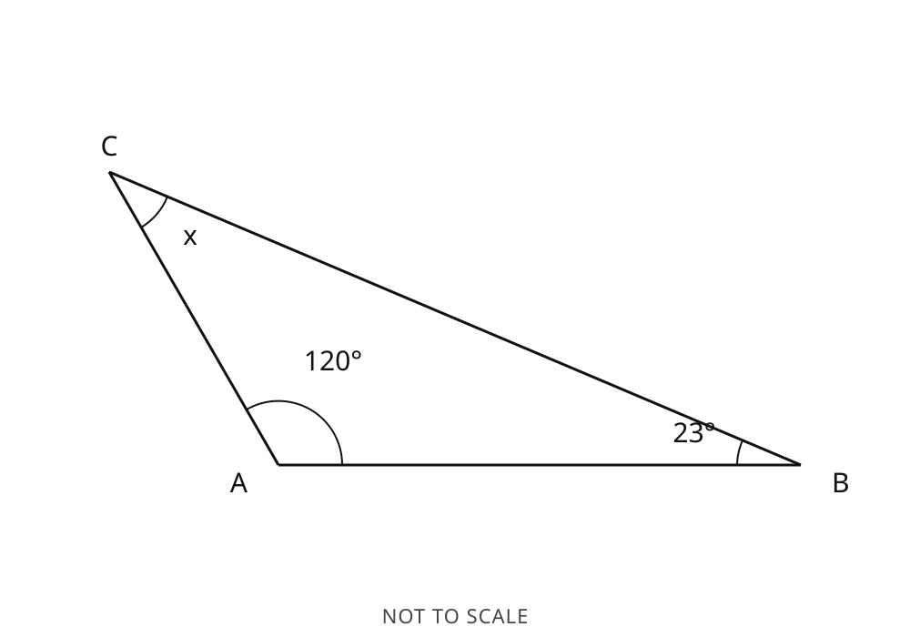

<details><summary>Inline SVG (source)</summary>

```xml
<svg xmlns="http://www.w3.org/2000/svg" viewBox="0 0 1000 700" role="img" aria-label="Diagram: a triangle with two known angles and an unknown angle x.">
<title>Triangle ABC</title>
<desc>Triangle ABC has an interior angle of 120 degrees at A, an interior angle of 23 degrees at B, and an unknown interior angle x at C.</desc>
<style>.gl{stroke:#111;stroke-width:3;fill:none}.ga{stroke:#111;stroke-width:2;fill:none}.gt{stroke:#111;stroke-width:3}.gx{stroke:#111;stroke-width:3}.gv{fill:#111}text{font-family:sans-serif;font-size:30px;fill:#111}.gn{font-size:22px;fill:#444;letter-spacing:1px}</style>
<line class="gl" x1="306" y1="511" x2="880" y2="511"/>
<line class="gl" x1="306" y1="511" x2="120" y2="189"/>
<line class="gl" x1="880" y1="511" x2="120" y2="189"/>
<path class="ga" d="M 362 511 A 56 56 0 0 0 278 463"/>
<path class="ga" d="M 828 489 A 56 56 0 0 0 824 511"/>
<path class="ga" d="M 148 237 A 56 56 0 0 0 172 211"/>
<line class="gx" x1="817" y1="498" x2="799" y2="520"/>
<text x="272" y="541" text-anchor="end">A</text>
<text x="914" y="541" text-anchor="start">B</text>
<text x="120" y="171" text-anchor="middle">C</text>
<text x="352" y="431" text-anchor="middle">120°</text>
<text x="778" y="547" text-anchor="middle">23°</text>
<text x="200" y="261" text-anchor="middle">x</text>
<text class="gn" x="500" y="685" text-anchor="middle">NOT TO SCALE</text>
</svg>
```

</details>

**Alt text:** Diagram: a triangle with two known angles and an unknown angle x.

**Long description:** Triangle ABC has an interior angle of 120 degrees at A, an interior angle of 23 degrees at B, and an unknown interior angle x at C.

**Data-table fallback**

| angle | value |
| --- | --- |
| angle 1 | 120 degrees |
| angle 2 | 23 degrees |
| x | unknown |

**Answer:** `x = 37°`

**Worked solution**

1. State the angle fact — `The interior angles of a triangle sum to 180 degrees`
2. Form the equation — `x = 180 - (120 + 23)`
3. Evaluate — `x = 37°`

**MC option order:** A. 37° (correct)  B. 143°  C. 60°  D. 217°

**Distractor calculations (each a distinct misconception pathway)**

| Value | Formula (teacher) | Misconception | Rationale | Student feedback |
| --- | --- | --- | --- | --- |
| `217°` | `360 - A - B` | Uses 360 for a triangle (`MISC.GEOM.TRI.USES_360`) | Used a 360-degree sum for a triangle. | The interior angles of a triangle sum to 180 degrees, not 360. |
| `143°` | `A + B` | Returns the sum of the givens (`MISC.GEOM.TRI.RETURNS_SUM_GIVENS`) | Gave the sum of the two known angles. | You added the two known angles. Subtract their total from 180. |
| `60°` | `180 - A` | Subtracts only one given (`MISC.GEOM.TRI.SUBTRACTS_ONLY_ONE_GIVEN`) | Subtracted only one known angle from 180. | Subtract both known angles from 180, not just one. |

**Diagram-to-data validation:** `svg-realises-data`=pass  `arc-region-measure-agreement`=pass  `arc-large-flag-correct`=pass  `arc-sweep-correct`=pass  `arc-matches-cyclic-region`=n/a  `label-inside-intended-region`=pass  `reflex-region-rendered-correctly`=pass  `no-theorem-revealing-markers`=n/a  `target-region-unambiguous`=n/a  `labels-non-overlapping`=pass  `not-to-scale`=pass  `no-answer-leakage`=pass  `media-present`=pass

**Accessibility validation:** `a11y-fields-present`=pass  `a11y-no-answer-in-text`=pass  `a11y-equivalent-information`=pass  `nonColorIndicators`=True

**Overall validation:** pass

**Curriculum decision:** [ ] approve  [ ] revise  [ ] reject — notes: ____

---

### triangle_missing_angle / multiple-choice #3 — band 3 (floor 2, range [2, 3])

- **Objective:** `SPI.MIDDLE.GEO.TRIANGLE_ANGLE_SUM.01`  ·  **Family:** F2  ·  **Calculator:** calculator-not-required
- **Interaction type:** multiple-choice  ·  **Answer type:** integer  ·  **Units:** degrees
- **Canonical value:** `num=51, den=1` -> `51°`  ·  **Givens:** `[118, 11]`
- **Seed:** `3`  ·  **Generator:** v`1.2.2`  ·  **Parameters:** `{"task": "triangle_missing_angle", "A": 118, "B": 11}`
- **Difficulty axes:** `{"numericalComplexity": 0.5, "reasoningSteps": 0.5, "representation": 0.6, "abstraction": 0.5}`  ·  **Band:** 3
- **To scale:** False (figure is NOT drawn to scale)
- **Reproduce:** `generate(3, {"task": "triangle_missing_angle", "interactionType": "multiple-choice"})` on v`1.2.2`

**Question**

> Find the size of the unknown angle x, in degrees.

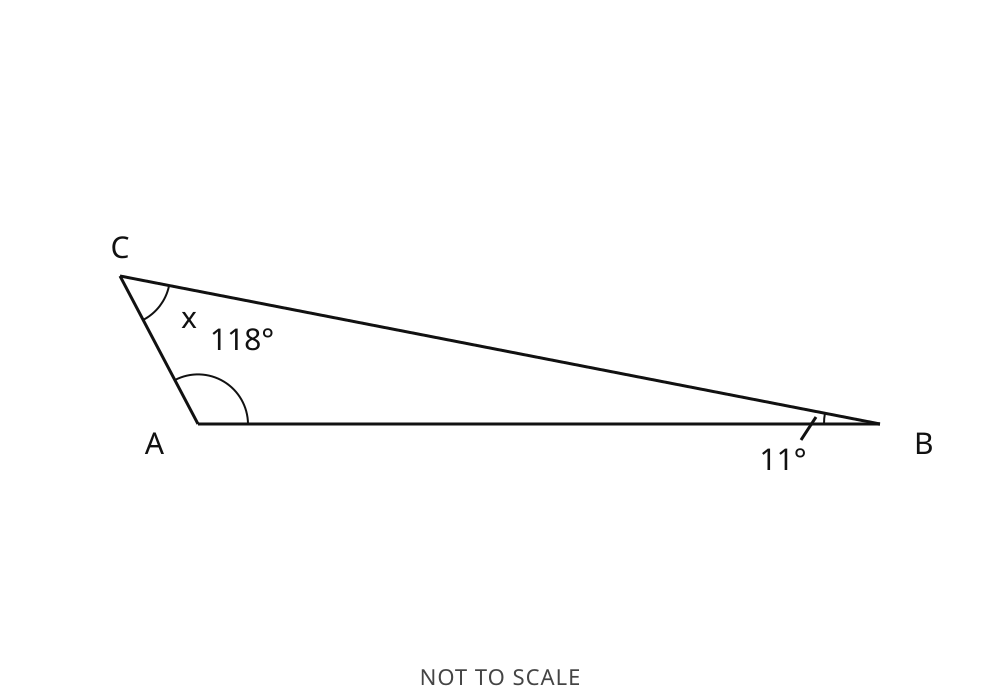

<details><summary>Inline SVG (source)</summary>

```xml
<svg xmlns="http://www.w3.org/2000/svg" viewBox="0 0 1000 700" role="img" aria-label="Diagram: a triangle with two known angles and an unknown angle x.">
<title>Triangle ABC</title>
<desc>Triangle ABC has an interior angle of 118 degrees at A, an interior angle of 11 degrees at B, and an unknown interior angle x at C.</desc>
<style>.gl{stroke:#111;stroke-width:3;fill:none}.ga{stroke:#111;stroke-width:2;fill:none}.gt{stroke:#111;stroke-width:3}.gx{stroke:#111;stroke-width:3}.gv{fill:#111}text{font-family:sans-serif;font-size:30px;fill:#111}.gn{font-size:22px;fill:#444;letter-spacing:1px}</style>
<line class="gl" x1="198" y1="424" x2="880" y2="424"/>
<line class="gl" x1="198" y1="424" x2="120" y2="276"/>
<line class="gl" x1="880" y1="424" x2="120" y2="276"/>
<path class="ga" d="M 248 424 A 50 50 0 0 0 175 380"/>
<path class="ga" d="M 825 413 A 56 56 0 0 0 824 424"/>
<path class="ga" d="M 143 320 A 50 50 0 0 0 169 286"/>
<line class="gx" x1="816" y1="417" x2="801" y2="440"/>
<text x="164" y="454" text-anchor="end">A</text>
<text x="914" y="454" text-anchor="start">B</text>
<text x="120" y="258" text-anchor="middle">C</text>
<text x="242" y="350" text-anchor="middle">118°</text>
<text x="783" y="470" text-anchor="middle">11°</text>
<text x="189" y="328" text-anchor="middle">x</text>
<text class="gn" x="500" y="685" text-anchor="middle">NOT TO SCALE</text>
</svg>
```

</details>

**Alt text:** Diagram: a triangle with two known angles and an unknown angle x.

**Long description:** Triangle ABC has an interior angle of 118 degrees at A, an interior angle of 11 degrees at B, and an unknown interior angle x at C.

**Data-table fallback**

| angle | value |
| --- | --- |
| angle 1 | 118 degrees |
| angle 2 | 11 degrees |
| x | unknown |

**Answer:** `x = 51°`

**Worked solution**

1. State the angle fact — `The interior angles of a triangle sum to 180 degrees`
2. Form the equation — `x = 180 - (118 + 11)`
3. Evaluate — `x = 51°`

**MC option order:** A. 129°  B. 62°  C. 51° (correct)  D. 231°

**Distractor calculations (each a distinct misconception pathway)**

| Value | Formula (teacher) | Misconception | Rationale | Student feedback |
| --- | --- | --- | --- | --- |
| `231°` | `360 - A - B` | Uses 360 for a triangle (`MISC.GEOM.TRI.USES_360`) | Used a 360-degree sum for a triangle. | The interior angles of a triangle sum to 180 degrees, not 360. |
| `129°` | `A + B` | Returns the sum of the givens (`MISC.GEOM.TRI.RETURNS_SUM_GIVENS`) | Gave the sum of the two known angles. | You added the two known angles. Subtract their total from 180. |
| `62°` | `180 - A` | Subtracts only one given (`MISC.GEOM.TRI.SUBTRACTS_ONLY_ONE_GIVEN`) | Subtracted only one known angle from 180. | Subtract both known angles from 180, not just one. |

**Diagram-to-data validation:** `svg-realises-data`=pass  `arc-region-measure-agreement`=pass  `arc-large-flag-correct`=pass  `arc-sweep-correct`=pass  `arc-matches-cyclic-region`=n/a  `label-inside-intended-region`=pass  `reflex-region-rendered-correctly`=pass  `no-theorem-revealing-markers`=n/a  `target-region-unambiguous`=n/a  `labels-non-overlapping`=pass  `not-to-scale`=pass  `no-answer-leakage`=pass  `media-present`=pass

**Accessibility validation:** `a11y-fields-present`=pass  `a11y-no-answer-in-text`=pass  `a11y-equivalent-information`=pass  `nonColorIndicators`=True

**Overall validation:** pass

**Curriculum decision:** [ ] approve  [ ] revise  [ ] reject — notes: ____

---

### triangle_missing_angle / multiple-choice #4 — band 3 (floor 2, range [2, 3])

- **Objective:** `SPI.MIDDLE.GEO.TRIANGLE_ANGLE_SUM.01`  ·  **Family:** F2  ·  **Calculator:** calculator-not-required
- **Interaction type:** multiple-choice  ·  **Answer type:** integer  ·  **Units:** degrees
- **Canonical value:** `num=20, den=1` -> `20°`  ·  **Givens:** `[100, 60]`
- **Seed:** `25`  ·  **Generator:** v`1.2.2`  ·  **Parameters:** `{"task": "triangle_missing_angle", "A": 100, "B": 60}`
- **Difficulty axes:** `{"numericalComplexity": 0.5, "reasoningSteps": 0.5, "representation": 0.6, "abstraction": 0.3}`  ·  **Band:** 3
- **To scale:** False (figure is NOT drawn to scale)
- **Reproduce:** `generate(25, {"task": "triangle_missing_angle", "interactionType": "multiple-choice"})` on v`1.2.2`

**Question**

> Find the size of the unknown angle x, in degrees.


<details><summary>Inline SVG (source)</summary>

```xml
<svg xmlns="http://www.w3.org/2000/svg" viewBox="0 0 1000 700" role="img" aria-label="Diagram: a triangle with two known angles and an unknown angle x.">
<title>Triangle ABC</title>
<desc>Triangle ABC has an interior angle of 100 degrees at A, an interior angle of 60 degrees at B, and an unknown interior angle x at C.</desc>
<style>.gl{stroke:#111;stroke-width:3;fill:none}.ga{stroke:#111;stroke-width:2;fill:none}.gt{stroke:#111;stroke-width:3}.gx{stroke:#111;stroke-width:3}.gv{fill:#111}text{font-family:sans-serif;font-size:30px;fill:#111}.gn{font-size:22px;fill:#444;letter-spacing:1px}</style>
<line class="gl" x1="442" y1="610" x2="650" y2="610"/>
<line class="gl" x1="442" y1="610" x2="350" y2="90"/>
<line class="gl" x1="650" y1="610" x2="350" y2="90"/>
<path class="ga" d="M 498 610 A 56 56 0 0 0 432 555"/>
<path class="ga" d="M 622 562 A 56 56 0 0 0 594 610"/>
<path class="ga" d="M 360 145 A 56 56 0 0 0 378 138"/>
<line class="gx" x1="372" y1="150" x2="414" y2="154"/>
<text x="408" y="640" text-anchor="end">A</text>
<text x="684" y="640" text-anchor="start">B</text>
<text x="350" y="72" text-anchor="middle">C</text>
<text x="501" y="540" text-anchor="middle">100°</text>
<text x="570" y="564" text-anchor="middle">60°</text>
<text x="434" y="157" text-anchor="middle">x</text>
<text class="gn" x="500" y="685" text-anchor="middle">NOT TO SCALE</text>
</svg>
```

</details>

**Alt text:** Diagram: a triangle with two known angles and an unknown angle x.

**Long description:** Triangle ABC has an interior angle of 100 degrees at A, an interior angle of 60 degrees at B, and an unknown interior angle x at C.

**Data-table fallback**

| angle | value |
| --- | --- |
| angle 1 | 100 degrees |
| angle 2 | 60 degrees |
| x | unknown |

**Answer:** `x = 20°`

**Worked solution**

1. State the angle fact — `The interior angles of a triangle sum to 180 degrees`
2. Form the equation — `x = 180 - (100 + 60)`
3. Evaluate — `x = 20°`

**MC option order:** A. 200°  B. 20° (correct)  C. 80°  D. 160°

**Distractor calculations (each a distinct misconception pathway)**

| Value | Formula (teacher) | Misconception | Rationale | Student feedback |
| --- | --- | --- | --- | --- |
| `200°` | `360 - A - B` | Uses 360 for a triangle (`MISC.GEOM.TRI.USES_360`) | Used a 360-degree sum for a triangle. | The interior angles of a triangle sum to 180 degrees, not 360. |
| `160°` | `A + B` | Returns the sum of the givens (`MISC.GEOM.TRI.RETURNS_SUM_GIVENS`) | Gave the sum of the two known angles. | You added the two known angles. Subtract their total from 180. |
| `80°` | `180 - A` | Subtracts only one given (`MISC.GEOM.TRI.SUBTRACTS_ONLY_ONE_GIVEN`) | Subtracted only one known angle from 180. | Subtract both known angles from 180, not just one. |

**Diagram-to-data validation:** `svg-realises-data`=pass  `arc-region-measure-agreement`=pass  `arc-large-flag-correct`=pass  `arc-sweep-correct`=pass  `arc-matches-cyclic-region`=n/a  `label-inside-intended-region`=pass  `reflex-region-rendered-correctly`=pass  `no-theorem-revealing-markers`=n/a  `target-region-unambiguous`=n/a  `labels-non-overlapping`=pass  `not-to-scale`=pass  `no-answer-leakage`=pass  `media-present`=pass

**Accessibility validation:** `a11y-fields-present`=pass  `a11y-no-answer-in-text`=pass  `a11y-equivalent-information`=pass  `nonColorIndicators`=True

**Overall validation:** pass

**Curriculum decision:** [ ] approve  [ ] revise  [ ] reject — notes: ____

---

### triangle_missing_angle / multiple-choice #5 — band 2 (floor 2, range [2, 3])

- **Objective:** `SPI.MIDDLE.GEO.TRIANGLE_ANGLE_SUM.01`  ·  **Family:** F2  ·  **Calculator:** calculator-not-required
- **Interaction type:** multiple-choice  ·  **Answer type:** integer  ·  **Units:** degrees
- **Canonical value:** `num=95, den=1` -> `95°`  ·  **Givens:** `[60, 25]`
- **Seed:** `98`  ·  **Generator:** v`1.2.2`  ·  **Parameters:** `{"task": "triangle_missing_angle", "A": 60, "B": 25}`
- **Difficulty axes:** `{"numericalComplexity": 0.5, "reasoningSteps": 0.5, "representation": 0.6, "abstraction": 0.3}`  ·  **Band:** 2
- **To scale:** False (figure is NOT drawn to scale)
- **Reproduce:** `generate(98, {"task": "triangle_missing_angle", "interactionType": "multiple-choice"})` on v`1.2.2`

**Question**

> Find the size of the unknown angle x, in degrees.

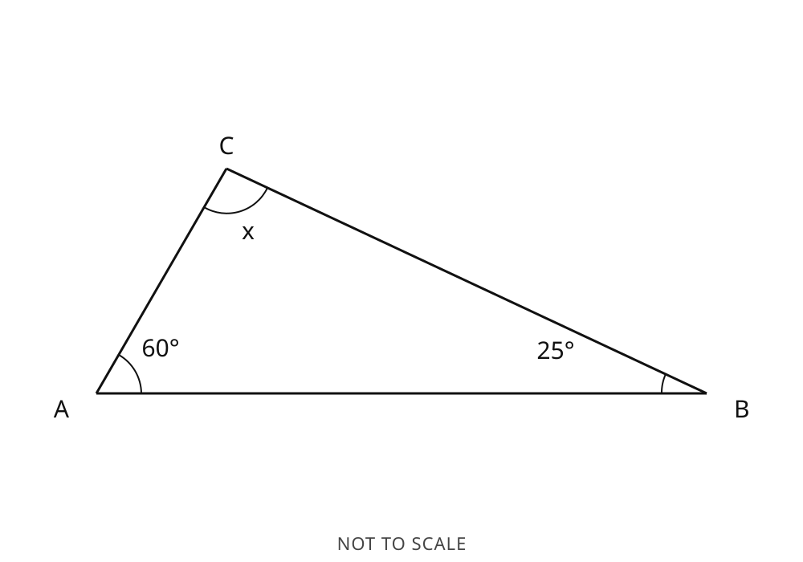

<details><summary>Inline SVG (source)</summary>

```xml
<svg xmlns="http://www.w3.org/2000/svg" viewBox="0 0 1000 700" role="img" aria-label="Diagram: a triangle with two known angles and an unknown angle x.">
<title>Triangle ABC</title>
<desc>Triangle ABC has an interior angle of 60 degrees at A, an interior angle of 25 degrees at B, and an unknown interior angle x at C.</desc>
<style>.gl{stroke:#111;stroke-width:3;fill:none}.ga{stroke:#111;stroke-width:2;fill:none}.gt{stroke:#111;stroke-width:3}.gx{stroke:#111;stroke-width:3}.gv{fill:#111}text{font-family:sans-serif;font-size:30px;fill:#111}.gn{font-size:22px;fill:#444;letter-spacing:1px}</style>
<line class="gl" x1="120" y1="490" x2="880" y2="490"/>
<line class="gl" x1="120" y1="490" x2="282" y2="210"/>
<line class="gl" x1="880" y1="490" x2="282" y2="210"/>
<path class="ga" d="M 176 490 A 56 56 0 0 0 148 442"/>
<path class="ga" d="M 829 466 A 56 56 0 0 0 824 490"/>
<path class="ga" d="M 254 258 A 56 56 0 0 0 333 234"/>
<text x="86" y="520" text-anchor="end">A</text>
<text x="914" y="520" text-anchor="start">B</text>
<text x="282" y="192" text-anchor="middle">C</text>
<text x="200" y="444" text-anchor="middle">60°</text>
<text x="692" y="447" text-anchor="middle">25°</text>
<text x="309" y="298" text-anchor="middle">x</text>
<text class="gn" x="500" y="685" text-anchor="middle">NOT TO SCALE</text>
</svg>
```

</details>

**Alt text:** Diagram: a triangle with two known angles and an unknown angle x.

**Long description:** Triangle ABC has an interior angle of 60 degrees at A, an interior angle of 25 degrees at B, and an unknown interior angle x at C.

**Data-table fallback**

| angle | value |
| --- | --- |
| angle 1 | 60 degrees |
| angle 2 | 25 degrees |
| x | unknown |

**Answer:** `x = 95°`

**Worked solution**

1. State the angle fact — `The interior angles of a triangle sum to 180 degrees`
2. Form the equation — `x = 180 - (60 + 25)`
3. Evaluate — `x = 95°`

**MC option order:** A. 120°  B. 85°  C. 275°  D. 95° (correct)

**Distractor calculations (each a distinct misconception pathway)**

| Value | Formula (teacher) | Misconception | Rationale | Student feedback |
| --- | --- | --- | --- | --- |
| `275°` | `360 - A - B` | Uses 360 for a triangle (`MISC.GEOM.TRI.USES_360`) | Used a 360-degree sum for a triangle. | The interior angles of a triangle sum to 180 degrees, not 360. |
| `85°` | `A + B` | Returns the sum of the givens (`MISC.GEOM.TRI.RETURNS_SUM_GIVENS`) | Gave the sum of the two known angles. | You added the two known angles. Subtract their total from 180. |
| `120°` | `180 - A` | Subtracts only one given (`MISC.GEOM.TRI.SUBTRACTS_ONLY_ONE_GIVEN`) | Subtracted only one known angle from 180. | Subtract both known angles from 180, not just one. |

**Diagram-to-data validation:** `svg-realises-data`=pass  `arc-region-measure-agreement`=pass  `arc-large-flag-correct`=pass  `arc-sweep-correct`=pass  `arc-matches-cyclic-region`=n/a  `label-inside-intended-region`=pass  `reflex-region-rendered-correctly`=pass  `no-theorem-revealing-markers`=n/a  `target-region-unambiguous`=n/a  `labels-non-overlapping`=pass  `not-to-scale`=pass  `no-answer-leakage`=pass  `media-present`=pass

**Accessibility validation:** `a11y-fields-present`=pass  `a11y-no-answer-in-text`=pass  `a11y-equivalent-information`=pass  `nonColorIndicators`=True

**Overall validation:** pass

**Curriculum decision:** [ ] approve  [ ] revise  [ ] reject — notes: ____

---

## isosceles_base_angle · free-response — 5 examples  (F2, `SPI.MIDDLE.GEO.ISOSCELES_BASE_ANGLES.01`)

### isosceles_base_angle / free-response #1 — band 3 (floor 2, range [2, 3])

- **Objective:** `SPI.MIDDLE.GEO.ISOSCELES_BASE_ANGLES.01`  ·  **Family:** F2  ·  **Calculator:** calculator-not-required
- **Interaction type:** free-response  ·  **Answer type:** integer  ·  **Units:** degrees
- **Canonical value:** `num=36, den=1` -> `36°`  ·  **Givens:** `[108]`
- **Seed:** `1`  ·  **Generator:** v`1.2.2`  ·  **Parameters:** `{"task": "isosceles_base_angle", "apex": 108}`
- **Difficulty axes:** `{"numericalComplexity": 0.25, "reasoningSteps": 0.5, "representation": 0.6, "abstraction": 0.5}`  ·  **Band:** 3
- **To scale:** False (figure is NOT drawn to scale)
- **Reproduce:** `generate(1, {"task": "isosceles_base_angle", "interactionType": "free-response"})` on v`1.2.2`

**Question**

> Find the size of the unknown angle x, in degrees.

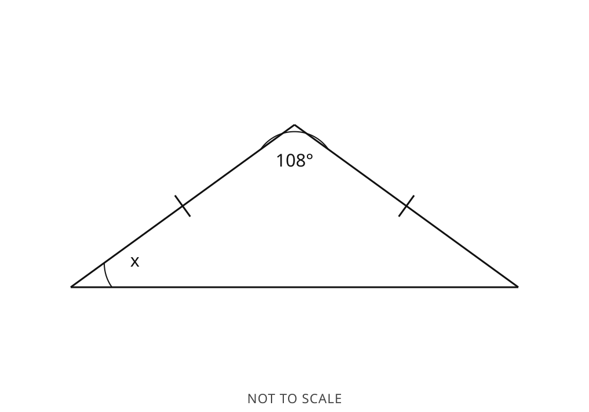

<details><summary>Inline SVG (source)</summary>

```xml
<svg xmlns="http://www.w3.org/2000/svg" viewBox="0 0 1000 700" role="img" aria-label="Diagram: a triangle with two sides marked equal, an apex angle, and an unknown base angle x.">
<title>Isosceles triangle</title>
<desc>Triangle ABC has its two slanted sides marked equal with single tick marks. The angle at the apex is 108 degrees, and the unknown base angle is marked x.</desc>
<style>.gl{stroke:#111;stroke-width:3;fill:none}.ga{stroke:#111;stroke-width:2;fill:none}.gt{stroke:#111;stroke-width:3}.gx{stroke:#111;stroke-width:3}.gv{fill:#111}text{font-family:sans-serif;font-size:30px;fill:#111}.gn{font-size:22px;fill:#444;letter-spacing:1px}</style>
<line class="gl" x1="120" y1="488" x2="880" y2="488"/>
<line class="gl" x1="120" y1="488" x2="500" y2="212"/>
<line class="gl" x1="880" y1="488" x2="500" y2="212"/>
<path class="ga" d="M 455 245 A 56 56 0 0 0 545 245"/>
<path class="ga" d="M 176 488 A 56 56 0 0 0 165 455"/>
<line class="gt" x1="323" y1="368" x2="297" y2="332"/>
<line class="gt" x1="703" y1="332" x2="677" y2="368"/>
<text x="500" y="304" text-anchor="middle">108°</text>
<text x="223" y="455" text-anchor="middle">x</text>
<text class="gn" x="500" y="685" text-anchor="middle">NOT TO SCALE</text>
</svg>
```

</details>

**Alt text:** Diagram: a triangle with two sides marked equal, an apex angle, and an unknown base angle x.

**Long description:** Triangle ABC has its two slanted sides marked equal with single tick marks. The angle at the apex is 108 degrees, and the unknown base angle is marked x.

**Data-table fallback**

| angle | value |
| --- | --- |
| angle 1 | 108 degrees |
| x | unknown |

**Answer:** `x = 36°`

**Worked solution**

1. State the angle fact — `Base angles of an isosceles triangle are equal; the three angles sum to 180 degrees`
2. Form the equation — `x = (180 - 108) / 2`
3. Evaluate — `x = 36°`

_Free-response: no distractors._

**Diagram-to-data validation:** `svg-realises-data`=pass  `arc-region-measure-agreement`=pass  `arc-large-flag-correct`=pass  `arc-sweep-correct`=pass  `arc-matches-cyclic-region`=n/a  `label-inside-intended-region`=pass  `reflex-region-rendered-correctly`=pass  `no-theorem-revealing-markers`=n/a  `target-region-unambiguous`=n/a  `labels-non-overlapping`=pass  `not-to-scale`=pass  `no-answer-leakage`=pass  `media-present`=pass

**Accessibility validation:** `a11y-fields-present`=pass  `a11y-no-answer-in-text`=pass  `a11y-equivalent-information`=pass  `nonColorIndicators`=True

**Overall validation:** pass

**Curriculum decision:** [ ] approve  [ ] revise  [ ] reject — notes: ____

---

### isosceles_base_angle / free-response #2 — band 3 (floor 2, range [2, 3])

- **Objective:** `SPI.MIDDLE.GEO.ISOSCELES_BASE_ANGLES.01`  ·  **Family:** F2  ·  **Calculator:** calculator-not-required
- **Interaction type:** free-response  ·  **Answer type:** integer  ·  **Units:** degrees
- **Canonical value:** `num=28, den=1` -> `28°`  ·  **Givens:** `[124]`
- **Seed:** `2`  ·  **Generator:** v`1.2.2`  ·  **Parameters:** `{"task": "isosceles_base_angle", "apex": 124}`
- **Difficulty axes:** `{"numericalComplexity": 0.25, "reasoningSteps": 0.5, "representation": 0.6, "abstraction": 0.5}`  ·  **Band:** 3
- **To scale:** False (figure is NOT drawn to scale)
- **Reproduce:** `generate(2, {"task": "isosceles_base_angle", "interactionType": "free-response"})` on v`1.2.2`

**Question**

> Find the size of the unknown angle x, in degrees.

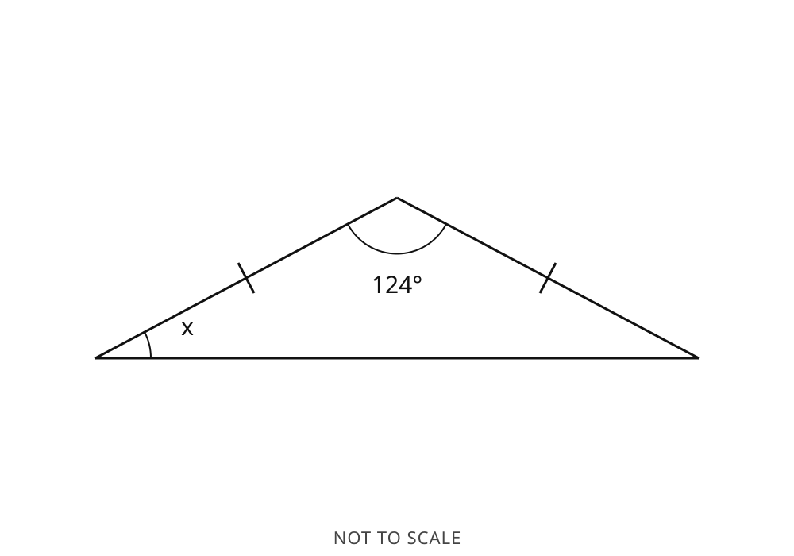

<details><summary>Inline SVG (source)</summary>

```xml
<svg xmlns="http://www.w3.org/2000/svg" viewBox="0 0 1000 700" role="img" aria-label="Diagram: a triangle with two sides marked equal, an apex angle, and an unknown base angle x.">
<title>Isosceles triangle</title>
<desc>Triangle ABC has its two slanted sides marked equal with single tick marks. The angle at the apex is 124 degrees, and the unknown base angle is marked x.</desc>
<style>.gl{stroke:#111;stroke-width:3;fill:none}.ga{stroke:#111;stroke-width:2;fill:none}.gt{stroke:#111;stroke-width:3}.gx{stroke:#111;stroke-width:3}.gv{fill:#111}text{font-family:sans-serif;font-size:30px;fill:#111}.gn{font-size:22px;fill:#444;letter-spacing:1px}</style>
<line class="gl" x1="120" y1="451" x2="880" y2="451"/>
<line class="gl" x1="120" y1="451" x2="500" y2="249"/>
<line class="gl" x1="880" y1="451" x2="500" y2="249"/>
<path class="ga" d="M 451 275 A 56 56 0 0 0 549 275"/>
<path class="ga" d="M 176 451 A 56 56 0 0 0 169 425"/>
<line class="gt" x1="320" y1="369" x2="300" y2="331"/>
<line class="gt" x1="700" y1="331" x2="680" y2="369"/>
<line class="gx" x1="182" y1="436" x2="190" y2="394"/>
<text x="500" y="341" text-anchor="middle">124°</text>
<text x="195" y="375" text-anchor="middle">x</text>
<text class="gn" x="500" y="685" text-anchor="middle">NOT TO SCALE</text>
</svg>
```

</details>

**Alt text:** Diagram: a triangle with two sides marked equal, an apex angle, and an unknown base angle x.

**Long description:** Triangle ABC has its two slanted sides marked equal with single tick marks. The angle at the apex is 124 degrees, and the unknown base angle is marked x.

**Data-table fallback**

| angle | value |
| --- | --- |
| angle 1 | 124 degrees |
| x | unknown |

**Answer:** `x = 28°`

**Worked solution**

1. State the angle fact — `Base angles of an isosceles triangle are equal; the three angles sum to 180 degrees`
2. Form the equation — `x = (180 - 124) / 2`
3. Evaluate — `x = 28°`

_Free-response: no distractors._

**Diagram-to-data validation:** `svg-realises-data`=pass  `arc-region-measure-agreement`=pass  `arc-large-flag-correct`=pass  `arc-sweep-correct`=pass  `arc-matches-cyclic-region`=n/a  `label-inside-intended-region`=pass  `reflex-region-rendered-correctly`=pass  `no-theorem-revealing-markers`=n/a  `target-region-unambiguous`=n/a  `labels-non-overlapping`=pass  `not-to-scale`=pass  `no-answer-leakage`=pass  `media-present`=pass

**Accessibility validation:** `a11y-fields-present`=pass  `a11y-no-answer-in-text`=pass  `a11y-equivalent-information`=pass  `nonColorIndicators`=True

**Overall validation:** pass

**Curriculum decision:** [ ] approve  [ ] revise  [ ] reject — notes: ____

---

### isosceles_base_angle / free-response #3 — band 3 (floor 2, range [2, 3])

- **Objective:** `SPI.MIDDLE.GEO.ISOSCELES_BASE_ANGLES.01`  ·  **Family:** F2  ·  **Calculator:** calculator-not-required
- **Interaction type:** free-response  ·  **Answer type:** integer  ·  **Units:** degrees
- **Canonical value:** `num=29, den=1` -> `29°`  ·  **Givens:** `[122]`
- **Seed:** `3`  ·  **Generator:** v`1.2.2`  ·  **Parameters:** `{"task": "isosceles_base_angle", "apex": 122}`
- **Difficulty axes:** `{"numericalComplexity": 0.25, "reasoningSteps": 0.5, "representation": 0.6, "abstraction": 0.5}`  ·  **Band:** 3
- **To scale:** False (figure is NOT drawn to scale)
- **Reproduce:** `generate(3, {"task": "isosceles_base_angle", "interactionType": "free-response"})` on v`1.2.2`

**Question**

> Find the size of the unknown angle x, in degrees.

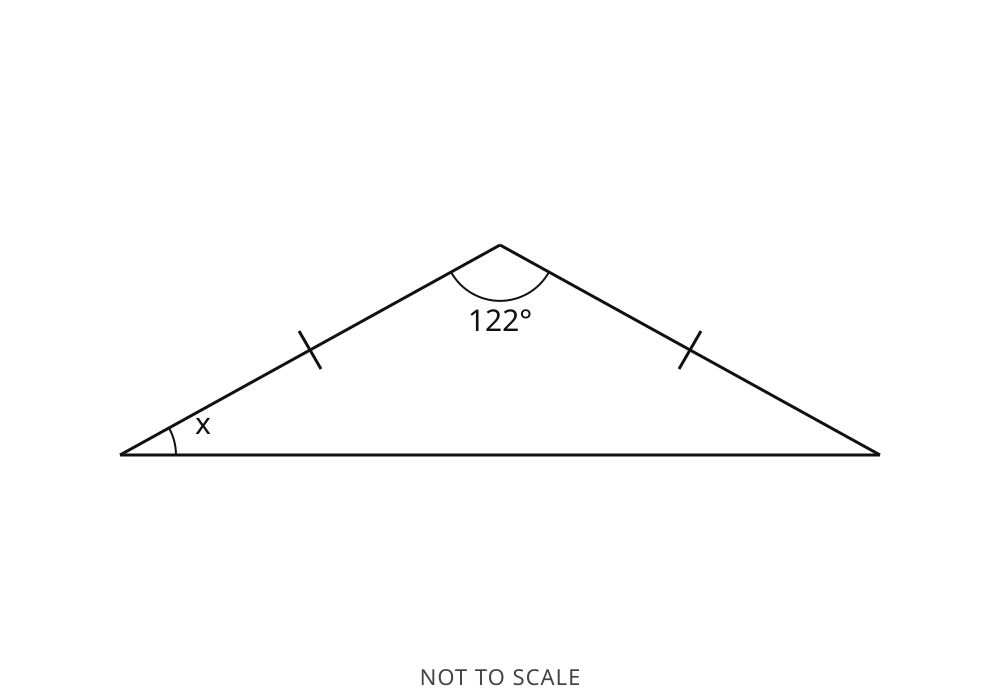

<details><summary>Inline SVG (source)</summary>

```xml
<svg xmlns="http://www.w3.org/2000/svg" viewBox="0 0 1000 700" role="img" aria-label="Diagram: a triangle with two sides marked equal, an apex angle, and an unknown base angle x.">
<title>Isosceles triangle</title>
<desc>Triangle ABC has its two slanted sides marked equal with single tick marks. The angle at the apex is 122 degrees, and the unknown base angle is marked x.</desc>
<style>.gl{stroke:#111;stroke-width:3;fill:none}.ga{stroke:#111;stroke-width:2;fill:none}.gt{stroke:#111;stroke-width:3}.gx{stroke:#111;stroke-width:3}.gv{fill:#111}text{font-family:sans-serif;font-size:30px;fill:#111}.gn{font-size:22px;fill:#444;letter-spacing:1px}</style>
<line class="gl" x1="120" y1="455" x2="880" y2="455"/>
<line class="gl" x1="120" y1="455" x2="500" y2="245"/>
<line class="gl" x1="880" y1="455" x2="500" y2="245"/>
<path class="ga" d="M 451 272 A 56 56 0 0 0 549 272"/>
<path class="ga" d="M 176 455 A 56 56 0 0 0 169 428"/>
<line class="gt" x1="321" y1="369" x2="299" y2="331"/>
<line class="gt" x1="701" y1="331" x2="679" y2="369"/>
<text x="500" y="337" text-anchor="middle">122°</text>
<text x="256" y="421" text-anchor="middle">x</text>
<text class="gn" x="500" y="685" text-anchor="middle">NOT TO SCALE</text>
</svg>
```

</details>

**Alt text:** Diagram: a triangle with two sides marked equal, an apex angle, and an unknown base angle x.

**Long description:** Triangle ABC has its two slanted sides marked equal with single tick marks. The angle at the apex is 122 degrees, and the unknown base angle is marked x.

**Data-table fallback**

| angle | value |
| --- | --- |
| angle 1 | 122 degrees |
| x | unknown |

**Answer:** `x = 29°`

**Worked solution**

1. State the angle fact — `Base angles of an isosceles triangle are equal; the three angles sum to 180 degrees`
2. Form the equation — `x = (180 - 122) / 2`
3. Evaluate — `x = 29°`

_Free-response: no distractors._

**Diagram-to-data validation:** `svg-realises-data`=pass  `arc-region-measure-agreement`=pass  `arc-large-flag-correct`=pass  `arc-sweep-correct`=pass  `arc-matches-cyclic-region`=n/a  `label-inside-intended-region`=pass  `reflex-region-rendered-correctly`=pass  `no-theorem-revealing-markers`=n/a  `target-region-unambiguous`=n/a  `labels-non-overlapping`=pass  `not-to-scale`=pass  `no-answer-leakage`=pass  `media-present`=pass

**Accessibility validation:** `a11y-fields-present`=pass  `a11y-no-answer-in-text`=pass  `a11y-equivalent-information`=pass  `nonColorIndicators`=True

**Overall validation:** pass

**Curriculum decision:** [ ] approve  [ ] revise  [ ] reject — notes: ____

---

### isosceles_base_angle / free-response #4 — band 3 (floor 2, range [2, 3])

- **Objective:** `SPI.MIDDLE.GEO.ISOSCELES_BASE_ANGLES.01`  ·  **Family:** F2  ·  **Calculator:** calculator-not-required
- **Interaction type:** free-response  ·  **Answer type:** integer  ·  **Units:** degrees
- **Canonical value:** `num=15, den=1` -> `15°`  ·  **Givens:** `[150]`
- **Seed:** `4`  ·  **Generator:** v`1.2.2`  ·  **Parameters:** `{"task": "isosceles_base_angle", "apex": 150}`
- **Difficulty axes:** `{"numericalComplexity": 0.25, "reasoningSteps": 0.5, "representation": 0.6, "abstraction": 0.3}`  ·  **Band:** 3
- **To scale:** False (figure is NOT drawn to scale)
- **Reproduce:** `generate(4, {"task": "isosceles_base_angle", "interactionType": "free-response"})` on v`1.2.2`

**Question**

> Find the size of the unknown angle x, in degrees.

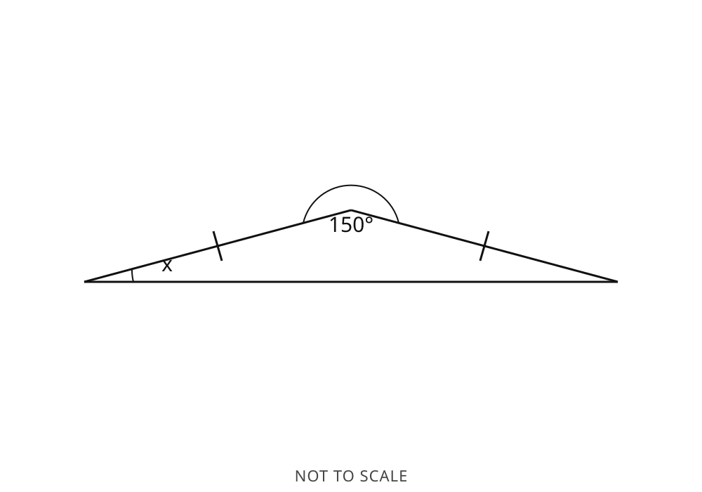

<details><summary>Inline SVG (source)</summary>

```xml
<svg xmlns="http://www.w3.org/2000/svg" viewBox="0 0 1000 700" role="img" aria-label="Diagram: a triangle with two sides marked equal, an apex angle, and an unknown base angle x.">
<title>Isosceles triangle</title>
<desc>Triangle ABC has its two slanted sides marked equal with single tick marks. The angle at the apex is 150 degrees, and the unknown base angle is marked x.</desc>
<style>.gl{stroke:#111;stroke-width:3;fill:none}.ga{stroke:#111;stroke-width:2;fill:none}.gt{stroke:#111;stroke-width:3}.gx{stroke:#111;stroke-width:3}.gv{fill:#111}text{font-family:sans-serif;font-size:30px;fill:#111}.gn{font-size:22px;fill:#444;letter-spacing:1px}</style>
<line class="gl" x1="120" y1="401" x2="880" y2="401"/>
<line class="gl" x1="120" y1="401" x2="500" y2="299"/>
<line class="gl" x1="880" y1="401" x2="500" y2="299"/>
<path class="ga" d="M 446 313 A 56 56 0 0 0 554 313"/>
<path class="ga" d="M 176 401 A 56 56 0 0 0 174 387"/>
<line class="gt" x1="316" y1="371" x2="304" y2="329"/>
<line class="gt" x1="696" y1="329" x2="684" y2="371"/>
<line class="gx" x1="184" y1="393" x2="197" y2="353"/>
<text x="500" y="439" text-anchor="middle">150°</text>
<text x="204" y="334" text-anchor="middle">x</text>
<text class="gn" x="500" y="685" text-anchor="middle">NOT TO SCALE</text>
</svg>
```

</details>

**Alt text:** Diagram: a triangle with two sides marked equal, an apex angle, and an unknown base angle x.

**Long description:** Triangle ABC has its two slanted sides marked equal with single tick marks. The angle at the apex is 150 degrees, and the unknown base angle is marked x.

**Data-table fallback**

| angle | value |
| --- | --- |
| angle 1 | 150 degrees |
| x | unknown |

**Answer:** `x = 15°`

**Worked solution**

1. State the angle fact — `Base angles of an isosceles triangle are equal; the three angles sum to 180 degrees`
2. Form the equation — `x = (180 - 150) / 2`
3. Evaluate — `x = 15°`

_Free-response: no distractors._

**Diagram-to-data validation:** `svg-realises-data`=pass  `arc-region-measure-agreement`=pass  `arc-large-flag-correct`=pass  `arc-sweep-correct`=pass  `arc-matches-cyclic-region`=n/a  `label-inside-intended-region`=pass  `reflex-region-rendered-correctly`=pass  `no-theorem-revealing-markers`=n/a  `target-region-unambiguous`=n/a  `labels-non-overlapping`=pass  `not-to-scale`=pass  `no-answer-leakage`=pass  `media-present`=pass

**Accessibility validation:** `a11y-fields-present`=pass  `a11y-no-answer-in-text`=pass  `a11y-equivalent-information`=pass  `nonColorIndicators`=True

**Overall validation:** pass

**Curriculum decision:** [ ] approve  [ ] revise  [ ] reject — notes: ____

---

### isosceles_base_angle / free-response #5 — band 2 (floor 2, range [2, 3])

- **Objective:** `SPI.MIDDLE.GEO.ISOSCELES_BASE_ANGLES.01`  ·  **Family:** F2  ·  **Calculator:** calculator-not-required
- **Interaction type:** free-response  ·  **Answer type:** integer  ·  **Units:** degrees
- **Canonical value:** `num=80, den=1` -> `80°`  ·  **Givens:** `[20]`
- **Seed:** `7`  ·  **Generator:** v`1.2.2`  ·  **Parameters:** `{"task": "isosceles_base_angle", "apex": 20}`
- **Difficulty axes:** `{"numericalComplexity": 0.25, "reasoningSteps": 0.5, "representation": 0.6, "abstraction": 0.3}`  ·  **Band:** 2
- **To scale:** False (figure is NOT drawn to scale)
- **Reproduce:** `generate(7, {"task": "isosceles_base_angle", "interactionType": "free-response"})` on v`1.2.2`

**Question**

> Find the size of the unknown angle x, in degrees.


<details><summary>Inline SVG (source)</summary>

```xml
<svg xmlns="http://www.w3.org/2000/svg" viewBox="0 0 1000 700" role="img" aria-label="Diagram: a triangle with two sides marked equal, an apex angle, and an unknown base angle x.">
<title>Isosceles triangle</title>
<desc>Triangle ABC has its two slanted sides marked equal with single tick marks. The angle at the apex is 20 degrees, and the unknown base angle is marked x.</desc>
<style>.gl{stroke:#111;stroke-width:3;fill:none}.ga{stroke:#111;stroke-width:2;fill:none}.gt{stroke:#111;stroke-width:3}.gx{stroke:#111;stroke-width:3}.gv{fill:#111}text{font-family:sans-serif;font-size:30px;fill:#111}.gn{font-size:22px;fill:#444;letter-spacing:1px}</style>
<line class="gl" x1="408" y1="610" x2="592" y2="610"/>
<line class="gl" x1="408" y1="610" x2="500" y2="90"/>
<line class="gl" x1="592" y1="610" x2="500" y2="90"/>
<path class="ga" d="M 490 145 A 56 56 0 0 0 510 145"/>
<path class="ga" d="M 463 610 A 55 55 0 0 0 418 556"/>
<line class="gt" x1="476" y1="354" x2="432" y2="346"/>
<line class="gt" x1="568" y1="346" x2="524" y2="354"/>
<text x="500" y="311" text-anchor="middle">20°</text>
<text x="478" y="552" text-anchor="middle">x</text>
<text class="gn" x="500" y="685" text-anchor="middle">NOT TO SCALE</text>
</svg>
```

</details>

**Alt text:** Diagram: a triangle with two sides marked equal, an apex angle, and an unknown base angle x.

**Long description:** Triangle ABC has its two slanted sides marked equal with single tick marks. The angle at the apex is 20 degrees, and the unknown base angle is marked x.

**Data-table fallback**

| angle | value |
| --- | --- |
| angle 1 | 20 degrees |
| x | unknown |

**Answer:** `x = 80°`

**Worked solution**

1. State the angle fact — `Base angles of an isosceles triangle are equal; the three angles sum to 180 degrees`
2. Form the equation — `x = (180 - 20) / 2`
3. Evaluate — `x = 80°`

_Free-response: no distractors._

**Diagram-to-data validation:** `svg-realises-data`=pass  `arc-region-measure-agreement`=pass  `arc-large-flag-correct`=pass  `arc-sweep-correct`=pass  `arc-matches-cyclic-region`=n/a  `label-inside-intended-region`=pass  `reflex-region-rendered-correctly`=pass  `no-theorem-revealing-markers`=n/a  `target-region-unambiguous`=n/a  `labels-non-overlapping`=pass  `not-to-scale`=pass  `no-answer-leakage`=pass  `media-present`=pass

**Accessibility validation:** `a11y-fields-present`=pass  `a11y-no-answer-in-text`=pass  `a11y-equivalent-information`=pass  `nonColorIndicators`=True

**Overall validation:** pass

**Curriculum decision:** [ ] approve  [ ] revise  [ ] reject — notes: ____

---

## isosceles_base_angle · multiple-choice — 3 examples  (F2, `SPI.MIDDLE.GEO.ISOSCELES_BASE_ANGLES.01`)

### isosceles_base_angle / multiple-choice #1 — band 2 (floor 2, range [2, 3])

- **Objective:** `SPI.MIDDLE.GEO.ISOSCELES_BASE_ANGLES.01`  ·  **Family:** F2  ·  **Calculator:** calculator-not-required
- **Interaction type:** multiple-choice  ·  **Answer type:** integer  ·  **Units:** degrees
- **Canonical value:** `num=80, den=1` -> `80°`  ·  **Givens:** `[20]`
- **Seed:** `1`  ·  **Generator:** v`1.2.2`  ·  **Parameters:** `{"task": "isosceles_base_angle", "apex": 20}`
- **Difficulty axes:** `{"numericalComplexity": 0.25, "reasoningSteps": 0.5, "representation": 0.6, "abstraction": 0.3}`  ·  **Band:** 2
- **To scale:** False (figure is NOT drawn to scale)
- **Reproduce:** `generate(1, {"task": "isosceles_base_angle", "interactionType": "multiple-choice"})` on v`1.2.2`

**Question**

> Find the size of the unknown angle x, in degrees.

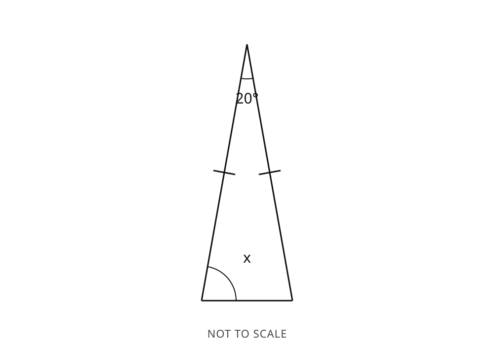

<details><summary>Inline SVG (source)</summary>

```xml
<svg xmlns="http://www.w3.org/2000/svg" viewBox="0 0 1000 700" role="img" aria-label="Diagram: a triangle with two sides marked equal, an apex angle, and an unknown base angle x.">
<title>Isosceles triangle</title>
<desc>Triangle ABC has its two slanted sides marked equal with single tick marks. The angle at the apex is 20 degrees, and the unknown base angle is marked x.</desc>
<style>.gl{stroke:#111;stroke-width:3;fill:none}.ga{stroke:#111;stroke-width:2;fill:none}.gt{stroke:#111;stroke-width:3}.gx{stroke:#111;stroke-width:3}.gv{fill:#111}text{font-family:sans-serif;font-size:30px;fill:#111}.gn{font-size:22px;fill:#444;letter-spacing:1px}</style>
<line class="gl" x1="408" y1="610" x2="592" y2="610"/>
<line class="gl" x1="408" y1="610" x2="500" y2="90"/>
<line class="gl" x1="592" y1="610" x2="500" y2="90"/>
<path class="ga" d="M 490 145 A 56 56 0 0 0 510 145"/>
<path class="ga" d="M 463 610 A 55 55 0 0 0 418 556"/>
<line class="gt" x1="476" y1="354" x2="432" y2="346"/>
<line class="gt" x1="568" y1="346" x2="524" y2="354"/>
<text x="500" y="311" text-anchor="middle">20°</text>
<text x="478" y="552" text-anchor="middle">x</text>
<text class="gn" x="500" y="685" text-anchor="middle">NOT TO SCALE</text>
</svg>
```

</details>

**Alt text:** Diagram: a triangle with two sides marked equal, an apex angle, and an unknown base angle x.

**Long description:** Triangle ABC has its two slanted sides marked equal with single tick marks. The angle at the apex is 20 degrees, and the unknown base angle is marked x.

**Data-table fallback**

| angle | value |
| --- | --- |
| angle 1 | 20 degrees |
| x | unknown |

**Answer:** `x = 80°`

**Worked solution**

1. State the angle fact — `Base angles of an isosceles triangle are equal; the three angles sum to 180 degrees`
2. Form the equation — `x = (180 - 20) / 2`
3. Evaluate — `x = 80°`

**MC option order:** A. 80° (correct)  B. 160°  C. 20°  D. 70°

**Distractor calculations (each a distinct misconception pathway)**

| Value | Formula (teacher) | Misconception | Rationale | Student feedback |
| --- | --- | --- | --- | --- |
| `160°` | `180 - apex` | Forgot to halve (`MISC.GEOM.ISO.FORGOT_TO_HALVE`) | Did not halve after subtracting the apex. | After subtracting the apex from 180, share the result equally between the two base angles (divide by 2). |
| `70°` | `90 - apex` | Halved 180 instead of (180 - apex) (`MISC.GEOM.ISO.HALVES_180_ONLY`) | Used 90 - apex instead of (180 - apex) divided by 2. | Subtract the apex from 180 first, then divide by 2. |
| `20°` | `apex` | Base equals apex (`MISC.GEOM.ISO.APEX_EQUALS_BASE`) | Took the base angle to equal the apex. | The base angles are not equal to the apex; use base = (180 - apex) divided by 2. |

**Diagram-to-data validation:** `svg-realises-data`=pass  `arc-region-measure-agreement`=pass  `arc-large-flag-correct`=pass  `arc-sweep-correct`=pass  `arc-matches-cyclic-region`=n/a  `label-inside-intended-region`=pass  `reflex-region-rendered-correctly`=pass  `no-theorem-revealing-markers`=n/a  `target-region-unambiguous`=n/a  `labels-non-overlapping`=pass  `not-to-scale`=pass  `no-answer-leakage`=pass  `media-present`=pass

**Accessibility validation:** `a11y-fields-present`=pass  `a11y-no-answer-in-text`=pass  `a11y-equivalent-information`=pass  `nonColorIndicators`=True

**Overall validation:** pass

**Curriculum decision:** [ ] approve  [ ] revise  [ ] reject — notes: ____

---

### isosceles_base_angle / multiple-choice #2 — band 3 (floor 2, range [2, 3])

- **Objective:** `SPI.MIDDLE.GEO.ISOSCELES_BASE_ANGLES.01`  ·  **Family:** F2  ·  **Calculator:** calculator-not-required
- **Interaction type:** multiple-choice  ·  **Answer type:** integer  ·  **Units:** degrees
- **Canonical value:** `num=57, den=1` -> `57°`  ·  **Givens:** `[66]`
- **Seed:** `2`  ·  **Generator:** v`1.2.2`  ·  **Parameters:** `{"task": "isosceles_base_angle", "apex": 66}`
- **Difficulty axes:** `{"numericalComplexity": 0.25, "reasoningSteps": 0.5, "representation": 0.6, "abstraction": 0.5}`  ·  **Band:** 3
- **To scale:** False (figure is NOT drawn to scale)
- **Reproduce:** `generate(2, {"task": "isosceles_base_angle", "interactionType": "multiple-choice"})` on v`1.2.2`

**Question**

> Find the size of the unknown angle x, in degrees.

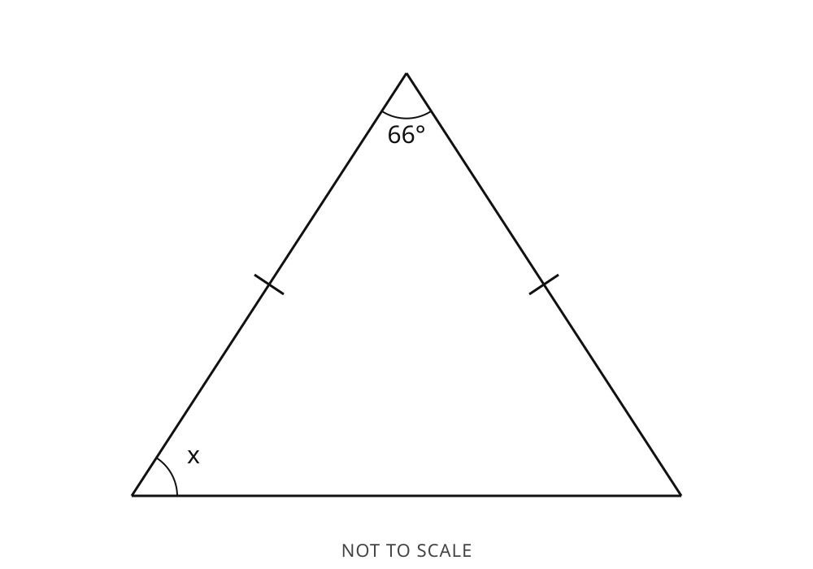

<details><summary>Inline SVG (source)</summary>

```xml
<svg xmlns="http://www.w3.org/2000/svg" viewBox="0 0 1000 700" role="img" aria-label="Diagram: a triangle with two sides marked equal, an apex angle, and an unknown base angle x.">
<title>Isosceles triangle</title>
<desc>Triangle ABC has its two slanted sides marked equal with single tick marks. The angle at the apex is 66 degrees, and the unknown base angle is marked x.</desc>
<style>.gl{stroke:#111;stroke-width:3;fill:none}.ga{stroke:#111;stroke-width:2;fill:none}.gt{stroke:#111;stroke-width:3}.gx{stroke:#111;stroke-width:3}.gv{fill:#111}text{font-family:sans-serif;font-size:30px;fill:#111}.gn{font-size:22px;fill:#444;letter-spacing:1px}</style>
<line class="gl" x1="162" y1="610" x2="838" y2="610"/>
<line class="gl" x1="162" y1="610" x2="500" y2="90"/>
<line class="gl" x1="838" y1="610" x2="500" y2="90"/>
<path class="ga" d="M 470 137 A 56 56 0 0 0 530 137"/>
<path class="ga" d="M 218 610 A 56 56 0 0 0 192 563"/>
<line class="gt" x1="349" y1="362" x2="313" y2="338"/>
<line class="gt" x1="687" y1="338" x2="651" y2="362"/>
<text x="500" y="182" text-anchor="middle">66°</text>
<text x="243" y="567" text-anchor="middle">x</text>
<text class="gn" x="500" y="685" text-anchor="middle">NOT TO SCALE</text>
</svg>
```

</details>

**Alt text:** Diagram: a triangle with two sides marked equal, an apex angle, and an unknown base angle x.

**Long description:** Triangle ABC has its two slanted sides marked equal with single tick marks. The angle at the apex is 66 degrees, and the unknown base angle is marked x.

**Data-table fallback**

| angle | value |
| --- | --- |
| angle 1 | 66 degrees |
| x | unknown |

**Answer:** `x = 57°`

**Worked solution**

1. State the angle fact — `Base angles of an isosceles triangle are equal; the three angles sum to 180 degrees`
2. Form the equation — `x = (180 - 66) / 2`
3. Evaluate — `x = 57°`

**MC option order:** A. 57° (correct)  B. 24°  C. 66°  D. 114°

**Distractor calculations (each a distinct misconception pathway)**

| Value | Formula (teacher) | Misconception | Rationale | Student feedback |
| --- | --- | --- | --- | --- |
| `114°` | `180 - apex` | Forgot to halve (`MISC.GEOM.ISO.FORGOT_TO_HALVE`) | Did not halve after subtracting the apex. | After subtracting the apex from 180, share the result equally between the two base angles (divide by 2). |
| `24°` | `90 - apex` | Halved 180 instead of (180 - apex) (`MISC.GEOM.ISO.HALVES_180_ONLY`) | Used 90 - apex instead of (180 - apex) divided by 2. | Subtract the apex from 180 first, then divide by 2. |
| `66°` | `apex` | Base equals apex (`MISC.GEOM.ISO.APEX_EQUALS_BASE`) | Took the base angle to equal the apex. | The base angles are not equal to the apex; use base = (180 - apex) divided by 2. |

**Diagram-to-data validation:** `svg-realises-data`=pass  `arc-region-measure-agreement`=pass  `arc-large-flag-correct`=pass  `arc-sweep-correct`=pass  `arc-matches-cyclic-region`=n/a  `label-inside-intended-region`=pass  `reflex-region-rendered-correctly`=pass  `no-theorem-revealing-markers`=n/a  `target-region-unambiguous`=n/a  `labels-non-overlapping`=pass  `not-to-scale`=pass  `no-answer-leakage`=pass  `media-present`=pass

**Accessibility validation:** `a11y-fields-present`=pass  `a11y-no-answer-in-text`=pass  `a11y-equivalent-information`=pass  `nonColorIndicators`=True

**Overall validation:** pass

**Curriculum decision:** [ ] approve  [ ] revise  [ ] reject — notes: ____

---

### isosceles_base_angle / multiple-choice #3 — band 3 (floor 2, range [2, 3])

- **Objective:** `SPI.MIDDLE.GEO.ISOSCELES_BASE_ANGLES.01`  ·  **Family:** F2  ·  **Calculator:** calculator-not-required
- **Interaction type:** multiple-choice  ·  **Answer type:** integer  ·  **Units:** degrees
- **Canonical value:** `num=78, den=1` -> `78°`  ·  **Givens:** `[24]`
- **Seed:** `3`  ·  **Generator:** v`1.2.2`  ·  **Parameters:** `{"task": "isosceles_base_angle", "apex": 24}`
- **Difficulty axes:** `{"numericalComplexity": 0.25, "reasoningSteps": 0.5, "representation": 0.6, "abstraction": 0.5}`  ·  **Band:** 3
- **To scale:** False (figure is NOT drawn to scale)
- **Reproduce:** `generate(3, {"task": "isosceles_base_angle", "interactionType": "multiple-choice"})` on v`1.2.2`

**Question**

> Find the size of the unknown angle x, in degrees.

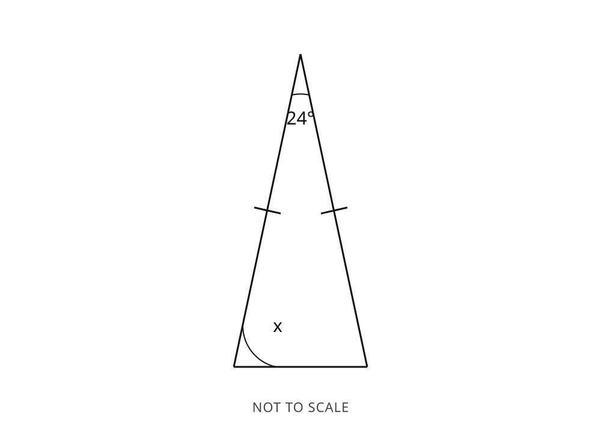

<details><summary>Inline SVG (source)</summary>

```xml
<svg xmlns="http://www.w3.org/2000/svg" viewBox="0 0 1000 700" role="img" aria-label="Diagram: a triangle with two sides marked equal, an apex angle, and an unknown base angle x.">
<title>Isosceles triangle</title>
<desc>Triangle ABC has its two slanted sides marked equal with single tick marks. The angle at the apex is 24 degrees, and the unknown base angle is marked x.</desc>
<style>.gl{stroke:#111;stroke-width:3;fill:none}.ga{stroke:#111;stroke-width:2;fill:none}.gt{stroke:#111;stroke-width:3}.gx{stroke:#111;stroke-width:3}.gv{fill:#111}text{font-family:sans-serif;font-size:30px;fill:#111}.gn{font-size:22px;fill:#444;letter-spacing:1px}</style>
<line class="gl" x1="389" y1="610" x2="611" y2="610"/>
<line class="gl" x1="389" y1="610" x2="500" y2="90"/>
<line class="gl" x1="611" y1="610" x2="500" y2="90"/>
<path class="ga" d="M 488 145 A 56 56 0 0 0 512 145"/>
<path class="ga" d="M 445 610 A 56 56 0 0 0 401 555"/>
<line class="gt" x1="467" y1="355" x2="423" y2="345"/>
<line class="gt" x1="578" y1="345" x2="534" y2="355"/>
<text x="500" y="267" text-anchor="middle">24°</text>
<text x="460" y="552" text-anchor="middle">x</text>
<text class="gn" x="500" y="685" text-anchor="middle">NOT TO SCALE</text>
</svg>
```

</details>

**Alt text:** Diagram: a triangle with two sides marked equal, an apex angle, and an unknown base angle x.

**Long description:** Triangle ABC has its two slanted sides marked equal with single tick marks. The angle at the apex is 24 degrees, and the unknown base angle is marked x.

**Data-table fallback**

| angle | value |
| --- | --- |
| angle 1 | 24 degrees |
| x | unknown |

**Answer:** `x = 78°`

**Worked solution**

1. State the angle fact — `Base angles of an isosceles triangle are equal; the three angles sum to 180 degrees`
2. Form the equation — `x = (180 - 24) / 2`
3. Evaluate — `x = 78°`

**MC option order:** A. 66°  B. 24°  C. 78° (correct)  D. 156°

**Distractor calculations (each a distinct misconception pathway)**

| Value | Formula (teacher) | Misconception | Rationale | Student feedback |
| --- | --- | --- | --- | --- |
| `156°` | `180 - apex` | Forgot to halve (`MISC.GEOM.ISO.FORGOT_TO_HALVE`) | Did not halve after subtracting the apex. | After subtracting the apex from 180, share the result equally between the two base angles (divide by 2). |
| `66°` | `90 - apex` | Halved 180 instead of (180 - apex) (`MISC.GEOM.ISO.HALVES_180_ONLY`) | Used 90 - apex instead of (180 - apex) divided by 2. | Subtract the apex from 180 first, then divide by 2. |
| `24°` | `apex` | Base equals apex (`MISC.GEOM.ISO.APEX_EQUALS_BASE`) | Took the base angle to equal the apex. | The base angles are not equal to the apex; use base = (180 - apex) divided by 2. |

**Diagram-to-data validation:** `svg-realises-data`=pass  `arc-region-measure-agreement`=pass  `arc-large-flag-correct`=pass  `arc-sweep-correct`=pass  `arc-matches-cyclic-region`=n/a  `label-inside-intended-region`=pass  `reflex-region-rendered-correctly`=pass  `no-theorem-revealing-markers`=n/a  `target-region-unambiguous`=n/a  `labels-non-overlapping`=pass  `not-to-scale`=pass  `no-answer-leakage`=pass  `media-present`=pass

**Accessibility validation:** `a11y-fields-present`=pass  `a11y-no-answer-in-text`=pass  `a11y-equivalent-information`=pass  `nonColorIndicators`=True

**Overall validation:** pass

**Curriculum decision:** [ ] approve  [ ] revise  [ ] reject — notes: ____

---

## vertically_opposite_angle · free-response — 5 examples  (F3, `SPI.MIDDLE.GEO.VERTICALLY_OPPOSITE_ANGLES.01`)

### vertically_opposite_angle / free-response #1 — band 2 (floor 1, range [1, 2])

- **Objective:** `SPI.MIDDLE.GEO.VERTICALLY_OPPOSITE_ANGLES.01`  ·  **Family:** F3  ·  **Calculator:** calculator-not-required
- **Interaction type:** free-response  ·  **Answer type:** integer  ·  **Units:** degrees
- **Canonical value:** `num=110, den=1` -> `110°`  ·  **Givens:** `[110]`
- **Seed:** `1`  ·  **Generator:** v`1.2.2`  ·  **Parameters:** `{"task": "vertically_opposite_angle", "theta": 110}`
- **Difficulty axes:** `{"numericalComplexity": 0.25, "reasoningSteps": 0.25, "representation": 0.6, "abstraction": 0.3}`  ·  **Band:** 2
- **To scale:** False (figure is NOT drawn to scale)
- **Reproduce:** `generate(1, {"task": "vertically_opposite_angle", "interactionType": "free-response"})` on v`1.2.2`

**Question**

> Find the size of the unknown angle x, in degrees.

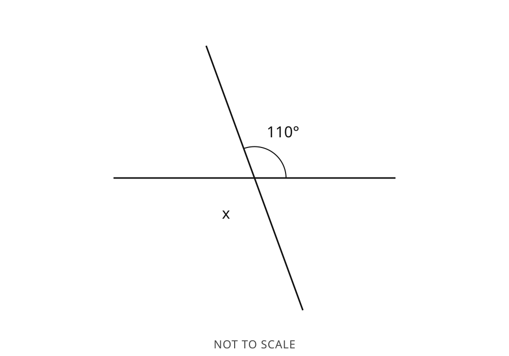

<details><summary>Inline SVG (source)</summary>

```xml
<svg xmlns="http://www.w3.org/2000/svg" viewBox="0 0 1000 700" role="img" aria-label="Diagram: two straight lines crossing at a point, with a given angle and the angle x in the opposite region.">
<title>Two intersecting straight lines</title>
<desc>Two straight lines cross at a point, forming four angles. One angle measures 110 degrees, and the unknown angle x is in the region directly opposite it.</desc>
<style>.gl{stroke:#111;stroke-width:3;fill:none}.ga{stroke:#111;stroke-width:2;fill:none}.gt{stroke:#111;stroke-width:3}.gx{stroke:#111;stroke-width:3}.gv{fill:#111}text{font-family:sans-serif;font-size:30px;fill:#111}.gn{font-size:22px;fill:#444;letter-spacing:1px}</style>
<line class="gl" x1="223" y1="350" x2="777" y2="350"/>
<line class="gl" x1="595" y1="610" x2="405" y2="90"/>
<path class="ga" d="M 562 350 A 62 62 0 0 0 479 292"/>
<text x="556" y="270" text-anchor="middle">110°</text>
<text x="444" y="430" text-anchor="middle">x</text>
<text class="gn" x="500" y="685" text-anchor="middle">NOT TO SCALE</text>
</svg>
```

</details>

**Alt text:** Diagram: two straight lines crossing at a point, with a given angle and the angle x in the opposite region.

**Long description:** Two straight lines cross at a point, forming four angles. One angle measures 110 degrees, and the unknown angle x is in the region directly opposite it.

**Data-table fallback**

| angle | value |
| --- | --- |
| angle 1 | 110 degrees |
| x | unknown |

**Answer:** `x = 110°`

**Worked solution**

1. State the angle fact — `Vertically opposite angles are equal`
2. Apply — `x = 110°`

_Free-response: no distractors._

**Diagram-to-data validation:** `svg-realises-data`=pass  `arc-region-measure-agreement`=pass  `arc-large-flag-correct`=pass  `arc-sweep-correct`=pass  `arc-matches-cyclic-region`=n/a  `label-inside-intended-region`=pass  `reflex-region-rendered-correctly`=pass  `no-theorem-revealing-markers`=pass  `target-region-unambiguous`=pass  `labels-non-overlapping`=pass  `not-to-scale`=pass  `no-answer-leakage`=pass  `media-present`=pass

**Accessibility validation:** `a11y-fields-present`=pass  `a11y-no-answer-in-text`=pass  `a11y-equivalent-information`=pass  `nonColorIndicators`=True

**Overall validation:** pass

**Curriculum decision:** [ ] approve  [ ] revise  [ ] reject — notes: ____

---

### vertically_opposite_angle / free-response #2 — band 2 (floor 1, range [1, 2])

- **Objective:** `SPI.MIDDLE.GEO.VERTICALLY_OPPOSITE_ANGLES.01`  ·  **Family:** F3  ·  **Calculator:** calculator-not-required
- **Interaction type:** free-response  ·  **Answer type:** integer  ·  **Units:** degrees
- **Canonical value:** `num=128, den=1` -> `128°`  ·  **Givens:** `[128]`
- **Seed:** `2`  ·  **Generator:** v`1.2.2`  ·  **Parameters:** `{"task": "vertically_opposite_angle", "theta": 128}`
- **Difficulty axes:** `{"numericalComplexity": 0.25, "reasoningSteps": 0.25, "representation": 0.6, "abstraction": 0.5}`  ·  **Band:** 2
- **To scale:** False (figure is NOT drawn to scale)
- **Reproduce:** `generate(2, {"task": "vertically_opposite_angle", "interactionType": "free-response"})` on v`1.2.2`

**Question**

> Find the size of the unknown angle x, in degrees.

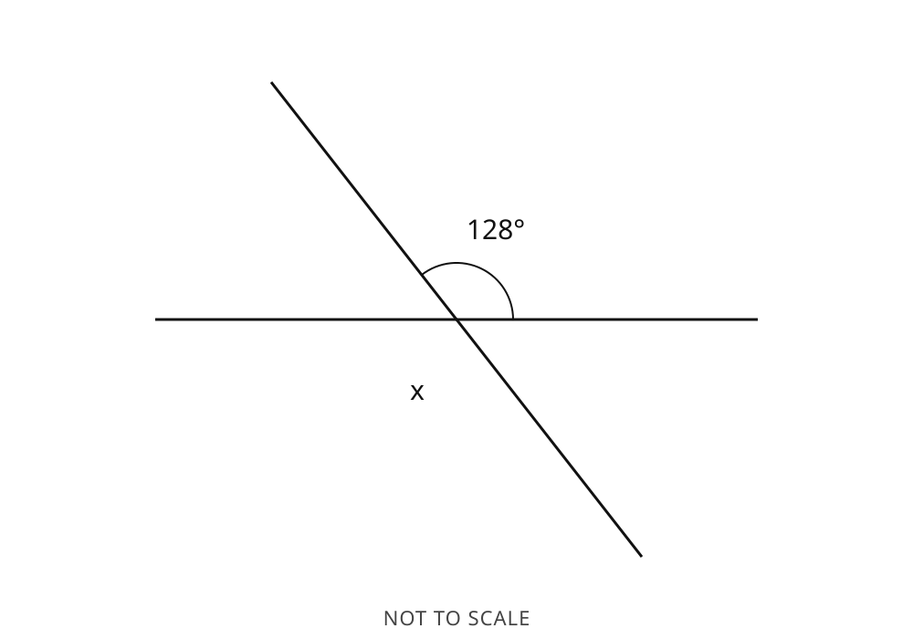

<details><summary>Inline SVG (source)</summary>

```xml
<svg xmlns="http://www.w3.org/2000/svg" viewBox="0 0 1000 700" role="img" aria-label="Diagram: two straight lines crossing at a point, with a given angle and the angle x in the opposite region.">
<title>Two intersecting straight lines</title>
<desc>Two straight lines cross at a point, forming four angles. One angle measures 128 degrees, and the unknown angle x is in the region directly opposite it.</desc>
<style>.gl{stroke:#111;stroke-width:3;fill:none}.ga{stroke:#111;stroke-width:2;fill:none}.gt{stroke:#111;stroke-width:3}.gx{stroke:#111;stroke-width:3}.gv{fill:#111}text{font-family:sans-serif;font-size:30px;fill:#111}.gn{font-size:22px;fill:#444;letter-spacing:1px}</style>
<line class="gl" x1="170" y1="350" x2="830" y2="350"/>
<line class="gl" x1="703" y1="610" x2="297" y2="90"/>
<path class="ga" d="M 562 350 A 62 62 0 0 0 462 301"/>
<text x="543" y="262" text-anchor="middle">128°</text>
<text x="457" y="438" text-anchor="middle">x</text>
<text class="gn" x="500" y="685" text-anchor="middle">NOT TO SCALE</text>
</svg>
```

</details>

**Alt text:** Diagram: two straight lines crossing at a point, with a given angle and the angle x in the opposite region.

**Long description:** Two straight lines cross at a point, forming four angles. One angle measures 128 degrees, and the unknown angle x is in the region directly opposite it.

**Data-table fallback**

| angle | value |
| --- | --- |
| angle 1 | 128 degrees |
| x | unknown |

**Answer:** `x = 128°`

**Worked solution**

1. State the angle fact — `Vertically opposite angles are equal`
2. Apply — `x = 128°`

_Free-response: no distractors._

**Diagram-to-data validation:** `svg-realises-data`=pass  `arc-region-measure-agreement`=pass  `arc-large-flag-correct`=pass  `arc-sweep-correct`=pass  `arc-matches-cyclic-region`=n/a  `label-inside-intended-region`=pass  `reflex-region-rendered-correctly`=pass  `no-theorem-revealing-markers`=pass  `target-region-unambiguous`=pass  `labels-non-overlapping`=pass  `not-to-scale`=pass  `no-answer-leakage`=pass  `media-present`=pass

**Accessibility validation:** `a11y-fields-present`=pass  `a11y-no-answer-in-text`=pass  `a11y-equivalent-information`=pass  `nonColorIndicators`=True

**Overall validation:** pass

**Curriculum decision:** [ ] approve  [ ] revise  [ ] reject — notes: ____

---

### vertically_opposite_angle / free-response #3 — band 2 (floor 1, range [1, 2])

- **Objective:** `SPI.MIDDLE.GEO.VERTICALLY_OPPOSITE_ANGLES.01`  ·  **Family:** F3  ·  **Calculator:** calculator-not-required
- **Interaction type:** free-response  ·  **Answer type:** integer  ·  **Units:** degrees
- **Canonical value:** `num=125, den=1` -> `125°`  ·  **Givens:** `[125]`
- **Seed:** `3`  ·  **Generator:** v`1.2.2`  ·  **Parameters:** `{"task": "vertically_opposite_angle", "theta": 125}`
- **Difficulty axes:** `{"numericalComplexity": 0.25, "reasoningSteps": 0.25, "representation": 0.6, "abstraction": 0.3}`  ·  **Band:** 2
- **To scale:** False (figure is NOT drawn to scale)
- **Reproduce:** `generate(3, {"task": "vertically_opposite_angle", "interactionType": "free-response"})` on v`1.2.2`

**Question**

> Find the size of the unknown angle x, in degrees.

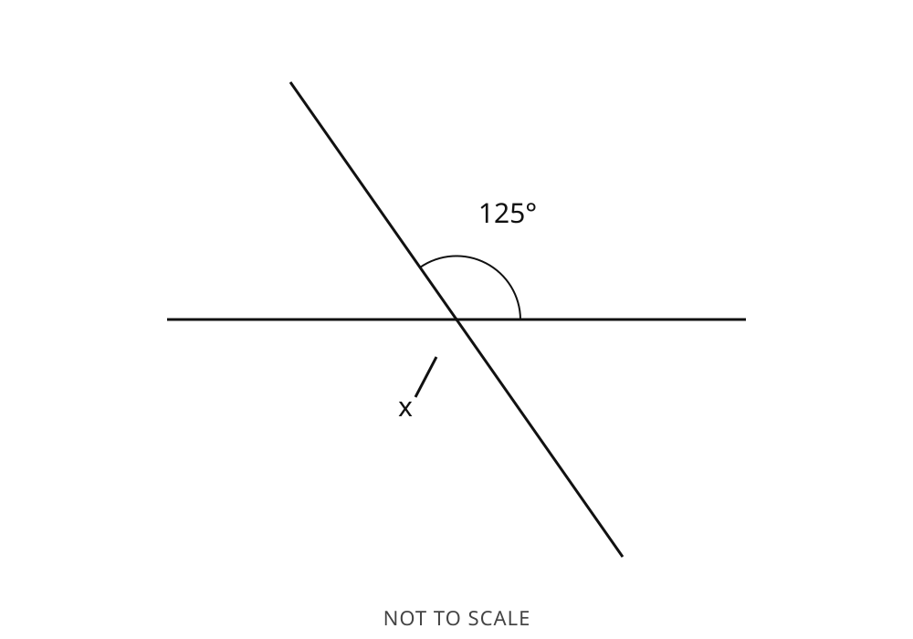

<details><summary>Inline SVG (source)</summary>

```xml
<svg xmlns="http://www.w3.org/2000/svg" viewBox="0 0 1000 700" role="img" aria-label="Diagram: two straight lines crossing at a point, with a given angle and the angle x in the opposite region.">
<title>Two intersecting straight lines</title>
<desc>Two straight lines cross at a point, forming four angles. One angle measures 125 degrees, and the unknown angle x is in the region directly opposite it.</desc>
<style>.gl{stroke:#111;stroke-width:3;fill:none}.ga{stroke:#111;stroke-width:2;fill:none}.gt{stroke:#111;stroke-width:3}.gx{stroke:#111;stroke-width:3}.gv{fill:#111}text{font-family:sans-serif;font-size:30px;fill:#111}.gn{font-size:22px;fill:#444;letter-spacing:1px}</style>
<line class="gl" x1="183" y1="350" x2="817" y2="350"/>
<line class="gl" x1="682" y1="610" x2="318" y2="90"/>
<path class="ga" d="M 562 350 A 62 62 0 0 0 464 299"/>
<text x="546" y="263" text-anchor="middle">125°</text>
<text x="454" y="437" text-anchor="middle">x</text>
<text class="gn" x="500" y="685" text-anchor="middle">NOT TO SCALE</text>
</svg>
```

</details>

**Alt text:** Diagram: two straight lines crossing at a point, with a given angle and the angle x in the opposite region.

**Long description:** Two straight lines cross at a point, forming four angles. One angle measures 125 degrees, and the unknown angle x is in the region directly opposite it.

**Data-table fallback**

| angle | value |
| --- | --- |
| angle 1 | 125 degrees |
| x | unknown |

**Answer:** `x = 125°`

**Worked solution**

1. State the angle fact — `Vertically opposite angles are equal`
2. Apply — `x = 125°`

_Free-response: no distractors._

**Diagram-to-data validation:** `svg-realises-data`=pass  `arc-region-measure-agreement`=pass  `arc-large-flag-correct`=pass  `arc-sweep-correct`=pass  `arc-matches-cyclic-region`=n/a  `label-inside-intended-region`=pass  `reflex-region-rendered-correctly`=pass  `no-theorem-revealing-markers`=pass  `target-region-unambiguous`=pass  `labels-non-overlapping`=pass  `not-to-scale`=pass  `no-answer-leakage`=pass  `media-present`=pass

**Accessibility validation:** `a11y-fields-present`=pass  `a11y-no-answer-in-text`=pass  `a11y-equivalent-information`=pass  `nonColorIndicators`=True

**Overall validation:** pass

**Curriculum decision:** [ ] approve  [ ] revise  [ ] reject — notes: ____

---

### vertically_opposite_angle / free-response #4 — band 1 (floor 1, range [1, 2])

- **Objective:** `SPI.MIDDLE.GEO.VERTICALLY_OPPOSITE_ANGLES.01`  ·  **Family:** F3  ·  **Calculator:** calculator-not-required
- **Interaction type:** free-response  ·  **Answer type:** integer  ·  **Units:** degrees
- **Canonical value:** `num=35, den=1` -> `35°`  ·  **Givens:** `[35]`
- **Seed:** `8`  ·  **Generator:** v`1.2.2`  ·  **Parameters:** `{"task": "vertically_opposite_angle", "theta": 35}`
- **Difficulty axes:** `{"numericalComplexity": 0.25, "reasoningSteps": 0.25, "representation": 0.6, "abstraction": 0.3}`  ·  **Band:** 1
- **To scale:** False (figure is NOT drawn to scale)
- **Reproduce:** `generate(8, {"task": "vertically_opposite_angle", "interactionType": "free-response"})` on v`1.2.2`

**Question**

> Find the size of the unknown angle x, in degrees.

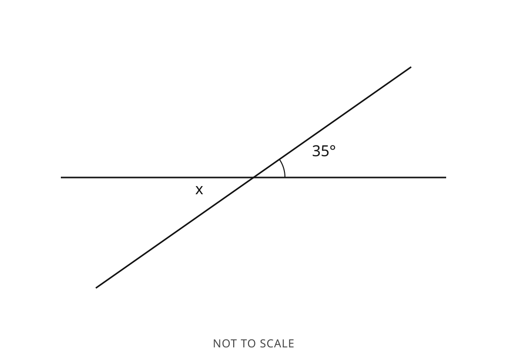

<details><summary>Inline SVG (source)</summary>

```xml
<svg xmlns="http://www.w3.org/2000/svg" viewBox="0 0 1000 700" role="img" aria-label="Diagram: two straight lines crossing at a point, with a given angle and the angle x in the opposite region.">
<title>Two intersecting straight lines</title>
<desc>Two straight lines cross at a point, forming four angles. One angle measures 35 degrees, and the unknown angle x is in the region directly opposite it.</desc>
<style>.gl{stroke:#111;stroke-width:3;fill:none}.ga{stroke:#111;stroke-width:2;fill:none}.gt{stroke:#111;stroke-width:3}.gx{stroke:#111;stroke-width:3}.gv{fill:#111}text{font-family:sans-serif;font-size:30px;fill:#111}.gn{font-size:22px;fill:#444;letter-spacing:1px}</style>
<line class="gl" x1="120" y1="350" x2="880" y2="350"/>
<line class="gl" x1="189" y1="568" x2="811" y2="132"/>
<path class="ga" d="M 562 350 A 62 62 0 0 0 551 314"/>
<text x="629" y="311" text-anchor="middle">35°</text>
<text x="391" y="383" text-anchor="middle">x</text>
<text class="gn" x="500" y="685" text-anchor="middle">NOT TO SCALE</text>
</svg>
```

</details>

**Alt text:** Diagram: two straight lines crossing at a point, with a given angle and the angle x in the opposite region.

**Long description:** Two straight lines cross at a point, forming four angles. One angle measures 35 degrees, and the unknown angle x is in the region directly opposite it.

**Data-table fallback**

| angle | value |
| --- | --- |
| angle 1 | 35 degrees |
| x | unknown |

**Answer:** `x = 35°`

**Worked solution**

1. State the angle fact — `Vertically opposite angles are equal`
2. Apply — `x = 35°`

_Free-response: no distractors._

**Diagram-to-data validation:** `svg-realises-data`=pass  `arc-region-measure-agreement`=pass  `arc-large-flag-correct`=pass  `arc-sweep-correct`=pass  `arc-matches-cyclic-region`=n/a  `label-inside-intended-region`=pass  `reflex-region-rendered-correctly`=pass  `no-theorem-revealing-markers`=pass  `target-region-unambiguous`=pass  `labels-non-overlapping`=pass  `not-to-scale`=pass  `no-answer-leakage`=pass  `media-present`=pass

**Accessibility validation:** `a11y-fields-present`=pass  `a11y-no-answer-in-text`=pass  `a11y-equivalent-information`=pass  `nonColorIndicators`=True

**Overall validation:** pass

**Curriculum decision:** [ ] approve  [ ] revise  [ ] reject — notes: ____

---

### vertically_opposite_angle / free-response #5 — band 1 (floor 1, range [1, 2])

- **Objective:** `SPI.MIDDLE.GEO.VERTICALLY_OPPOSITE_ANGLES.01`  ·  **Family:** F3  ·  **Calculator:** calculator-not-required
- **Interaction type:** free-response  ·  **Answer type:** integer  ·  **Units:** degrees
- **Canonical value:** `num=10, den=1` -> `10°`  ·  **Givens:** `[10]`
- **Seed:** `307`  ·  **Generator:** v`1.2.2`  ·  **Parameters:** `{"task": "vertically_opposite_angle", "theta": 10}`
- **Difficulty axes:** `{"numericalComplexity": 0.25, "reasoningSteps": 0.25, "representation": 0.6, "abstraction": 0.3}`  ·  **Band:** 1
- **To scale:** False (figure is NOT drawn to scale)
- **Reproduce:** `generate(307, {"task": "vertically_opposite_angle", "interactionType": "free-response"})` on v`1.2.2`

**Question**

> Find the size of the unknown angle x, in degrees.

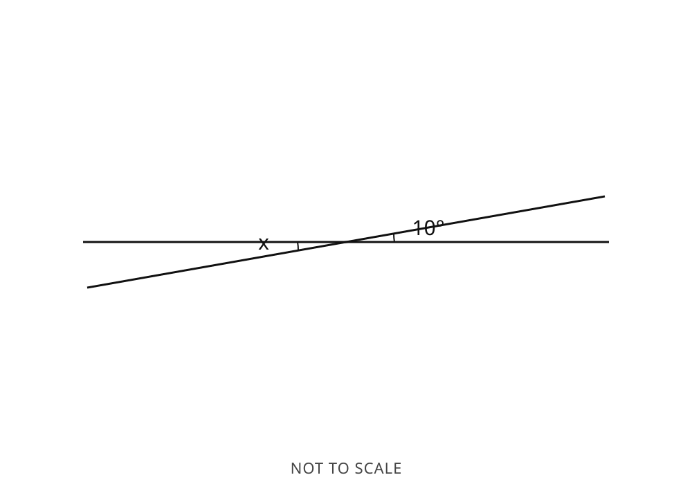

<details><summary>Inline SVG (source)</summary>

```xml
<svg xmlns="http://www.w3.org/2000/svg" viewBox="0 0 1000 700" role="img" aria-label="Diagram: two straight lines crossing at a point, with a given angle and the angle x in the opposite region.">
<title>Two intersecting straight lines</title>
<desc>Two straight lines cross at a point, forming four angles. One angle measures 10 degrees, and the unknown angle x is in the region directly opposite it.</desc>
<style>.gl{stroke:#111;stroke-width:3;fill:none}.ga{stroke:#111;stroke-width:2;fill:none}.gt{stroke:#111;stroke-width:3}.gx{stroke:#111;stroke-width:3}.gv{fill:#111}text{font-family:sans-serif;font-size:30px;fill:#111}.gn{font-size:22px;fill:#444;letter-spacing:1px}</style>
<line class="gl" x1="120" y1="350" x2="880" y2="350"/>
<line class="gl" x1="126" y1="416" x2="874" y2="284"/>
<path class="ga" d="M 562 350 A 62 62 0 0 0 561 339"/>
<line class="gx" x1="570" y1="344" x2="580" y2="316"/>
<line class="gx" x1="430" y1="356" x2="415" y2="343"/>
<text x="593" y="285" text-anchor="middle">10°</text>
<text x="400" y="331" text-anchor="middle">x</text>
<text class="gn" x="500" y="685" text-anchor="middle">NOT TO SCALE</text>
</svg>
```

</details>

**Alt text:** Diagram: two straight lines crossing at a point, with a given angle and the angle x in the opposite region.

**Long description:** Two straight lines cross at a point, forming four angles. One angle measures 10 degrees, and the unknown angle x is in the region directly opposite it.

**Data-table fallback**

| angle | value |
| --- | --- |
| angle 1 | 10 degrees |
| x | unknown |

**Answer:** `x = 10°`

**Worked solution**

1. State the angle fact — `Vertically opposite angles are equal`
2. Apply — `x = 10°`

_Free-response: no distractors._

**Diagram-to-data validation:** `svg-realises-data`=pass  `arc-region-measure-agreement`=pass  `arc-large-flag-correct`=pass  `arc-sweep-correct`=pass  `arc-matches-cyclic-region`=n/a  `label-inside-intended-region`=pass  `reflex-region-rendered-correctly`=pass  `no-theorem-revealing-markers`=pass  `target-region-unambiguous`=pass  `labels-non-overlapping`=pass  `not-to-scale`=pass  `no-answer-leakage`=pass  `media-present`=pass

**Accessibility validation:** `a11y-fields-present`=pass  `a11y-no-answer-in-text`=pass  `a11y-equivalent-information`=pass  `nonColorIndicators`=True

**Overall validation:** pass

**Curriculum decision:** [ ] approve  [ ] revise  [ ] reject — notes: ____

---

## angles_at_point_missing · free-response — 7 examples  (F3, `SPI.MIDDLE.GEO.ANGLES_AT_POINT.01`)

### angles_at_point_missing / free-response #1 — band 4 (floor 2, range [2, 4])

- **Objective:** `SPI.MIDDLE.GEO.ANGLES_AT_POINT.01`  ·  **Family:** F3  ·  **Calculator:** calculator-not-required
- **Interaction type:** free-response  ·  **Answer type:** integer  ·  **Units:** degrees
- **Canonical value:** `num=12, den=1` -> `12°`  ·  **Givens:** `[10, 179, 159]`
- **Seed:** `1`  ·  **Generator:** v`1.2.2`  ·  **Parameters:** `{"task": "angles_at_point_missing", "regions": [10, 179, 159, 12], "unknownIndex": 3}`
- **Difficulty axes:** `{"numericalComplexity": 0.75, "reasoningSteps": 0.5, "representation": 0.6, "abstraction": 0.5}`  ·  **Band:** 4
- **To scale:** False (figure is NOT drawn to scale)
- **Reproduce:** `generate(1, {"task": "angles_at_point_missing", "interactionType": "free-response"})` on v`1.2.2`

**Question**

> Find the size of the unknown angle x, in degrees.

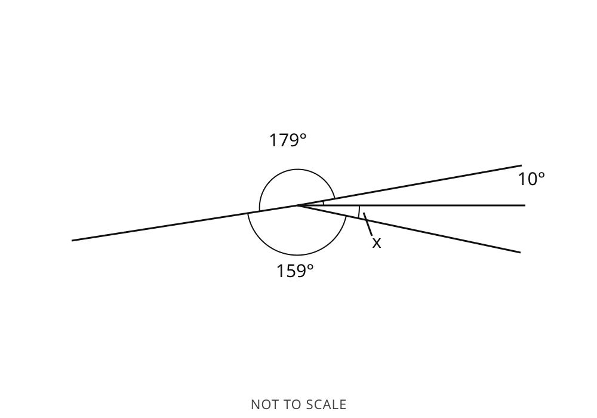

<details><summary>Inline SVG (source)</summary>

```xml
<svg xmlns="http://www.w3.org/2000/svg" viewBox="0 0 1000 700" role="img" aria-label="Diagram: angles meeting consecutively around a point, with an unknown angle x.">
<title>Angles around a point</title>
<desc>Angles of 10 degrees, 179 degrees, 159 degrees and an unknown angle x are arranged consecutively, with no gaps, around a single point.</desc>
<style>.gl{stroke:#111;stroke-width:3;fill:none}.ga{stroke:#111;stroke-width:2;fill:none}.gt{stroke:#111;stroke-width:3}.gx{stroke:#111;stroke-width:3}.gv{fill:#111}text{font-family:sans-serif;font-size:30px;fill:#111}.gn{font-size:22px;fill:#444;letter-spacing:1px}</style>
<line class="gl" x1="498" y1="344" x2="880" y2="344"/>
<line class="gl" x1="498" y1="344" x2="874" y2="277"/>
<line class="gl" x1="498" y1="344" x2="120" y2="403"/>
<line class="gl" x1="498" y1="344" x2="872" y2="423"/>
<path class="ga" d="M 542 344 A 44 44 0 0 0 541 336"/>
<path class="ga" d="M 561 333 A 64 64 0 0 0 435 354"/>
<path class="ga" d="M 415 357 A 84 84 0 0 0 580 361"/>
<path class="ga" d="M 600 366 A 104 104 0 0 0 602 344"/>
<line class="gx" x1="609" y1="356" x2="623" y2="395"/>
<text x="890" y="310" text-anchor="middle">10°</text>
<text x="482" y="245" text-anchor="middle">179°</text>
<text x="494" y="464" text-anchor="middle">159°</text>
<text x="631" y="415" text-anchor="middle">x</text>
<text class="gn" x="500" y="685" text-anchor="middle">NOT TO SCALE</text>
</svg>
```

</details>

**Alt text:** Diagram: angles meeting consecutively around a point, with an unknown angle x.

**Long description:** Angles of 10 degrees, 179 degrees, 159 degrees and an unknown angle x are arranged consecutively, with no gaps, around a single point.

**Data-table fallback**

| angle | value |
| --- | --- |
| angle 1 | 10 degrees |
| angle 2 | 179 degrees |
| angle 3 | 159 degrees |
| x | unknown |

**Answer:** `x = 12°`

**Worked solution**

1. State the angle fact — `Angles around a point sum to 360 degrees`
2. Form the equation — `x = 360 - (10 + 179 + 159)`
3. Evaluate — `x = 12°`

_Free-response: no distractors._

**Diagram-to-data validation:** `svg-realises-data`=pass  `arc-region-measure-agreement`=pass  `arc-large-flag-correct`=pass  `arc-sweep-correct`=pass  `arc-matches-cyclic-region`=pass  `label-inside-intended-region`=pass  `reflex-region-rendered-correctly`=pass  `no-theorem-revealing-markers`=n/a  `target-region-unambiguous`=n/a  `labels-non-overlapping`=pass  `not-to-scale`=pass  `no-answer-leakage`=pass  `media-present`=pass

**Accessibility validation:** `a11y-fields-present`=pass  `a11y-no-answer-in-text`=pass  `a11y-equivalent-information`=pass  `nonColorIndicators`=True

**Overall validation:** pass

**Curriculum decision:** [ ] approve  [ ] revise  [ ] reject — notes: ____

---

### angles_at_point_missing / free-response #2 — band 4 (floor 2, range [2, 4])

- **Objective:** `SPI.MIDDLE.GEO.ANGLES_AT_POINT.01`  ·  **Family:** F3  ·  **Calculator:** calculator-not-required
- **Interaction type:** free-response  ·  **Answer type:** integer  ·  **Units:** degrees
- **Canonical value:** `num=82, den=1` -> `82°`  ·  **Givens:** `[114, 71, 93]`
- **Seed:** `2`  ·  **Generator:** v`1.2.2`  ·  **Parameters:** `{"task": "angles_at_point_missing", "regions": [114, 71, 93, 82], "unknownIndex": 3}`
- **Difficulty axes:** `{"numericalComplexity": 0.75, "reasoningSteps": 0.5, "representation": 0.6, "abstraction": 0.5}`  ·  **Band:** 4
- **To scale:** False (figure is NOT drawn to scale)
- **Reproduce:** `generate(2, {"task": "angles_at_point_missing", "interactionType": "free-response"})` on v`1.2.2`

**Question**

> Find the size of the unknown angle x, in degrees.

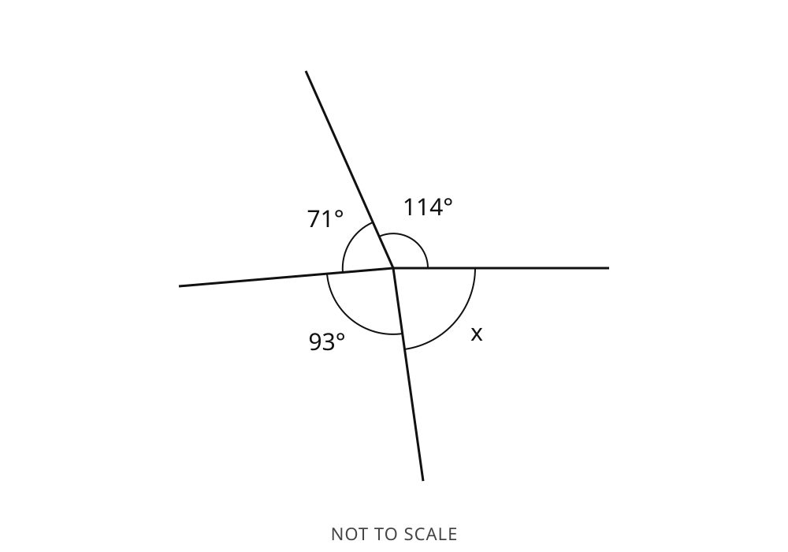

<details><summary>Inline SVG (source)</summary>

```xml
<svg xmlns="http://www.w3.org/2000/svg" viewBox="0 0 1000 700" role="img" aria-label="Diagram: angles meeting consecutively around a point, with an unknown angle x.">
<title>Angles around a point</title>
<desc>Angles of 114 degrees, 71 degrees, 93 degrees and an unknown angle x are arranged consecutively, with no gaps, around a single point.</desc>
<style>.gl{stroke:#111;stroke-width:3;fill:none}.ga{stroke:#111;stroke-width:2;fill:none}.gt{stroke:#111;stroke-width:3}.gx{stroke:#111;stroke-width:3}.gv{fill:#111}text{font-family:sans-serif;font-size:30px;fill:#111}.gn{font-size:22px;fill:#444;letter-spacing:1px}</style>
<line class="gl" x1="499" y1="340" x2="773" y2="340"/>
<line class="gl" x1="499" y1="340" x2="388" y2="90"/>
<line class="gl" x1="499" y1="340" x2="227" y2="363"/>
<line class="gl" x1="499" y1="340" x2="537" y2="610"/>
<path class="ga" d="M 543 340 A 44 44 0 0 0 481 300"/>
<path class="ga" d="M 473 282 A 64 64 0 0 0 435 346"/>
<path class="ga" d="M 415 347 A 84 84 0 0 0 511 423"/>
<path class="ga" d="M 513 443 A 104 104 0 0 0 603 340"/>
<text x="543" y="273" text-anchor="middle">114°</text>
<text x="413" y="288" text-anchor="middle">71°</text>
<text x="413" y="446" text-anchor="middle">93°</text>
<text x="605" y="432" text-anchor="middle">x</text>
<text class="gn" x="500" y="685" text-anchor="middle">NOT TO SCALE</text>
</svg>
```

</details>

**Alt text:** Diagram: angles meeting consecutively around a point, with an unknown angle x.

**Long description:** Angles of 114 degrees, 71 degrees, 93 degrees and an unknown angle x are arranged consecutively, with no gaps, around a single point.

**Data-table fallback**

| angle | value |
| --- | --- |
| angle 1 | 114 degrees |
| angle 2 | 71 degrees |
| angle 3 | 93 degrees |
| x | unknown |

**Answer:** `x = 82°`

**Worked solution**

1. State the angle fact — `Angles around a point sum to 360 degrees`
2. Form the equation — `x = 360 - (114 + 71 + 93)`
3. Evaluate — `x = 82°`

_Free-response: no distractors._

**Diagram-to-data validation:** `svg-realises-data`=pass  `arc-region-measure-agreement`=pass  `arc-large-flag-correct`=pass  `arc-sweep-correct`=pass  `arc-matches-cyclic-region`=pass  `label-inside-intended-region`=pass  `reflex-region-rendered-correctly`=pass  `no-theorem-revealing-markers`=n/a  `target-region-unambiguous`=n/a  `labels-non-overlapping`=pass  `not-to-scale`=pass  `no-answer-leakage`=pass  `media-present`=pass

**Accessibility validation:** `a11y-fields-present`=pass  `a11y-no-answer-in-text`=pass  `a11y-equivalent-information`=pass  `nonColorIndicators`=True

**Overall validation:** pass

**Curriculum decision:** [ ] approve  [ ] revise  [ ] reject — notes: ____

---

### angles_at_point_missing / free-response #3 — band 4 (floor 2, range [2, 4])

- **Objective:** `SPI.MIDDLE.GEO.ANGLES_AT_POINT.01`  ·  **Family:** F3  ·  **Calculator:** calculator-not-required
- **Interaction type:** free-response  ·  **Answer type:** integer  ·  **Units:** degrees
- **Canonical value:** `num=166, den=1` -> `166°`  ·  **Givens:** `[22, 150, 22]`
- **Seed:** `3`  ·  **Generator:** v`1.2.2`  ·  **Parameters:** `{"task": "angles_at_point_missing", "regions": [22, 150, 22, 166], "unknownIndex": 3}`
- **Difficulty axes:** `{"numericalComplexity": 0.75, "reasoningSteps": 0.5, "representation": 0.6, "abstraction": 0.5}`  ·  **Band:** 4
- **To scale:** False (figure is NOT drawn to scale)
- **Reproduce:** `generate(3, {"task": "angles_at_point_missing", "interactionType": "free-response"})` on v`1.2.2`

**Question**

> Find the size of the unknown angle x, in degrees.

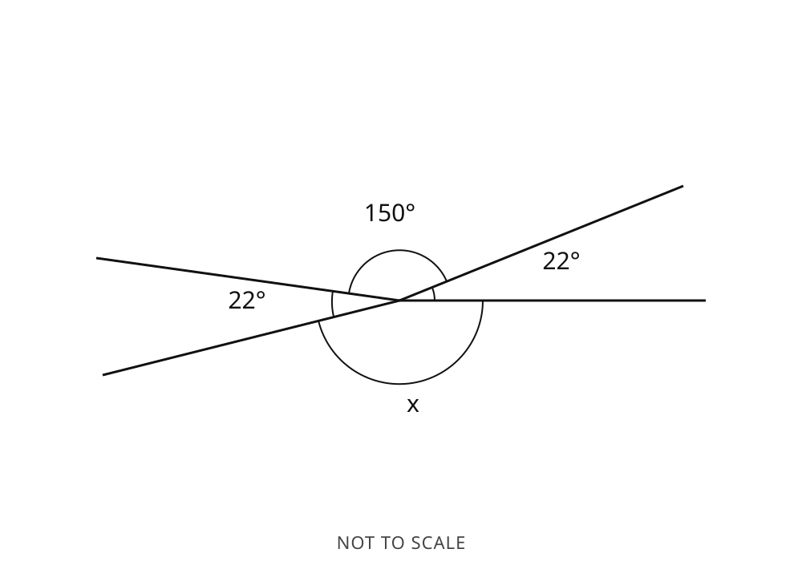

<details><summary>Inline SVG (source)</summary>

```xml
<svg xmlns="http://www.w3.org/2000/svg" viewBox="0 0 1000 700" role="img" aria-label="Diagram: angles meeting consecutively around a point, with an unknown angle x.">
<title>Angles around a point</title>
<desc>Angles of 22 degrees, 150 degrees, 22 degrees and an unknown angle x are arranged consecutively, with no gaps, around a single point.</desc>
<style>.gl{stroke:#111;stroke-width:3;fill:none}.ga{stroke:#111;stroke-width:2;fill:none}.gt{stroke:#111;stroke-width:3}.gx{stroke:#111;stroke-width:3}.gv{fill:#111}text{font-family:sans-serif;font-size:30px;fill:#111}.gn{font-size:22px;fill:#444;letter-spacing:1px}</style>
<line class="gl" x1="498" y1="375" x2="880" y2="375"/>
<line class="gl" x1="498" y1="375" x2="852" y2="232"/>
<line class="gl" x1="498" y1="375" x2="120" y2="322"/>
<line class="gl" x1="498" y1="375" x2="128" y2="468"/>
<path class="ga" d="M 542 375 A 44 44 0 0 0 539 359"/>
<path class="ga" d="M 557 351 A 64 64 0 0 0 435 366"/>
<path class="ga" d="M 415 363 A 84 84 0 0 0 416 395"/>
<path class="ga" d="M 397 400 A 104 104 0 0 0 602 375"/>
<text x="700" y="336" text-anchor="middle">22°</text>
<text x="486" y="276" text-anchor="middle">150°</text>
<text x="308" y="385" text-anchor="middle">22°</text>
<text x="515" y="514" text-anchor="middle">x</text>
<text class="gn" x="500" y="685" text-anchor="middle">NOT TO SCALE</text>
</svg>
```

</details>

**Alt text:** Diagram: angles meeting consecutively around a point, with an unknown angle x.

**Long description:** Angles of 22 degrees, 150 degrees, 22 degrees and an unknown angle x are arranged consecutively, with no gaps, around a single point.

**Data-table fallback**

| angle | value |
| --- | --- |
| angle 1 | 22 degrees |
| angle 2 | 150 degrees |
| angle 3 | 22 degrees |
| x | unknown |

**Answer:** `x = 166°`

**Worked solution**

1. State the angle fact — `Angles around a point sum to 360 degrees`
2. Form the equation — `x = 360 - (22 + 150 + 22)`
3. Evaluate — `x = 166°`

_Free-response: no distractors._

**Diagram-to-data validation:** `svg-realises-data`=pass  `arc-region-measure-agreement`=pass  `arc-large-flag-correct`=pass  `arc-sweep-correct`=pass  `arc-matches-cyclic-region`=pass  `label-inside-intended-region`=pass  `reflex-region-rendered-correctly`=pass  `no-theorem-revealing-markers`=n/a  `target-region-unambiguous`=n/a  `labels-non-overlapping`=pass  `not-to-scale`=pass  `no-answer-leakage`=pass  `media-present`=pass

**Accessibility validation:** `a11y-fields-present`=pass  `a11y-no-answer-in-text`=pass  `a11y-equivalent-information`=pass  `nonColorIndicators`=True

**Overall validation:** pass

**Curriculum decision:** [ ] approve  [ ] revise  [ ] reject — notes: ____

---

### angles_at_point_missing / free-response #4 — band 4 (floor 2, range [2, 4])

- **Objective:** `SPI.MIDDLE.GEO.ANGLES_AT_POINT.01`  ·  **Family:** F3  ·  **Calculator:** calculator-not-required
- **Interaction type:** free-response  ·  **Answer type:** integer  ·  **Units:** degrees
- **Canonical value:** `num=17, den=1` -> `17°`  ·  **Givens:** `[30, 313]`
- **Seed:** `7`  ·  **Generator:** v`1.2.2`  ·  **Parameters:** `{"task": "angles_at_point_missing", "regions": [30, 313, 17], "unknownIndex": 2}`
- **Difficulty axes:** `{"numericalComplexity": 0.5, "reasoningSteps": 0.5, "representation": 0.6, "abstraction": 0.5}`  ·  **Band:** 4
- **To scale:** False (figure is NOT drawn to scale)
- **Reproduce:** `generate(7, {"task": "angles_at_point_missing", "interactionType": "free-response"})` on v`1.2.2`

**Question**

> Find the size of the unknown angle x, in degrees.

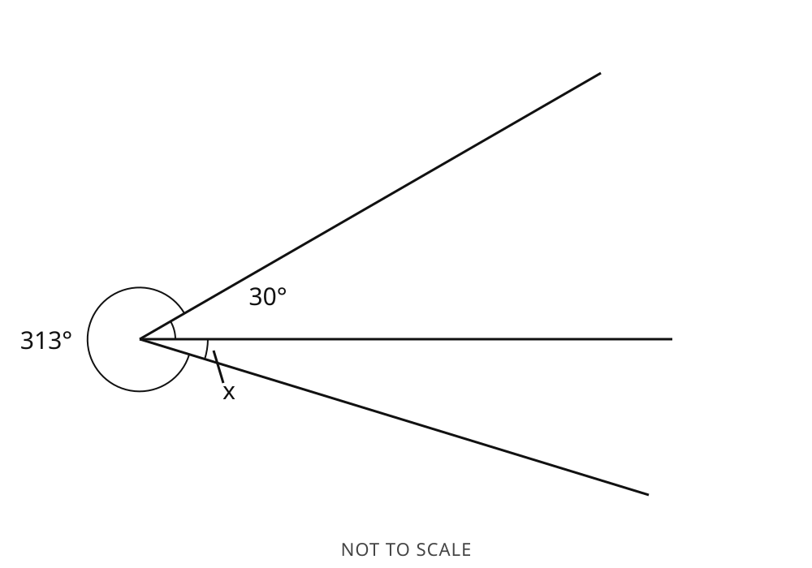

<details><summary>Inline SVG (source)</summary>

```xml
<svg xmlns="http://www.w3.org/2000/svg" viewBox="0 0 1000 700" role="img" aria-label="Diagram: angles meeting consecutively around a point, with an unknown angle x.">
<title>Angles around a point</title>
<desc>Angles of 30 degrees, 313 degrees and an unknown angle x are arranged consecutively, with no gaps, around a single point.</desc>
<style>.gl{stroke:#111;stroke-width:3;fill:none}.ga{stroke:#111;stroke-width:2;fill:none}.gt{stroke:#111;stroke-width:3}.gx{stroke:#111;stroke-width:3}.gv{fill:#111}text{font-family:sans-serif;font-size:30px;fill:#111}.gn{font-size:22px;fill:#444;letter-spacing:1px}</style>
<line class="gl" x1="172" y1="418" x2="828" y2="418"/>
<line class="gl" x1="172" y1="418" x2="740" y2="90"/>
<line class="gl" x1="172" y1="418" x2="799" y2="610"/>
<path class="ga" d="M 216 418 A 44 44 0 0 0 210 396"/>
<path class="ga" d="M 227 386 A 64 64 0 1 0 233 437"/>
<path class="ga" d="M 252 443 A 84 84 0 0 0 256 418"/>
<line class="gx" x1="263" y1="432" x2="275" y2="472"/>
<text x="330" y="376" text-anchor="middle">30°</text>
<text x="57" y="430" text-anchor="middle">313°</text>
<text x="282" y="492" text-anchor="middle">x</text>
<text class="gn" x="500" y="685" text-anchor="middle">NOT TO SCALE</text>
</svg>
```

</details>

**Alt text:** Diagram: angles meeting consecutively around a point, with an unknown angle x.

**Long description:** Angles of 30 degrees, 313 degrees and an unknown angle x are arranged consecutively, with no gaps, around a single point.

**Data-table fallback**

| angle | value |
| --- | --- |
| angle 1 | 30 degrees |
| angle 2 | 313 degrees |
| x | unknown |

**Answer:** `x = 17°`

**Worked solution**

1. State the angle fact — `Angles around a point sum to 360 degrees`
2. Form the equation — `x = 360 - (30 + 313)`
3. Evaluate — `x = 17°`

_Free-response: no distractors._

**Diagram-to-data validation:** `svg-realises-data`=pass  `arc-region-measure-agreement`=pass  `arc-large-flag-correct`=pass  `arc-sweep-correct`=pass  `arc-matches-cyclic-region`=pass  `label-inside-intended-region`=pass  `reflex-region-rendered-correctly`=pass  `no-theorem-revealing-markers`=n/a  `target-region-unambiguous`=n/a  `labels-non-overlapping`=pass  `not-to-scale`=pass  `no-answer-leakage`=pass  `media-present`=pass

**Accessibility validation:** `a11y-fields-present`=pass  `a11y-no-answer-in-text`=pass  `a11y-equivalent-information`=pass  `nonColorIndicators`=True

**Overall validation:** pass

**Curriculum decision:** [ ] approve  [ ] revise  [ ] reject — notes: ____

---

### angles_at_point_missing / free-response #5 — band 3 (floor 2, range [2, 4])

- **Objective:** `SPI.MIDDLE.GEO.ANGLES_AT_POINT.01`  ·  **Family:** F3  ·  **Calculator:** calculator-not-required
- **Interaction type:** free-response  ·  **Answer type:** integer  ·  **Units:** degrees
- **Canonical value:** `num=209, den=1` -> `209°`  ·  **Givens:** `[79, 72]`
- **Seed:** `18`  ·  **Generator:** v`1.2.2`  ·  **Parameters:** `{"task": "angles_at_point_missing", "regions": [209, 79, 72], "unknownIndex": 0}`
- **Difficulty axes:** `{"numericalComplexity": 0.5, "reasoningSteps": 0.5, "representation": 0.6, "abstraction": 0.5}`  ·  **Band:** 3
- **To scale:** False (figure is NOT drawn to scale)
- **Reproduce:** `generate(18, {"task": "angles_at_point_missing", "interactionType": "free-response"})` on v`1.2.2`

**Question**

> Find the size of the unknown angle x, in degrees.

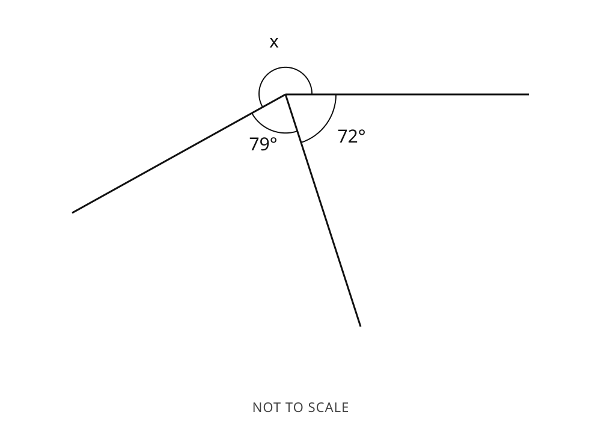

<details><summary>Inline SVG (source)</summary>

```xml
<svg xmlns="http://www.w3.org/2000/svg" viewBox="0 0 1000 700" role="img" aria-label="Diagram: angles meeting consecutively around a point, with an unknown angle x.">
<title>Angles around a point</title>
<desc>Angles of 79 degrees, 72 degrees and an unknown angle x are arranged consecutively, with no gaps, around a single point.</desc>
<style>.gl{stroke:#111;stroke-width:3;fill:none}.ga{stroke:#111;stroke-width:2;fill:none}.gt{stroke:#111;stroke-width:3}.gx{stroke:#111;stroke-width:3}.gv{fill:#111}text{font-family:sans-serif;font-size:30px;fill:#111}.gn{font-size:22px;fill:#444;letter-spacing:1px}</style>
<line class="gl" x1="475" y1="157" x2="880" y2="157"/>
<line class="gl" x1="475" y1="157" x2="120" y2="354"/>
<line class="gl" x1="475" y1="157" x2="600" y2="543"/>
<path class="ga" d="M 519 157 A 44 44 0 1 0 437 178"/>
<path class="ga" d="M 419 188 A 64 64 0 0 0 495 218"/>
<path class="ga" d="M 501 237 A 84 84 0 0 0 559 157"/>
<text x="456" y="79" text-anchor="middle">x</text>
<text x="438" y="250" text-anchor="middle">79°</text>
<text x="585" y="237" text-anchor="middle">72°</text>
<text class="gn" x="500" y="685" text-anchor="middle">NOT TO SCALE</text>
</svg>
```

</details>

**Alt text:** Diagram: angles meeting consecutively around a point, with an unknown angle x.

**Long description:** Angles of 79 degrees, 72 degrees and an unknown angle x are arranged consecutively, with no gaps, around a single point.

**Data-table fallback**

| angle | value |
| --- | --- |
| angle 1 | 79 degrees |
| angle 2 | 72 degrees |
| x | unknown |

**Answer:** `x = 209°`

**Worked solution**

1. State the angle fact — `Angles around a point sum to 360 degrees`
2. Form the equation — `x = 360 - (79 + 72)`
3. Evaluate — `x = 209°`

_Free-response: no distractors._

**Diagram-to-data validation:** `svg-realises-data`=pass  `arc-region-measure-agreement`=pass  `arc-large-flag-correct`=pass  `arc-sweep-correct`=pass  `arc-matches-cyclic-region`=pass  `label-inside-intended-region`=pass  `reflex-region-rendered-correctly`=pass  `no-theorem-revealing-markers`=n/a  `target-region-unambiguous`=n/a  `labels-non-overlapping`=pass  `not-to-scale`=pass  `no-answer-leakage`=pass  `media-present`=pass

**Accessibility validation:** `a11y-fields-present`=pass  `a11y-no-answer-in-text`=pass  `a11y-equivalent-information`=pass  `nonColorIndicators`=True

**Overall validation:** pass

**Curriculum decision:** [ ] approve  [ ] revise  [ ] reject — notes: ____

---

### angles_at_point_missing / free-response #6 — band 3 (floor 2, range [2, 4])

- **Objective:** `SPI.MIDDLE.GEO.ANGLES_AT_POINT.01`  ·  **Family:** F3  ·  **Calculator:** calculator-not-required
- **Interaction type:** free-response  ·  **Answer type:** integer  ·  **Units:** degrees
- **Canonical value:** `num=330, den=1` -> `330°`  ·  **Givens:** `[10, 10, 10]`
- **Seed:** `37`  ·  **Generator:** v`1.2.2`  ·  **Parameters:** `{"task": "angles_at_point_missing", "regions": [330, 10, 10, 10], "unknownIndex": 0}`
- **Difficulty axes:** `{"numericalComplexity": 0.75, "reasoningSteps": 0.5, "representation": 0.6, "abstraction": 0.3}`  ·  **Band:** 3
- **To scale:** False (figure is NOT drawn to scale)
- **Reproduce:** `generate(37, {"task": "angles_at_point_missing", "interactionType": "free-response"})` on v`1.2.2`

**Question**

> Find the size of the unknown angle x, in degrees.

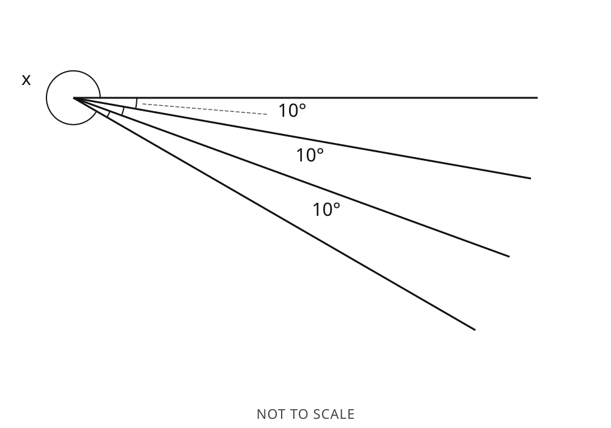

<details><summary>Inline SVG (source)</summary>

```xml
<svg xmlns="http://www.w3.org/2000/svg" viewBox="0 0 1000 700" role="img" aria-label="Diagram: angles meeting consecutively around a point, with an unknown angle x.">
<title>Angles around a point</title>
<desc>Angles of 10 degrees, 10 degrees, 10 degrees and an unknown angle x are arranged consecutively, with no gaps, around a single point.</desc>
<style>.gl{stroke:#111;stroke-width:3;fill:none}.ga{stroke:#111;stroke-width:2;fill:none}.gt{stroke:#111;stroke-width:3}.gx{stroke:#111;stroke-width:3}.gv{fill:#111}text{font-family:sans-serif;font-size:30px;fill:#111}.gn{font-size:22px;fill:#444;letter-spacing:1px}</style>
<line class="gl" x1="120" y1="160" x2="880" y2="160"/>
<line class="gl" x1="120" y1="160" x2="778" y2="540"/>
<line class="gl" x1="120" y1="160" x2="834" y2="420"/>
<line class="gl" x1="120" y1="160" x2="869" y2="292"/>
<path class="ga" d="M 164 160 A 44 44 0 1 0 158 182"/>
<path class="ga" d="M 175 192 A 64 64 0 0 0 180 182"/>
<path class="ga" d="M 199 189 A 84 84 0 0 0 203 175"/>
<path class="ga" d="M 222 178 A 104 104 0 0 0 224 160"/>
<line class="gx" x1="185" y1="190" x2="185" y2="219"/>
<line class="gx" x1="209" y1="184" x2="227" y2="162"/>
<text x="43" y="139" text-anchor="middle">x</text>
<text x="187" y="253" text-anchor="middle">10°</text>
<text x="250" y="137" text-anchor="middle">10°</text>
<text x="480" y="191" text-anchor="middle">10°</text>
<text class="gn" x="500" y="685" text-anchor="middle">NOT TO SCALE</text>
</svg>
```

</details>

**Alt text:** Diagram: angles meeting consecutively around a point, with an unknown angle x.

**Long description:** Angles of 10 degrees, 10 degrees, 10 degrees and an unknown angle x are arranged consecutively, with no gaps, around a single point.

**Data-table fallback**

| angle | value |
| --- | --- |
| angle 1 | 10 degrees |
| angle 2 | 10 degrees |
| angle 3 | 10 degrees |
| x | unknown |

**Answer:** `x = 330°`

**Worked solution**

1. State the angle fact — `Angles around a point sum to 360 degrees`
2. Form the equation — `x = 360 - (10 + 10 + 10)`
3. Evaluate — `x = 330°`

_Free-response: no distractors._

**Diagram-to-data validation:** `svg-realises-data`=pass  `arc-region-measure-agreement`=pass  `arc-large-flag-correct`=pass  `arc-sweep-correct`=pass  `arc-matches-cyclic-region`=pass  `label-inside-intended-region`=pass  `reflex-region-rendered-correctly`=pass  `no-theorem-revealing-markers`=n/a  `target-region-unambiguous`=n/a  `labels-non-overlapping`=pass  `not-to-scale`=pass  `no-answer-leakage`=pass  `media-present`=pass

**Accessibility validation:** `a11y-fields-present`=pass  `a11y-no-answer-in-text`=pass  `a11y-equivalent-information`=pass  `nonColorIndicators`=True

**Overall validation:** pass

**Curriculum decision:** [ ] approve  [ ] revise  [ ] reject — notes: ____

---

### angles_at_point_missing / free-response #7 — band 2 (floor 2, range [2, 4])

- **Objective:** `SPI.MIDDLE.GEO.ANGLES_AT_POINT.01`  ·  **Family:** F3  ·  **Calculator:** calculator-not-required
- **Interaction type:** free-response  ·  **Answer type:** integer  ·  **Units:** degrees
- **Canonical value:** `num=295, den=1` -> `295°`  ·  **Givens:** `[25, 40]`
- **Seed:** `153`  ·  **Generator:** v`1.2.2`  ·  **Parameters:** `{"task": "angles_at_point_missing", "regions": [295, 25, 40], "unknownIndex": 0}`
- **Difficulty axes:** `{"numericalComplexity": 0.5, "reasoningSteps": 0.5, "representation": 0.6, "abstraction": 0.3}`  ·  **Band:** 2
- **To scale:** False (figure is NOT drawn to scale)
- **Reproduce:** `generate(153, {"task": "angles_at_point_missing", "interactionType": "free-response"})` on v`1.2.2`

**Question**

> Find the size of the unknown angle x, in degrees.

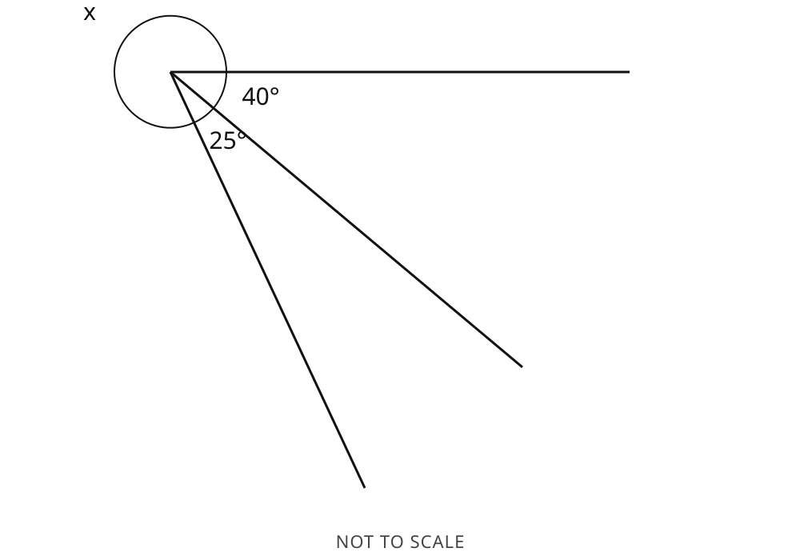

<details><summary>Inline SVG (source)</summary>

```xml
<svg xmlns="http://www.w3.org/2000/svg" viewBox="0 0 1000 700" role="img" aria-label="Diagram: angles meeting consecutively around a point, with an unknown angle x.">
<title>Angles around a point</title>
<desc>Angles of 25 degrees, 40 degrees and an unknown angle x are arranged consecutively, with no gaps, around a single point.</desc>
<style>.gl{stroke:#111;stroke-width:3;fill:none}.ga{stroke:#111;stroke-width:2;fill:none}.gt{stroke:#111;stroke-width:3}.gx{stroke:#111;stroke-width:3}.gv{fill:#111}text{font-family:sans-serif;font-size:30px;fill:#111}.gn{font-size:22px;fill:#444;letter-spacing:1px}</style>
<line class="gl" x1="213" y1="90" x2="787" y2="90"/>
<line class="gl" x1="213" y1="90" x2="456" y2="610"/>
<line class="gl" x1="213" y1="90" x2="653" y2="459"/>
<path class="ga" d="M 257 90 A 44 44 0 1 0 232 130"/>
<path class="ga" d="M 240 148 A 64 64 0 0 0 262 131"/>
<path class="ga" d="M 277 144 A 84 84 0 0 0 297 90"/>
<text x="146" y="46" text-anchor="middle">x</text>
<text x="329" y="244" text-anchor="middle">25°</text>
<text x="326" y="131" text-anchor="middle">40°</text>
<text class="gn" x="500" y="685" text-anchor="middle">NOT TO SCALE</text>
</svg>
```

</details>

**Alt text:** Diagram: angles meeting consecutively around a point, with an unknown angle x.

**Long description:** Angles of 25 degrees, 40 degrees and an unknown angle x are arranged consecutively, with no gaps, around a single point.

**Data-table fallback**

| angle | value |
| --- | --- |
| angle 1 | 25 degrees |
| angle 2 | 40 degrees |
| x | unknown |

**Answer:** `x = 295°`

**Worked solution**

1. State the angle fact — `Angles around a point sum to 360 degrees`
2. Form the equation — `x = 360 - (25 + 40)`
3. Evaluate — `x = 295°`

_Free-response: no distractors._

**Diagram-to-data validation:** `svg-realises-data`=pass  `arc-region-measure-agreement`=pass  `arc-large-flag-correct`=pass  `arc-sweep-correct`=pass  `arc-matches-cyclic-region`=pass  `label-inside-intended-region`=pass  `reflex-region-rendered-correctly`=pass  `no-theorem-revealing-markers`=n/a  `target-region-unambiguous`=n/a  `labels-non-overlapping`=pass  `not-to-scale`=pass  `no-answer-leakage`=pass  `media-present`=pass

**Accessibility validation:** `a11y-fields-present`=pass  `a11y-no-answer-in-text`=pass  `a11y-equivalent-information`=pass  `nonColorIndicators`=True

**Overall validation:** pass

**Curriculum decision:** [ ] approve  [ ] revise  [ ] reject — notes: ____

---

## angles_at_point_missing · multiple-choice — 6 examples  (F3, `SPI.MIDDLE.GEO.ANGLES_AT_POINT.01`)

### angles_at_point_missing / multiple-choice #1 — band 3 (floor 2, range [2, 4])

- **Objective:** `SPI.MIDDLE.GEO.ANGLES_AT_POINT.01`  ·  **Family:** F3  ·  **Calculator:** calculator-not-required
- **Interaction type:** multiple-choice  ·  **Answer type:** integer  ·  **Units:** degrees
- **Canonical value:** `num=263, den=1` -> `263°`  ·  **Givens:** `[32, 65]`
- **Seed:** `1`  ·  **Generator:** v`1.2.2`  ·  **Parameters:** `{"task": "angles_at_point_missing", "regions": [263, 32, 65], "unknownIndex": 0}`
- **Difficulty axes:** `{"numericalComplexity": 0.5, "reasoningSteps": 0.5, "representation": 0.6, "abstraction": 0.5}`  ·  **Band:** 3
- **To scale:** False (figure is NOT drawn to scale)
- **Reproduce:** `generate(1, {"task": "angles_at_point_missing", "interactionType": "multiple-choice"})` on v`1.2.2`

**Question**

> Find the size of the unknown angle x, in degrees.

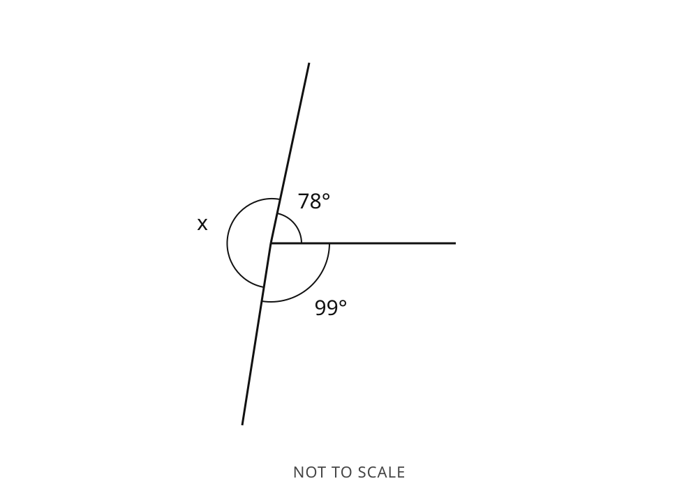

<details><summary>Inline SVG (source)</summary>

```xml
<svg xmlns="http://www.w3.org/2000/svg" viewBox="0 0 1000 700" role="img" aria-label="Diagram: angles meeting consecutively around a point, with an unknown angle x.">
<title>Angles around a point</title>
<desc>Angles of 32 degrees, 65 degrees and an unknown angle x are arranged consecutively, with no gaps, around a single point.</desc>
<style>.gl{stroke:#111;stroke-width:3;fill:none}.ga{stroke:#111;stroke-width:2;fill:none}.gt{stroke:#111;stroke-width:3}.gx{stroke:#111;stroke-width:3}.gv{fill:#111}text{font-family:sans-serif;font-size:30px;fill:#111}.gn{font-size:22px;fill:#444;letter-spacing:1px}</style>
<line class="gl" x1="270" y1="90" x2="794" y2="90"/>
<line class="gl" x1="270" y1="90" x2="206" y2="610"/>
<line class="gl" x1="270" y1="90" x2="492" y2="565"/>
<path class="ga" d="M 314 90 A 44 44 0 1 0 265 134"/>
<path class="ga" d="M 262 154 A 64 64 0 0 0 297 148"/>
<path class="ga" d="M 305 166 A 84 84 0 0 0 354 90"/>
<line class="gx" x1="236" y1="51" x2="217" y2="49"/>
<text x="197" y="48" text-anchor="middle">x</text>
<text x="295" y="245" text-anchor="middle">32°</text>
<text x="371" y="155" text-anchor="middle">65°</text>
<text class="gn" x="500" y="685" text-anchor="middle">NOT TO SCALE</text>
</svg>
```

</details>

**Alt text:** Diagram: angles meeting consecutively around a point, with an unknown angle x.

**Long description:** Angles of 32 degrees, 65 degrees and an unknown angle x are arranged consecutively, with no gaps, around a single point.

**Data-table fallback**

| angle | value |
| --- | --- |
| angle 1 | 32 degrees |
| angle 2 | 65 degrees |
| x | unknown |

**Answer:** `x = 263°`

**Worked solution**

1. State the angle fact — `Angles around a point sum to 360 degrees`
2. Form the equation — `x = 360 - (32 + 65)`
3. Evaluate — `x = 263°`

**MC option order:** A. 328°  B. 97°  C. 83°  D. 263° (correct)

**Distractor calculations (each a distinct misconception pathway)**

| Value | Formula (teacher) | Misconception | Rationale | Student feedback |
| --- | --- | --- | --- | --- |
| `83°` | `180 - sum(givens)` | Uses 180 around a point (`MISC.GEOM.POINT.USES_180`) | Used a 180-degree sum instead of 360. | Angles around a point sum to 360 degrees, not 180. |
| `97°` | `sum(givens)` | Returns the sum of the givens (`MISC.GEOM.POINT.RETURNS_SUM_GIVENS`) | Gave the sum of the given angles. | You added the given angles. Subtract their total from 360. |
| `328°` | `360 - sum(all but one given)` | Forgot one given angle (`MISC.GEOM.POINT.FORGOT_ONE_GIVEN`) | Left out one of the given angles. | Include every given angle; subtract their total from 360. |

**Diagram-to-data validation:** `svg-realises-data`=pass  `arc-region-measure-agreement`=pass  `arc-large-flag-correct`=pass  `arc-sweep-correct`=pass  `arc-matches-cyclic-region`=pass  `label-inside-intended-region`=pass  `reflex-region-rendered-correctly`=pass  `no-theorem-revealing-markers`=n/a  `target-region-unambiguous`=n/a  `labels-non-overlapping`=pass  `not-to-scale`=pass  `no-answer-leakage`=pass  `media-present`=pass

**Accessibility validation:** `a11y-fields-present`=pass  `a11y-no-answer-in-text`=pass  `a11y-equivalent-information`=pass  `nonColorIndicators`=True

**Overall validation:** pass

**Curriculum decision:** [ ] approve  [ ] revise  [ ] reject — notes: ____

---

### angles_at_point_missing / multiple-choice #2 — band 3 (floor 2, range [2, 4])

- **Objective:** `SPI.MIDDLE.GEO.ANGLES_AT_POINT.01`  ·  **Family:** F3  ·  **Calculator:** calculator-not-required
- **Interaction type:** multiple-choice  ·  **Answer type:** integer  ·  **Units:** degrees
- **Canonical value:** `num=312, den=1` -> `312°`  ·  **Givens:** `[11, 37]`
- **Seed:** `2`  ·  **Generator:** v`1.2.2`  ·  **Parameters:** `{"task": "angles_at_point_missing", "regions": [312, 11, 37], "unknownIndex": 0}`
- **Difficulty axes:** `{"numericalComplexity": 0.5, "reasoningSteps": 0.5, "representation": 0.6, "abstraction": 0.5}`  ·  **Band:** 3
- **To scale:** False (figure is NOT drawn to scale)
- **Reproduce:** `generate(2, {"task": "angles_at_point_missing", "interactionType": "multiple-choice"})` on v`1.2.2`

**Question**

> Find the size of the unknown angle x, in degrees.

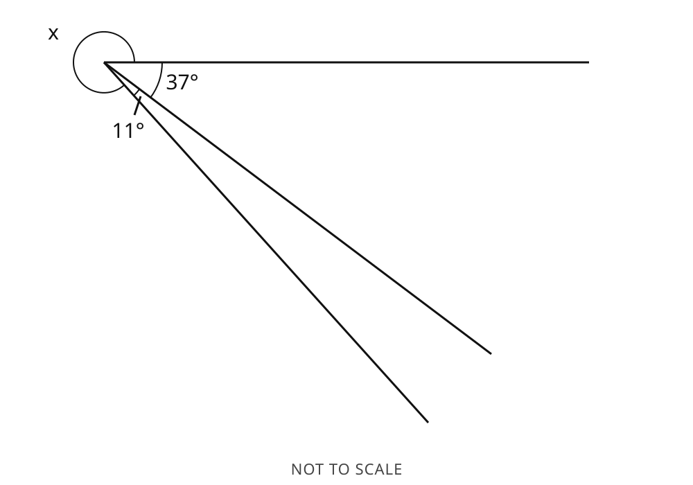

<details><summary>Inline SVG (source)</summary>

```xml
<svg xmlns="http://www.w3.org/2000/svg" viewBox="0 0 1000 700" role="img" aria-label="Diagram: angles meeting consecutively around a point, with an unknown angle x.">
<title>Angles around a point</title>
<desc>Angles of 11 degrees, 37 degrees and an unknown angle x are arranged consecutively, with no gaps, around a single point.</desc>
<style>.gl{stroke:#111;stroke-width:3;fill:none}.ga{stroke:#111;stroke-width:2;fill:none}.gt{stroke:#111;stroke-width:3}.gx{stroke:#111;stroke-width:3}.gv{fill:#111}text{font-family:sans-serif;font-size:30px;fill:#111}.gn{font-size:22px;fill:#444;letter-spacing:1px}</style>
<line class="gl" x1="150" y1="90" x2="850" y2="90"/>
<line class="gl" x1="150" y1="90" x2="618" y2="610"/>
<line class="gl" x1="150" y1="90" x2="709" y2="511"/>
<path class="ga" d="M 194 90 A 44 44 0 1 0 179 123"/>
<path class="ga" d="M 193 138 A 64 64 0 0 0 201 129"/>
<path class="ga" d="M 217 141 A 84 84 0 0 0 234 90"/>
<line class="gx" x1="203" y1="139" x2="194" y2="166"/>
<text x="77" y="57" text-anchor="middle">x</text>
<text x="185" y="199" text-anchor="middle">11°</text>
<text x="263" y="129" text-anchor="middle">37°</text>
<text class="gn" x="500" y="685" text-anchor="middle">NOT TO SCALE</text>
</svg>
```

</details>

**Alt text:** Diagram: angles meeting consecutively around a point, with an unknown angle x.

**Long description:** Angles of 11 degrees, 37 degrees and an unknown angle x are arranged consecutively, with no gaps, around a single point.

**Data-table fallback**

| angle | value |
| --- | --- |
| angle 1 | 11 degrees |
| angle 2 | 37 degrees |
| x | unknown |

**Answer:** `x = 312°`

**Worked solution**

1. State the angle fact — `Angles around a point sum to 360 degrees`
2. Form the equation — `x = 360 - (11 + 37)`
3. Evaluate — `x = 312°`

**MC option order:** A. 48°  B. 132°  C. 349°  D. 312° (correct)

**Distractor calculations (each a distinct misconception pathway)**

| Value | Formula (teacher) | Misconception | Rationale | Student feedback |
| --- | --- | --- | --- | --- |
| `132°` | `180 - sum(givens)` | Uses 180 around a point (`MISC.GEOM.POINT.USES_180`) | Used a 180-degree sum instead of 360. | Angles around a point sum to 360 degrees, not 180. |
| `48°` | `sum(givens)` | Returns the sum of the givens (`MISC.GEOM.POINT.RETURNS_SUM_GIVENS`) | Gave the sum of the given angles. | You added the given angles. Subtract their total from 360. |
| `349°` | `360 - sum(all but one given)` | Forgot one given angle (`MISC.GEOM.POINT.FORGOT_ONE_GIVEN`) | Left out one of the given angles. | Include every given angle; subtract their total from 360. |

**Diagram-to-data validation:** `svg-realises-data`=pass  `arc-region-measure-agreement`=pass  `arc-large-flag-correct`=pass  `arc-sweep-correct`=pass  `arc-matches-cyclic-region`=pass  `label-inside-intended-region`=pass  `reflex-region-rendered-correctly`=pass  `no-theorem-revealing-markers`=n/a  `target-region-unambiguous`=n/a  `labels-non-overlapping`=pass  `not-to-scale`=pass  `no-answer-leakage`=pass  `media-present`=pass

**Accessibility validation:** `a11y-fields-present`=pass  `a11y-no-answer-in-text`=pass  `a11y-equivalent-information`=pass  `nonColorIndicators`=True

**Overall validation:** pass

**Curriculum decision:** [ ] approve  [ ] revise  [ ] reject — notes: ____

---

### angles_at_point_missing / multiple-choice #3 — band 4 (floor 2, range [2, 4])

- **Objective:** `SPI.MIDDLE.GEO.ANGLES_AT_POINT.01`  ·  **Family:** F3  ·  **Calculator:** calculator-not-required
- **Interaction type:** multiple-choice  ·  **Answer type:** integer  ·  **Units:** degrees
- **Canonical value:** `num=217, den=1` -> `217°`  ·  **Givens:** `[109, 21, 13]`
- **Seed:** `3`  ·  **Generator:** v`1.2.2`  ·  **Parameters:** `{"task": "angles_at_point_missing", "regions": [109, 217, 21, 13], "unknownIndex": 1}`
- **Difficulty axes:** `{"numericalComplexity": 0.75, "reasoningSteps": 0.5, "representation": 0.6, "abstraction": 0.5}`  ·  **Band:** 4
- **To scale:** False (figure is NOT drawn to scale)
- **Reproduce:** `generate(3, {"task": "angles_at_point_missing", "interactionType": "multiple-choice"})` on v`1.2.2`

**Question**

> Find the size of the unknown angle x, in degrees.

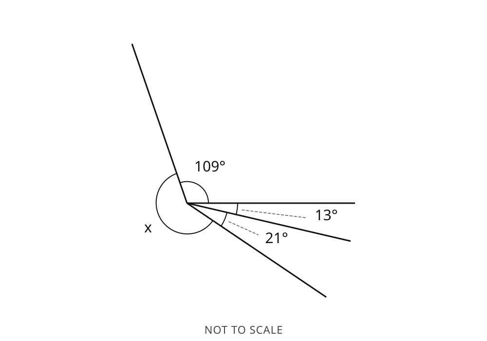

<details><summary>Inline SVG (source)</summary>

```xml
<svg xmlns="http://www.w3.org/2000/svg" viewBox="0 0 1000 700" role="img" aria-label="Diagram: angles meeting consecutively around a point, with an unknown angle x.">
<title>Angles around a point</title>
<desc>Angles of 109 degrees, 21 degrees, 13 degrees and an unknown angle x are arranged consecutively, with no gaps, around a single point.</desc>
<style>.gl{stroke:#111;stroke-width:3;fill:none}.ga{stroke:#111;stroke-width:2;fill:none}.gt{stroke:#111;stroke-width:3}.gx{stroke:#111;stroke-width:3}.gv{fill:#111}text{font-family:sans-serif;font-size:30px;fill:#111}.gn{font-size:22px;fill:#444;letter-spacing:1px}</style>
<line class="gl" x1="384" y1="417" x2="729" y2="417"/>
<line class="gl" x1="384" y1="417" x2="271" y2="90"/>
<line class="gl" x1="384" y1="417" x2="670" y2="610"/>
<line class="gl" x1="384" y1="417" x2="720" y2="495"/>
<path class="ga" d="M 428 417 A 44 44 0 0 0 370 375"/>
<path class="ga" d="M 363 356 A 64 64 0 1 0 437 453"/>
<path class="ga" d="M 454 464 A 84 84 0 0 0 466 436"/>
<path class="ga" d="M 485 440 A 104 104 0 0 0 488 417"/>
<text x="431" y="352" text-anchor="middle">109°</text>
<text x="304" y="477" text-anchor="middle">x</text>
<text x="571" y="500" text-anchor="middle">21°</text>
<text x="670" y="452" text-anchor="middle">13°</text>
<text class="gn" x="500" y="685" text-anchor="middle">NOT TO SCALE</text>
</svg>
```

</details>

**Alt text:** Diagram: angles meeting consecutively around a point, with an unknown angle x.

**Long description:** Angles of 109 degrees, 21 degrees, 13 degrees and an unknown angle x are arranged consecutively, with no gaps, around a single point.

**Data-table fallback**

| angle | value |
| --- | --- |
| angle 1 | 109 degrees |
| angle 2 | 21 degrees |
| angle 3 | 13 degrees |
| x | unknown |

**Answer:** `x = 217°`

**Worked solution**

1. State the angle fact — `Angles around a point sum to 360 degrees`
2. Form the equation — `x = 360 - (109 + 21 + 13)`
3. Evaluate — `x = 217°`

**MC option order:** A. 37°  B. 230°  C. 217° (correct)  D. 143°

**Distractor calculations (each a distinct misconception pathway)**

| Value | Formula (teacher) | Misconception | Rationale | Student feedback |
| --- | --- | --- | --- | --- |
| `37°` | `180 - sum(givens)` | Uses 180 around a point (`MISC.GEOM.POINT.USES_180`) | Used a 180-degree sum instead of 360. | Angles around a point sum to 360 degrees, not 180. |
| `143°` | `sum(givens)` | Returns the sum of the givens (`MISC.GEOM.POINT.RETURNS_SUM_GIVENS`) | Gave the sum of the given angles. | You added the given angles. Subtract their total from 360. |
| `230°` | `360 - sum(all but one given)` | Forgot one given angle (`MISC.GEOM.POINT.FORGOT_ONE_GIVEN`) | Left out one of the given angles. | Include every given angle; subtract their total from 360. |

**Diagram-to-data validation:** `svg-realises-data`=pass  `arc-region-measure-agreement`=pass  `arc-large-flag-correct`=pass  `arc-sweep-correct`=pass  `arc-matches-cyclic-region`=pass  `label-inside-intended-region`=pass  `reflex-region-rendered-correctly`=pass  `no-theorem-revealing-markers`=n/a  `target-region-unambiguous`=n/a  `labels-non-overlapping`=pass  `not-to-scale`=pass  `no-answer-leakage`=pass  `media-present`=pass

**Accessibility validation:** `a11y-fields-present`=pass  `a11y-no-answer-in-text`=pass  `a11y-equivalent-information`=pass  `nonColorIndicators`=True

**Overall validation:** pass

**Curriculum decision:** [ ] approve  [ ] revise  [ ] reject — notes: ____

---

### angles_at_point_missing / multiple-choice #4 — band 3 (floor 2, range [2, 4])

- **Objective:** `SPI.MIDDLE.GEO.ANGLES_AT_POINT.01`  ·  **Family:** F3  ·  **Calculator:** calculator-not-required
- **Interaction type:** multiple-choice  ·  **Answer type:** integer  ·  **Units:** degrees
- **Canonical value:** `num=339, den=1` -> `339°`  ·  **Givens:** `[11, 10]`
- **Seed:** `14`  ·  **Generator:** v`1.2.2`  ·  **Parameters:** `{"task": "angles_at_point_missing", "regions": [339, 11, 10], "unknownIndex": 0}`
- **Difficulty axes:** `{"numericalComplexity": 0.5, "reasoningSteps": 0.5, "representation": 0.6, "abstraction": 0.5}`  ·  **Band:** 3
- **To scale:** False (figure is NOT drawn to scale)
- **Reproduce:** `generate(14, {"task": "angles_at_point_missing", "interactionType": "multiple-choice"})` on v`1.2.2`

**Question**

> Find the size of the unknown angle x, in degrees.

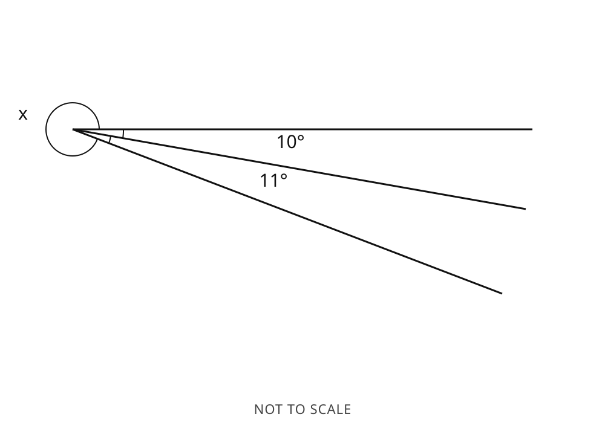

<details><summary>Inline SVG (source)</summary>

```xml
<svg xmlns="http://www.w3.org/2000/svg" viewBox="0 0 1000 700" role="img" aria-label="Diagram: angles meeting consecutively around a point, with an unknown angle x.">
<title>Angles around a point</title>
<desc>Angles of 11 degrees, 10 degrees and an unknown angle x are arranged consecutively, with no gaps, around a single point.</desc>
<style>.gl{stroke:#111;stroke-width:3;fill:none}.ga{stroke:#111;stroke-width:2;fill:none}.gt{stroke:#111;stroke-width:3}.gx{stroke:#111;stroke-width:3}.gv{fill:#111}text{font-family:sans-serif;font-size:30px;fill:#111}.gn{font-size:22px;fill:#444;letter-spacing:1px}</style>
<line class="gl" x1="120" y1="214" x2="880" y2="214"/>
<line class="gl" x1="120" y1="214" x2="830" y2="486"/>
<line class="gl" x1="120" y1="214" x2="869" y2="346"/>
<path class="ga" d="M 164 214 A 44 44 0 1 0 161 230"/>
<path class="ga" d="M 180 237 A 64 64 0 0 0 183 225"/>
<path class="ga" d="M 203 229 A 84 84 0 0 0 204 214"/>
<text x="38" y="198" text-anchor="middle">x</text>
<text x="452" y="309" text-anchor="middle">11°</text>
<text x="480" y="245" text-anchor="middle">10°</text>
<text class="gn" x="500" y="685" text-anchor="middle">NOT TO SCALE</text>
</svg>
```

</details>

**Alt text:** Diagram: angles meeting consecutively around a point, with an unknown angle x.

**Long description:** Angles of 11 degrees, 10 degrees and an unknown angle x are arranged consecutively, with no gaps, around a single point.

**Data-table fallback**

| angle | value |
| --- | --- |
| angle 1 | 11 degrees |
| angle 2 | 10 degrees |
| x | unknown |

**Answer:** `x = 339°`

**Worked solution**

1. State the angle fact — `Angles around a point sum to 360 degrees`
2. Form the equation — `x = 360 - (11 + 10)`
3. Evaluate — `x = 339°`

**MC option order:** A. 349°  B. 159°  C. 21°  D. 339° (correct)

**Distractor calculations (each a distinct misconception pathway)**

| Value | Formula (teacher) | Misconception | Rationale | Student feedback |
| --- | --- | --- | --- | --- |
| `159°` | `180 - sum(givens)` | Uses 180 around a point (`MISC.GEOM.POINT.USES_180`) | Used a 180-degree sum instead of 360. | Angles around a point sum to 360 degrees, not 180. |
| `21°` | `sum(givens)` | Returns the sum of the givens (`MISC.GEOM.POINT.RETURNS_SUM_GIVENS`) | Gave the sum of the given angles. | You added the given angles. Subtract their total from 360. |
| `349°` | `360 - sum(all but one given)` | Forgot one given angle (`MISC.GEOM.POINT.FORGOT_ONE_GIVEN`) | Left out one of the given angles. | Include every given angle; subtract their total from 360. |

**Diagram-to-data validation:** `svg-realises-data`=pass  `arc-region-measure-agreement`=pass  `arc-large-flag-correct`=pass  `arc-sweep-correct`=pass  `arc-matches-cyclic-region`=pass  `label-inside-intended-region`=pass  `reflex-region-rendered-correctly`=pass  `no-theorem-revealing-markers`=n/a  `target-region-unambiguous`=n/a  `labels-non-overlapping`=pass  `not-to-scale`=pass  `no-answer-leakage`=pass  `media-present`=pass

**Accessibility validation:** `a11y-fields-present`=pass  `a11y-no-answer-in-text`=pass  `a11y-equivalent-information`=pass  `nonColorIndicators`=True

**Overall validation:** pass

**Curriculum decision:** [ ] approve  [ ] revise  [ ] reject — notes: ____

---

### angles_at_point_missing / multiple-choice #5 — band 3 (floor 2, range [2, 4])

- **Objective:** `SPI.MIDDLE.GEO.ANGLES_AT_POINT.01`  ·  **Family:** F3  ·  **Calculator:** calculator-not-required
- **Interaction type:** multiple-choice  ·  **Answer type:** integer  ·  **Units:** degrees
- **Canonical value:** `num=330, den=1` -> `330°`  ·  **Givens:** `[10, 10, 10]`
- **Seed:** `37`  ·  **Generator:** v`1.2.2`  ·  **Parameters:** `{"task": "angles_at_point_missing", "regions": [330, 10, 10, 10], "unknownIndex": 0}`
- **Difficulty axes:** `{"numericalComplexity": 0.75, "reasoningSteps": 0.5, "representation": 0.6, "abstraction": 0.3}`  ·  **Band:** 3
- **To scale:** False (figure is NOT drawn to scale)
- **Reproduce:** `generate(37, {"task": "angles_at_point_missing", "interactionType": "multiple-choice"})` on v`1.2.2`

**Question**

> Find the size of the unknown angle x, in degrees.

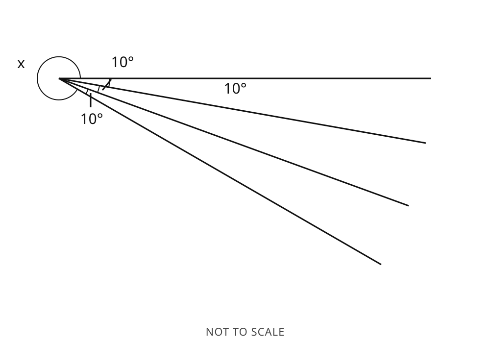

<details><summary>Inline SVG (source)</summary>

```xml
<svg xmlns="http://www.w3.org/2000/svg" viewBox="0 0 1000 700" role="img" aria-label="Diagram: angles meeting consecutively around a point, with an unknown angle x.">
<title>Angles around a point</title>
<desc>Angles of 10 degrees, 10 degrees, 10 degrees and an unknown angle x are arranged consecutively, with no gaps, around a single point.</desc>
<style>.gl{stroke:#111;stroke-width:3;fill:none}.ga{stroke:#111;stroke-width:2;fill:none}.gt{stroke:#111;stroke-width:3}.gx{stroke:#111;stroke-width:3}.gv{fill:#111}text{font-family:sans-serif;font-size:30px;fill:#111}.gn{font-size:22px;fill:#444;letter-spacing:1px}</style>
<line class="gl" x1="120" y1="160" x2="880" y2="160"/>
<line class="gl" x1="120" y1="160" x2="778" y2="540"/>
<line class="gl" x1="120" y1="160" x2="834" y2="420"/>
<line class="gl" x1="120" y1="160" x2="869" y2="292"/>
<path class="ga" d="M 164 160 A 44 44 0 1 0 158 182"/>
<path class="ga" d="M 175 192 A 64 64 0 0 0 180 182"/>
<path class="ga" d="M 199 189 A 84 84 0 0 0 203 175"/>
<path class="ga" d="M 222 178 A 104 104 0 0 0 224 160"/>
<line class="gx" x1="185" y1="190" x2="185" y2="219"/>
<line class="gx" x1="209" y1="184" x2="227" y2="162"/>
<text x="43" y="139" text-anchor="middle">x</text>
<text x="187" y="253" text-anchor="middle">10°</text>
<text x="250" y="137" text-anchor="middle">10°</text>
<text x="480" y="191" text-anchor="middle">10°</text>
<text class="gn" x="500" y="685" text-anchor="middle">NOT TO SCALE</text>
</svg>
```

</details>

**Alt text:** Diagram: angles meeting consecutively around a point, with an unknown angle x.

**Long description:** Angles of 10 degrees, 10 degrees, 10 degrees and an unknown angle x are arranged consecutively, with no gaps, around a single point.

**Data-table fallback**

| angle | value |
| --- | --- |
| angle 1 | 10 degrees |
| angle 2 | 10 degrees |
| angle 3 | 10 degrees |
| x | unknown |

**Answer:** `x = 330°`

**Worked solution**

1. State the angle fact — `Angles around a point sum to 360 degrees`
2. Form the equation — `x = 360 - (10 + 10 + 10)`
3. Evaluate — `x = 330°`

**MC option order:** A. 340°  B. 150°  C. 330° (correct)  D. 30°

**Distractor calculations (each a distinct misconception pathway)**

| Value | Formula (teacher) | Misconception | Rationale | Student feedback |
| --- | --- | --- | --- | --- |
| `150°` | `180 - sum(givens)` | Uses 180 around a point (`MISC.GEOM.POINT.USES_180`) | Used a 180-degree sum instead of 360. | Angles around a point sum to 360 degrees, not 180. |
| `30°` | `sum(givens)` | Returns the sum of the givens (`MISC.GEOM.POINT.RETURNS_SUM_GIVENS`) | Gave the sum of the given angles. | You added the given angles. Subtract their total from 360. |
| `340°` | `360 - sum(all but one given)` | Forgot one given angle (`MISC.GEOM.POINT.FORGOT_ONE_GIVEN`) | Left out one of the given angles. | Include every given angle; subtract their total from 360. |

**Diagram-to-data validation:** `svg-realises-data`=pass  `arc-region-measure-agreement`=pass  `arc-large-flag-correct`=pass  `arc-sweep-correct`=pass  `arc-matches-cyclic-region`=pass  `label-inside-intended-region`=pass  `reflex-region-rendered-correctly`=pass  `no-theorem-revealing-markers`=n/a  `target-region-unambiguous`=n/a  `labels-non-overlapping`=pass  `not-to-scale`=pass  `no-answer-leakage`=pass  `media-present`=pass

**Accessibility validation:** `a11y-fields-present`=pass  `a11y-no-answer-in-text`=pass  `a11y-equivalent-information`=pass  `nonColorIndicators`=True

**Overall validation:** pass

**Curriculum decision:** [ ] approve  [ ] revise  [ ] reject — notes: ____

---

### angles_at_point_missing / multiple-choice #6 — band 2 (floor 2, range [2, 4])

- **Objective:** `SPI.MIDDLE.GEO.ANGLES_AT_POINT.01`  ·  **Family:** F3  ·  **Calculator:** calculator-not-required
- **Interaction type:** multiple-choice  ·  **Answer type:** integer  ·  **Units:** degrees
- **Canonical value:** `num=280, den=1` -> `280°`  ·  **Givens:** `[10, 70]`
- **Seed:** `99`  ·  **Generator:** v`1.2.2`  ·  **Parameters:** `{"task": "angles_at_point_missing", "regions": [280, 10, 70], "unknownIndex": 0}`
- **Difficulty axes:** `{"numericalComplexity": 0.5, "reasoningSteps": 0.5, "representation": 0.6, "abstraction": 0.3}`  ·  **Band:** 2
- **To scale:** False (figure is NOT drawn to scale)
- **Reproduce:** `generate(99, {"task": "angles_at_point_missing", "interactionType": "multiple-choice"})` on v`1.2.2`

**Question**

> Find the size of the unknown angle x, in degrees.

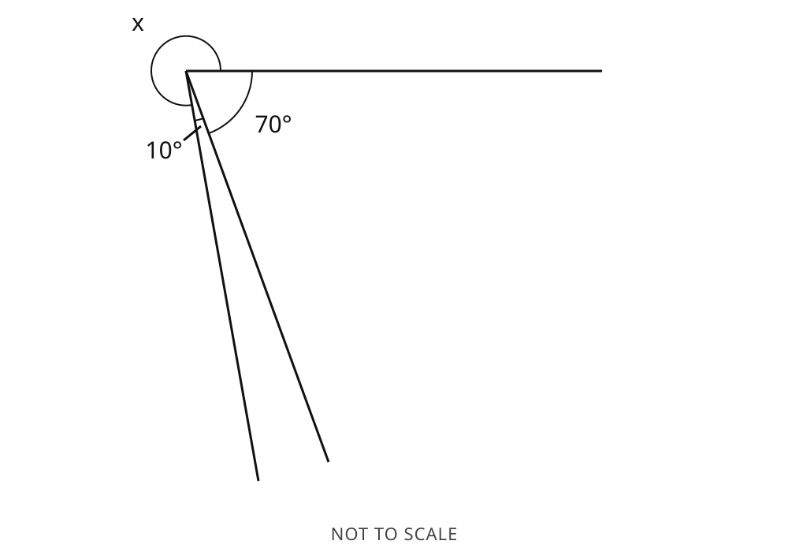

<details><summary>Inline SVG (source)</summary>

```xml
<svg xmlns="http://www.w3.org/2000/svg" viewBox="0 0 1000 700" role="img" aria-label="Diagram: angles meeting consecutively around a point, with an unknown angle x.">
<title>Angles around a point</title>
<desc>Angles of 10 degrees, 70 degrees and an unknown angle x are arranged consecutively, with no gaps, around a single point.</desc>
<style>.gl{stroke:#111;stroke-width:3;fill:none}.ga{stroke:#111;stroke-width:2;fill:none}.gt{stroke:#111;stroke-width:3}.gx{stroke:#111;stroke-width:3}.gv{fill:#111}text{font-family:sans-serif;font-size:30px;fill:#111}.gn{font-size:22px;fill:#444;letter-spacing:1px}</style>
<line class="gl" x1="236" y1="90" x2="764" y2="90"/>
<line class="gl" x1="236" y1="90" x2="328" y2="610"/>
<line class="gl" x1="236" y1="90" x2="417" y2="586"/>
<path class="ga" d="M 280 90 A 44 44 0 1 0 244 133"/>
<path class="ga" d="M 247 153 A 64 64 0 0 0 258 150"/>
<path class="ga" d="M 265 169 A 84 84 0 0 0 320 90"/>
<line class="gx" x1="255" y1="160" x2="233" y2="178"/>
<text x="175" y="39" text-anchor="middle">x</text>
<text x="208" y="201" text-anchor="middle">10°</text>
<text x="347" y="168" text-anchor="middle">70°</text>
<text class="gn" x="500" y="685" text-anchor="middle">NOT TO SCALE</text>
</svg>
```

</details>

**Alt text:** Diagram: angles meeting consecutively around a point, with an unknown angle x.

**Long description:** Angles of 10 degrees, 70 degrees and an unknown angle x are arranged consecutively, with no gaps, around a single point.

**Data-table fallback**

| angle | value |
| --- | --- |
| angle 1 | 10 degrees |
| angle 2 | 70 degrees |
| x | unknown |

**Answer:** `x = 280°`

**Worked solution**

1. State the angle fact — `Angles around a point sum to 360 degrees`
2. Form the equation — `x = 360 - (10 + 70)`
3. Evaluate — `x = 280°`

**MC option order:** A. 350°  B. 280° (correct)  C. 80°  D. 100°

**Distractor calculations (each a distinct misconception pathway)**

| Value | Formula (teacher) | Misconception | Rationale | Student feedback |
| --- | --- | --- | --- | --- |
| `100°` | `180 - sum(givens)` | Uses 180 around a point (`MISC.GEOM.POINT.USES_180`) | Used a 180-degree sum instead of 360. | Angles around a point sum to 360 degrees, not 180. |
| `80°` | `sum(givens)` | Returns the sum of the givens (`MISC.GEOM.POINT.RETURNS_SUM_GIVENS`) | Gave the sum of the given angles. | You added the given angles. Subtract their total from 360. |
| `350°` | `360 - sum(all but one given)` | Forgot one given angle (`MISC.GEOM.POINT.FORGOT_ONE_GIVEN`) | Left out one of the given angles. | Include every given angle; subtract their total from 360. |

**Diagram-to-data validation:** `svg-realises-data`=pass  `arc-region-measure-agreement`=pass  `arc-large-flag-correct`=pass  `arc-sweep-correct`=pass  `arc-matches-cyclic-region`=pass  `label-inside-intended-region`=pass  `reflex-region-rendered-correctly`=pass  `no-theorem-revealing-markers`=n/a  `target-region-unambiguous`=n/a  `labels-non-overlapping`=pass  `not-to-scale`=pass  `no-answer-leakage`=pass  `media-present`=pass

**Accessibility validation:** `a11y-fields-present`=pass  `a11y-no-answer-in-text`=pass  `a11y-equivalent-information`=pass  `nonColorIndicators`=True

**Overall validation:** pass

**Curriculum decision:** [ ] approve  [ ] revise  [ ] reject — notes: ____

---
