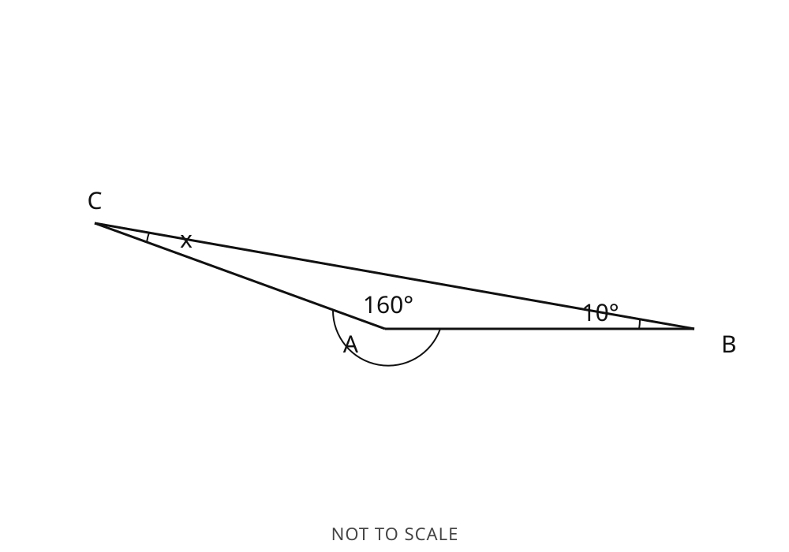
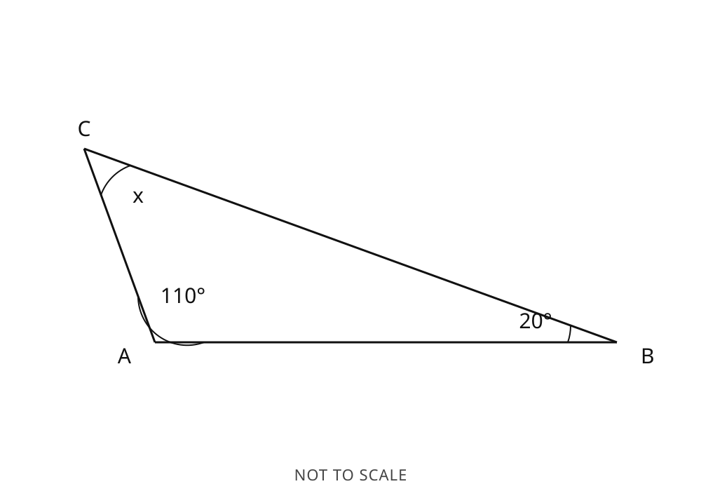
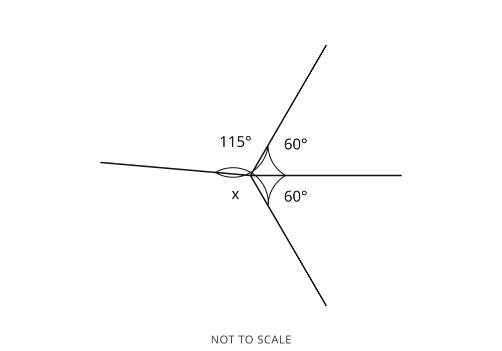
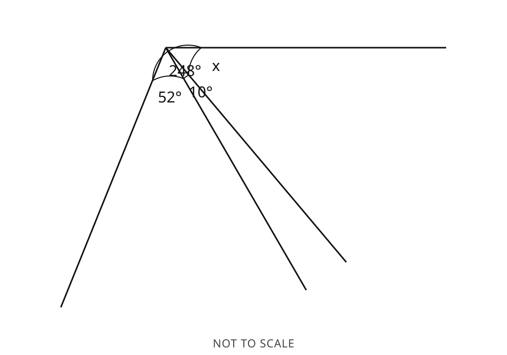
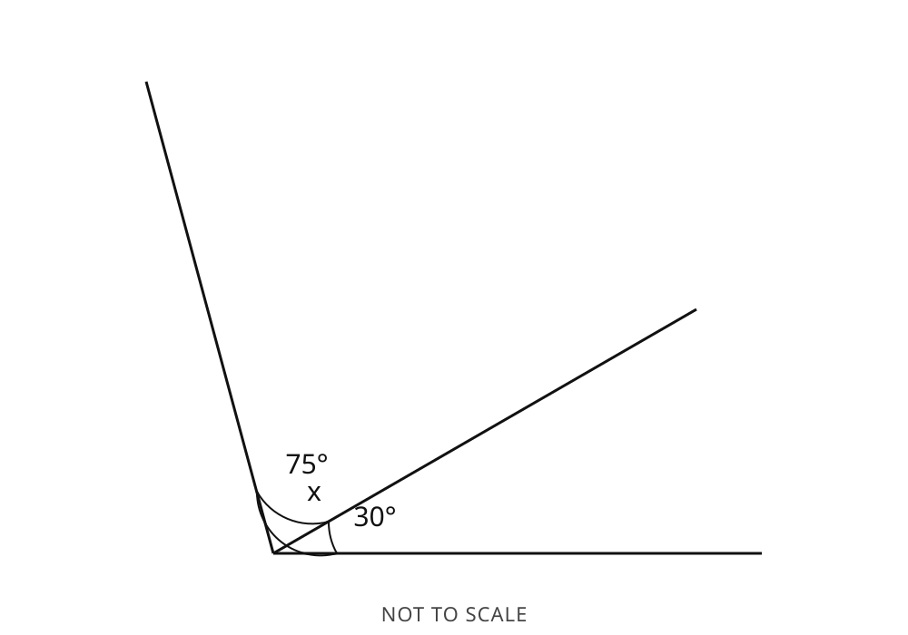
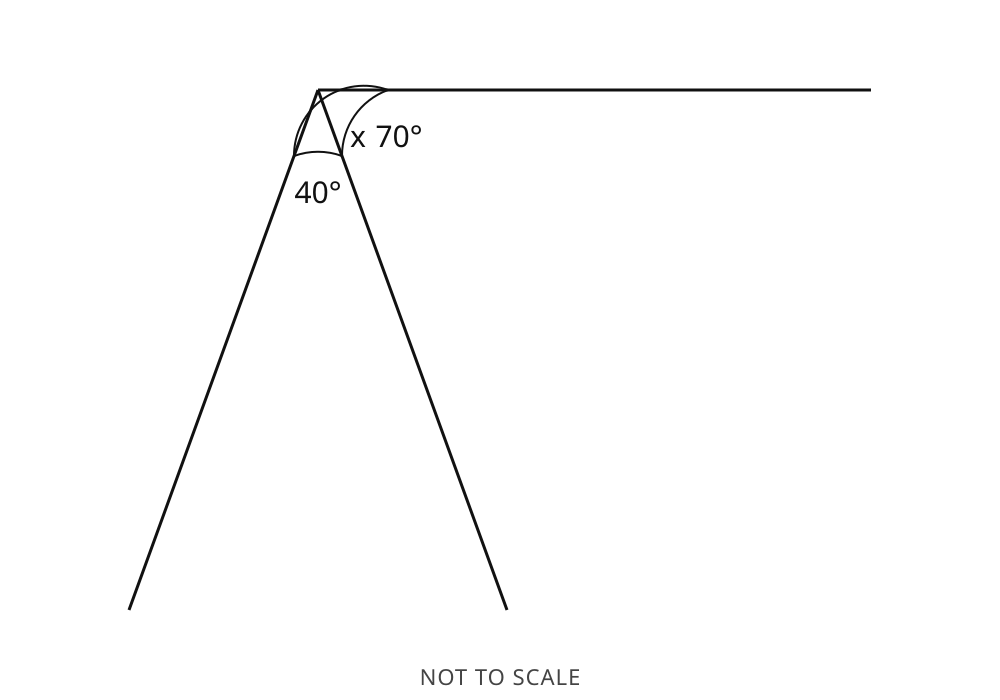
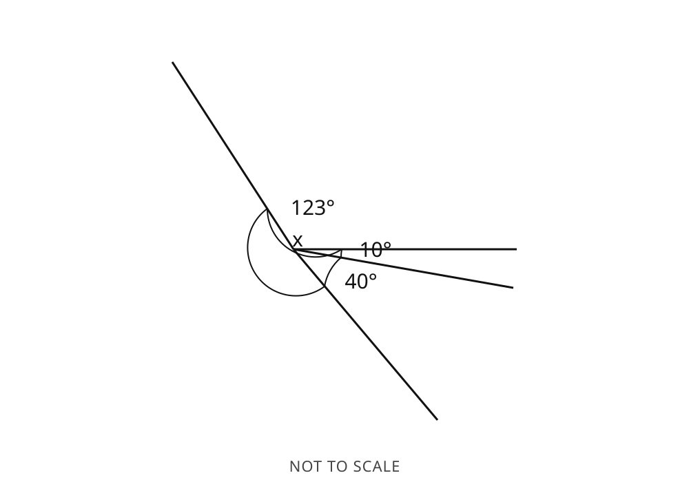

# Curriculum-Review Pack — Geometry: Angles, Lines & Triangles (SVG diagrams)

Generator: `gen.geometry.angles-figures` v`1.0.0`. Stage: SPI-Math Middle School -> Geometry -> Ch.21 (Angles, Lines, Triangles). Generated by `oracle/make_review_pack_geometry.py`.

> **Review purpose.** Machine-validated diagram items with exact integer-degree answers. Advancing any item or objective to `curriculum-reviewed` / `approved` / `published` is the curriculum authority's decision. The diagram IS the question: every figure is built from the same parameters as the prompt and answer, ray directions come from a committed integer table (no runtime trigonometry), coordinates use one round-half-up rule, and the SVG is byte-for-byte identical between the Python oracle and the TypeScript app. All figures are **NOT TO SCALE**.

## Objectives under review (one task each)

| Task | Family | Objective | MC? |
| --- | --- | --- | --- |
| straight_line_missing_angle | F1 | `SPI.MIDDLE.GEO.ANGLES_STRAIGHT_LINE.01` | yes |
| triangle_missing_angle | F2 | `SPI.MIDDLE.GEO.TRIANGLE_ANGLE_SUM.01` | yes |
| isosceles_base_angle | F2 | `SPI.MIDDLE.GEO.ISOSCELES_BASE_ANGLES.01` | yes |
| vertically_opposite_angle | F3 | `SPI.MIDDLE.GEO.VERTICALLY_OPPOSITE_ANGLES.01` | no (free-response only in v1.0.0) |
| angles_at_point_missing | F3 | `SPI.MIDDLE.GEO.ANGLES_AT_POINT.01` | yes |

## Platform-gate summaries

- **Distractor collision / deterministic regeneration:** over a 10,000-seed MC sweep, **10,000** items had exactly three distinct, formula-backed distractors; **0** violations. When three cannot be formed, the generator deterministically regenerates parameters (same seed -> same item).
- **To-scale fidelity (non-blocking diagnostic):** across 2,000 vertically-opposite items, the worst drawn-ray error is **0.1186 deg** (tolerance 0.5 deg). This diagnostic is the only place `atan2` is used; it never gates generation or validation.
- **Monochrome / no colour-only information:** across 2,000 items the only colours used are `#111, #444` (near-black inks); no information is conveyed by colour alone.
- **Multi-item export:** Multiple inline SVGs in one exported worksheet have NO duplicate DOM ids, each carries role=img + aria-label + <title>/<desc>, and no answer appears in any accessibility text. Enforced by apps/generator-studio/a11y.test.ts.

## Misconception rule coverage (MC distractor rules)

| ID | Misconception | Formula (teacher) | Example (seed · task -> distractor vs answer) | Student feedback |
| --- | --- | --- | --- | --- |
| `MISC.GEOM.LINE.USES_360` | Uses 360 on a straight line | `360 - sum(givens)` | 1 · straight_line_missing_angle -> 261° (correct 81°) | Angles on a straight line sum to 180 degrees, not 360. Subtract the given angles from 180. |
| `MISC.GEOM.LINE.RETURNS_SUM_GIVENS` | Returns the sum of the givens | `sum(givens)` | 1 · straight_line_missing_angle -> 99° (correct 81°) | You added the given angles. Subtract their total from 180 to find the unknown. |
| `MISC.GEOM.LINE.FORGOT_ONE_GIVEN` | Forgot one given angle | `180 - sum(all but one given)` | 1 · straight_line_missing_angle -> 170° (correct 81°) | Include every given angle. Subtract the total of all of them from 180. |
| `MISC.GEOM.TRI.USES_360` | Uses 360 for a triangle | `360 - A - B` | 1 · triangle_missing_angle -> 193° (correct 13°) | The interior angles of a triangle sum to 180 degrees, not 360. |
| `MISC.GEOM.TRI.RETURNS_SUM_GIVENS` | Returns the sum of the givens | `A + B` | 1 · triangle_missing_angle -> 167° (correct 13°) | You added the two known angles. Subtract their total from 180. |
| `MISC.GEOM.TRI.SUBTRACTS_ONLY_ONE_GIVEN` | Subtracts only one given | `180 - A` | 1 · triangle_missing_angle -> 24° (correct 13°) | Subtract both known angles from 180, not just one. |
| `MISC.GEOM.ISO.FORGOT_TO_HALVE` | Forgot to halve | `180 - apex` | 1 · isosceles_base_angle -> 160° (correct 80°) | After subtracting the apex from 180, share the result equally between the two base angles (divide by 2). |
| `MISC.GEOM.ISO.HALVES_180_ONLY` | Halved 180 instead of (180 - apex) | `90 - apex` | 1 · isosceles_base_angle -> 70° (correct 80°) | Subtract the apex from 180 first, then divide by 2. |
| `MISC.GEOM.ISO.APEX_EQUALS_BASE` | Base equals apex | `apex` | 1 · isosceles_base_angle -> 20° (correct 80°) | The base angles are not equal to the apex; use base = (180 - apex) divided by 2. |
| `MISC.GEOM.POINT.USES_180` | Uses 180 around a point | `180 - sum(givens)` | 1 · angles_at_point_missing -> 83° (correct 263°) | Angles around a point sum to 360 degrees, not 180. |
| `MISC.GEOM.POINT.RETURNS_SUM_GIVENS` | Returns the sum of the givens | `sum(givens)` | 1 · angles_at_point_missing -> 97° (correct 263°) | You added the given angles. Subtract their total from 360. |
| `MISC.GEOM.POINT.FORGOT_ONE_GIVEN` | Forgot one given angle | `360 - sum(all but one given)` | 1 · angles_at_point_missing -> 328° (correct 263°) | Include every given angle; subtract their total from 360. |
| `MISC.GEOM.VO.USES_SUPPLEMENTARY` | Uses the supplementary angle | `180 - theta` | — (diagnostic-only) | — |

_`MISC.GEOM.VO.USES_SUPPLEMENTARY` is diagnostic-only: vertically-opposite is free-response in v1.0.0, so it is never used to build a multiple-choice distractor._

## straight_line_missing_angle · free-response — 5 examples  (F1, `SPI.MIDDLE.GEO.ANGLES_STRAIGHT_LINE.01`)

### straight_line_missing_angle / free-response #1 — band 2 (floor 1, range [1, 3])

- **Objective:** `SPI.MIDDLE.GEO.ANGLES_STRAIGHT_LINE.01`  ·  **Family:** F1  ·  **Calculator:** calculator-not-required
- **Interaction type:** free-response  ·  **Answer type:** integer  ·  **Units:** degrees
- **Canonical value:** `num=81, den=1` -> `81°`  ·  **Givens:** `[10, 89]`
- **Seed:** `1`  ·  **Generator:** v`1.0.0`  ·  **Parameters:** `{"task": "straight_line_missing_angle", "regions": [10, 89, 81], "unknownIndex": 2}`
- **Difficulty axes:** `{"numericalComplexity": 0.5, "reasoningSteps": 0.5, "representation": 0.6, "abstraction": 0.5}`  ·  **Band:** 2
- **To scale:** False (figure is NOT drawn to scale)
- **Reproduce:** `generate(1, {"task": "straight_line_missing_angle", "interactionType": "free-response"})` on v`1.0.0`

**Question**

> Find the size of the unknown angle x, in degrees.


<details><summary>Inline SVG (source)</summary>

```xml
<svg xmlns="http://www.w3.org/2000/svg" viewBox="0 0 1000 700" role="img" aria-label="Diagram: angles meeting on a straight line, with an unknown angle x.">
<title>Angles on a straight line</title>
<desc>Angles of 10 degrees, 89 degrees and an unknown angle x lie along one side of a straight line and together make a straight angle of 180 degrees.</desc>
<style>.gl{stroke:#111;stroke-width:3;fill:none}.ga{stroke:#111;stroke-width:2;fill:none}.gt{stroke:#111;stroke-width:3}.gv{fill:#111}text{font-family:sans-serif;font-size:30px;fill:#111}.gn{font-size:22px;fill:#444;letter-spacing:1px}</style>
<line class="gl" x1="880" y1="538" x2="120" y2="538"/>
<line class="gl" x1="500" y1="538" x2="874" y2="472"/>
<line class="gl" x1="500" y1="538" x2="441" y2="162"/>
<path class="ga" d="M 570 538 A 70 70 0 0 1 569 526"/>
<path class="ga" d="M 569 526 A 70 70 0 0 1 489 469"/>
<path class="ga" d="M 489 469 A 70 70 0 0 1 430 538"/>
<text x="619" y="528" text-anchor="middle">10°</text>
<text x="550" y="468" text-anchor="middle">89°</text>
<text x="431" y="479" text-anchor="middle">x</text>
<text class="gn" x="500" y="685" text-anchor="middle">NOT TO SCALE</text>
</svg>
```

</details>

**Alt text:** Diagram: angles meeting on a straight line, with an unknown angle x.

**Long description:** Angles of 10 degrees, 89 degrees and an unknown angle x lie along one side of a straight line and together make a straight angle of 180 degrees.

**Data-table fallback**

| angle | value |
| --- | --- |
| angle 1 | 10 degrees |
| angle 2 | 89 degrees |
| x | unknown |

**Answer:** `x = 81°`

**Worked solution**

1. State the angle fact — `Angles on a straight line sum to 180 degrees`
2. Form the equation — `x = 180 - (10 + 89)`
3. Evaluate — `x = 81°`

_Free-response: no distractors._

**Diagram-to-data validation:** `svg-realises-data`=pass  `labels-non-overlapping`=pass  `not-to-scale`=pass  `no-answer-leakage`=pass  `media-present`=pass

**Accessibility validation:** `a11y-fields-present`=pass  `a11y-no-answer-in-text`=pass  `nonColorIndicators`=True

**Overall validation:** pass

**Curriculum decision:** [ ] approve  [ ] revise  [ ] reject — notes: ____

---

### straight_line_missing_angle / free-response #2 — band 3 (floor 1, range [1, 3])

- **Objective:** `SPI.MIDDLE.GEO.ANGLES_STRAIGHT_LINE.01`  ·  **Family:** F1  ·  **Calculator:** calculator-not-required
- **Interaction type:** free-response  ·  **Answer type:** integer  ·  **Units:** degrees
- **Canonical value:** `num=41, den=1` -> `41°`  ·  **Givens:** `[55, 37, 47]`
- **Seed:** `2`  ·  **Generator:** v`1.0.0`  ·  **Parameters:** `{"task": "straight_line_missing_angle", "regions": [55, 37, 47, 41], "unknownIndex": 3}`
- **Difficulty axes:** `{"numericalComplexity": 0.75, "reasoningSteps": 0.5, "representation": 0.6, "abstraction": 0.5}`  ·  **Band:** 3
- **To scale:** False (figure is NOT drawn to scale)
- **Reproduce:** `generate(2, {"task": "straight_line_missing_angle", "interactionType": "free-response"})` on v`1.0.0`

**Question**

> Find the size of the unknown angle x, in degrees.


<details><summary>Inline SVG (source)</summary>

```xml
<svg xmlns="http://www.w3.org/2000/svg" viewBox="0 0 1000 700" role="img" aria-label="Diagram: angles meeting on a straight line, with an unknown angle x.">
<title>Angles on a straight line</title>
<desc>Angles of 55 degrees, 37 degrees, 47 degrees and an unknown angle x lie along one side of a straight line and together make a straight angle of 180 degrees.</desc>
<style>.gl{stroke:#111;stroke-width:3;fill:none}.ga{stroke:#111;stroke-width:2;fill:none}.gt{stroke:#111;stroke-width:3}.gv{fill:#111}text{font-family:sans-serif;font-size:30px;fill:#111}.gn{font-size:22px;fill:#444;letter-spacing:1px}</style>
<line class="gl" x1="880" y1="540" x2="120" y2="540"/>
<line class="gl" x1="500" y1="540" x2="718" y2="229"/>
<line class="gl" x1="500" y1="540" x2="487" y2="160"/>
<line class="gl" x1="500" y1="540" x2="213" y2="291"/>
<path class="ga" d="M 570 540 A 70 70 0 0 1 540 483"/>
<path class="ga" d="M 540 483 A 70 70 0 0 1 498 470"/>
<path class="ga" d="M 498 470 A 70 70 0 0 1 447 494"/>
<path class="ga" d="M 447 494 A 70 70 0 0 1 430 540"/>
<text x="595" y="491" text-anchor="middle">55°</text>
<text x="533" y="431" text-anchor="middle">37°</text>
<text x="453" y="441" text-anchor="middle">47°</text>
<text x="395" y="501" text-anchor="middle">x</text>
<text class="gn" x="500" y="685" text-anchor="middle">NOT TO SCALE</text>
</svg>
```

</details>

**Alt text:** Diagram: angles meeting on a straight line, with an unknown angle x.

**Long description:** Angles of 55 degrees, 37 degrees, 47 degrees and an unknown angle x lie along one side of a straight line and together make a straight angle of 180 degrees.

**Data-table fallback**

| angle | value |
| --- | --- |
| angle 1 | 55 degrees |
| angle 2 | 37 degrees |
| angle 3 | 47 degrees |
| x | unknown |

**Answer:** `x = 41°`

**Worked solution**

1. State the angle fact — `Angles on a straight line sum to 180 degrees`
2. Form the equation — `x = 180 - (55 + 37 + 47)`
3. Evaluate — `x = 41°`

_Free-response: no distractors._

**Diagram-to-data validation:** `svg-realises-data`=pass  `labels-non-overlapping`=pass  `not-to-scale`=pass  `no-answer-leakage`=pass  `media-present`=pass

**Accessibility validation:** `a11y-fields-present`=pass  `a11y-no-answer-in-text`=pass  `nonColorIndicators`=True

**Overall validation:** pass

**Curriculum decision:** [ ] approve  [ ] revise  [ ] reject — notes: ____

---

### straight_line_missing_angle / free-response #3 — band 3 (floor 1, range [1, 3])

- **Objective:** `SPI.MIDDLE.GEO.ANGLES_STRAIGHT_LINE.01`  ·  **Family:** F1  ·  **Calculator:** calculator-not-required
- **Interaction type:** free-response  ·  **Answer type:** integer  ·  **Units:** degrees
- **Canonical value:** `num=78, den=1` -> `78°`  ·  **Givens:** `[15, 72, 15]`
- **Seed:** `3`  ·  **Generator:** v`1.0.0`  ·  **Parameters:** `{"task": "straight_line_missing_angle", "regions": [15, 72, 15, 78], "unknownIndex": 3}`
- **Difficulty axes:** `{"numericalComplexity": 0.75, "reasoningSteps": 0.5, "representation": 0.6, "abstraction": 0.5}`  ·  **Band:** 3
- **To scale:** False (figure is NOT drawn to scale)
- **Reproduce:** `generate(3, {"task": "straight_line_missing_angle", "interactionType": "free-response"})` on v`1.0.0`

**Question**

> Find the size of the unknown angle x, in degrees.


<details><summary>Inline SVG (source)</summary>

```xml
<svg xmlns="http://www.w3.org/2000/svg" viewBox="0 0 1000 700" role="img" aria-label="Diagram: angles meeting on a straight line, with an unknown angle x.">
<title>Angles on a straight line</title>
<desc>Angles of 15 degrees, 72 degrees, 15 degrees and an unknown angle x lie along one side of a straight line and together make a straight angle of 180 degrees.</desc>
<style>.gl{stroke:#111;stroke-width:3;fill:none}.ga{stroke:#111;stroke-width:2;fill:none}.gt{stroke:#111;stroke-width:3}.gv{fill:#111}text{font-family:sans-serif;font-size:30px;fill:#111}.gn{font-size:22px;fill:#444;letter-spacing:1px}</style>
<line class="gl" x1="880" y1="540" x2="120" y2="540"/>
<line class="gl" x1="500" y1="540" x2="867" y2="441"/>
<line class="gl" x1="500" y1="540" x2="520" y2="160"/>
<line class="gl" x1="500" y1="540" x2="421" y2="168"/>
<path class="ga" d="M 570 540 A 70 70 0 0 1 568 522"/>
<path class="ga" d="M 568 522 A 70 70 0 0 1 504 470"/>
<path class="ga" d="M 504 470 A 70 70 0 0 1 485 472"/>
<path class="ga" d="M 485 472 A 70 70 0 0 1 430 540"/>
<text x="618" y="525" text-anchor="middle">15°</text>
<text x="561" y="465" text-anchor="middle">72°</text>
<text x="491" y="422" text-anchor="middle">15°</text>
<text x="428" y="482" text-anchor="middle">x</text>
<text class="gn" x="500" y="685" text-anchor="middle">NOT TO SCALE</text>
</svg>
```

</details>

**Alt text:** Diagram: angles meeting on a straight line, with an unknown angle x.

**Long description:** Angles of 15 degrees, 72 degrees, 15 degrees and an unknown angle x lie along one side of a straight line and together make a straight angle of 180 degrees.

**Data-table fallback**

| angle | value |
| --- | --- |
| angle 1 | 15 degrees |
| angle 2 | 72 degrees |
| angle 3 | 15 degrees |
| x | unknown |

**Answer:** `x = 78°`

**Worked solution**

1. State the angle fact — `Angles on a straight line sum to 180 degrees`
2. Form the equation — `x = 180 - (15 + 72 + 15)`
3. Evaluate — `x = 78°`

_Free-response: no distractors._

**Diagram-to-data validation:** `svg-realises-data`=pass  `labels-non-overlapping`=pass  `not-to-scale`=pass  `no-answer-leakage`=pass  `media-present`=pass

**Accessibility validation:** `a11y-fields-present`=pass  `a11y-no-answer-in-text`=pass  `nonColorIndicators`=True

**Overall validation:** pass

**Curriculum decision:** [ ] approve  [ ] revise  [ ] reject — notes: ____

---

### straight_line_missing_angle / free-response #4 — band 2 (floor 1, range [1, 3])

- **Objective:** `SPI.MIDDLE.GEO.ANGLES_STRAIGHT_LINE.01`  ·  **Family:** F1  ·  **Calculator:** calculator-not-required
- **Interaction type:** free-response  ·  **Answer type:** integer  ·  **Units:** degrees
- **Canonical value:** `num=10, den=1` -> `10°`  ·  **Givens:** `[110, 60]`
- **Seed:** `6`  ·  **Generator:** v`1.0.0`  ·  **Parameters:** `{"task": "straight_line_missing_angle", "regions": [10, 110, 60], "unknownIndex": 0}`
- **Difficulty axes:** `{"numericalComplexity": 0.5, "reasoningSteps": 0.5, "representation": 0.6, "abstraction": 0.3}`  ·  **Band:** 2
- **To scale:** False (figure is NOT drawn to scale)
- **Reproduce:** `generate(6, {"task": "straight_line_missing_angle", "interactionType": "free-response"})` on v`1.0.0`

**Question**

> Find the size of the unknown angle x, in degrees.


<details><summary>Inline SVG (source)</summary>

```xml
<svg xmlns="http://www.w3.org/2000/svg" viewBox="0 0 1000 700" role="img" aria-label="Diagram: angles meeting on a straight line, with an unknown angle x.">
<title>Angles on a straight line</title>
<desc>Angles of 110 degrees, 60 degrees and an unknown angle x lie along one side of a straight line and together make a straight angle of 180 degrees.</desc>
<style>.gl{stroke:#111;stroke-width:3;fill:none}.ga{stroke:#111;stroke-width:2;fill:none}.gt{stroke:#111;stroke-width:3}.gv{fill:#111}text{font-family:sans-serif;font-size:30px;fill:#111}.gn{font-size:22px;fill:#444;letter-spacing:1px}</style>
<line class="gl" x1="880" y1="515" x2="120" y2="515"/>
<line class="gl" x1="500" y1="515" x2="874" y2="448"/>
<line class="gl" x1="500" y1="515" x2="310" y2="185"/>
<path class="ga" d="M 570 515 A 70 70 0 0 1 569 503"/>
<path class="ga" d="M 569 503 A 70 70 0 0 1 465 454"/>
<path class="ga" d="M 465 454 A 70 70 0 0 1 430 515"/>
<text x="619" y="505" text-anchor="middle">x</text>
<text x="529" y="453" text-anchor="middle">110°</text>
<text x="410" y="463" text-anchor="middle">60°</text>
<text class="gn" x="500" y="685" text-anchor="middle">NOT TO SCALE</text>
</svg>
```

</details>

**Alt text:** Diagram: angles meeting on a straight line, with an unknown angle x.

**Long description:** Angles of 110 degrees, 60 degrees and an unknown angle x lie along one side of a straight line and together make a straight angle of 180 degrees.

**Data-table fallback**

| angle | value |
| --- | --- |
| angle 1 | 110 degrees |
| angle 2 | 60 degrees |
| x | unknown |

**Answer:** `x = 10°`

**Worked solution**

1. State the angle fact — `Angles on a straight line sum to 180 degrees`
2. Form the equation — `x = 180 - (110 + 60)`
3. Evaluate — `x = 10°`

_Free-response: no distractors._

**Diagram-to-data validation:** `svg-realises-data`=pass  `labels-non-overlapping`=pass  `not-to-scale`=pass  `no-answer-leakage`=pass  `media-present`=pass

**Accessibility validation:** `a11y-fields-present`=pass  `a11y-no-answer-in-text`=pass  `nonColorIndicators`=True

**Overall validation:** pass

**Curriculum decision:** [ ] approve  [ ] revise  [ ] reject — notes: ____

---

### straight_line_missing_angle / free-response #5 — band 1 (floor 1, range [1, 3])

- **Objective:** `SPI.MIDDLE.GEO.ANGLES_STRAIGHT_LINE.01`  ·  **Family:** F1  ·  **Calculator:** calculator-not-required
- **Interaction type:** free-response  ·  **Answer type:** integer  ·  **Units:** degrees
- **Canonical value:** `num=110, den=1` -> `110°`  ·  **Givens:** `[70]`
- **Seed:** `8`  ·  **Generator:** v`1.0.0`  ·  **Parameters:** `{"task": "straight_line_missing_angle", "regions": [110, 70], "unknownIndex": 0}`
- **Difficulty axes:** `{"numericalComplexity": 0.25, "reasoningSteps": 0.5, "representation": 0.6, "abstraction": 0.3}`  ·  **Band:** 1
- **To scale:** False (figure is NOT drawn to scale)
- **Reproduce:** `generate(8, {"task": "straight_line_missing_angle", "interactionType": "free-response"})` on v`1.0.0`

**Question**

> Find the size of the unknown angle x, in degrees.


<details><summary>Inline SVG (source)</summary>

```xml
<svg xmlns="http://www.w3.org/2000/svg" viewBox="0 0 1000 700" role="img" aria-label="Diagram: angles meeting on a straight line, with an unknown angle x.">
<title>Angles on a straight line</title>
<desc>Angles of 70 degrees and an unknown angle x lie along one side of a straight line and together make a straight angle of 180 degrees.</desc>
<style>.gl{stroke:#111;stroke-width:3;fill:none}.ga{stroke:#111;stroke-width:2;fill:none}.gt{stroke:#111;stroke-width:3}.gv{fill:#111}text{font-family:sans-serif;font-size:30px;fill:#111}.gn{font-size:22px;fill:#444;letter-spacing:1px}</style>
<line class="gl" x1="880" y1="529" x2="120" y2="529"/>
<line class="gl" x1="500" y1="529" x2="370" y2="171"/>
<path class="ga" d="M 570 529 A 70 70 0 0 1 476 463"/>
<path class="ga" d="M 476 463 A 70 70 0 0 1 430 529"/>
<text x="540" y="473" text-anchor="middle">x</text>
<text x="420" y="473" text-anchor="middle">70°</text>
<text class="gn" x="500" y="685" text-anchor="middle">NOT TO SCALE</text>
</svg>
```

</details>

**Alt text:** Diagram: angles meeting on a straight line, with an unknown angle x.

**Long description:** Angles of 70 degrees and an unknown angle x lie along one side of a straight line and together make a straight angle of 180 degrees.

**Data-table fallback**

| angle | value |
| --- | --- |
| angle 1 | 70 degrees |
| x | unknown |

**Answer:** `x = 110°`

**Worked solution**

1. State the angle fact — `Angles on a straight line sum to 180 degrees`
2. Form the equation — `x = 180 - (70)`
3. Evaluate — `x = 110°`

_Free-response: no distractors._

**Diagram-to-data validation:** `svg-realises-data`=pass  `labels-non-overlapping`=pass  `not-to-scale`=pass  `no-answer-leakage`=pass  `media-present`=pass

**Accessibility validation:** `a11y-fields-present`=pass  `a11y-no-answer-in-text`=pass  `nonColorIndicators`=True

**Overall validation:** pass

**Curriculum decision:** [ ] approve  [ ] revise  [ ] reject — notes: ____

---

## straight_line_missing_angle · multiple-choice — 5 examples  (F1, `SPI.MIDDLE.GEO.ANGLES_STRAIGHT_LINE.01`)

### straight_line_missing_angle / multiple-choice #1 — band 2 (floor 1, range [1, 3])

- **Objective:** `SPI.MIDDLE.GEO.ANGLES_STRAIGHT_LINE.01`  ·  **Family:** F1  ·  **Calculator:** calculator-not-required
- **Interaction type:** multiple-choice  ·  **Answer type:** integer  ·  **Units:** degrees
- **Canonical value:** `num=81, den=1` -> `81°`  ·  **Givens:** `[10, 89]`
- **Seed:** `1`  ·  **Generator:** v`1.0.0`  ·  **Parameters:** `{"task": "straight_line_missing_angle", "regions": [10, 89, 81], "unknownIndex": 2}`
- **Difficulty axes:** `{"numericalComplexity": 0.5, "reasoningSteps": 0.5, "representation": 0.6, "abstraction": 0.5}`  ·  **Band:** 2
- **To scale:** False (figure is NOT drawn to scale)
- **Reproduce:** `generate(1, {"task": "straight_line_missing_angle", "interactionType": "multiple-choice"})` on v`1.0.0`

**Question**

> Find the size of the unknown angle x, in degrees.


<details><summary>Inline SVG (source)</summary>

```xml
<svg xmlns="http://www.w3.org/2000/svg" viewBox="0 0 1000 700" role="img" aria-label="Diagram: angles meeting on a straight line, with an unknown angle x.">
<title>Angles on a straight line</title>
<desc>Angles of 10 degrees, 89 degrees and an unknown angle x lie along one side of a straight line and together make a straight angle of 180 degrees.</desc>
<style>.gl{stroke:#111;stroke-width:3;fill:none}.ga{stroke:#111;stroke-width:2;fill:none}.gt{stroke:#111;stroke-width:3}.gv{fill:#111}text{font-family:sans-serif;font-size:30px;fill:#111}.gn{font-size:22px;fill:#444;letter-spacing:1px}</style>
<line class="gl" x1="880" y1="538" x2="120" y2="538"/>
<line class="gl" x1="500" y1="538" x2="874" y2="472"/>
<line class="gl" x1="500" y1="538" x2="441" y2="162"/>
<path class="ga" d="M 570 538 A 70 70 0 0 1 569 526"/>
<path class="ga" d="M 569 526 A 70 70 0 0 1 489 469"/>
<path class="ga" d="M 489 469 A 70 70 0 0 1 430 538"/>
<text x="619" y="528" text-anchor="middle">10°</text>
<text x="550" y="468" text-anchor="middle">89°</text>
<text x="431" y="479" text-anchor="middle">x</text>
<text class="gn" x="500" y="685" text-anchor="middle">NOT TO SCALE</text>
</svg>
```

</details>

**Alt text:** Diagram: angles meeting on a straight line, with an unknown angle x.

**Long description:** Angles of 10 degrees, 89 degrees and an unknown angle x lie along one side of a straight line and together make a straight angle of 180 degrees.

**Data-table fallback**

| angle | value |
| --- | --- |
| angle 1 | 10 degrees |
| angle 2 | 89 degrees |
| x | unknown |

**Answer:** `x = 81°`

**Worked solution**

1. State the angle fact — `Angles on a straight line sum to 180 degrees`
2. Form the equation — `x = 180 - (10 + 89)`
3. Evaluate — `x = 81°`

**MC option order:** A. 99°  B. 261°  C. 81° (correct)  D. 170°

**Distractor calculations (each a distinct misconception pathway)**

| Value | Formula (teacher) | Misconception | Rationale | Student feedback |
| --- | --- | --- | --- | --- |
| `261°` | `360 - sum(givens)` | Uses 360 on a straight line (`MISC.GEOM.LINE.USES_360`) | Subtracted from 360 instead of 180. | Angles on a straight line sum to 180 degrees, not 360. Subtract the given angles from 180. |
| `99°` | `sum(givens)` | Returns the sum of the givens (`MISC.GEOM.LINE.RETURNS_SUM_GIVENS`) | Gave the sum of the given angles. | You added the given angles. Subtract their total from 180 to find the unknown. |
| `170°` | `180 - sum(all but one given)` | Forgot one given angle (`MISC.GEOM.LINE.FORGOT_ONE_GIVEN`) | Left out one of the given angles. | Include every given angle. Subtract the total of all of them from 180. |

**Diagram-to-data validation:** `svg-realises-data`=pass  `labels-non-overlapping`=pass  `not-to-scale`=pass  `no-answer-leakage`=pass  `media-present`=pass

**Accessibility validation:** `a11y-fields-present`=pass  `a11y-no-answer-in-text`=pass  `nonColorIndicators`=True

**Overall validation:** pass

**Curriculum decision:** [ ] approve  [ ] revise  [ ] reject — notes: ____

---

### straight_line_missing_angle / multiple-choice #2 — band 3 (floor 1, range [1, 3])

- **Objective:** `SPI.MIDDLE.GEO.ANGLES_STRAIGHT_LINE.01`  ·  **Family:** F1  ·  **Calculator:** calculator-not-required
- **Interaction type:** multiple-choice  ·  **Answer type:** integer  ·  **Units:** degrees
- **Canonical value:** `num=41, den=1` -> `41°`  ·  **Givens:** `[55, 37, 47]`
- **Seed:** `2`  ·  **Generator:** v`1.0.0`  ·  **Parameters:** `{"task": "straight_line_missing_angle", "regions": [55, 37, 47, 41], "unknownIndex": 3}`
- **Difficulty axes:** `{"numericalComplexity": 0.75, "reasoningSteps": 0.5, "representation": 0.6, "abstraction": 0.5}`  ·  **Band:** 3
- **To scale:** False (figure is NOT drawn to scale)
- **Reproduce:** `generate(2, {"task": "straight_line_missing_angle", "interactionType": "multiple-choice"})` on v`1.0.0`

**Question**

> Find the size of the unknown angle x, in degrees.


<details><summary>Inline SVG (source)</summary>

```xml
<svg xmlns="http://www.w3.org/2000/svg" viewBox="0 0 1000 700" role="img" aria-label="Diagram: angles meeting on a straight line, with an unknown angle x.">
<title>Angles on a straight line</title>
<desc>Angles of 55 degrees, 37 degrees, 47 degrees and an unknown angle x lie along one side of a straight line and together make a straight angle of 180 degrees.</desc>
<style>.gl{stroke:#111;stroke-width:3;fill:none}.ga{stroke:#111;stroke-width:2;fill:none}.gt{stroke:#111;stroke-width:3}.gv{fill:#111}text{font-family:sans-serif;font-size:30px;fill:#111}.gn{font-size:22px;fill:#444;letter-spacing:1px}</style>
<line class="gl" x1="880" y1="540" x2="120" y2="540"/>
<line class="gl" x1="500" y1="540" x2="718" y2="229"/>
<line class="gl" x1="500" y1="540" x2="487" y2="160"/>
<line class="gl" x1="500" y1="540" x2="213" y2="291"/>
<path class="ga" d="M 570 540 A 70 70 0 0 1 540 483"/>
<path class="ga" d="M 540 483 A 70 70 0 0 1 498 470"/>
<path class="ga" d="M 498 470 A 70 70 0 0 1 447 494"/>
<path class="ga" d="M 447 494 A 70 70 0 0 1 430 540"/>
<text x="595" y="491" text-anchor="middle">55°</text>
<text x="533" y="431" text-anchor="middle">37°</text>
<text x="453" y="441" text-anchor="middle">47°</text>
<text x="395" y="501" text-anchor="middle">x</text>
<text class="gn" x="500" y="685" text-anchor="middle">NOT TO SCALE</text>
</svg>
```

</details>

**Alt text:** Diagram: angles meeting on a straight line, with an unknown angle x.

**Long description:** Angles of 55 degrees, 37 degrees, 47 degrees and an unknown angle x lie along one side of a straight line and together make a straight angle of 180 degrees.

**Data-table fallback**

| angle | value |
| --- | --- |
| angle 1 | 55 degrees |
| angle 2 | 37 degrees |
| angle 3 | 47 degrees |
| x | unknown |

**Answer:** `x = 41°`

**Worked solution**

1. State the angle fact — `Angles on a straight line sum to 180 degrees`
2. Form the equation — `x = 180 - (55 + 37 + 47)`
3. Evaluate — `x = 41°`

**MC option order:** A. 88°  B. 41° (correct)  C. 221°  D. 139°

**Distractor calculations (each a distinct misconception pathway)**

| Value | Formula (teacher) | Misconception | Rationale | Student feedback |
| --- | --- | --- | --- | --- |
| `221°` | `360 - sum(givens)` | Uses 360 on a straight line (`MISC.GEOM.LINE.USES_360`) | Subtracted from 360 instead of 180. | Angles on a straight line sum to 180 degrees, not 360. Subtract the given angles from 180. |
| `139°` | `sum(givens)` | Returns the sum of the givens (`MISC.GEOM.LINE.RETURNS_SUM_GIVENS`) | Gave the sum of the given angles. | You added the given angles. Subtract their total from 180 to find the unknown. |
| `88°` | `180 - sum(all but one given)` | Forgot one given angle (`MISC.GEOM.LINE.FORGOT_ONE_GIVEN`) | Left out one of the given angles. | Include every given angle. Subtract the total of all of them from 180. |

**Diagram-to-data validation:** `svg-realises-data`=pass  `labels-non-overlapping`=pass  `not-to-scale`=pass  `no-answer-leakage`=pass  `media-present`=pass

**Accessibility validation:** `a11y-fields-present`=pass  `a11y-no-answer-in-text`=pass  `nonColorIndicators`=True

**Overall validation:** pass

**Curriculum decision:** [ ] approve  [ ] revise  [ ] reject — notes: ____

---

### straight_line_missing_angle / multiple-choice #3 — band 3 (floor 1, range [1, 3])

- **Objective:** `SPI.MIDDLE.GEO.ANGLES_STRAIGHT_LINE.01`  ·  **Family:** F1  ·  **Calculator:** calculator-not-required
- **Interaction type:** multiple-choice  ·  **Answer type:** integer  ·  **Units:** degrees
- **Canonical value:** `num=78, den=1` -> `78°`  ·  **Givens:** `[15, 72, 15]`
- **Seed:** `3`  ·  **Generator:** v`1.0.0`  ·  **Parameters:** `{"task": "straight_line_missing_angle", "regions": [15, 72, 15, 78], "unknownIndex": 3}`
- **Difficulty axes:** `{"numericalComplexity": 0.75, "reasoningSteps": 0.5, "representation": 0.6, "abstraction": 0.5}`  ·  **Band:** 3
- **To scale:** False (figure is NOT drawn to scale)
- **Reproduce:** `generate(3, {"task": "straight_line_missing_angle", "interactionType": "multiple-choice"})` on v`1.0.0`

**Question**

> Find the size of the unknown angle x, in degrees.


<details><summary>Inline SVG (source)</summary>

```xml
<svg xmlns="http://www.w3.org/2000/svg" viewBox="0 0 1000 700" role="img" aria-label="Diagram: angles meeting on a straight line, with an unknown angle x.">
<title>Angles on a straight line</title>
<desc>Angles of 15 degrees, 72 degrees, 15 degrees and an unknown angle x lie along one side of a straight line and together make a straight angle of 180 degrees.</desc>
<style>.gl{stroke:#111;stroke-width:3;fill:none}.ga{stroke:#111;stroke-width:2;fill:none}.gt{stroke:#111;stroke-width:3}.gv{fill:#111}text{font-family:sans-serif;font-size:30px;fill:#111}.gn{font-size:22px;fill:#444;letter-spacing:1px}</style>
<line class="gl" x1="880" y1="540" x2="120" y2="540"/>
<line class="gl" x1="500" y1="540" x2="867" y2="441"/>
<line class="gl" x1="500" y1="540" x2="520" y2="160"/>
<line class="gl" x1="500" y1="540" x2="421" y2="168"/>
<path class="ga" d="M 570 540 A 70 70 0 0 1 568 522"/>
<path class="ga" d="M 568 522 A 70 70 0 0 1 504 470"/>
<path class="ga" d="M 504 470 A 70 70 0 0 1 485 472"/>
<path class="ga" d="M 485 472 A 70 70 0 0 1 430 540"/>
<text x="618" y="525" text-anchor="middle">15°</text>
<text x="561" y="465" text-anchor="middle">72°</text>
<text x="491" y="422" text-anchor="middle">15°</text>
<text x="428" y="482" text-anchor="middle">x</text>
<text class="gn" x="500" y="685" text-anchor="middle">NOT TO SCALE</text>
</svg>
```

</details>

**Alt text:** Diagram: angles meeting on a straight line, with an unknown angle x.

**Long description:** Angles of 15 degrees, 72 degrees, 15 degrees and an unknown angle x lie along one side of a straight line and together make a straight angle of 180 degrees.

**Data-table fallback**

| angle | value |
| --- | --- |
| angle 1 | 15 degrees |
| angle 2 | 72 degrees |
| angle 3 | 15 degrees |
| x | unknown |

**Answer:** `x = 78°`

**Worked solution**

1. State the angle fact — `Angles on a straight line sum to 180 degrees`
2. Form the equation — `x = 180 - (15 + 72 + 15)`
3. Evaluate — `x = 78°`

**MC option order:** A. 102°  B. 78° (correct)  C. 93°  D. 258°

**Distractor calculations (each a distinct misconception pathway)**

| Value | Formula (teacher) | Misconception | Rationale | Student feedback |
| --- | --- | --- | --- | --- |
| `258°` | `360 - sum(givens)` | Uses 360 on a straight line (`MISC.GEOM.LINE.USES_360`) | Subtracted from 360 instead of 180. | Angles on a straight line sum to 180 degrees, not 360. Subtract the given angles from 180. |
| `102°` | `sum(givens)` | Returns the sum of the givens (`MISC.GEOM.LINE.RETURNS_SUM_GIVENS`) | Gave the sum of the given angles. | You added the given angles. Subtract their total from 180 to find the unknown. |
| `93°` | `180 - sum(all but one given)` | Forgot one given angle (`MISC.GEOM.LINE.FORGOT_ONE_GIVEN`) | Left out one of the given angles. | Include every given angle. Subtract the total of all of them from 180. |

**Diagram-to-data validation:** `svg-realises-data`=pass  `labels-non-overlapping`=pass  `not-to-scale`=pass  `no-answer-leakage`=pass  `media-present`=pass

**Accessibility validation:** `a11y-fields-present`=pass  `a11y-no-answer-in-text`=pass  `nonColorIndicators`=True

**Overall validation:** pass

**Curriculum decision:** [ ] approve  [ ] revise  [ ] reject — notes: ____

---

### straight_line_missing_angle / multiple-choice #4 — band 2 (floor 1, range [1, 3])

- **Objective:** `SPI.MIDDLE.GEO.ANGLES_STRAIGHT_LINE.01`  ·  **Family:** F1  ·  **Calculator:** calculator-not-required
- **Interaction type:** multiple-choice  ·  **Answer type:** integer  ·  **Units:** degrees
- **Canonical value:** `num=10, den=1` -> `10°`  ·  **Givens:** `[110, 60]`
- **Seed:** `6`  ·  **Generator:** v`1.0.0`  ·  **Parameters:** `{"task": "straight_line_missing_angle", "regions": [10, 110, 60], "unknownIndex": 0}`
- **Difficulty axes:** `{"numericalComplexity": 0.5, "reasoningSteps": 0.5, "representation": 0.6, "abstraction": 0.3}`  ·  **Band:** 2
- **To scale:** False (figure is NOT drawn to scale)
- **Reproduce:** `generate(6, {"task": "straight_line_missing_angle", "interactionType": "multiple-choice"})` on v`1.0.0`

**Question**

> Find the size of the unknown angle x, in degrees.


<details><summary>Inline SVG (source)</summary>

```xml
<svg xmlns="http://www.w3.org/2000/svg" viewBox="0 0 1000 700" role="img" aria-label="Diagram: angles meeting on a straight line, with an unknown angle x.">
<title>Angles on a straight line</title>
<desc>Angles of 110 degrees, 60 degrees and an unknown angle x lie along one side of a straight line and together make a straight angle of 180 degrees.</desc>
<style>.gl{stroke:#111;stroke-width:3;fill:none}.ga{stroke:#111;stroke-width:2;fill:none}.gt{stroke:#111;stroke-width:3}.gv{fill:#111}text{font-family:sans-serif;font-size:30px;fill:#111}.gn{font-size:22px;fill:#444;letter-spacing:1px}</style>
<line class="gl" x1="880" y1="515" x2="120" y2="515"/>
<line class="gl" x1="500" y1="515" x2="874" y2="448"/>
<line class="gl" x1="500" y1="515" x2="310" y2="185"/>
<path class="ga" d="M 570 515 A 70 70 0 0 1 569 503"/>
<path class="ga" d="M 569 503 A 70 70 0 0 1 465 454"/>
<path class="ga" d="M 465 454 A 70 70 0 0 1 430 515"/>
<text x="619" y="505" text-anchor="middle">x</text>
<text x="529" y="453" text-anchor="middle">110°</text>
<text x="410" y="463" text-anchor="middle">60°</text>
<text class="gn" x="500" y="685" text-anchor="middle">NOT TO SCALE</text>
</svg>
```

</details>

**Alt text:** Diagram: angles meeting on a straight line, with an unknown angle x.

**Long description:** Angles of 110 degrees, 60 degrees and an unknown angle x lie along one side of a straight line and together make a straight angle of 180 degrees.

**Data-table fallback**

| angle | value |
| --- | --- |
| angle 1 | 110 degrees |
| angle 2 | 60 degrees |
| x | unknown |

**Answer:** `x = 10°`

**Worked solution**

1. State the angle fact — `Angles on a straight line sum to 180 degrees`
2. Form the equation — `x = 180 - (110 + 60)`
3. Evaluate — `x = 10°`

**MC option order:** A. 190°  B. 70°  C. 10° (correct)  D. 170°

**Distractor calculations (each a distinct misconception pathway)**

| Value | Formula (teacher) | Misconception | Rationale | Student feedback |
| --- | --- | --- | --- | --- |
| `190°` | `360 - sum(givens)` | Uses 360 on a straight line (`MISC.GEOM.LINE.USES_360`) | Subtracted from 360 instead of 180. | Angles on a straight line sum to 180 degrees, not 360. Subtract the given angles from 180. |
| `170°` | `sum(givens)` | Returns the sum of the givens (`MISC.GEOM.LINE.RETURNS_SUM_GIVENS`) | Gave the sum of the given angles. | You added the given angles. Subtract their total from 180 to find the unknown. |
| `70°` | `180 - sum(all but one given)` | Forgot one given angle (`MISC.GEOM.LINE.FORGOT_ONE_GIVEN`) | Left out one of the given angles. | Include every given angle. Subtract the total of all of them from 180. |

**Diagram-to-data validation:** `svg-realises-data`=pass  `labels-non-overlapping`=pass  `not-to-scale`=pass  `no-answer-leakage`=pass  `media-present`=pass

**Accessibility validation:** `a11y-fields-present`=pass  `a11y-no-answer-in-text`=pass  `nonColorIndicators`=True

**Overall validation:** pass

**Curriculum decision:** [ ] approve  [ ] revise  [ ] reject — notes: ____

---

### straight_line_missing_angle / multiple-choice #5 — band 1 (floor 1, range [1, 3])

- **Objective:** `SPI.MIDDLE.GEO.ANGLES_STRAIGHT_LINE.01`  ·  **Family:** F1  ·  **Calculator:** calculator-not-required
- **Interaction type:** multiple-choice  ·  **Answer type:** integer  ·  **Units:** degrees
- **Canonical value:** `num=95, den=1` -> `95°`  ·  **Givens:** `[15, 70]`
- **Seed:** `87`  ·  **Generator:** v`1.0.0`  ·  **Parameters:** `{"task": "straight_line_missing_angle", "regions": [15, 95, 70], "unknownIndex": 1}`
- **Difficulty axes:** `{"numericalComplexity": 0.5, "reasoningSteps": 0.5, "representation": 0.6, "abstraction": 0.3}`  ·  **Band:** 1
- **To scale:** False (figure is NOT drawn to scale)
- **Reproduce:** `generate(87, {"task": "straight_line_missing_angle", "interactionType": "multiple-choice"})` on v`1.0.0`

**Question**

> Find the size of the unknown angle x, in degrees.


<details><summary>Inline SVG (source)</summary>

```xml
<svg xmlns="http://www.w3.org/2000/svg" viewBox="0 0 1000 700" role="img" aria-label="Diagram: angles meeting on a straight line, with an unknown angle x.">
<title>Angles on a straight line</title>
<desc>Angles of 15 degrees, 70 degrees and an unknown angle x lie along one side of a straight line and together make a straight angle of 180 degrees.</desc>
<style>.gl{stroke:#111;stroke-width:3;fill:none}.ga{stroke:#111;stroke-width:2;fill:none}.gt{stroke:#111;stroke-width:3}.gv{fill:#111}text{font-family:sans-serif;font-size:30px;fill:#111}.gn{font-size:22px;fill:#444;letter-spacing:1px}</style>
<line class="gl" x1="880" y1="529" x2="120" y2="529"/>
<line class="gl" x1="500" y1="529" x2="867" y2="430"/>
<line class="gl" x1="500" y1="529" x2="370" y2="171"/>
<path class="ga" d="M 570 529 A 70 70 0 0 1 568 511"/>
<path class="ga" d="M 568 511 A 70 70 0 0 1 476 463"/>
<path class="ga" d="M 476 463 A 70 70 0 0 1 430 529"/>
<text x="618" y="514" text-anchor="middle">15°</text>
<text x="538" y="457" text-anchor="middle">x</text>
<text x="420" y="473" text-anchor="middle">70°</text>
<text class="gn" x="500" y="685" text-anchor="middle">NOT TO SCALE</text>
</svg>
```

</details>

**Alt text:** Diagram: angles meeting on a straight line, with an unknown angle x.

**Long description:** Angles of 15 degrees, 70 degrees and an unknown angle x lie along one side of a straight line and together make a straight angle of 180 degrees.

**Data-table fallback**

| angle | value |
| --- | --- |
| angle 1 | 15 degrees |
| angle 2 | 70 degrees |
| x | unknown |

**Answer:** `x = 95°`

**Worked solution**

1. State the angle fact — `Angles on a straight line sum to 180 degrees`
2. Form the equation — `x = 180 - (15 + 70)`
3. Evaluate — `x = 95°`

**MC option order:** A. 85°  B. 95° (correct)  C. 165°  D. 275°

**Distractor calculations (each a distinct misconception pathway)**

| Value | Formula (teacher) | Misconception | Rationale | Student feedback |
| --- | --- | --- | --- | --- |
| `275°` | `360 - sum(givens)` | Uses 360 on a straight line (`MISC.GEOM.LINE.USES_360`) | Subtracted from 360 instead of 180. | Angles on a straight line sum to 180 degrees, not 360. Subtract the given angles from 180. |
| `85°` | `sum(givens)` | Returns the sum of the givens (`MISC.GEOM.LINE.RETURNS_SUM_GIVENS`) | Gave the sum of the given angles. | You added the given angles. Subtract their total from 180 to find the unknown. |
| `165°` | `180 - sum(all but one given)` | Forgot one given angle (`MISC.GEOM.LINE.FORGOT_ONE_GIVEN`) | Left out one of the given angles. | Include every given angle. Subtract the total of all of them from 180. |

**Diagram-to-data validation:** `svg-realises-data`=pass  `labels-non-overlapping`=pass  `not-to-scale`=pass  `no-answer-leakage`=pass  `media-present`=pass

**Accessibility validation:** `a11y-fields-present`=pass  `a11y-no-answer-in-text`=pass  `nonColorIndicators`=True

**Overall validation:** pass

**Curriculum decision:** [ ] approve  [ ] revise  [ ] reject — notes: ____

---

## triangle_missing_angle · free-response — 6 examples  (F2, `SPI.MIDDLE.GEO.TRIANGLE_ANGLE_SUM.01`)

### triangle_missing_angle / free-response #1 — band 3 (floor 2, range [2, 3])

- **Objective:** `SPI.MIDDLE.GEO.TRIANGLE_ANGLE_SUM.01`  ·  **Family:** F2  ·  **Calculator:** calculator-not-required
- **Interaction type:** free-response  ·  **Answer type:** integer  ·  **Units:** degrees
- **Canonical value:** `num=13, den=1` -> `13°`  ·  **Givens:** `[156, 11]`
- **Seed:** `1`  ·  **Generator:** v`1.0.0`  ·  **Parameters:** `{"task": "triangle_missing_angle", "A": 156, "B": 11}`
- **Difficulty axes:** `{"numericalComplexity": 0.5, "reasoningSteps": 0.5, "representation": 0.6, "abstraction": 0.5}`  ·  **Band:** 3
- **To scale:** False (figure is NOT drawn to scale)
- **Reproduce:** `generate(1, {"task": "triangle_missing_angle", "interactionType": "free-response"})` on v`1.0.0`

**Question**

> Find the size of the unknown angle x, in degrees.


<details><summary>Inline SVG (source)</summary>

```xml
<svg xmlns="http://www.w3.org/2000/svg" viewBox="0 0 1000 700" role="img" aria-label="Diagram: a triangle with two known angles and an unknown angle x.">
<title>Triangle ABC</title>
<desc>Triangle ABC has interior angles of 156 degrees at A and 11 degrees at B, and an unknown interior angle x at C.</desc>
<style>.gl{stroke:#111;stroke-width:3;fill:none}.ga{stroke:#111;stroke-width:2;fill:none}.gt{stroke:#111;stroke-width:3}.gv{fill:#111}text{font-family:sans-serif;font-size:30px;fill:#111}.gn{font-size:22px;fill:#444;letter-spacing:1px}</style>
<line class="gl" x1="452" y1="424" x2="880" y2="424"/>
<line class="gl" x1="452" y1="424" x2="120" y2="276"/>
<line class="gl" x1="880" y1="424" x2="120" y2="276"/>
<path class="ga" d="M 522 424 A 70 70 0 0 1 388 396"/>
<path class="ga" d="M 811 411 A 70 70 0 0 1 810 424"/>
<path class="ga" d="M 184 304 A 70 70 0 0 1 189 289"/>
<text x="418" y="454" text-anchor="end">A</text>
<text x="914" y="454" text-anchor="start">B</text>
<text x="120" y="258" text-anchor="middle">C</text>
<text x="457" y="400" text-anchor="middle">156°</text>
<text x="761" y="413" text-anchor="middle">11°</text>
<text x="234" y="312" text-anchor="middle">x</text>
<text class="gn" x="500" y="685" text-anchor="middle">NOT TO SCALE</text>
</svg>
```

</details>

**Alt text:** Diagram: a triangle with two known angles and an unknown angle x.

**Long description:** Triangle ABC has interior angles of 156 degrees at A and 11 degrees at B, and an unknown interior angle x at C.

**Data-table fallback**

| angle | value |
| --- | --- |
| angle 1 | 156 degrees |
| angle 2 | 11 degrees |
| x | unknown |

**Answer:** `x = 13°`

**Worked solution**

1. State the angle fact — `The interior angles of a triangle sum to 180 degrees`
2. Form the equation — `x = 180 - (156 + 11)`
3. Evaluate — `x = 13°`

_Free-response: no distractors._

**Diagram-to-data validation:** `svg-realises-data`=pass  `labels-non-overlapping`=pass  `not-to-scale`=pass  `no-answer-leakage`=pass  `media-present`=pass

**Accessibility validation:** `a11y-fields-present`=pass  `a11y-no-answer-in-text`=pass  `nonColorIndicators`=True

**Overall validation:** pass

**Curriculum decision:** [ ] approve  [ ] revise  [ ] reject — notes: ____

---

### triangle_missing_angle / free-response #2 — band 3 (floor 2, range [2, 3])

- **Objective:** `SPI.MIDDLE.GEO.TRIANGLE_ANGLE_SUM.01`  ·  **Family:** F2  ·  **Calculator:** calculator-not-required
- **Interaction type:** free-response  ·  **Answer type:** integer  ·  **Units:** degrees
- **Canonical value:** `num=37, den=1` -> `37°`  ·  **Givens:** `[120, 23]`
- **Seed:** `2`  ·  **Generator:** v`1.0.0`  ·  **Parameters:** `{"task": "triangle_missing_angle", "A": 120, "B": 23}`
- **Difficulty axes:** `{"numericalComplexity": 0.5, "reasoningSteps": 0.5, "representation": 0.6, "abstraction": 0.5}`  ·  **Band:** 3
- **To scale:** False (figure is NOT drawn to scale)
- **Reproduce:** `generate(2, {"task": "triangle_missing_angle", "interactionType": "free-response"})` on v`1.0.0`

**Question**

> Find the size of the unknown angle x, in degrees.


<details><summary>Inline SVG (source)</summary>

```xml
<svg xmlns="http://www.w3.org/2000/svg" viewBox="0 0 1000 700" role="img" aria-label="Diagram: a triangle with two known angles and an unknown angle x.">
<title>Triangle ABC</title>
<desc>Triangle ABC has interior angles of 120 degrees at A and 23 degrees at B, and an unknown interior angle x at C.</desc>
<style>.gl{stroke:#111;stroke-width:3;fill:none}.ga{stroke:#111;stroke-width:2;fill:none}.gt{stroke:#111;stroke-width:3}.gv{fill:#111}text{font-family:sans-serif;font-size:30px;fill:#111}.gn{font-size:22px;fill:#444;letter-spacing:1px}</style>
<line class="gl" x1="306" y1="511" x2="880" y2="511"/>
<line class="gl" x1="306" y1="511" x2="120" y2="189"/>
<line class="gl" x1="880" y1="511" x2="120" y2="189"/>
<path class="ga" d="M 376 511 A 70 70 0 0 1 271 450"/>
<path class="ga" d="M 816 484 A 70 70 0 0 1 810 511"/>
<path class="ga" d="M 155 250 A 70 70 0 0 1 184 216"/>
<text x="272" y="541" text-anchor="end">A</text>
<text x="914" y="541" text-anchor="start">B</text>
<text x="120" y="171" text-anchor="middle">C</text>
<text x="336" y="459" text-anchor="middle">120°</text>
<text x="765" y="488" text-anchor="middle">23°</text>
<text x="205" y="265" text-anchor="middle">x</text>
<text class="gn" x="500" y="685" text-anchor="middle">NOT TO SCALE</text>
</svg>
```

</details>

**Alt text:** Diagram: a triangle with two known angles and an unknown angle x.

**Long description:** Triangle ABC has interior angles of 120 degrees at A and 23 degrees at B, and an unknown interior angle x at C.

**Data-table fallback**

| angle | value |
| --- | --- |
| angle 1 | 120 degrees |
| angle 2 | 23 degrees |
| x | unknown |

**Answer:** `x = 37°`

**Worked solution**

1. State the angle fact — `The interior angles of a triangle sum to 180 degrees`
2. Form the equation — `x = 180 - (120 + 23)`
3. Evaluate — `x = 37°`

_Free-response: no distractors._

**Diagram-to-data validation:** `svg-realises-data`=pass  `labels-non-overlapping`=pass  `not-to-scale`=pass  `no-answer-leakage`=pass  `media-present`=pass

**Accessibility validation:** `a11y-fields-present`=pass  `a11y-no-answer-in-text`=pass  `nonColorIndicators`=True

**Overall validation:** pass

**Curriculum decision:** [ ] approve  [ ] revise  [ ] reject — notes: ____

---

### triangle_missing_angle / free-response #3 — band 3 (floor 2, range [2, 3])

- **Objective:** `SPI.MIDDLE.GEO.TRIANGLE_ANGLE_SUM.01`  ·  **Family:** F2  ·  **Calculator:** calculator-not-required
- **Interaction type:** free-response  ·  **Answer type:** integer  ·  **Units:** degrees
- **Canonical value:** `num=51, den=1` -> `51°`  ·  **Givens:** `[118, 11]`
- **Seed:** `3`  ·  **Generator:** v`1.0.0`  ·  **Parameters:** `{"task": "triangle_missing_angle", "A": 118, "B": 11}`
- **Difficulty axes:** `{"numericalComplexity": 0.5, "reasoningSteps": 0.5, "representation": 0.6, "abstraction": 0.5}`  ·  **Band:** 3
- **To scale:** False (figure is NOT drawn to scale)
- **Reproduce:** `generate(3, {"task": "triangle_missing_angle", "interactionType": "free-response"})` on v`1.0.0`

**Question**

> Find the size of the unknown angle x, in degrees.


<details><summary>Inline SVG (source)</summary>

```xml
<svg xmlns="http://www.w3.org/2000/svg" viewBox="0 0 1000 700" role="img" aria-label="Diagram: a triangle with two known angles and an unknown angle x.">
<title>Triangle ABC</title>
<desc>Triangle ABC has interior angles of 118 degrees at A and 11 degrees at B, and an unknown interior angle x at C.</desc>
<style>.gl{stroke:#111;stroke-width:3;fill:none}.ga{stroke:#111;stroke-width:2;fill:none}.gt{stroke:#111;stroke-width:3}.gv{fill:#111}text{font-family:sans-serif;font-size:30px;fill:#111}.gn{font-size:22px;fill:#444;letter-spacing:1px}</style>
<line class="gl" x1="198" y1="424" x2="880" y2="424"/>
<line class="gl" x1="198" y1="424" x2="120" y2="276"/>
<line class="gl" x1="880" y1="424" x2="120" y2="276"/>
<path class="ga" d="M 268 424 A 70 70 0 0 1 165 362"/>
<path class="ga" d="M 811 411 A 70 70 0 0 1 810 424"/>
<path class="ga" d="M 153 338 A 70 70 0 0 1 189 289"/>
<text x="164" y="454" text-anchor="end">A</text>
<text x="914" y="454" text-anchor="start">B</text>
<text x="120" y="258" text-anchor="middle">C</text>
<text x="230" y="371" text-anchor="middle">118°</text>
<text x="761" y="413" text-anchor="middle">11°</text>
<text x="207" y="341" text-anchor="middle">x</text>
<text class="gn" x="500" y="685" text-anchor="middle">NOT TO SCALE</text>
</svg>
```

</details>

**Alt text:** Diagram: a triangle with two known angles and an unknown angle x.

**Long description:** Triangle ABC has interior angles of 118 degrees at A and 11 degrees at B, and an unknown interior angle x at C.

**Data-table fallback**

| angle | value |
| --- | --- |
| angle 1 | 118 degrees |
| angle 2 | 11 degrees |
| x | unknown |

**Answer:** `x = 51°`

**Worked solution**

1. State the angle fact — `The interior angles of a triangle sum to 180 degrees`
2. Form the equation — `x = 180 - (118 + 11)`
3. Evaluate — `x = 51°`

_Free-response: no distractors._

**Diagram-to-data validation:** `svg-realises-data`=pass  `labels-non-overlapping`=pass  `not-to-scale`=pass  `no-answer-leakage`=pass  `media-present`=pass

**Accessibility validation:** `a11y-fields-present`=pass  `a11y-no-answer-in-text`=pass  `nonColorIndicators`=True

**Overall validation:** pass

**Curriculum decision:** [ ] approve  [ ] revise  [ ] reject — notes: ____

---

### triangle_missing_angle / free-response #4 — band 3 (floor 2, range [2, 3])

- **Objective:** `SPI.MIDDLE.GEO.TRIANGLE_ANGLE_SUM.01`  ·  **Family:** F2  ·  **Calculator:** calculator-not-required
- **Interaction type:** free-response  ·  **Answer type:** integer  ·  **Units:** degrees
- **Canonical value:** `num=50, den=1` -> `50°`  ·  **Givens:** `[110, 20]`
- **Seed:** `6`  ·  **Generator:** v`1.0.0`  ·  **Parameters:** `{"task": "triangle_missing_angle", "A": 110, "B": 20}`
- **Difficulty axes:** `{"numericalComplexity": 0.5, "reasoningSteps": 0.5, "representation": 0.6, "abstraction": 0.3}`  ·  **Band:** 3
- **To scale:** False (figure is NOT drawn to scale)
- **Reproduce:** `generate(6, {"task": "triangle_missing_angle", "interactionType": "free-response"})` on v`1.0.0`

**Question**

> Find the size of the unknown angle x, in degrees.


<details><summary>Inline SVG (source)</summary>

```xml
<svg xmlns="http://www.w3.org/2000/svg" viewBox="0 0 1000 700" role="img" aria-label="Diagram: a triangle with two known angles and an unknown angle x.">
<title>Triangle ABC</title>
<desc>Triangle ABC has interior angles of 110 degrees at A and 20 degrees at B, and an unknown interior angle x at C.</desc>
<style>.gl{stroke:#111;stroke-width:3;fill:none}.ga{stroke:#111;stroke-width:2;fill:none}.gt{stroke:#111;stroke-width:3}.gv{fill:#111}text{font-family:sans-serif;font-size:30px;fill:#111}.gn{font-size:22px;fill:#444;letter-spacing:1px}</style>
<line class="gl" x1="221" y1="488" x2="880" y2="488"/>
<line class="gl" x1="221" y1="488" x2="120" y2="212"/>
<line class="gl" x1="880" y1="488" x2="120" y2="212"/>
<path class="ga" d="M 291 488 A 70 70 0 0 1 197 422"/>
<path class="ga" d="M 814 464 A 70 70 0 0 1 810 488"/>
<path class="ga" d="M 144 278 A 70 70 0 0 1 186 236"/>
<text x="187" y="518" text-anchor="end">A</text>
<text x="914" y="518" text-anchor="start">B</text>
<text x="120" y="194" text-anchor="middle">C</text>
<text x="261" y="432" text-anchor="middle">110°</text>
<text x="764" y="468" text-anchor="middle">20°</text>
<text x="197" y="289" text-anchor="middle">x</text>
<text class="gn" x="500" y="685" text-anchor="middle">NOT TO SCALE</text>
</svg>
```

</details>

**Alt text:** Diagram: a triangle with two known angles and an unknown angle x.

**Long description:** Triangle ABC has interior angles of 110 degrees at A and 20 degrees at B, and an unknown interior angle x at C.

**Data-table fallback**

| angle | value |
| --- | --- |
| angle 1 | 110 degrees |
| angle 2 | 20 degrees |
| x | unknown |

**Answer:** `x = 50°`

**Worked solution**

1. State the angle fact — `The interior angles of a triangle sum to 180 degrees`
2. Form the equation — `x = 180 - (110 + 20)`
3. Evaluate — `x = 50°`

_Free-response: no distractors._

**Diagram-to-data validation:** `svg-realises-data`=pass  `labels-non-overlapping`=pass  `not-to-scale`=pass  `no-answer-leakage`=pass  `media-present`=pass

**Accessibility validation:** `a11y-fields-present`=pass  `a11y-no-answer-in-text`=pass  `nonColorIndicators`=True

**Overall validation:** pass

**Curriculum decision:** [ ] approve  [ ] revise  [ ] reject — notes: ____

---

### triangle_missing_angle / free-response #5 — band 3 (floor 2, range [2, 3])

- **Objective:** `SPI.MIDDLE.GEO.TRIANGLE_ANGLE_SUM.01`  ·  **Family:** F2  ·  **Calculator:** calculator-not-required
- **Interaction type:** free-response  ·  **Answer type:** integer  ·  **Units:** degrees
- **Canonical value:** `num=10, den=1` -> `10°`  ·  **Givens:** `[160, 10]`
- **Seed:** `43`  ·  **Generator:** v`1.0.0`  ·  **Parameters:** `{"task": "triangle_missing_angle", "A": 160, "B": 10}`
- **Difficulty axes:** `{"numericalComplexity": 0.5, "reasoningSteps": 0.5, "representation": 0.6, "abstraction": 0.3}`  ·  **Band:** 3
- **To scale:** False (figure is NOT drawn to scale)
- **Reproduce:** `generate(43, {"task": "triangle_missing_angle", "interactionType": "free-response"})` on v`1.0.0`

**Question**

> Find the size of the unknown angle x, in degrees.



<details><summary>Inline SVG (source)</summary>

```xml
<svg xmlns="http://www.w3.org/2000/svg" viewBox="0 0 1000 700" role="img" aria-label="Diagram: a triangle with two known angles and an unknown angle x.">
<title>Triangle ABC</title>
<desc>Triangle ABC has interior angles of 160 degrees at A and 10 degrees at B, and an unknown interior angle x at C.</desc>
<style>.gl{stroke:#111;stroke-width:3;fill:none}.ga{stroke:#111;stroke-width:2;fill:none}.gt{stroke:#111;stroke-width:3}.gv{fill:#111}text{font-family:sans-serif;font-size:30px;fill:#111}.gn{font-size:22px;fill:#444;letter-spacing:1px}</style>
<line class="gl" x1="488" y1="417" x2="880" y2="417"/>
<line class="gl" x1="488" y1="417" x2="120" y2="283"/>
<line class="gl" x1="880" y1="417" x2="120" y2="283"/>
<path class="ga" d="M 558 417 A 70 70 0 0 1 422 393"/>
<path class="ga" d="M 811 405 A 70 70 0 0 1 810 417"/>
<path class="ga" d="M 186 307 A 70 70 0 0 1 189 295"/>
<text x="454" y="447" text-anchor="end">A</text>
<text x="914" y="447" text-anchor="start">B</text>
<text x="120" y="265" text-anchor="middle">C</text>
<text x="492" y="397" text-anchor="middle">160°</text>
<text x="761" y="407" text-anchor="middle">10°</text>
<text x="236" y="314" text-anchor="middle">x</text>
<text class="gn" x="500" y="685" text-anchor="middle">NOT TO SCALE</text>
</svg>
```

</details>

**Alt text:** Diagram: a triangle with two known angles and an unknown angle x.

**Long description:** Triangle ABC has interior angles of 160 degrees at A and 10 degrees at B, and an unknown interior angle x at C.

**Data-table fallback**

| angle | value |
| --- | --- |
| angle 1 | 160 degrees |
| angle 2 | 10 degrees |
| x | unknown |

**Answer:** `x = 10°`

**Worked solution**

1. State the angle fact — `The interior angles of a triangle sum to 180 degrees`
2. Form the equation — `x = 180 - (160 + 10)`
3. Evaluate — `x = 10°`

_Free-response: no distractors._

**Diagram-to-data validation:** `svg-realises-data`=pass  `labels-non-overlapping`=pass  `not-to-scale`=pass  `no-answer-leakage`=pass  `media-present`=pass

**Accessibility validation:** `a11y-fields-present`=pass  `a11y-no-answer-in-text`=pass  `nonColorIndicators`=True

**Overall validation:** pass

**Curriculum decision:** [ ] approve  [ ] revise  [ ] reject — notes: ____

---

### triangle_missing_angle / free-response #6 — band 2 (floor 2, range [2, 3])

- **Objective:** `SPI.MIDDLE.GEO.TRIANGLE_ANGLE_SUM.01`  ·  **Family:** F2  ·  **Calculator:** calculator-not-required
- **Interaction type:** free-response  ·  **Answer type:** integer  ·  **Units:** degrees
- **Canonical value:** `num=95, den=1` -> `95°`  ·  **Givens:** `[60, 25]`
- **Seed:** `98`  ·  **Generator:** v`1.0.0`  ·  **Parameters:** `{"task": "triangle_missing_angle", "A": 60, "B": 25}`
- **Difficulty axes:** `{"numericalComplexity": 0.5, "reasoningSteps": 0.5, "representation": 0.6, "abstraction": 0.3}`  ·  **Band:** 2
- **To scale:** False (figure is NOT drawn to scale)
- **Reproduce:** `generate(98, {"task": "triangle_missing_angle", "interactionType": "free-response"})` on v`1.0.0`

**Question**

> Find the size of the unknown angle x, in degrees.


<details><summary>Inline SVG (source)</summary>

```xml
<svg xmlns="http://www.w3.org/2000/svg" viewBox="0 0 1000 700" role="img" aria-label="Diagram: a triangle with two known angles and an unknown angle x.">
<title>Triangle ABC</title>
<desc>Triangle ABC has interior angles of 60 degrees at A and 25 degrees at B, and an unknown interior angle x at C.</desc>
<style>.gl{stroke:#111;stroke-width:3;fill:none}.ga{stroke:#111;stroke-width:2;fill:none}.gt{stroke:#111;stroke-width:3}.gv{fill:#111}text{font-family:sans-serif;font-size:30px;fill:#111}.gn{font-size:22px;fill:#444;letter-spacing:1px}</style>
<line class="gl" x1="120" y1="490" x2="880" y2="490"/>
<line class="gl" x1="120" y1="490" x2="282" y2="210"/>
<line class="gl" x1="880" y1="490" x2="282" y2="210"/>
<path class="ga" d="M 190 490 A 70 70 0 0 1 155 429"/>
<path class="ga" d="M 817 460 A 70 70 0 0 1 810 490"/>
<path class="ga" d="M 247 271 A 70 70 0 0 1 345 240"/>
<text x="86" y="520" text-anchor="end">A</text>
<text x="914" y="520" text-anchor="start">B</text>
<text x="282" y="192" text-anchor="middle">C</text>
<text x="210" y="438" text-anchor="middle">60°</text>
<text x="766" y="465" text-anchor="middle">25°</text>
<text x="307" y="288" text-anchor="middle">x</text>
<text class="gn" x="500" y="685" text-anchor="middle">NOT TO SCALE</text>
</svg>
```

</details>

**Alt text:** Diagram: a triangle with two known angles and an unknown angle x.

**Long description:** Triangle ABC has interior angles of 60 degrees at A and 25 degrees at B, and an unknown interior angle x at C.

**Data-table fallback**

| angle | value |
| --- | --- |
| angle 1 | 60 degrees |
| angle 2 | 25 degrees |
| x | unknown |

**Answer:** `x = 95°`

**Worked solution**

1. State the angle fact — `The interior angles of a triangle sum to 180 degrees`
2. Form the equation — `x = 180 - (60 + 25)`
3. Evaluate — `x = 95°`

_Free-response: no distractors._

**Diagram-to-data validation:** `svg-realises-data`=pass  `labels-non-overlapping`=pass  `not-to-scale`=pass  `no-answer-leakage`=pass  `media-present`=pass

**Accessibility validation:** `a11y-fields-present`=pass  `a11y-no-answer-in-text`=pass  `nonColorIndicators`=True

**Overall validation:** pass

**Curriculum decision:** [ ] approve  [ ] revise  [ ] reject — notes: ____

---

## triangle_missing_angle · multiple-choice — 6 examples  (F2, `SPI.MIDDLE.GEO.TRIANGLE_ANGLE_SUM.01`)

### triangle_missing_angle / multiple-choice #1 — band 3 (floor 2, range [2, 3])

- **Objective:** `SPI.MIDDLE.GEO.TRIANGLE_ANGLE_SUM.01`  ·  **Family:** F2  ·  **Calculator:** calculator-not-required
- **Interaction type:** multiple-choice  ·  **Answer type:** integer  ·  **Units:** degrees
- **Canonical value:** `num=13, den=1` -> `13°`  ·  **Givens:** `[156, 11]`
- **Seed:** `1`  ·  **Generator:** v`1.0.0`  ·  **Parameters:** `{"task": "triangle_missing_angle", "A": 156, "B": 11}`
- **Difficulty axes:** `{"numericalComplexity": 0.5, "reasoningSteps": 0.5, "representation": 0.6, "abstraction": 0.5}`  ·  **Band:** 3
- **To scale:** False (figure is NOT drawn to scale)
- **Reproduce:** `generate(1, {"task": "triangle_missing_angle", "interactionType": "multiple-choice"})` on v`1.0.0`

**Question**

> Find the size of the unknown angle x, in degrees.


<details><summary>Inline SVG (source)</summary>

```xml
<svg xmlns="http://www.w3.org/2000/svg" viewBox="0 0 1000 700" role="img" aria-label="Diagram: a triangle with two known angles and an unknown angle x.">
<title>Triangle ABC</title>
<desc>Triangle ABC has interior angles of 156 degrees at A and 11 degrees at B, and an unknown interior angle x at C.</desc>
<style>.gl{stroke:#111;stroke-width:3;fill:none}.ga{stroke:#111;stroke-width:2;fill:none}.gt{stroke:#111;stroke-width:3}.gv{fill:#111}text{font-family:sans-serif;font-size:30px;fill:#111}.gn{font-size:22px;fill:#444;letter-spacing:1px}</style>
<line class="gl" x1="452" y1="424" x2="880" y2="424"/>
<line class="gl" x1="452" y1="424" x2="120" y2="276"/>
<line class="gl" x1="880" y1="424" x2="120" y2="276"/>
<path class="ga" d="M 522 424 A 70 70 0 0 1 388 396"/>
<path class="ga" d="M 811 411 A 70 70 0 0 1 810 424"/>
<path class="ga" d="M 184 304 A 70 70 0 0 1 189 289"/>
<text x="418" y="454" text-anchor="end">A</text>
<text x="914" y="454" text-anchor="start">B</text>
<text x="120" y="258" text-anchor="middle">C</text>
<text x="457" y="400" text-anchor="middle">156°</text>
<text x="761" y="413" text-anchor="middle">11°</text>
<text x="234" y="312" text-anchor="middle">x</text>
<text class="gn" x="500" y="685" text-anchor="middle">NOT TO SCALE</text>
</svg>
```

</details>

**Alt text:** Diagram: a triangle with two known angles and an unknown angle x.

**Long description:** Triangle ABC has interior angles of 156 degrees at A and 11 degrees at B, and an unknown interior angle x at C.

**Data-table fallback**

| angle | value |
| --- | --- |
| angle 1 | 156 degrees |
| angle 2 | 11 degrees |
| x | unknown |

**Answer:** `x = 13°`

**Worked solution**

1. State the angle fact — `The interior angles of a triangle sum to 180 degrees`
2. Form the equation — `x = 180 - (156 + 11)`
3. Evaluate — `x = 13°`

**MC option order:** A. 193°  B. 13° (correct)  C. 24°  D. 167°

**Distractor calculations (each a distinct misconception pathway)**

| Value | Formula (teacher) | Misconception | Rationale | Student feedback |
| --- | --- | --- | --- | --- |
| `193°` | `360 - A - B` | Uses 360 for a triangle (`MISC.GEOM.TRI.USES_360`) | Used a 360-degree sum for a triangle. | The interior angles of a triangle sum to 180 degrees, not 360. |
| `167°` | `A + B` | Returns the sum of the givens (`MISC.GEOM.TRI.RETURNS_SUM_GIVENS`) | Gave the sum of the two known angles. | You added the two known angles. Subtract their total from 180. |
| `24°` | `180 - A` | Subtracts only one given (`MISC.GEOM.TRI.SUBTRACTS_ONLY_ONE_GIVEN`) | Subtracted only one known angle from 180. | Subtract both known angles from 180, not just one. |

**Diagram-to-data validation:** `svg-realises-data`=pass  `labels-non-overlapping`=pass  `not-to-scale`=pass  `no-answer-leakage`=pass  `media-present`=pass

**Accessibility validation:** `a11y-fields-present`=pass  `a11y-no-answer-in-text`=pass  `nonColorIndicators`=True

**Overall validation:** pass

**Curriculum decision:** [ ] approve  [ ] revise  [ ] reject — notes: ____

---

### triangle_missing_angle / multiple-choice #2 — band 3 (floor 2, range [2, 3])

- **Objective:** `SPI.MIDDLE.GEO.TRIANGLE_ANGLE_SUM.01`  ·  **Family:** F2  ·  **Calculator:** calculator-not-required
- **Interaction type:** multiple-choice  ·  **Answer type:** integer  ·  **Units:** degrees
- **Canonical value:** `num=37, den=1` -> `37°`  ·  **Givens:** `[120, 23]`
- **Seed:** `2`  ·  **Generator:** v`1.0.0`  ·  **Parameters:** `{"task": "triangle_missing_angle", "A": 120, "B": 23}`
- **Difficulty axes:** `{"numericalComplexity": 0.5, "reasoningSteps": 0.5, "representation": 0.6, "abstraction": 0.5}`  ·  **Band:** 3
- **To scale:** False (figure is NOT drawn to scale)
- **Reproduce:** `generate(2, {"task": "triangle_missing_angle", "interactionType": "multiple-choice"})` on v`1.0.0`

**Question**

> Find the size of the unknown angle x, in degrees.


<details><summary>Inline SVG (source)</summary>

```xml
<svg xmlns="http://www.w3.org/2000/svg" viewBox="0 0 1000 700" role="img" aria-label="Diagram: a triangle with two known angles and an unknown angle x.">
<title>Triangle ABC</title>
<desc>Triangle ABC has interior angles of 120 degrees at A and 23 degrees at B, and an unknown interior angle x at C.</desc>
<style>.gl{stroke:#111;stroke-width:3;fill:none}.ga{stroke:#111;stroke-width:2;fill:none}.gt{stroke:#111;stroke-width:3}.gv{fill:#111}text{font-family:sans-serif;font-size:30px;fill:#111}.gn{font-size:22px;fill:#444;letter-spacing:1px}</style>
<line class="gl" x1="306" y1="511" x2="880" y2="511"/>
<line class="gl" x1="306" y1="511" x2="120" y2="189"/>
<line class="gl" x1="880" y1="511" x2="120" y2="189"/>
<path class="ga" d="M 376 511 A 70 70 0 0 1 271 450"/>
<path class="ga" d="M 816 484 A 70 70 0 0 1 810 511"/>
<path class="ga" d="M 155 250 A 70 70 0 0 1 184 216"/>
<text x="272" y="541" text-anchor="end">A</text>
<text x="914" y="541" text-anchor="start">B</text>
<text x="120" y="171" text-anchor="middle">C</text>
<text x="336" y="459" text-anchor="middle">120°</text>
<text x="765" y="488" text-anchor="middle">23°</text>
<text x="205" y="265" text-anchor="middle">x</text>
<text class="gn" x="500" y="685" text-anchor="middle">NOT TO SCALE</text>
</svg>
```

</details>

**Alt text:** Diagram: a triangle with two known angles and an unknown angle x.

**Long description:** Triangle ABC has interior angles of 120 degrees at A and 23 degrees at B, and an unknown interior angle x at C.

**Data-table fallback**

| angle | value |
| --- | --- |
| angle 1 | 120 degrees |
| angle 2 | 23 degrees |
| x | unknown |

**Answer:** `x = 37°`

**Worked solution**

1. State the angle fact — `The interior angles of a triangle sum to 180 degrees`
2. Form the equation — `x = 180 - (120 + 23)`
3. Evaluate — `x = 37°`

**MC option order:** A. 37° (correct)  B. 143°  C. 60°  D. 217°

**Distractor calculations (each a distinct misconception pathway)**

| Value | Formula (teacher) | Misconception | Rationale | Student feedback |
| --- | --- | --- | --- | --- |
| `217°` | `360 - A - B` | Uses 360 for a triangle (`MISC.GEOM.TRI.USES_360`) | Used a 360-degree sum for a triangle. | The interior angles of a triangle sum to 180 degrees, not 360. |
| `143°` | `A + B` | Returns the sum of the givens (`MISC.GEOM.TRI.RETURNS_SUM_GIVENS`) | Gave the sum of the two known angles. | You added the two known angles. Subtract their total from 180. |
| `60°` | `180 - A` | Subtracts only one given (`MISC.GEOM.TRI.SUBTRACTS_ONLY_ONE_GIVEN`) | Subtracted only one known angle from 180. | Subtract both known angles from 180, not just one. |

**Diagram-to-data validation:** `svg-realises-data`=pass  `labels-non-overlapping`=pass  `not-to-scale`=pass  `no-answer-leakage`=pass  `media-present`=pass

**Accessibility validation:** `a11y-fields-present`=pass  `a11y-no-answer-in-text`=pass  `nonColorIndicators`=True

**Overall validation:** pass

**Curriculum decision:** [ ] approve  [ ] revise  [ ] reject — notes: ____

---

### triangle_missing_angle / multiple-choice #3 — band 3 (floor 2, range [2, 3])

- **Objective:** `SPI.MIDDLE.GEO.TRIANGLE_ANGLE_SUM.01`  ·  **Family:** F2  ·  **Calculator:** calculator-not-required
- **Interaction type:** multiple-choice  ·  **Answer type:** integer  ·  **Units:** degrees
- **Canonical value:** `num=51, den=1` -> `51°`  ·  **Givens:** `[118, 11]`
- **Seed:** `3`  ·  **Generator:** v`1.0.0`  ·  **Parameters:** `{"task": "triangle_missing_angle", "A": 118, "B": 11}`
- **Difficulty axes:** `{"numericalComplexity": 0.5, "reasoningSteps": 0.5, "representation": 0.6, "abstraction": 0.5}`  ·  **Band:** 3
- **To scale:** False (figure is NOT drawn to scale)
- **Reproduce:** `generate(3, {"task": "triangle_missing_angle", "interactionType": "multiple-choice"})` on v`1.0.0`

**Question**

> Find the size of the unknown angle x, in degrees.


<details><summary>Inline SVG (source)</summary>

```xml
<svg xmlns="http://www.w3.org/2000/svg" viewBox="0 0 1000 700" role="img" aria-label="Diagram: a triangle with two known angles and an unknown angle x.">
<title>Triangle ABC</title>
<desc>Triangle ABC has interior angles of 118 degrees at A and 11 degrees at B, and an unknown interior angle x at C.</desc>
<style>.gl{stroke:#111;stroke-width:3;fill:none}.ga{stroke:#111;stroke-width:2;fill:none}.gt{stroke:#111;stroke-width:3}.gv{fill:#111}text{font-family:sans-serif;font-size:30px;fill:#111}.gn{font-size:22px;fill:#444;letter-spacing:1px}</style>
<line class="gl" x1="198" y1="424" x2="880" y2="424"/>
<line class="gl" x1="198" y1="424" x2="120" y2="276"/>
<line class="gl" x1="880" y1="424" x2="120" y2="276"/>
<path class="ga" d="M 268 424 A 70 70 0 0 1 165 362"/>
<path class="ga" d="M 811 411 A 70 70 0 0 1 810 424"/>
<path class="ga" d="M 153 338 A 70 70 0 0 1 189 289"/>
<text x="164" y="454" text-anchor="end">A</text>
<text x="914" y="454" text-anchor="start">B</text>
<text x="120" y="258" text-anchor="middle">C</text>
<text x="230" y="371" text-anchor="middle">118°</text>
<text x="761" y="413" text-anchor="middle">11°</text>
<text x="207" y="341" text-anchor="middle">x</text>
<text class="gn" x="500" y="685" text-anchor="middle">NOT TO SCALE</text>
</svg>
```

</details>

**Alt text:** Diagram: a triangle with two known angles and an unknown angle x.

**Long description:** Triangle ABC has interior angles of 118 degrees at A and 11 degrees at B, and an unknown interior angle x at C.

**Data-table fallback**

| angle | value |
| --- | --- |
| angle 1 | 118 degrees |
| angle 2 | 11 degrees |
| x | unknown |

**Answer:** `x = 51°`

**Worked solution**

1. State the angle fact — `The interior angles of a triangle sum to 180 degrees`
2. Form the equation — `x = 180 - (118 + 11)`
3. Evaluate — `x = 51°`

**MC option order:** A. 129°  B. 62°  C. 51° (correct)  D. 231°

**Distractor calculations (each a distinct misconception pathway)**

| Value | Formula (teacher) | Misconception | Rationale | Student feedback |
| --- | --- | --- | --- | --- |
| `231°` | `360 - A - B` | Uses 360 for a triangle (`MISC.GEOM.TRI.USES_360`) | Used a 360-degree sum for a triangle. | The interior angles of a triangle sum to 180 degrees, not 360. |
| `129°` | `A + B` | Returns the sum of the givens (`MISC.GEOM.TRI.RETURNS_SUM_GIVENS`) | Gave the sum of the two known angles. | You added the two known angles. Subtract their total from 180. |
| `62°` | `180 - A` | Subtracts only one given (`MISC.GEOM.TRI.SUBTRACTS_ONLY_ONE_GIVEN`) | Subtracted only one known angle from 180. | Subtract both known angles from 180, not just one. |

**Diagram-to-data validation:** `svg-realises-data`=pass  `labels-non-overlapping`=pass  `not-to-scale`=pass  `no-answer-leakage`=pass  `media-present`=pass

**Accessibility validation:** `a11y-fields-present`=pass  `a11y-no-answer-in-text`=pass  `nonColorIndicators`=True

**Overall validation:** pass

**Curriculum decision:** [ ] approve  [ ] revise  [ ] reject — notes: ____

---

### triangle_missing_angle / multiple-choice #4 — band 3 (floor 2, range [2, 3])

- **Objective:** `SPI.MIDDLE.GEO.TRIANGLE_ANGLE_SUM.01`  ·  **Family:** F2  ·  **Calculator:** calculator-not-required
- **Interaction type:** multiple-choice  ·  **Answer type:** integer  ·  **Units:** degrees
- **Canonical value:** `num=50, den=1` -> `50°`  ·  **Givens:** `[110, 20]`
- **Seed:** `6`  ·  **Generator:** v`1.0.0`  ·  **Parameters:** `{"task": "triangle_missing_angle", "A": 110, "B": 20}`
- **Difficulty axes:** `{"numericalComplexity": 0.5, "reasoningSteps": 0.5, "representation": 0.6, "abstraction": 0.3}`  ·  **Band:** 3
- **To scale:** False (figure is NOT drawn to scale)
- **Reproduce:** `generate(6, {"task": "triangle_missing_angle", "interactionType": "multiple-choice"})` on v`1.0.0`

**Question**

> Find the size of the unknown angle x, in degrees.



<details><summary>Inline SVG (source)</summary>

```xml
<svg xmlns="http://www.w3.org/2000/svg" viewBox="0 0 1000 700" role="img" aria-label="Diagram: a triangle with two known angles and an unknown angle x.">
<title>Triangle ABC</title>
<desc>Triangle ABC has interior angles of 110 degrees at A and 20 degrees at B, and an unknown interior angle x at C.</desc>
<style>.gl{stroke:#111;stroke-width:3;fill:none}.ga{stroke:#111;stroke-width:2;fill:none}.gt{stroke:#111;stroke-width:3}.gv{fill:#111}text{font-family:sans-serif;font-size:30px;fill:#111}.gn{font-size:22px;fill:#444;letter-spacing:1px}</style>
<line class="gl" x1="221" y1="488" x2="880" y2="488"/>
<line class="gl" x1="221" y1="488" x2="120" y2="212"/>
<line class="gl" x1="880" y1="488" x2="120" y2="212"/>
<path class="ga" d="M 291 488 A 70 70 0 0 1 197 422"/>
<path class="ga" d="M 814 464 A 70 70 0 0 1 810 488"/>
<path class="ga" d="M 144 278 A 70 70 0 0 1 186 236"/>
<text x="187" y="518" text-anchor="end">A</text>
<text x="914" y="518" text-anchor="start">B</text>
<text x="120" y="194" text-anchor="middle">C</text>
<text x="261" y="432" text-anchor="middle">110°</text>
<text x="764" y="468" text-anchor="middle">20°</text>
<text x="197" y="289" text-anchor="middle">x</text>
<text class="gn" x="500" y="685" text-anchor="middle">NOT TO SCALE</text>
</svg>
```

</details>

**Alt text:** Diagram: a triangle with two known angles and an unknown angle x.

**Long description:** Triangle ABC has interior angles of 110 degrees at A and 20 degrees at B, and an unknown interior angle x at C.

**Data-table fallback**

| angle | value |
| --- | --- |
| angle 1 | 110 degrees |
| angle 2 | 20 degrees |
| x | unknown |

**Answer:** `x = 50°`

**Worked solution**

1. State the angle fact — `The interior angles of a triangle sum to 180 degrees`
2. Form the equation — `x = 180 - (110 + 20)`
3. Evaluate — `x = 50°`

**MC option order:** A. 230°  B. 70°  C. 50° (correct)  D. 130°

**Distractor calculations (each a distinct misconception pathway)**

| Value | Formula (teacher) | Misconception | Rationale | Student feedback |
| --- | --- | --- | --- | --- |
| `230°` | `360 - A - B` | Uses 360 for a triangle (`MISC.GEOM.TRI.USES_360`) | Used a 360-degree sum for a triangle. | The interior angles of a triangle sum to 180 degrees, not 360. |
| `130°` | `A + B` | Returns the sum of the givens (`MISC.GEOM.TRI.RETURNS_SUM_GIVENS`) | Gave the sum of the two known angles. | You added the two known angles. Subtract their total from 180. |
| `70°` | `180 - A` | Subtracts only one given (`MISC.GEOM.TRI.SUBTRACTS_ONLY_ONE_GIVEN`) | Subtracted only one known angle from 180. | Subtract both known angles from 180, not just one. |

**Diagram-to-data validation:** `svg-realises-data`=pass  `labels-non-overlapping`=pass  `not-to-scale`=pass  `no-answer-leakage`=pass  `media-present`=pass

**Accessibility validation:** `a11y-fields-present`=pass  `a11y-no-answer-in-text`=pass  `nonColorIndicators`=True

**Overall validation:** pass

**Curriculum decision:** [ ] approve  [ ] revise  [ ] reject — notes: ____

---

### triangle_missing_angle / multiple-choice #5 — band 3 (floor 2, range [2, 3])

- **Objective:** `SPI.MIDDLE.GEO.TRIANGLE_ANGLE_SUM.01`  ·  **Family:** F2  ·  **Calculator:** calculator-not-required
- **Interaction type:** multiple-choice  ·  **Answer type:** integer  ·  **Units:** degrees
- **Canonical value:** `num=10, den=1` -> `10°`  ·  **Givens:** `[160, 10]`
- **Seed:** `43`  ·  **Generator:** v`1.0.0`  ·  **Parameters:** `{"task": "triangle_missing_angle", "A": 160, "B": 10}`
- **Difficulty axes:** `{"numericalComplexity": 0.5, "reasoningSteps": 0.5, "representation": 0.6, "abstraction": 0.3}`  ·  **Band:** 3
- **To scale:** False (figure is NOT drawn to scale)
- **Reproduce:** `generate(43, {"task": "triangle_missing_angle", "interactionType": "multiple-choice"})` on v`1.0.0`

**Question**

> Find the size of the unknown angle x, in degrees.


<details><summary>Inline SVG (source)</summary>

```xml
<svg xmlns="http://www.w3.org/2000/svg" viewBox="0 0 1000 700" role="img" aria-label="Diagram: a triangle with two known angles and an unknown angle x.">
<title>Triangle ABC</title>
<desc>Triangle ABC has interior angles of 160 degrees at A and 10 degrees at B, and an unknown interior angle x at C.</desc>
<style>.gl{stroke:#111;stroke-width:3;fill:none}.ga{stroke:#111;stroke-width:2;fill:none}.gt{stroke:#111;stroke-width:3}.gv{fill:#111}text{font-family:sans-serif;font-size:30px;fill:#111}.gn{font-size:22px;fill:#444;letter-spacing:1px}</style>
<line class="gl" x1="488" y1="417" x2="880" y2="417"/>
<line class="gl" x1="488" y1="417" x2="120" y2="283"/>
<line class="gl" x1="880" y1="417" x2="120" y2="283"/>
<path class="ga" d="M 558 417 A 70 70 0 0 1 422 393"/>
<path class="ga" d="M 811 405 A 70 70 0 0 1 810 417"/>
<path class="ga" d="M 186 307 A 70 70 0 0 1 189 295"/>
<text x="454" y="447" text-anchor="end">A</text>
<text x="914" y="447" text-anchor="start">B</text>
<text x="120" y="265" text-anchor="middle">C</text>
<text x="492" y="397" text-anchor="middle">160°</text>
<text x="761" y="407" text-anchor="middle">10°</text>
<text x="236" y="314" text-anchor="middle">x</text>
<text class="gn" x="500" y="685" text-anchor="middle">NOT TO SCALE</text>
</svg>
```

</details>

**Alt text:** Diagram: a triangle with two known angles and an unknown angle x.

**Long description:** Triangle ABC has interior angles of 160 degrees at A and 10 degrees at B, and an unknown interior angle x at C.

**Data-table fallback**

| angle | value |
| --- | --- |
| angle 1 | 160 degrees |
| angle 2 | 10 degrees |
| x | unknown |

**Answer:** `x = 10°`

**Worked solution**

1. State the angle fact — `The interior angles of a triangle sum to 180 degrees`
2. Form the equation — `x = 180 - (160 + 10)`
3. Evaluate — `x = 10°`

**MC option order:** A. 190°  B. 20°  C. 10° (correct)  D. 170°

**Distractor calculations (each a distinct misconception pathway)**

| Value | Formula (teacher) | Misconception | Rationale | Student feedback |
| --- | --- | --- | --- | --- |
| `190°` | `360 - A - B` | Uses 360 for a triangle (`MISC.GEOM.TRI.USES_360`) | Used a 360-degree sum for a triangle. | The interior angles of a triangle sum to 180 degrees, not 360. |
| `170°` | `A + B` | Returns the sum of the givens (`MISC.GEOM.TRI.RETURNS_SUM_GIVENS`) | Gave the sum of the two known angles. | You added the two known angles. Subtract their total from 180. |
| `20°` | `180 - A` | Subtracts only one given (`MISC.GEOM.TRI.SUBTRACTS_ONLY_ONE_GIVEN`) | Subtracted only one known angle from 180. | Subtract both known angles from 180, not just one. |

**Diagram-to-data validation:** `svg-realises-data`=pass  `labels-non-overlapping`=pass  `not-to-scale`=pass  `no-answer-leakage`=pass  `media-present`=pass

**Accessibility validation:** `a11y-fields-present`=pass  `a11y-no-answer-in-text`=pass  `nonColorIndicators`=True

**Overall validation:** pass

**Curriculum decision:** [ ] approve  [ ] revise  [ ] reject — notes: ____

---

### triangle_missing_angle / multiple-choice #6 — band 2 (floor 2, range [2, 3])

- **Objective:** `SPI.MIDDLE.GEO.TRIANGLE_ANGLE_SUM.01`  ·  **Family:** F2  ·  **Calculator:** calculator-not-required
- **Interaction type:** multiple-choice  ·  **Answer type:** integer  ·  **Units:** degrees
- **Canonical value:** `num=95, den=1` -> `95°`  ·  **Givens:** `[60, 25]`
- **Seed:** `98`  ·  **Generator:** v`1.0.0`  ·  **Parameters:** `{"task": "triangle_missing_angle", "A": 60, "B": 25}`
- **Difficulty axes:** `{"numericalComplexity": 0.5, "reasoningSteps": 0.5, "representation": 0.6, "abstraction": 0.3}`  ·  **Band:** 2
- **To scale:** False (figure is NOT drawn to scale)
- **Reproduce:** `generate(98, {"task": "triangle_missing_angle", "interactionType": "multiple-choice"})` on v`1.0.0`

**Question**

> Find the size of the unknown angle x, in degrees.


<details><summary>Inline SVG (source)</summary>

```xml
<svg xmlns="http://www.w3.org/2000/svg" viewBox="0 0 1000 700" role="img" aria-label="Diagram: a triangle with two known angles and an unknown angle x.">
<title>Triangle ABC</title>
<desc>Triangle ABC has interior angles of 60 degrees at A and 25 degrees at B, and an unknown interior angle x at C.</desc>
<style>.gl{stroke:#111;stroke-width:3;fill:none}.ga{stroke:#111;stroke-width:2;fill:none}.gt{stroke:#111;stroke-width:3}.gv{fill:#111}text{font-family:sans-serif;font-size:30px;fill:#111}.gn{font-size:22px;fill:#444;letter-spacing:1px}</style>
<line class="gl" x1="120" y1="490" x2="880" y2="490"/>
<line class="gl" x1="120" y1="490" x2="282" y2="210"/>
<line class="gl" x1="880" y1="490" x2="282" y2="210"/>
<path class="ga" d="M 190 490 A 70 70 0 0 1 155 429"/>
<path class="ga" d="M 817 460 A 70 70 0 0 1 810 490"/>
<path class="ga" d="M 247 271 A 70 70 0 0 1 345 240"/>
<text x="86" y="520" text-anchor="end">A</text>
<text x="914" y="520" text-anchor="start">B</text>
<text x="282" y="192" text-anchor="middle">C</text>
<text x="210" y="438" text-anchor="middle">60°</text>
<text x="766" y="465" text-anchor="middle">25°</text>
<text x="307" y="288" text-anchor="middle">x</text>
<text class="gn" x="500" y="685" text-anchor="middle">NOT TO SCALE</text>
</svg>
```

</details>

**Alt text:** Diagram: a triangle with two known angles and an unknown angle x.

**Long description:** Triangle ABC has interior angles of 60 degrees at A and 25 degrees at B, and an unknown interior angle x at C.

**Data-table fallback**

| angle | value |
| --- | --- |
| angle 1 | 60 degrees |
| angle 2 | 25 degrees |
| x | unknown |

**Answer:** `x = 95°`

**Worked solution**

1. State the angle fact — `The interior angles of a triangle sum to 180 degrees`
2. Form the equation — `x = 180 - (60 + 25)`
3. Evaluate — `x = 95°`

**MC option order:** A. 120°  B. 85°  C. 275°  D. 95° (correct)

**Distractor calculations (each a distinct misconception pathway)**

| Value | Formula (teacher) | Misconception | Rationale | Student feedback |
| --- | --- | --- | --- | --- |
| `275°` | `360 - A - B` | Uses 360 for a triangle (`MISC.GEOM.TRI.USES_360`) | Used a 360-degree sum for a triangle. | The interior angles of a triangle sum to 180 degrees, not 360. |
| `85°` | `A + B` | Returns the sum of the givens (`MISC.GEOM.TRI.RETURNS_SUM_GIVENS`) | Gave the sum of the two known angles. | You added the two known angles. Subtract their total from 180. |
| `120°` | `180 - A` | Subtracts only one given (`MISC.GEOM.TRI.SUBTRACTS_ONLY_ONE_GIVEN`) | Subtracted only one known angle from 180. | Subtract both known angles from 180, not just one. |

**Diagram-to-data validation:** `svg-realises-data`=pass  `labels-non-overlapping`=pass  `not-to-scale`=pass  `no-answer-leakage`=pass  `media-present`=pass

**Accessibility validation:** `a11y-fields-present`=pass  `a11y-no-answer-in-text`=pass  `nonColorIndicators`=True

**Overall validation:** pass

**Curriculum decision:** [ ] approve  [ ] revise  [ ] reject — notes: ____

---

## isosceles_base_angle · free-response — 5 examples  (F2, `SPI.MIDDLE.GEO.ISOSCELES_BASE_ANGLES.01`)

### isosceles_base_angle / free-response #1 — band 3 (floor 2, range [2, 3])

- **Objective:** `SPI.MIDDLE.GEO.ISOSCELES_BASE_ANGLES.01`  ·  **Family:** F2  ·  **Calculator:** calculator-not-required
- **Interaction type:** free-response  ·  **Answer type:** integer  ·  **Units:** degrees
- **Canonical value:** `num=36, den=1` -> `36°`  ·  **Givens:** `[108]`
- **Seed:** `1`  ·  **Generator:** v`1.0.0`  ·  **Parameters:** `{"task": "isosceles_base_angle", "apex": 108}`
- **Difficulty axes:** `{"numericalComplexity": 0.25, "reasoningSteps": 0.5, "representation": 0.6, "abstraction": 0.5}`  ·  **Band:** 3
- **To scale:** False (figure is NOT drawn to scale)
- **Reproduce:** `generate(1, {"task": "isosceles_base_angle", "interactionType": "free-response"})` on v`1.0.0`

**Question**

> Find the size of the unknown angle x, in degrees.


<details><summary>Inline SVG (source)</summary>

```xml
<svg xmlns="http://www.w3.org/2000/svg" viewBox="0 0 1000 700" role="img" aria-label="Diagram: an isosceles triangle with the apex angle given and an unknown base angle x.">
<title>Isosceles triangle</title>
<desc>An isosceles triangle has an apex angle of 108 degrees and two equal sides marked with single tick marks; each base angle is equal, and one is the unknown x.</desc>
<style>.gl{stroke:#111;stroke-width:3;fill:none}.ga{stroke:#111;stroke-width:2;fill:none}.gt{stroke:#111;stroke-width:3}.gv{fill:#111}text{font-family:sans-serif;font-size:30px;fill:#111}.gn{font-size:22px;fill:#444;letter-spacing:1px}</style>
<line class="gl" x1="120" y1="488" x2="880" y2="488"/>
<line class="gl" x1="120" y1="488" x2="500" y2="212"/>
<line class="gl" x1="880" y1="488" x2="500" y2="212"/>
<path class="ga" d="M 443 253 A 70 70 0 0 1 557 253"/>
<path class="ga" d="M 190 488 A 70 70 0 0 1 177 447"/>
<line class="gt" x1="323" y1="368" x2="297" y2="332"/>
<line class="gt" x1="703" y1="332" x2="677" y2="368"/>
<text x="500" y="283" text-anchor="middle">108°</text>
<text x="229" y="453" text-anchor="middle">x</text>
<text class="gn" x="500" y="685" text-anchor="middle">NOT TO SCALE</text>
</svg>
```

</details>

**Alt text:** Diagram: an isosceles triangle with the apex angle given and an unknown base angle x.

**Long description:** An isosceles triangle has an apex angle of 108 degrees and two equal sides marked with single tick marks; each base angle is equal, and one is the unknown x.

**Data-table fallback**

| angle | value |
| --- | --- |
| angle 1 | 108 degrees |
| x | unknown |

**Answer:** `x = 36°`

**Worked solution**

1. State the angle fact — `Base angles of an isosceles triangle are equal; the three angles sum to 180 degrees`
2. Form the equation — `x = (180 - 108) / 2`
3. Evaluate — `x = 36°`

_Free-response: no distractors._

**Diagram-to-data validation:** `svg-realises-data`=pass  `labels-non-overlapping`=pass  `not-to-scale`=pass  `no-answer-leakage`=pass  `media-present`=pass

**Accessibility validation:** `a11y-fields-present`=pass  `a11y-no-answer-in-text`=pass  `nonColorIndicators`=True

**Overall validation:** pass

**Curriculum decision:** [ ] approve  [ ] revise  [ ] reject — notes: ____

---

### isosceles_base_angle / free-response #2 — band 3 (floor 2, range [2, 3])

- **Objective:** `SPI.MIDDLE.GEO.ISOSCELES_BASE_ANGLES.01`  ·  **Family:** F2  ·  **Calculator:** calculator-not-required
- **Interaction type:** free-response  ·  **Answer type:** integer  ·  **Units:** degrees
- **Canonical value:** `num=28, den=1` -> `28°`  ·  **Givens:** `[124]`
- **Seed:** `2`  ·  **Generator:** v`1.0.0`  ·  **Parameters:** `{"task": "isosceles_base_angle", "apex": 124}`
- **Difficulty axes:** `{"numericalComplexity": 0.25, "reasoningSteps": 0.5, "representation": 0.6, "abstraction": 0.5}`  ·  **Band:** 3
- **To scale:** False (figure is NOT drawn to scale)
- **Reproduce:** `generate(2, {"task": "isosceles_base_angle", "interactionType": "free-response"})` on v`1.0.0`

**Question**

> Find the size of the unknown angle x, in degrees.


<details><summary>Inline SVG (source)</summary>

```xml
<svg xmlns="http://www.w3.org/2000/svg" viewBox="0 0 1000 700" role="img" aria-label="Diagram: an isosceles triangle with the apex angle given and an unknown base angle x.">
<title>Isosceles triangle</title>
<desc>An isosceles triangle has an apex angle of 124 degrees and two equal sides marked with single tick marks; each base angle is equal, and one is the unknown x.</desc>
<style>.gl{stroke:#111;stroke-width:3;fill:none}.ga{stroke:#111;stroke-width:2;fill:none}.gt{stroke:#111;stroke-width:3}.gv{fill:#111}text{font-family:sans-serif;font-size:30px;fill:#111}.gn{font-size:22px;fill:#444;letter-spacing:1px}</style>
<line class="gl" x1="120" y1="451" x2="880" y2="451"/>
<line class="gl" x1="120" y1="451" x2="500" y2="249"/>
<line class="gl" x1="880" y1="451" x2="500" y2="249"/>
<path class="ga" d="M 438 282 A 70 70 0 0 1 562 282"/>
<path class="ga" d="M 190 451 A 70 70 0 0 1 182 418"/>
<line class="gt" x1="320" y1="369" x2="300" y2="331"/>
<line class="gt" x1="700" y1="331" x2="680" y2="369"/>
<text x="500" y="305" text-anchor="middle">124°</text>
<text x="233" y="423" text-anchor="middle">x</text>
<text class="gn" x="500" y="685" text-anchor="middle">NOT TO SCALE</text>
</svg>
```

</details>

**Alt text:** Diagram: an isosceles triangle with the apex angle given and an unknown base angle x.

**Long description:** An isosceles triangle has an apex angle of 124 degrees and two equal sides marked with single tick marks; each base angle is equal, and one is the unknown x.

**Data-table fallback**

| angle | value |
| --- | --- |
| angle 1 | 124 degrees |
| x | unknown |

**Answer:** `x = 28°`

**Worked solution**

1. State the angle fact — `Base angles of an isosceles triangle are equal; the three angles sum to 180 degrees`
2. Form the equation — `x = (180 - 124) / 2`
3. Evaluate — `x = 28°`

_Free-response: no distractors._

**Diagram-to-data validation:** `svg-realises-data`=pass  `labels-non-overlapping`=pass  `not-to-scale`=pass  `no-answer-leakage`=pass  `media-present`=pass

**Accessibility validation:** `a11y-fields-present`=pass  `a11y-no-answer-in-text`=pass  `nonColorIndicators`=True

**Overall validation:** pass

**Curriculum decision:** [ ] approve  [ ] revise  [ ] reject — notes: ____

---

### isosceles_base_angle / free-response #3 — band 3 (floor 2, range [2, 3])

- **Objective:** `SPI.MIDDLE.GEO.ISOSCELES_BASE_ANGLES.01`  ·  **Family:** F2  ·  **Calculator:** calculator-not-required
- **Interaction type:** free-response  ·  **Answer type:** integer  ·  **Units:** degrees
- **Canonical value:** `num=29, den=1` -> `29°`  ·  **Givens:** `[122]`
- **Seed:** `3`  ·  **Generator:** v`1.0.0`  ·  **Parameters:** `{"task": "isosceles_base_angle", "apex": 122}`
- **Difficulty axes:** `{"numericalComplexity": 0.25, "reasoningSteps": 0.5, "representation": 0.6, "abstraction": 0.5}`  ·  **Band:** 3
- **To scale:** False (figure is NOT drawn to scale)
- **Reproduce:** `generate(3, {"task": "isosceles_base_angle", "interactionType": "free-response"})` on v`1.0.0`

**Question**

> Find the size of the unknown angle x, in degrees.


<details><summary>Inline SVG (source)</summary>

```xml
<svg xmlns="http://www.w3.org/2000/svg" viewBox="0 0 1000 700" role="img" aria-label="Diagram: an isosceles triangle with the apex angle given and an unknown base angle x.">
<title>Isosceles triangle</title>
<desc>An isosceles triangle has an apex angle of 122 degrees and two equal sides marked with single tick marks; each base angle is equal, and one is the unknown x.</desc>
<style>.gl{stroke:#111;stroke-width:3;fill:none}.ga{stroke:#111;stroke-width:2;fill:none}.gt{stroke:#111;stroke-width:3}.gv{fill:#111}text{font-family:sans-serif;font-size:30px;fill:#111}.gn{font-size:22px;fill:#444;letter-spacing:1px}</style>
<line class="gl" x1="120" y1="455" x2="880" y2="455"/>
<line class="gl" x1="120" y1="455" x2="500" y2="245"/>
<line class="gl" x1="880" y1="455" x2="500" y2="245"/>
<path class="ga" d="M 439 279 A 70 70 0 0 1 561 279"/>
<path class="ga" d="M 190 455 A 70 70 0 0 1 181 421"/>
<line class="gt" x1="321" y1="369" x2="299" y2="331"/>
<line class="gt" x1="701" y1="331" x2="679" y2="369"/>
<text x="500" y="303" text-anchor="middle">122°</text>
<text x="233" y="426" text-anchor="middle">x</text>
<text class="gn" x="500" y="685" text-anchor="middle">NOT TO SCALE</text>
</svg>
```

</details>

**Alt text:** Diagram: an isosceles triangle with the apex angle given and an unknown base angle x.

**Long description:** An isosceles triangle has an apex angle of 122 degrees and two equal sides marked with single tick marks; each base angle is equal, and one is the unknown x.

**Data-table fallback**

| angle | value |
| --- | --- |
| angle 1 | 122 degrees |
| x | unknown |

**Answer:** `x = 29°`

**Worked solution**

1. State the angle fact — `Base angles of an isosceles triangle are equal; the three angles sum to 180 degrees`
2. Form the equation — `x = (180 - 122) / 2`
3. Evaluate — `x = 29°`

_Free-response: no distractors._

**Diagram-to-data validation:** `svg-realises-data`=pass  `labels-non-overlapping`=pass  `not-to-scale`=pass  `no-answer-leakage`=pass  `media-present`=pass

**Accessibility validation:** `a11y-fields-present`=pass  `a11y-no-answer-in-text`=pass  `nonColorIndicators`=True

**Overall validation:** pass

**Curriculum decision:** [ ] approve  [ ] revise  [ ] reject — notes: ____

---

### isosceles_base_angle / free-response #4 — band 3 (floor 2, range [2, 3])

- **Objective:** `SPI.MIDDLE.GEO.ISOSCELES_BASE_ANGLES.01`  ·  **Family:** F2  ·  **Calculator:** calculator-not-required
- **Interaction type:** free-response  ·  **Answer type:** integer  ·  **Units:** degrees
- **Canonical value:** `num=15, den=1` -> `15°`  ·  **Givens:** `[150]`
- **Seed:** `4`  ·  **Generator:** v`1.0.0`  ·  **Parameters:** `{"task": "isosceles_base_angle", "apex": 150}`
- **Difficulty axes:** `{"numericalComplexity": 0.25, "reasoningSteps": 0.5, "representation": 0.6, "abstraction": 0.3}`  ·  **Band:** 3
- **To scale:** False (figure is NOT drawn to scale)
- **Reproduce:** `generate(4, {"task": "isosceles_base_angle", "interactionType": "free-response"})` on v`1.0.0`

**Question**

> Find the size of the unknown angle x, in degrees.


<details><summary>Inline SVG (source)</summary>

```xml
<svg xmlns="http://www.w3.org/2000/svg" viewBox="0 0 1000 700" role="img" aria-label="Diagram: an isosceles triangle with the apex angle given and an unknown base angle x.">
<title>Isosceles triangle</title>
<desc>An isosceles triangle has an apex angle of 150 degrees and two equal sides marked with single tick marks; each base angle is equal, and one is the unknown x.</desc>
<style>.gl{stroke:#111;stroke-width:3;fill:none}.ga{stroke:#111;stroke-width:2;fill:none}.gt{stroke:#111;stroke-width:3}.gv{fill:#111}text{font-family:sans-serif;font-size:30px;fill:#111}.gn{font-size:22px;fill:#444;letter-spacing:1px}</style>
<line class="gl" x1="120" y1="401" x2="880" y2="401"/>
<line class="gl" x1="120" y1="401" x2="500" y2="299"/>
<line class="gl" x1="880" y1="401" x2="500" y2="299"/>
<path class="ga" d="M 432 317 A 70 70 0 0 1 568 317"/>
<path class="ga" d="M 190 401 A 70 70 0 0 1 188 383"/>
<line class="gt" x1="316" y1="371" x2="304" y2="329"/>
<line class="gt" x1="696" y1="329" x2="684" y2="371"/>
<text x="500" y="330" text-anchor="middle">150°</text>
<text x="238" y="386" text-anchor="middle">x</text>
<text class="gn" x="500" y="685" text-anchor="middle">NOT TO SCALE</text>
</svg>
```

</details>

**Alt text:** Diagram: an isosceles triangle with the apex angle given and an unknown base angle x.

**Long description:** An isosceles triangle has an apex angle of 150 degrees and two equal sides marked with single tick marks; each base angle is equal, and one is the unknown x.

**Data-table fallback**

| angle | value |
| --- | --- |
| angle 1 | 150 degrees |
| x | unknown |

**Answer:** `x = 15°`

**Worked solution**

1. State the angle fact — `Base angles of an isosceles triangle are equal; the three angles sum to 180 degrees`
2. Form the equation — `x = (180 - 150) / 2`
3. Evaluate — `x = 15°`

_Free-response: no distractors._

**Diagram-to-data validation:** `svg-realises-data`=pass  `labels-non-overlapping`=pass  `not-to-scale`=pass  `no-answer-leakage`=pass  `media-present`=pass

**Accessibility validation:** `a11y-fields-present`=pass  `a11y-no-answer-in-text`=pass  `nonColorIndicators`=True

**Overall validation:** pass

**Curriculum decision:** [ ] approve  [ ] revise  [ ] reject — notes: ____

---

### isosceles_base_angle / free-response #5 — band 2 (floor 2, range [2, 3])

- **Objective:** `SPI.MIDDLE.GEO.ISOSCELES_BASE_ANGLES.01`  ·  **Family:** F2  ·  **Calculator:** calculator-not-required
- **Interaction type:** free-response  ·  **Answer type:** integer  ·  **Units:** degrees
- **Canonical value:** `num=80, den=1` -> `80°`  ·  **Givens:** `[20]`
- **Seed:** `7`  ·  **Generator:** v`1.0.0`  ·  **Parameters:** `{"task": "isosceles_base_angle", "apex": 20}`
- **Difficulty axes:** `{"numericalComplexity": 0.25, "reasoningSteps": 0.5, "representation": 0.6, "abstraction": 0.3}`  ·  **Band:** 2
- **To scale:** False (figure is NOT drawn to scale)
- **Reproduce:** `generate(7, {"task": "isosceles_base_angle", "interactionType": "free-response"})` on v`1.0.0`

**Question**

> Find the size of the unknown angle x, in degrees.


<details><summary>Inline SVG (source)</summary>

```xml
<svg xmlns="http://www.w3.org/2000/svg" viewBox="0 0 1000 700" role="img" aria-label="Diagram: an isosceles triangle with the apex angle given and an unknown base angle x.">
<title>Isosceles triangle</title>
<desc>An isosceles triangle has an apex angle of 20 degrees and two equal sides marked with single tick marks; each base angle is equal, and one is the unknown x.</desc>
<style>.gl{stroke:#111;stroke-width:3;fill:none}.ga{stroke:#111;stroke-width:2;fill:none}.gt{stroke:#111;stroke-width:3}.gv{fill:#111}text{font-family:sans-serif;font-size:30px;fill:#111}.gn{font-size:22px;fill:#444;letter-spacing:1px}</style>
<line class="gl" x1="408" y1="610" x2="592" y2="610"/>
<line class="gl" x1="408" y1="610" x2="500" y2="90"/>
<line class="gl" x1="592" y1="610" x2="500" y2="90"/>
<path class="ga" d="M 488 159 A 70 70 0 0 1 512 159"/>
<path class="ga" d="M 478 610 A 70 70 0 0 1 420 541"/>
<line class="gt" x1="476" y1="354" x2="432" y2="346"/>
<line class="gt" x1="568" y1="346" x2="524" y2="354"/>
<text x="500" y="208" text-anchor="middle">20°</text>
<text x="479" y="551" text-anchor="middle">x</text>
<text class="gn" x="500" y="685" text-anchor="middle">NOT TO SCALE</text>
</svg>
```

</details>

**Alt text:** Diagram: an isosceles triangle with the apex angle given and an unknown base angle x.

**Long description:** An isosceles triangle has an apex angle of 20 degrees and two equal sides marked with single tick marks; each base angle is equal, and one is the unknown x.

**Data-table fallback**

| angle | value |
| --- | --- |
| angle 1 | 20 degrees |
| x | unknown |

**Answer:** `x = 80°`

**Worked solution**

1. State the angle fact — `Base angles of an isosceles triangle are equal; the three angles sum to 180 degrees`
2. Form the equation — `x = (180 - 20) / 2`
3. Evaluate — `x = 80°`

_Free-response: no distractors._

**Diagram-to-data validation:** `svg-realises-data`=pass  `labels-non-overlapping`=pass  `not-to-scale`=pass  `no-answer-leakage`=pass  `media-present`=pass

**Accessibility validation:** `a11y-fields-present`=pass  `a11y-no-answer-in-text`=pass  `nonColorIndicators`=True

**Overall validation:** pass

**Curriculum decision:** [ ] approve  [ ] revise  [ ] reject — notes: ____

---

## isosceles_base_angle · multiple-choice — 3 examples  (F2, `SPI.MIDDLE.GEO.ISOSCELES_BASE_ANGLES.01`)

### isosceles_base_angle / multiple-choice #1 — band 2 (floor 2, range [2, 3])

- **Objective:** `SPI.MIDDLE.GEO.ISOSCELES_BASE_ANGLES.01`  ·  **Family:** F2  ·  **Calculator:** calculator-not-required
- **Interaction type:** multiple-choice  ·  **Answer type:** integer  ·  **Units:** degrees
- **Canonical value:** `num=80, den=1` -> `80°`  ·  **Givens:** `[20]`
- **Seed:** `1`  ·  **Generator:** v`1.0.0`  ·  **Parameters:** `{"task": "isosceles_base_angle", "apex": 20}`
- **Difficulty axes:** `{"numericalComplexity": 0.25, "reasoningSteps": 0.5, "representation": 0.6, "abstraction": 0.3}`  ·  **Band:** 2
- **To scale:** False (figure is NOT drawn to scale)
- **Reproduce:** `generate(1, {"task": "isosceles_base_angle", "interactionType": "multiple-choice"})` on v`1.0.0`

**Question**

> Find the size of the unknown angle x, in degrees.


<details><summary>Inline SVG (source)</summary>

```xml
<svg xmlns="http://www.w3.org/2000/svg" viewBox="0 0 1000 700" role="img" aria-label="Diagram: an isosceles triangle with the apex angle given and an unknown base angle x.">
<title>Isosceles triangle</title>
<desc>An isosceles triangle has an apex angle of 20 degrees and two equal sides marked with single tick marks; each base angle is equal, and one is the unknown x.</desc>
<style>.gl{stroke:#111;stroke-width:3;fill:none}.ga{stroke:#111;stroke-width:2;fill:none}.gt{stroke:#111;stroke-width:3}.gv{fill:#111}text{font-family:sans-serif;font-size:30px;fill:#111}.gn{font-size:22px;fill:#444;letter-spacing:1px}</style>
<line class="gl" x1="408" y1="610" x2="592" y2="610"/>
<line class="gl" x1="408" y1="610" x2="500" y2="90"/>
<line class="gl" x1="592" y1="610" x2="500" y2="90"/>
<path class="ga" d="M 488 159 A 70 70 0 0 1 512 159"/>
<path class="ga" d="M 478 610 A 70 70 0 0 1 420 541"/>
<line class="gt" x1="476" y1="354" x2="432" y2="346"/>
<line class="gt" x1="568" y1="346" x2="524" y2="354"/>
<text x="500" y="208" text-anchor="middle">20°</text>
<text x="479" y="551" text-anchor="middle">x</text>
<text class="gn" x="500" y="685" text-anchor="middle">NOT TO SCALE</text>
</svg>
```

</details>

**Alt text:** Diagram: an isosceles triangle with the apex angle given and an unknown base angle x.

**Long description:** An isosceles triangle has an apex angle of 20 degrees and two equal sides marked with single tick marks; each base angle is equal, and one is the unknown x.

**Data-table fallback**

| angle | value |
| --- | --- |
| angle 1 | 20 degrees |
| x | unknown |

**Answer:** `x = 80°`

**Worked solution**

1. State the angle fact — `Base angles of an isosceles triangle are equal; the three angles sum to 180 degrees`
2. Form the equation — `x = (180 - 20) / 2`
3. Evaluate — `x = 80°`

**MC option order:** A. 80° (correct)  B. 160°  C. 20°  D. 70°

**Distractor calculations (each a distinct misconception pathway)**

| Value | Formula (teacher) | Misconception | Rationale | Student feedback |
| --- | --- | --- | --- | --- |
| `160°` | `180 - apex` | Forgot to halve (`MISC.GEOM.ISO.FORGOT_TO_HALVE`) | Did not halve after subtracting the apex. | After subtracting the apex from 180, share the result equally between the two base angles (divide by 2). |
| `70°` | `90 - apex` | Halved 180 instead of (180 - apex) (`MISC.GEOM.ISO.HALVES_180_ONLY`) | Used 90 - apex instead of (180 - apex) divided by 2. | Subtract the apex from 180 first, then divide by 2. |
| `20°` | `apex` | Base equals apex (`MISC.GEOM.ISO.APEX_EQUALS_BASE`) | Took the base angle to equal the apex. | The base angles are not equal to the apex; use base = (180 - apex) divided by 2. |

**Diagram-to-data validation:** `svg-realises-data`=pass  `labels-non-overlapping`=pass  `not-to-scale`=pass  `no-answer-leakage`=pass  `media-present`=pass

**Accessibility validation:** `a11y-fields-present`=pass  `a11y-no-answer-in-text`=pass  `nonColorIndicators`=True

**Overall validation:** pass

**Curriculum decision:** [ ] approve  [ ] revise  [ ] reject — notes: ____

---

### isosceles_base_angle / multiple-choice #2 — band 3 (floor 2, range [2, 3])

- **Objective:** `SPI.MIDDLE.GEO.ISOSCELES_BASE_ANGLES.01`  ·  **Family:** F2  ·  **Calculator:** calculator-not-required
- **Interaction type:** multiple-choice  ·  **Answer type:** integer  ·  **Units:** degrees
- **Canonical value:** `num=57, den=1` -> `57°`  ·  **Givens:** `[66]`
- **Seed:** `2`  ·  **Generator:** v`1.0.0`  ·  **Parameters:** `{"task": "isosceles_base_angle", "apex": 66}`
- **Difficulty axes:** `{"numericalComplexity": 0.25, "reasoningSteps": 0.5, "representation": 0.6, "abstraction": 0.5}`  ·  **Band:** 3
- **To scale:** False (figure is NOT drawn to scale)
- **Reproduce:** `generate(2, {"task": "isosceles_base_angle", "interactionType": "multiple-choice"})` on v`1.0.0`

**Question**

> Find the size of the unknown angle x, in degrees.


<details><summary>Inline SVG (source)</summary>

```xml
<svg xmlns="http://www.w3.org/2000/svg" viewBox="0 0 1000 700" role="img" aria-label="Diagram: an isosceles triangle with the apex angle given and an unknown base angle x.">
<title>Isosceles triangle</title>
<desc>An isosceles triangle has an apex angle of 66 degrees and two equal sides marked with single tick marks; each base angle is equal, and one is the unknown x.</desc>
<style>.gl{stroke:#111;stroke-width:3;fill:none}.ga{stroke:#111;stroke-width:2;fill:none}.gt{stroke:#111;stroke-width:3}.gv{fill:#111}text{font-family:sans-serif;font-size:30px;fill:#111}.gn{font-size:22px;fill:#444;letter-spacing:1px}</style>
<line class="gl" x1="162" y1="610" x2="838" y2="610"/>
<line class="gl" x1="162" y1="610" x2="500" y2="90"/>
<line class="gl" x1="838" y1="610" x2="500" y2="90"/>
<path class="ga" d="M 462 149 A 70 70 0 0 1 538 149"/>
<path class="ga" d="M 232 610 A 70 70 0 0 1 200 551"/>
<line class="gt" x1="349" y1="362" x2="313" y2="338"/>
<line class="gt" x1="687" y1="338" x2="651" y2="362"/>
<text x="500" y="191" text-anchor="middle">66°</text>
<text x="255" y="560" text-anchor="middle">x</text>
<text class="gn" x="500" y="685" text-anchor="middle">NOT TO SCALE</text>
</svg>
```

</details>

**Alt text:** Diagram: an isosceles triangle with the apex angle given and an unknown base angle x.

**Long description:** An isosceles triangle has an apex angle of 66 degrees and two equal sides marked with single tick marks; each base angle is equal, and one is the unknown x.

**Data-table fallback**

| angle | value |
| --- | --- |
| angle 1 | 66 degrees |
| x | unknown |

**Answer:** `x = 57°`

**Worked solution**

1. State the angle fact — `Base angles of an isosceles triangle are equal; the three angles sum to 180 degrees`
2. Form the equation — `x = (180 - 66) / 2`
3. Evaluate — `x = 57°`

**MC option order:** A. 57° (correct)  B. 24°  C. 66°  D. 114°

**Distractor calculations (each a distinct misconception pathway)**

| Value | Formula (teacher) | Misconception | Rationale | Student feedback |
| --- | --- | --- | --- | --- |
| `114°` | `180 - apex` | Forgot to halve (`MISC.GEOM.ISO.FORGOT_TO_HALVE`) | Did not halve after subtracting the apex. | After subtracting the apex from 180, share the result equally between the two base angles (divide by 2). |
| `24°` | `90 - apex` | Halved 180 instead of (180 - apex) (`MISC.GEOM.ISO.HALVES_180_ONLY`) | Used 90 - apex instead of (180 - apex) divided by 2. | Subtract the apex from 180 first, then divide by 2. |
| `66°` | `apex` | Base equals apex (`MISC.GEOM.ISO.APEX_EQUALS_BASE`) | Took the base angle to equal the apex. | The base angles are not equal to the apex; use base = (180 - apex) divided by 2. |

**Diagram-to-data validation:** `svg-realises-data`=pass  `labels-non-overlapping`=pass  `not-to-scale`=pass  `no-answer-leakage`=pass  `media-present`=pass

**Accessibility validation:** `a11y-fields-present`=pass  `a11y-no-answer-in-text`=pass  `nonColorIndicators`=True

**Overall validation:** pass

**Curriculum decision:** [ ] approve  [ ] revise  [ ] reject — notes: ____

---

### isosceles_base_angle / multiple-choice #3 — band 3 (floor 2, range [2, 3])

- **Objective:** `SPI.MIDDLE.GEO.ISOSCELES_BASE_ANGLES.01`  ·  **Family:** F2  ·  **Calculator:** calculator-not-required
- **Interaction type:** multiple-choice  ·  **Answer type:** integer  ·  **Units:** degrees
- **Canonical value:** `num=78, den=1` -> `78°`  ·  **Givens:** `[24]`
- **Seed:** `3`  ·  **Generator:** v`1.0.0`  ·  **Parameters:** `{"task": "isosceles_base_angle", "apex": 24}`
- **Difficulty axes:** `{"numericalComplexity": 0.25, "reasoningSteps": 0.5, "representation": 0.6, "abstraction": 0.5}`  ·  **Band:** 3
- **To scale:** False (figure is NOT drawn to scale)
- **Reproduce:** `generate(3, {"task": "isosceles_base_angle", "interactionType": "multiple-choice"})` on v`1.0.0`

**Question**

> Find the size of the unknown angle x, in degrees.


<details><summary>Inline SVG (source)</summary>

```xml
<svg xmlns="http://www.w3.org/2000/svg" viewBox="0 0 1000 700" role="img" aria-label="Diagram: an isosceles triangle with the apex angle given and an unknown base angle x.">
<title>Isosceles triangle</title>
<desc>An isosceles triangle has an apex angle of 24 degrees and two equal sides marked with single tick marks; each base angle is equal, and one is the unknown x.</desc>
<style>.gl{stroke:#111;stroke-width:3;fill:none}.ga{stroke:#111;stroke-width:2;fill:none}.gt{stroke:#111;stroke-width:3}.gv{fill:#111}text{font-family:sans-serif;font-size:30px;fill:#111}.gn{font-size:22px;fill:#444;letter-spacing:1px}</style>
<line class="gl" x1="389" y1="610" x2="611" y2="610"/>
<line class="gl" x1="389" y1="610" x2="500" y2="90"/>
<line class="gl" x1="611" y1="610" x2="500" y2="90"/>
<path class="ga" d="M 485 158 A 70 70 0 0 1 515 158"/>
<path class="ga" d="M 459 610 A 70 70 0 0 1 404 542"/>
<line class="gt" x1="467" y1="355" x2="423" y2="345"/>
<line class="gt" x1="578" y1="345" x2="534" y2="355"/>
<text x="500" y="207" text-anchor="middle">24°</text>
<text x="462" y="552" text-anchor="middle">x</text>
<text class="gn" x="500" y="685" text-anchor="middle">NOT TO SCALE</text>
</svg>
```

</details>

**Alt text:** Diagram: an isosceles triangle with the apex angle given and an unknown base angle x.

**Long description:** An isosceles triangle has an apex angle of 24 degrees and two equal sides marked with single tick marks; each base angle is equal, and one is the unknown x.

**Data-table fallback**

| angle | value |
| --- | --- |
| angle 1 | 24 degrees |
| x | unknown |

**Answer:** `x = 78°`

**Worked solution**

1. State the angle fact — `Base angles of an isosceles triangle are equal; the three angles sum to 180 degrees`
2. Form the equation — `x = (180 - 24) / 2`
3. Evaluate — `x = 78°`

**MC option order:** A. 66°  B. 24°  C. 78° (correct)  D. 156°

**Distractor calculations (each a distinct misconception pathway)**

| Value | Formula (teacher) | Misconception | Rationale | Student feedback |
| --- | --- | --- | --- | --- |
| `156°` | `180 - apex` | Forgot to halve (`MISC.GEOM.ISO.FORGOT_TO_HALVE`) | Did not halve after subtracting the apex. | After subtracting the apex from 180, share the result equally between the two base angles (divide by 2). |
| `66°` | `90 - apex` | Halved 180 instead of (180 - apex) (`MISC.GEOM.ISO.HALVES_180_ONLY`) | Used 90 - apex instead of (180 - apex) divided by 2. | Subtract the apex from 180 first, then divide by 2. |
| `24°` | `apex` | Base equals apex (`MISC.GEOM.ISO.APEX_EQUALS_BASE`) | Took the base angle to equal the apex. | The base angles are not equal to the apex; use base = (180 - apex) divided by 2. |

**Diagram-to-data validation:** `svg-realises-data`=pass  `labels-non-overlapping`=pass  `not-to-scale`=pass  `no-answer-leakage`=pass  `media-present`=pass

**Accessibility validation:** `a11y-fields-present`=pass  `a11y-no-answer-in-text`=pass  `nonColorIndicators`=True

**Overall validation:** pass

**Curriculum decision:** [ ] approve  [ ] revise  [ ] reject — notes: ____

---

## vertically_opposite_angle · free-response — 5 examples  (F3, `SPI.MIDDLE.GEO.VERTICALLY_OPPOSITE_ANGLES.01`)

### vertically_opposite_angle / free-response #1 — band 2 (floor 1, range [1, 2])

- **Objective:** `SPI.MIDDLE.GEO.VERTICALLY_OPPOSITE_ANGLES.01`  ·  **Family:** F3  ·  **Calculator:** calculator-not-required
- **Interaction type:** free-response  ·  **Answer type:** integer  ·  **Units:** degrees
- **Canonical value:** `num=110, den=1` -> `110°`  ·  **Givens:** `[110]`
- **Seed:** `1`  ·  **Generator:** v`1.0.0`  ·  **Parameters:** `{"task": "vertically_opposite_angle", "theta": 110}`
- **Difficulty axes:** `{"numericalComplexity": 0.25, "reasoningSteps": 0.25, "representation": 0.6, "abstraction": 0.3}`  ·  **Band:** 2
- **To scale:** False (figure is NOT drawn to scale)
- **Reproduce:** `generate(1, {"task": "vertically_opposite_angle", "interactionType": "free-response"})` on v`1.0.0`

**Question**

> Find the size of the unknown angle x, in degrees.


<details><summary>Inline SVG (source)</summary>

```xml
<svg xmlns="http://www.w3.org/2000/svg" viewBox="0 0 1000 700" role="img" aria-label="Diagram: two straight lines crossing at a point, with a given angle and the angle x opposite it.">
<title>Two intersecting straight lines</title>
<desc>Two straight lines cross at a point. One angle is 110 degrees and the unknown angle x is the angle vertically opposite it.</desc>
<style>.gl{stroke:#111;stroke-width:3;fill:none}.ga{stroke:#111;stroke-width:2;fill:none}.gt{stroke:#111;stroke-width:3}.gv{fill:#111}text{font-family:sans-serif;font-size:30px;fill:#111}.gn{font-size:22px;fill:#444;letter-spacing:1px}</style>
<line class="gl" x1="223" y1="350" x2="777" y2="350"/>
<line class="gl" x1="595" y1="610" x2="405" y2="90"/>
<path class="ga" d="M 570 350 A 70 70 0 0 1 476 284"/>
<path class="ga" d="M 430 350 A 70 70 0 0 1 524 416"/>
<text x="540" y="294" text-anchor="middle">110°</text>
<text x="461" y="407" text-anchor="middle">x</text>
<text class="gn" x="500" y="685" text-anchor="middle">NOT TO SCALE</text>
</svg>
```

</details>

**Alt text:** Diagram: two straight lines crossing at a point, with a given angle and the angle x opposite it.

**Long description:** Two straight lines cross at a point. One angle is 110 degrees and the unknown angle x is the angle vertically opposite it.

**Data-table fallback**

| angle | value |
| --- | --- |
| angle 1 | 110 degrees |
| x | unknown |

**Answer:** `x = 110°`

**Worked solution**

1. State the angle fact — `Vertically opposite angles are equal`
2. Apply — `x = 110°`

_Free-response: no distractors._

**Diagram-to-data validation:** `svg-realises-data`=pass  `labels-non-overlapping`=pass  `not-to-scale`=pass  `no-answer-leakage`=pass  `media-present`=pass

**Accessibility validation:** `a11y-fields-present`=pass  `a11y-no-answer-in-text`=pass  `nonColorIndicators`=True

**Overall validation:** pass

**Curriculum decision:** [ ] approve  [ ] revise  [ ] reject — notes: ____

---

### vertically_opposite_angle / free-response #2 — band 2 (floor 1, range [1, 2])

- **Objective:** `SPI.MIDDLE.GEO.VERTICALLY_OPPOSITE_ANGLES.01`  ·  **Family:** F3  ·  **Calculator:** calculator-not-required
- **Interaction type:** free-response  ·  **Answer type:** integer  ·  **Units:** degrees
- **Canonical value:** `num=128, den=1` -> `128°`  ·  **Givens:** `[128]`
- **Seed:** `2`  ·  **Generator:** v`1.0.0`  ·  **Parameters:** `{"task": "vertically_opposite_angle", "theta": 128}`
- **Difficulty axes:** `{"numericalComplexity": 0.25, "reasoningSteps": 0.25, "representation": 0.6, "abstraction": 0.5}`  ·  **Band:** 2
- **To scale:** False (figure is NOT drawn to scale)
- **Reproduce:** `generate(2, {"task": "vertically_opposite_angle", "interactionType": "free-response"})` on v`1.0.0`

**Question**

> Find the size of the unknown angle x, in degrees.


<details><summary>Inline SVG (source)</summary>

```xml
<svg xmlns="http://www.w3.org/2000/svg" viewBox="0 0 1000 700" role="img" aria-label="Diagram: two straight lines crossing at a point, with a given angle and the angle x opposite it.">
<title>Two intersecting straight lines</title>
<desc>Two straight lines cross at a point. One angle is 128 degrees and the unknown angle x is the angle vertically opposite it.</desc>
<style>.gl{stroke:#111;stroke-width:3;fill:none}.ga{stroke:#111;stroke-width:2;fill:none}.gt{stroke:#111;stroke-width:3}.gv{fill:#111}text{font-family:sans-serif;font-size:30px;fill:#111}.gn{font-size:22px;fill:#444;letter-spacing:1px}</style>
<line class="gl" x1="170" y1="350" x2="830" y2="350"/>
<line class="gl" x1="703" y1="610" x2="297" y2="90"/>
<path class="ga" d="M 570 350 A 70 70 0 0 1 457 295"/>
<path class="ga" d="M 430 350 A 70 70 0 0 1 543 405"/>
<text x="523" y="303" text-anchor="middle">128°</text>
<text x="477" y="398" text-anchor="middle">x</text>
<text class="gn" x="500" y="685" text-anchor="middle">NOT TO SCALE</text>
</svg>
```

</details>

**Alt text:** Diagram: two straight lines crossing at a point, with a given angle and the angle x opposite it.

**Long description:** Two straight lines cross at a point. One angle is 128 degrees and the unknown angle x is the angle vertically opposite it.

**Data-table fallback**

| angle | value |
| --- | --- |
| angle 1 | 128 degrees |
| x | unknown |

**Answer:** `x = 128°`

**Worked solution**

1. State the angle fact — `Vertically opposite angles are equal`
2. Apply — `x = 128°`

_Free-response: no distractors._

**Diagram-to-data validation:** `svg-realises-data`=pass  `labels-non-overlapping`=pass  `not-to-scale`=pass  `no-answer-leakage`=pass  `media-present`=pass

**Accessibility validation:** `a11y-fields-present`=pass  `a11y-no-answer-in-text`=pass  `nonColorIndicators`=True

**Overall validation:** pass

**Curriculum decision:** [ ] approve  [ ] revise  [ ] reject — notes: ____

---

### vertically_opposite_angle / free-response #3 — band 2 (floor 1, range [1, 2])

- **Objective:** `SPI.MIDDLE.GEO.VERTICALLY_OPPOSITE_ANGLES.01`  ·  **Family:** F3  ·  **Calculator:** calculator-not-required
- **Interaction type:** free-response  ·  **Answer type:** integer  ·  **Units:** degrees
- **Canonical value:** `num=125, den=1` -> `125°`  ·  **Givens:** `[125]`
- **Seed:** `3`  ·  **Generator:** v`1.0.0`  ·  **Parameters:** `{"task": "vertically_opposite_angle", "theta": 125}`
- **Difficulty axes:** `{"numericalComplexity": 0.25, "reasoningSteps": 0.25, "representation": 0.6, "abstraction": 0.3}`  ·  **Band:** 2
- **To scale:** False (figure is NOT drawn to scale)
- **Reproduce:** `generate(3, {"task": "vertically_opposite_angle", "interactionType": "free-response"})` on v`1.0.0`

**Question**

> Find the size of the unknown angle x, in degrees.


<details><summary>Inline SVG (source)</summary>

```xml
<svg xmlns="http://www.w3.org/2000/svg" viewBox="0 0 1000 700" role="img" aria-label="Diagram: two straight lines crossing at a point, with a given angle and the angle x opposite it.">
<title>Two intersecting straight lines</title>
<desc>Two straight lines cross at a point. One angle is 125 degrees and the unknown angle x is the angle vertically opposite it.</desc>
<style>.gl{stroke:#111;stroke-width:3;fill:none}.ga{stroke:#111;stroke-width:2;fill:none}.gt{stroke:#111;stroke-width:3}.gv{fill:#111}text{font-family:sans-serif;font-size:30px;fill:#111}.gn{font-size:22px;fill:#444;letter-spacing:1px}</style>
<line class="gl" x1="183" y1="350" x2="817" y2="350"/>
<line class="gl" x1="682" y1="610" x2="318" y2="90"/>
<path class="ga" d="M 570 350 A 70 70 0 0 1 460 293"/>
<path class="ga" d="M 430 350 A 70 70 0 0 1 540 407"/>
<text x="526" y="301" text-anchor="middle">125°</text>
<text x="475" y="399" text-anchor="middle">x</text>
<text class="gn" x="500" y="685" text-anchor="middle">NOT TO SCALE</text>
</svg>
```

</details>

**Alt text:** Diagram: two straight lines crossing at a point, with a given angle and the angle x opposite it.

**Long description:** Two straight lines cross at a point. One angle is 125 degrees and the unknown angle x is the angle vertically opposite it.

**Data-table fallback**

| angle | value |
| --- | --- |
| angle 1 | 125 degrees |
| x | unknown |

**Answer:** `x = 125°`

**Worked solution**

1. State the angle fact — `Vertically opposite angles are equal`
2. Apply — `x = 125°`

_Free-response: no distractors._

**Diagram-to-data validation:** `svg-realises-data`=pass  `labels-non-overlapping`=pass  `not-to-scale`=pass  `no-answer-leakage`=pass  `media-present`=pass

**Accessibility validation:** `a11y-fields-present`=pass  `a11y-no-answer-in-text`=pass  `nonColorIndicators`=True

**Overall validation:** pass

**Curriculum decision:** [ ] approve  [ ] revise  [ ] reject — notes: ____

---

### vertically_opposite_angle / free-response #4 — band 1 (floor 1, range [1, 2])

- **Objective:** `SPI.MIDDLE.GEO.VERTICALLY_OPPOSITE_ANGLES.01`  ·  **Family:** F3  ·  **Calculator:** calculator-not-required
- **Interaction type:** free-response  ·  **Answer type:** integer  ·  **Units:** degrees
- **Canonical value:** `num=35, den=1` -> `35°`  ·  **Givens:** `[35]`
- **Seed:** `8`  ·  **Generator:** v`1.0.0`  ·  **Parameters:** `{"task": "vertically_opposite_angle", "theta": 35}`
- **Difficulty axes:** `{"numericalComplexity": 0.25, "reasoningSteps": 0.25, "representation": 0.6, "abstraction": 0.3}`  ·  **Band:** 1
- **To scale:** False (figure is NOT drawn to scale)
- **Reproduce:** `generate(8, {"task": "vertically_opposite_angle", "interactionType": "free-response"})` on v`1.0.0`

**Question**

> Find the size of the unknown angle x, in degrees.


<details><summary>Inline SVG (source)</summary>

```xml
<svg xmlns="http://www.w3.org/2000/svg" viewBox="0 0 1000 700" role="img" aria-label="Diagram: two straight lines crossing at a point, with a given angle and the angle x opposite it.">
<title>Two intersecting straight lines</title>
<desc>Two straight lines cross at a point. One angle is 35 degrees and the unknown angle x is the angle vertically opposite it.</desc>
<style>.gl{stroke:#111;stroke-width:3;fill:none}.ga{stroke:#111;stroke-width:2;fill:none}.gt{stroke:#111;stroke-width:3}.gv{fill:#111}text{font-family:sans-serif;font-size:30px;fill:#111}.gn{font-size:22px;fill:#444;letter-spacing:1px}</style>
<line class="gl" x1="120" y1="350" x2="880" y2="350"/>
<line class="gl" x1="189" y1="568" x2="811" y2="132"/>
<path class="ga" d="M 570 350 A 70 70 0 0 1 557 310"/>
<path class="ga" d="M 430 350 A 70 70 0 0 1 443 390"/>
<text x="609" y="316" text-anchor="middle">35°</text>
<text x="391" y="385" text-anchor="middle">x</text>
<text class="gn" x="500" y="685" text-anchor="middle">NOT TO SCALE</text>
</svg>
```

</details>

**Alt text:** Diagram: two straight lines crossing at a point, with a given angle and the angle x opposite it.

**Long description:** Two straight lines cross at a point. One angle is 35 degrees and the unknown angle x is the angle vertically opposite it.

**Data-table fallback**

| angle | value |
| --- | --- |
| angle 1 | 35 degrees |
| x | unknown |

**Answer:** `x = 35°`

**Worked solution**

1. State the angle fact — `Vertically opposite angles are equal`
2. Apply — `x = 35°`

_Free-response: no distractors._

**Diagram-to-data validation:** `svg-realises-data`=pass  `labels-non-overlapping`=pass  `not-to-scale`=pass  `no-answer-leakage`=pass  `media-present`=pass

**Accessibility validation:** `a11y-fields-present`=pass  `a11y-no-answer-in-text`=pass  `nonColorIndicators`=True

**Overall validation:** pass

**Curriculum decision:** [ ] approve  [ ] revise  [ ] reject — notes: ____

---

### vertically_opposite_angle / free-response #5 — band 1 (floor 1, range [1, 2])

- **Objective:** `SPI.MIDDLE.GEO.VERTICALLY_OPPOSITE_ANGLES.01`  ·  **Family:** F3  ·  **Calculator:** calculator-not-required
- **Interaction type:** free-response  ·  **Answer type:** integer  ·  **Units:** degrees
- **Canonical value:** `num=10, den=1` -> `10°`  ·  **Givens:** `[10]`
- **Seed:** `307`  ·  **Generator:** v`1.0.0`  ·  **Parameters:** `{"task": "vertically_opposite_angle", "theta": 10}`
- **Difficulty axes:** `{"numericalComplexity": 0.25, "reasoningSteps": 0.25, "representation": 0.6, "abstraction": 0.3}`  ·  **Band:** 1
- **To scale:** False (figure is NOT drawn to scale)
- **Reproduce:** `generate(307, {"task": "vertically_opposite_angle", "interactionType": "free-response"})` on v`1.0.0`

**Question**

> Find the size of the unknown angle x, in degrees.


<details><summary>Inline SVG (source)</summary>

```xml
<svg xmlns="http://www.w3.org/2000/svg" viewBox="0 0 1000 700" role="img" aria-label="Diagram: two straight lines crossing at a point, with a given angle and the angle x opposite it.">
<title>Two intersecting straight lines</title>
<desc>Two straight lines cross at a point. One angle is 10 degrees and the unknown angle x is the angle vertically opposite it.</desc>
<style>.gl{stroke:#111;stroke-width:3;fill:none}.ga{stroke:#111;stroke-width:2;fill:none}.gt{stroke:#111;stroke-width:3}.gv{fill:#111}text{font-family:sans-serif;font-size:30px;fill:#111}.gn{font-size:22px;fill:#444;letter-spacing:1px}</style>
<line class="gl" x1="120" y1="350" x2="880" y2="350"/>
<line class="gl" x1="126" y1="416" x2="874" y2="284"/>
<path class="ga" d="M 570 350 A 70 70 0 0 1 569 338"/>
<path class="ga" d="M 430 350 A 70 70 0 0 1 431 362"/>
<text x="619" y="340" text-anchor="middle">10°</text>
<text x="381" y="361" text-anchor="middle">x</text>
<text class="gn" x="500" y="685" text-anchor="middle">NOT TO SCALE</text>
</svg>
```

</details>

**Alt text:** Diagram: two straight lines crossing at a point, with a given angle and the angle x opposite it.

**Long description:** Two straight lines cross at a point. One angle is 10 degrees and the unknown angle x is the angle vertically opposite it.

**Data-table fallback**

| angle | value |
| --- | --- |
| angle 1 | 10 degrees |
| x | unknown |

**Answer:** `x = 10°`

**Worked solution**

1. State the angle fact — `Vertically opposite angles are equal`
2. Apply — `x = 10°`

_Free-response: no distractors._

**Diagram-to-data validation:** `svg-realises-data`=pass  `labels-non-overlapping`=pass  `not-to-scale`=pass  `no-answer-leakage`=pass  `media-present`=pass

**Accessibility validation:** `a11y-fields-present`=pass  `a11y-no-answer-in-text`=pass  `nonColorIndicators`=True

**Overall validation:** pass

**Curriculum decision:** [ ] approve  [ ] revise  [ ] reject — notes: ____

---

## angles_at_point_missing · free-response — 7 examples  (F3, `SPI.MIDDLE.GEO.ANGLES_AT_POINT.01`)

### angles_at_point_missing / free-response #1 — band 4 (floor 2, range [2, 4])

- **Objective:** `SPI.MIDDLE.GEO.ANGLES_AT_POINT.01`  ·  **Family:** F3  ·  **Calculator:** calculator-not-required
- **Interaction type:** free-response  ·  **Answer type:** integer  ·  **Units:** degrees
- **Canonical value:** `num=102, den=1` -> `102°`  ·  **Givens:** `[212, 46]`
- **Seed:** `1`  ·  **Generator:** v`1.0.0`  ·  **Parameters:** `{"task": "angles_at_point_missing", "regions": [212, 102, 46], "unknownIndex": 1}`
- **Difficulty axes:** `{"numericalComplexity": 0.5, "reasoningSteps": 0.5, "representation": 0.6, "abstraction": 0.5}`  ·  **Band:** 4
- **To scale:** False (figure is NOT drawn to scale)
- **Reproduce:** `generate(1, {"task": "angles_at_point_missing", "interactionType": "free-response"})` on v`1.0.0`

**Question**

> Find the size of the unknown angle x, in degrees.


<details><summary>Inline SVG (source)</summary>

```xml
<svg xmlns="http://www.w3.org/2000/svg" viewBox="0 0 1000 700" role="img" aria-label="Diagram: several angles meeting around a point, with an unknown angle x.">
<title>Angles around a point</title>
<desc>Angles of 212 degrees, 46 degrees and an unknown angle x meet around a single point and together make a full turn of 360 degrees.</desc>
<style>.gl{stroke:#111;stroke-width:3;fill:none}.ga{stroke:#111;stroke-width:2;fill:none}.gt{stroke:#111;stroke-width:3}.gv{fill:#111}text{font-family:sans-serif;font-size:30px;fill:#111}.gn{font-size:22px;fill:#444;letter-spacing:1px}</style>
<line class="gl" x1="469" y1="202" x2="880" y2="202"/>
<line class="gl" x1="469" y1="202" x2="120" y2="420"/>
<line class="gl" x1="469" y1="202" x2="755" y2="498"/>
<path class="ga" d="M 539 202 A 70 70 0 0 0 410 239"/>
<path class="ga" d="M 410 239 A 70 70 0 0 1 518 252"/>
<path class="ga" d="M 518 252 A 70 70 0 0 1 539 202"/>
<text x="478" y="234" text-anchor="middle">212°</text>
<text x="460" y="277" text-anchor="middle">x</text>
<text x="571" y="245" text-anchor="middle">46°</text>
<text class="gn" x="500" y="685" text-anchor="middle">NOT TO SCALE</text>
</svg>
```

</details>

**Alt text:** Diagram: several angles meeting around a point, with an unknown angle x.

**Long description:** Angles of 212 degrees, 46 degrees and an unknown angle x meet around a single point and together make a full turn of 360 degrees.

**Data-table fallback**

| angle | value |
| --- | --- |
| angle 1 | 212 degrees |
| angle 2 | 46 degrees |
| x | unknown |

**Answer:** `x = 102°`

**Worked solution**

1. State the angle fact — `Angles around a point sum to 360 degrees`
2. Form the equation — `x = 360 - (212 + 46)`
3. Evaluate — `x = 102°`

_Free-response: no distractors._

**Diagram-to-data validation:** `svg-realises-data`=pass  `labels-non-overlapping`=pass  `not-to-scale`=pass  `no-answer-leakage`=pass  `media-present`=pass

**Accessibility validation:** `a11y-fields-present`=pass  `a11y-no-answer-in-text`=pass  `nonColorIndicators`=True

**Overall validation:** pass

**Curriculum decision:** [ ] approve  [ ] revise  [ ] reject — notes: ____

---

### angles_at_point_missing / free-response #2 — band 4 (floor 2, range [2, 4])

- **Objective:** `SPI.MIDDLE.GEO.ANGLES_AT_POINT.01`  ·  **Family:** F3  ·  **Calculator:** calculator-not-required
- **Interaction type:** free-response  ·  **Answer type:** integer  ·  **Units:** degrees
- **Canonical value:** `num=82, den=1` -> `82°`  ·  **Givens:** `[114, 71, 93]`
- **Seed:** `2`  ·  **Generator:** v`1.0.0`  ·  **Parameters:** `{"task": "angles_at_point_missing", "regions": [114, 71, 93, 82], "unknownIndex": 3}`
- **Difficulty axes:** `{"numericalComplexity": 0.75, "reasoningSteps": 0.5, "representation": 0.6, "abstraction": 0.5}`  ·  **Band:** 4
- **To scale:** False (figure is NOT drawn to scale)
- **Reproduce:** `generate(2, {"task": "angles_at_point_missing", "interactionType": "free-response"})` on v`1.0.0`

**Question**

> Find the size of the unknown angle x, in degrees.


<details><summary>Inline SVG (source)</summary>

```xml
<svg xmlns="http://www.w3.org/2000/svg" viewBox="0 0 1000 700" role="img" aria-label="Diagram: several angles meeting around a point, with an unknown angle x.">
<title>Angles around a point</title>
<desc>Angles of 114 degrees, 71 degrees, 93 degrees and an unknown angle x meet around a single point and together make a full turn of 360 degrees.</desc>
<style>.gl{stroke:#111;stroke-width:3;fill:none}.ga{stroke:#111;stroke-width:2;fill:none}.gt{stroke:#111;stroke-width:3}.gv{fill:#111}text{font-family:sans-serif;font-size:30px;fill:#111}.gn{font-size:22px;fill:#444;letter-spacing:1px}</style>
<line class="gl" x1="499" y1="340" x2="773" y2="340"/>
<line class="gl" x1="499" y1="340" x2="388" y2="90"/>
<line class="gl" x1="499" y1="340" x2="227" y2="363"/>
<line class="gl" x1="499" y1="340" x2="537" y2="610"/>
<path class="ga" d="M 569 340 A 70 70 0 0 1 471 276"/>
<path class="ga" d="M 471 276 A 70 70 0 0 1 429 346"/>
<path class="ga" d="M 429 346 A 70 70 0 0 1 509 409"/>
<path class="ga" d="M 509 409 A 70 70 0 0 1 569 340"/>
<text x="535" y="285" text-anchor="middle">114°</text>
<text x="415" y="290" text-anchor="middle">71°</text>
<text x="448" y="405" text-anchor="middle">93°</text>
<text x="568" y="400" text-anchor="middle">x</text>
<text class="gn" x="500" y="685" text-anchor="middle">NOT TO SCALE</text>
</svg>
```

</details>

**Alt text:** Diagram: several angles meeting around a point, with an unknown angle x.

**Long description:** Angles of 114 degrees, 71 degrees, 93 degrees and an unknown angle x meet around a single point and together make a full turn of 360 degrees.

**Data-table fallback**

| angle | value |
| --- | --- |
| angle 1 | 114 degrees |
| angle 2 | 71 degrees |
| angle 3 | 93 degrees |
| x | unknown |

**Answer:** `x = 82°`

**Worked solution**

1. State the angle fact — `Angles around a point sum to 360 degrees`
2. Form the equation — `x = 360 - (114 + 71 + 93)`
3. Evaluate — `x = 82°`

_Free-response: no distractors._

**Diagram-to-data validation:** `svg-realises-data`=pass  `labels-non-overlapping`=pass  `not-to-scale`=pass  `no-answer-leakage`=pass  `media-present`=pass

**Accessibility validation:** `a11y-fields-present`=pass  `a11y-no-answer-in-text`=pass  `nonColorIndicators`=True

**Overall validation:** pass

**Curriculum decision:** [ ] approve  [ ] revise  [ ] reject — notes: ____

---

### angles_at_point_missing / free-response #3 — band 4 (floor 2, range [2, 4])

- **Objective:** `SPI.MIDDLE.GEO.ANGLES_AT_POINT.01`  ·  **Family:** F3  ·  **Calculator:** calculator-not-required
- **Interaction type:** free-response  ·  **Answer type:** integer  ·  **Units:** degrees
- **Canonical value:** `num=166, den=1` -> `166°`  ·  **Givens:** `[22, 150, 22]`
- **Seed:** `3`  ·  **Generator:** v`1.0.0`  ·  **Parameters:** `{"task": "angles_at_point_missing", "regions": [22, 150, 22, 166], "unknownIndex": 3}`
- **Difficulty axes:** `{"numericalComplexity": 0.75, "reasoningSteps": 0.5, "representation": 0.6, "abstraction": 0.5}`  ·  **Band:** 4
- **To scale:** False (figure is NOT drawn to scale)
- **Reproduce:** `generate(3, {"task": "angles_at_point_missing", "interactionType": "free-response"})` on v`1.0.0`

**Question**

> Find the size of the unknown angle x, in degrees.


<details><summary>Inline SVG (source)</summary>

```xml
<svg xmlns="http://www.w3.org/2000/svg" viewBox="0 0 1000 700" role="img" aria-label="Diagram: several angles meeting around a point, with an unknown angle x.">
<title>Angles around a point</title>
<desc>Angles of 22 degrees, 150 degrees, 22 degrees and an unknown angle x meet around a single point and together make a full turn of 360 degrees.</desc>
<style>.gl{stroke:#111;stroke-width:3;fill:none}.ga{stroke:#111;stroke-width:2;fill:none}.gt{stroke:#111;stroke-width:3}.gv{fill:#111}text{font-family:sans-serif;font-size:30px;fill:#111}.gn{font-size:22px;fill:#444;letter-spacing:1px}</style>
<line class="gl" x1="498" y1="375" x2="880" y2="375"/>
<line class="gl" x1="498" y1="375" x2="852" y2="232"/>
<line class="gl" x1="498" y1="375" x2="120" y2="322"/>
<line class="gl" x1="498" y1="375" x2="128" y2="468"/>
<path class="ga" d="M 568 375 A 70 70 0 0 1 563 349"/>
<path class="ga" d="M 563 349 A 70 70 0 0 1 429 365"/>
<path class="ga" d="M 429 365 A 70 70 0 0 1 430 392"/>
<path class="ga" d="M 430 392 A 70 70 0 0 1 568 375"/>
<text x="614" y="353" text-anchor="middle">22°</text>
<text x="494" y="344" text-anchor="middle">150°</text>
<text x="381" y="381" text-anchor="middle">22°</text>
<text x="500" y="390" text-anchor="middle">x</text>
<text class="gn" x="500" y="685" text-anchor="middle">NOT TO SCALE</text>
</svg>
```

</details>

**Alt text:** Diagram: several angles meeting around a point, with an unknown angle x.

**Long description:** Angles of 22 degrees, 150 degrees, 22 degrees and an unknown angle x meet around a single point and together make a full turn of 360 degrees.

**Data-table fallback**

| angle | value |
| --- | --- |
| angle 1 | 22 degrees |
| angle 2 | 150 degrees |
| angle 3 | 22 degrees |
| x | unknown |

**Answer:** `x = 166°`

**Worked solution**

1. State the angle fact — `Angles around a point sum to 360 degrees`
2. Form the equation — `x = 360 - (22 + 150 + 22)`
3. Evaluate — `x = 166°`

_Free-response: no distractors._

**Diagram-to-data validation:** `svg-realises-data`=pass  `labels-non-overlapping`=pass  `not-to-scale`=pass  `no-answer-leakage`=pass  `media-present`=pass

**Accessibility validation:** `a11y-fields-present`=pass  `a11y-no-answer-in-text`=pass  `nonColorIndicators`=True

**Overall validation:** pass

**Curriculum decision:** [ ] approve  [ ] revise  [ ] reject — notes: ____

---

### angles_at_point_missing / free-response #4 — band 4 (floor 2, range [2, 4])

- **Objective:** `SPI.MIDDLE.GEO.ANGLES_AT_POINT.01`  ·  **Family:** F3  ·  **Calculator:** calculator-not-required
- **Interaction type:** free-response  ·  **Answer type:** integer  ·  **Units:** degrees
- **Canonical value:** `num=125, den=1` -> `125°`  ·  **Givens:** `[60, 115, 60]`
- **Seed:** `10`  ·  **Generator:** v`1.0.0`  ·  **Parameters:** `{"task": "angles_at_point_missing", "regions": [60, 115, 125, 60], "unknownIndex": 2}`
- **Difficulty axes:** `{"numericalComplexity": 0.75, "reasoningSteps": 0.5, "representation": 0.6, "abstraction": 0.3}`  ·  **Band:** 4
- **To scale:** False (figure is NOT drawn to scale)
- **Reproduce:** `generate(10, {"task": "angles_at_point_missing", "interactionType": "free-response"})` on v`1.0.0`

**Question**

> Find the size of the unknown angle x, in degrees.



<details><summary>Inline SVG (source)</summary>

```xml
<svg xmlns="http://www.w3.org/2000/svg" viewBox="0 0 1000 700" role="img" aria-label="Diagram: several angles meeting around a point, with an unknown angle x.">
<title>Angles around a point</title>
<desc>Angles of 60 degrees, 115 degrees, 60 degrees and an unknown angle x meet around a single point and together make a full turn of 360 degrees.</desc>
<style>.gl{stroke:#111;stroke-width:3;fill:none}.ga{stroke:#111;stroke-width:2;fill:none}.gt{stroke:#111;stroke-width:3}.gv{fill:#111}text{font-family:sans-serif;font-size:30px;fill:#111}.gn{font-size:22px;fill:#444;letter-spacing:1px}</style>
<line class="gl" x1="499" y1="350" x2="800" y2="350"/>
<line class="gl" x1="499" y1="350" x2="650" y2="90"/>
<line class="gl" x1="499" y1="350" x2="200" y2="324"/>
<line class="gl" x1="499" y1="350" x2="650" y2="610"/>
<path class="ga" d="M 569 350 A 70 70 0 0 1 534 289"/>
<path class="ga" d="M 534 289 A 70 70 0 0 1 429 344"/>
<path class="ga" d="M 429 344 A 70 70 0 0 1 534 411"/>
<path class="ga" d="M 534 411 A 70 70 0 0 1 569 350"/>
<text x="589" y="298" text-anchor="middle">60°</text>
<text x="469" y="293" text-anchor="middle">115°</text>
<text x="469" y="397" text-anchor="middle">x</text>
<text x="589" y="402" text-anchor="middle">60°</text>
<text class="gn" x="500" y="685" text-anchor="middle">NOT TO SCALE</text>
</svg>
```

</details>

**Alt text:** Diagram: several angles meeting around a point, with an unknown angle x.

**Long description:** Angles of 60 degrees, 115 degrees, 60 degrees and an unknown angle x meet around a single point and together make a full turn of 360 degrees.

**Data-table fallback**

| angle | value |
| --- | --- |
| angle 1 | 60 degrees |
| angle 2 | 115 degrees |
| angle 3 | 60 degrees |
| x | unknown |

**Answer:** `x = 125°`

**Worked solution**

1. State the angle fact — `Angles around a point sum to 360 degrees`
2. Form the equation — `x = 360 - (60 + 115 + 60)`
3. Evaluate — `x = 125°`

_Free-response: no distractors._

**Diagram-to-data validation:** `svg-realises-data`=pass  `labels-non-overlapping`=pass  `not-to-scale`=pass  `no-answer-leakage`=pass  `media-present`=pass

**Accessibility validation:** `a11y-fields-present`=pass  `a11y-no-answer-in-text`=pass  `nonColorIndicators`=True

**Overall validation:** pass

**Curriculum decision:** [ ] approve  [ ] revise  [ ] reject — notes: ____

---

### angles_at_point_missing / free-response #5 — band 3 (floor 2, range [2, 4])

- **Objective:** `SPI.MIDDLE.GEO.ANGLES_AT_POINT.01`  ·  **Family:** F3  ·  **Calculator:** calculator-not-required
- **Interaction type:** free-response  ·  **Answer type:** integer  ·  **Units:** degrees
- **Canonical value:** `num=209, den=1` -> `209°`  ·  **Givens:** `[79, 72]`
- **Seed:** `18`  ·  **Generator:** v`1.0.0`  ·  **Parameters:** `{"task": "angles_at_point_missing", "regions": [209, 79, 72], "unknownIndex": 0}`
- **Difficulty axes:** `{"numericalComplexity": 0.5, "reasoningSteps": 0.5, "representation": 0.6, "abstraction": 0.5}`  ·  **Band:** 3
- **To scale:** False (figure is NOT drawn to scale)
- **Reproduce:** `generate(18, {"task": "angles_at_point_missing", "interactionType": "free-response"})` on v`1.0.0`

**Question**

> Find the size of the unknown angle x, in degrees.


<details><summary>Inline SVG (source)</summary>

```xml
<svg xmlns="http://www.w3.org/2000/svg" viewBox="0 0 1000 700" role="img" aria-label="Diagram: several angles meeting around a point, with an unknown angle x.">
<title>Angles around a point</title>
<desc>Angles of 79 degrees, 72 degrees and an unknown angle x meet around a single point and together make a full turn of 360 degrees.</desc>
<style>.gl{stroke:#111;stroke-width:3;fill:none}.ga{stroke:#111;stroke-width:2;fill:none}.gt{stroke:#111;stroke-width:3}.gv{fill:#111}text{font-family:sans-serif;font-size:30px;fill:#111}.gn{font-size:22px;fill:#444;letter-spacing:1px}</style>
<line class="gl" x1="475" y1="157" x2="880" y2="157"/>
<line class="gl" x1="475" y1="157" x2="120" y2="354"/>
<line class="gl" x1="475" y1="157" x2="600" y2="543"/>
<path class="ga" d="M 545 157 A 70 70 0 0 0 414 191"/>
<path class="ga" d="M 414 191 A 70 70 0 0 1 497 224"/>
<path class="ga" d="M 497 224 A 70 70 0 0 1 545 157"/>
<text x="483" y="186" text-anchor="middle">x</text>
<text x="441" y="243" text-anchor="middle">79°</text>
<text x="554" y="214" text-anchor="middle">72°</text>
<text class="gn" x="500" y="685" text-anchor="middle">NOT TO SCALE</text>
</svg>
```

</details>

**Alt text:** Diagram: several angles meeting around a point, with an unknown angle x.

**Long description:** Angles of 79 degrees, 72 degrees and an unknown angle x meet around a single point and together make a full turn of 360 degrees.

**Data-table fallback**

| angle | value |
| --- | --- |
| angle 1 | 79 degrees |
| angle 2 | 72 degrees |
| x | unknown |

**Answer:** `x = 209°`

**Worked solution**

1. State the angle fact — `Angles around a point sum to 360 degrees`
2. Form the equation — `x = 360 - (79 + 72)`
3. Evaluate — `x = 209°`

_Free-response: no distractors._

**Diagram-to-data validation:** `svg-realises-data`=pass  `labels-non-overlapping`=pass  `not-to-scale`=pass  `no-answer-leakage`=pass  `media-present`=pass

**Accessibility validation:** `a11y-fields-present`=pass  `a11y-no-answer-in-text`=pass  `nonColorIndicators`=True

**Overall validation:** pass

**Curriculum decision:** [ ] approve  [ ] revise  [ ] reject — notes: ____

---

### angles_at_point_missing / free-response #6 — band 4 (floor 2, range [2, 4])

- **Objective:** `SPI.MIDDLE.GEO.ANGLES_AT_POINT.01`  ·  **Family:** F3  ·  **Calculator:** calculator-not-required
- **Interaction type:** free-response  ·  **Answer type:** integer  ·  **Units:** degrees
- **Canonical value:** `num=50, den=1` -> `50°`  ·  **Givens:** `[248, 52, 10]`
- **Seed:** `26`  ·  **Generator:** v`1.0.0`  ·  **Parameters:** `{"task": "angles_at_point_missing", "regions": [248, 52, 10, 50], "unknownIndex": 3}`
- **Difficulty axes:** `{"numericalComplexity": 0.75, "reasoningSteps": 0.5, "representation": 0.6, "abstraction": 0.5}`  ·  **Band:** 4
- **To scale:** False (figure is NOT drawn to scale)
- **Reproduce:** `generate(26, {"task": "angles_at_point_missing", "interactionType": "free-response"})` on v`1.0.0`

**Question**

> Find the size of the unknown angle x, in degrees.



<details><summary>Inline SVG (source)</summary>

```xml
<svg xmlns="http://www.w3.org/2000/svg" viewBox="0 0 1000 700" role="img" aria-label="Diagram: several angles meeting around a point, with an unknown angle x.">
<title>Angles around a point</title>
<desc>Angles of 248 degrees, 52 degrees, 10 degrees and an unknown angle x meet around a single point and together make a full turn of 360 degrees.</desc>
<style>.gl{stroke:#111;stroke-width:3;fill:none}.ga{stroke:#111;stroke-width:2;fill:none}.gt{stroke:#111;stroke-width:3}.gv{fill:#111}text{font-family:sans-serif;font-size:30px;fill:#111}.gn{font-size:22px;fill:#444;letter-spacing:1px}</style>
<line class="gl" x1="327" y1="94" x2="880" y2="94"/>
<line class="gl" x1="327" y1="94" x2="120" y2="606"/>
<line class="gl" x1="327" y1="94" x2="604" y2="572"/>
<line class="gl" x1="327" y1="94" x2="683" y2="517"/>
<path class="ga" d="M 397 94 A 70 70 0 0 0 301 159"/>
<path class="ga" d="M 301 159 A 70 70 0 0 1 362 155"/>
<path class="ga" d="M 362 155 A 70 70 0 0 1 372 148"/>
<path class="ga" d="M 372 148 A 70 70 0 0 1 397 94"/>
<text x="365" y="150" text-anchor="middle">248°</text>
<text x="335" y="202" text-anchor="middle">52°</text>
<text x="396" y="192" text-anchor="middle">10°</text>
<text x="426" y="140" text-anchor="middle">x</text>
<text class="gn" x="500" y="685" text-anchor="middle">NOT TO SCALE</text>
</svg>
```

</details>

**Alt text:** Diagram: several angles meeting around a point, with an unknown angle x.

**Long description:** Angles of 248 degrees, 52 degrees, 10 degrees and an unknown angle x meet around a single point and together make a full turn of 360 degrees.

**Data-table fallback**

| angle | value |
| --- | --- |
| angle 1 | 248 degrees |
| angle 2 | 52 degrees |
| angle 3 | 10 degrees |
| x | unknown |

**Answer:** `x = 50°`

**Worked solution**

1. State the angle fact — `Angles around a point sum to 360 degrees`
2. Form the equation — `x = 360 - (248 + 52 + 10)`
3. Evaluate — `x = 50°`

_Free-response: no distractors._

**Diagram-to-data validation:** `svg-realises-data`=pass  `labels-non-overlapping`=pass  `not-to-scale`=pass  `no-answer-leakage`=pass  `media-present`=pass

**Accessibility validation:** `a11y-fields-present`=pass  `a11y-no-answer-in-text`=pass  `nonColorIndicators`=True

**Overall validation:** pass

**Curriculum decision:** [ ] approve  [ ] revise  [ ] reject — notes: ____

---

### angles_at_point_missing / free-response #7 — band 2 (floor 2, range [2, 4])

- **Objective:** `SPI.MIDDLE.GEO.ANGLES_AT_POINT.01`  ·  **Family:** F3  ·  **Calculator:** calculator-not-required
- **Interaction type:** free-response  ·  **Answer type:** integer  ·  **Units:** degrees
- **Canonical value:** `num=255, den=1` -> `255°`  ·  **Givens:** `[30, 75]`
- **Seed:** `850`  ·  **Generator:** v`1.0.0`  ·  **Parameters:** `{"task": "angles_at_point_missing", "regions": [30, 75, 255], "unknownIndex": 2}`
- **Difficulty axes:** `{"numericalComplexity": 0.5, "reasoningSteps": 0.5, "representation": 0.6, "abstraction": 0.3}`  ·  **Band:** 2
- **To scale:** False (figure is NOT drawn to scale)
- **Reproduce:** `generate(850, {"task": "angles_at_point_missing", "interactionType": "free-response"})` on v`1.0.0`

**Question**

> Find the size of the unknown angle x, in degrees.



<details><summary>Inline SVG (source)</summary>

```xml
<svg xmlns="http://www.w3.org/2000/svg" viewBox="0 0 1000 700" role="img" aria-label="Diagram: several angles meeting around a point, with an unknown angle x.">
<title>Angles around a point</title>
<desc>Angles of 30 degrees, 75 degrees and an unknown angle x meet around a single point and together make a full turn of 360 degrees.</desc>
<style>.gl{stroke:#111;stroke-width:3;fill:none}.ga{stroke:#111;stroke-width:2;fill:none}.gt{stroke:#111;stroke-width:3}.gv{fill:#111}text{font-family:sans-serif;font-size:30px;fill:#111}.gn{font-size:22px;fill:#444;letter-spacing:1px}</style>
<line class="gl" x1="301" y1="610" x2="839" y2="610"/>
<line class="gl" x1="301" y1="610" x2="767" y2="341"/>
<line class="gl" x1="301" y1="610" x2="161" y2="90"/>
<path class="ga" d="M 371 610 A 70 70 0 0 1 362 575"/>
<path class="ga" d="M 362 575 A 70 70 0 0 1 283 542"/>
<path class="ga" d="M 283 542 A 70 70 0 0 0 371 610"/>
<text x="413" y="580" text-anchor="middle">30°</text>
<text x="338" y="522" text-anchor="middle">75°</text>
<text x="346" y="552" text-anchor="middle">x</text>
<text class="gn" x="500" y="685" text-anchor="middle">NOT TO SCALE</text>
</svg>
```

</details>

**Alt text:** Diagram: several angles meeting around a point, with an unknown angle x.

**Long description:** Angles of 30 degrees, 75 degrees and an unknown angle x meet around a single point and together make a full turn of 360 degrees.

**Data-table fallback**

| angle | value |
| --- | --- |
| angle 1 | 30 degrees |
| angle 2 | 75 degrees |
| x | unknown |

**Answer:** `x = 255°`

**Worked solution**

1. State the angle fact — `Angles around a point sum to 360 degrees`
2. Form the equation — `x = 360 - (30 + 75)`
3. Evaluate — `x = 255°`

_Free-response: no distractors._

**Diagram-to-data validation:** `svg-realises-data`=pass  `labels-non-overlapping`=pass  `not-to-scale`=pass  `no-answer-leakage`=pass  `media-present`=pass

**Accessibility validation:** `a11y-fields-present`=pass  `a11y-no-answer-in-text`=pass  `nonColorIndicators`=True

**Overall validation:** pass

**Curriculum decision:** [ ] approve  [ ] revise  [ ] reject — notes: ____

---

## angles_at_point_missing · multiple-choice — 5 examples  (F3, `SPI.MIDDLE.GEO.ANGLES_AT_POINT.01`)

### angles_at_point_missing / multiple-choice #1 — band 3 (floor 2, range [2, 4])

- **Objective:** `SPI.MIDDLE.GEO.ANGLES_AT_POINT.01`  ·  **Family:** F3  ·  **Calculator:** calculator-not-required
- **Interaction type:** multiple-choice  ·  **Answer type:** integer  ·  **Units:** degrees
- **Canonical value:** `num=263, den=1` -> `263°`  ·  **Givens:** `[32, 65]`
- **Seed:** `1`  ·  **Generator:** v`1.0.0`  ·  **Parameters:** `{"task": "angles_at_point_missing", "regions": [263, 32, 65], "unknownIndex": 0}`
- **Difficulty axes:** `{"numericalComplexity": 0.5, "reasoningSteps": 0.5, "representation": 0.6, "abstraction": 0.5}`  ·  **Band:** 3
- **To scale:** False (figure is NOT drawn to scale)
- **Reproduce:** `generate(1, {"task": "angles_at_point_missing", "interactionType": "multiple-choice"})` on v`1.0.0`

**Question**

> Find the size of the unknown angle x, in degrees.


<details><summary>Inline SVG (source)</summary>

```xml
<svg xmlns="http://www.w3.org/2000/svg" viewBox="0 0 1000 700" role="img" aria-label="Diagram: several angles meeting around a point, with an unknown angle x.">
<title>Angles around a point</title>
<desc>Angles of 32 degrees, 65 degrees and an unknown angle x meet around a single point and together make a full turn of 360 degrees.</desc>
<style>.gl{stroke:#111;stroke-width:3;fill:none}.ga{stroke:#111;stroke-width:2;fill:none}.gt{stroke:#111;stroke-width:3}.gv{fill:#111}text{font-family:sans-serif;font-size:30px;fill:#111}.gn{font-size:22px;fill:#444;letter-spacing:1px}</style>
<line class="gl" x1="270" y1="90" x2="794" y2="90"/>
<line class="gl" x1="270" y1="90" x2="206" y2="610"/>
<line class="gl" x1="270" y1="90" x2="492" y2="565"/>
<path class="ga" d="M 340 90 A 70 70 0 0 0 261 159"/>
<path class="ga" d="M 261 159 A 70 70 0 0 1 300 153"/>
<path class="ga" d="M 300 153 A 70 70 0 0 1 340 90"/>
<text x="323" y="150" text-anchor="middle">x</text>
<text x="288" y="204" text-anchor="middle">32°</text>
<text x="356" y="145" text-anchor="middle">65°</text>
<text class="gn" x="500" y="685" text-anchor="middle">NOT TO SCALE</text>
</svg>
```

</details>

**Alt text:** Diagram: several angles meeting around a point, with an unknown angle x.

**Long description:** Angles of 32 degrees, 65 degrees and an unknown angle x meet around a single point and together make a full turn of 360 degrees.

**Data-table fallback**

| angle | value |
| --- | --- |
| angle 1 | 32 degrees |
| angle 2 | 65 degrees |
| x | unknown |

**Answer:** `x = 263°`

**Worked solution**

1. State the angle fact — `Angles around a point sum to 360 degrees`
2. Form the equation — `x = 360 - (32 + 65)`
3. Evaluate — `x = 263°`

**MC option order:** A. 328°  B. 97°  C. 83°  D. 263° (correct)

**Distractor calculations (each a distinct misconception pathway)**

| Value | Formula (teacher) | Misconception | Rationale | Student feedback |
| --- | --- | --- | --- | --- |
| `83°` | `180 - sum(givens)` | Uses 180 around a point (`MISC.GEOM.POINT.USES_180`) | Used a 180-degree sum instead of 360. | Angles around a point sum to 360 degrees, not 180. |
| `97°` | `sum(givens)` | Returns the sum of the givens (`MISC.GEOM.POINT.RETURNS_SUM_GIVENS`) | Gave the sum of the given angles. | You added the given angles. Subtract their total from 360. |
| `328°` | `360 - sum(all but one given)` | Forgot one given angle (`MISC.GEOM.POINT.FORGOT_ONE_GIVEN`) | Left out one of the given angles. | Include every given angle; subtract their total from 360. |

**Diagram-to-data validation:** `svg-realises-data`=pass  `labels-non-overlapping`=pass  `not-to-scale`=pass  `no-answer-leakage`=pass  `media-present`=pass

**Accessibility validation:** `a11y-fields-present`=pass  `a11y-no-answer-in-text`=pass  `nonColorIndicators`=True

**Overall validation:** pass

**Curriculum decision:** [ ] approve  [ ] revise  [ ] reject — notes: ____

---

### angles_at_point_missing / multiple-choice #2 — band 4 (floor 2, range [2, 4])

- **Objective:** `SPI.MIDDLE.GEO.ANGLES_AT_POINT.01`  ·  **Family:** F3  ·  **Calculator:** calculator-not-required
- **Interaction type:** multiple-choice  ·  **Answer type:** integer  ·  **Units:** degrees
- **Canonical value:** `num=209, den=1` -> `209°`  ·  **Givens:** `[110, 30, 11]`
- **Seed:** `2`  ·  **Generator:** v`1.0.0`  ·  **Parameters:** `{"task": "angles_at_point_missing", "regions": [110, 209, 30, 11], "unknownIndex": 1}`
- **Difficulty axes:** `{"numericalComplexity": 0.75, "reasoningSteps": 0.5, "representation": 0.6, "abstraction": 0.5}`  ·  **Band:** 4
- **To scale:** False (figure is NOT drawn to scale)
- **Reproduce:** `generate(2, {"task": "angles_at_point_missing", "interactionType": "multiple-choice"})` on v`1.0.0`

**Question**

> Find the size of the unknown angle x, in degrees.


<details><summary>Inline SVG (source)</summary>

```xml
<svg xmlns="http://www.w3.org/2000/svg" viewBox="0 0 1000 700" role="img" aria-label="Diagram: several angles meeting around a point, with an unknown angle x.">
<title>Angles around a point</title>
<desc>Angles of 110 degrees, 30 degrees, 11 degrees and an unknown angle x meet around a single point and together make a full turn of 360 degrees.</desc>
<style>.gl{stroke:#111;stroke-width:3;fill:none}.ga{stroke:#111;stroke-width:2;fill:none}.gt{stroke:#111;stroke-width:3}.gv{fill:#111}text{font-family:sans-serif;font-size:30px;fill:#111}.gn{font-size:22px;fill:#444;letter-spacing:1px}</style>
<line class="gl" x1="393" y1="396" x2="719" y2="396"/>
<line class="gl" x1="393" y1="396" x2="281" y2="90"/>
<line class="gl" x1="393" y1="396" x2="639" y2="610"/>
<line class="gl" x1="393" y1="396" x2="713" y2="458"/>
<path class="ga" d="M 463 396 A 70 70 0 0 1 369 330"/>
<path class="ga" d="M 369 330 A 70 70 0 0 0 446 442"/>
<path class="ga" d="M 446 442 A 70 70 0 0 1 462 409"/>
<path class="ga" d="M 462 409 A 70 70 0 0 1 463 396"/>
<text x="433" y="340" text-anchor="middle">110°</text>
<text x="418" y="379" text-anchor="middle">x</text>
<text x="498" y="447" text-anchor="middle">30°</text>
<text x="512" y="408" text-anchor="middle">11°</text>
<text class="gn" x="500" y="685" text-anchor="middle">NOT TO SCALE</text>
</svg>
```

</details>

**Alt text:** Diagram: several angles meeting around a point, with an unknown angle x.

**Long description:** Angles of 110 degrees, 30 degrees, 11 degrees and an unknown angle x meet around a single point and together make a full turn of 360 degrees.

**Data-table fallback**

| angle | value |
| --- | --- |
| angle 1 | 110 degrees |
| angle 2 | 30 degrees |
| angle 3 | 11 degrees |
| x | unknown |

**Answer:** `x = 209°`

**Worked solution**

1. State the angle fact — `Angles around a point sum to 360 degrees`
2. Form the equation — `x = 360 - (110 + 30 + 11)`
3. Evaluate — `x = 209°`

**MC option order:** A. 151°  B. 220°  C. 209° (correct)  D. 29°

**Distractor calculations (each a distinct misconception pathway)**

| Value | Formula (teacher) | Misconception | Rationale | Student feedback |
| --- | --- | --- | --- | --- |
| `29°` | `180 - sum(givens)` | Uses 180 around a point (`MISC.GEOM.POINT.USES_180`) | Used a 180-degree sum instead of 360. | Angles around a point sum to 360 degrees, not 180. |
| `151°` | `sum(givens)` | Returns the sum of the givens (`MISC.GEOM.POINT.RETURNS_SUM_GIVENS`) | Gave the sum of the given angles. | You added the given angles. Subtract their total from 360. |
| `220°` | `360 - sum(all but one given)` | Forgot one given angle (`MISC.GEOM.POINT.FORGOT_ONE_GIVEN`) | Left out one of the given angles. | Include every given angle; subtract their total from 360. |

**Diagram-to-data validation:** `svg-realises-data`=pass  `labels-non-overlapping`=pass  `not-to-scale`=pass  `no-answer-leakage`=pass  `media-present`=pass

**Accessibility validation:** `a11y-fields-present`=pass  `a11y-no-answer-in-text`=pass  `nonColorIndicators`=True

**Overall validation:** pass

**Curriculum decision:** [ ] approve  [ ] revise  [ ] reject — notes: ____

---

### angles_at_point_missing / multiple-choice #3 — band 4 (floor 2, range [2, 4])

- **Objective:** `SPI.MIDDLE.GEO.ANGLES_AT_POINT.01`  ·  **Family:** F3  ·  **Calculator:** calculator-not-required
- **Interaction type:** multiple-choice  ·  **Answer type:** integer  ·  **Units:** degrees
- **Canonical value:** `num=217, den=1` -> `217°`  ·  **Givens:** `[109, 21, 13]`
- **Seed:** `3`  ·  **Generator:** v`1.0.0`  ·  **Parameters:** `{"task": "angles_at_point_missing", "regions": [109, 217, 21, 13], "unknownIndex": 1}`
- **Difficulty axes:** `{"numericalComplexity": 0.75, "reasoningSteps": 0.5, "representation": 0.6, "abstraction": 0.5}`  ·  **Band:** 4
- **To scale:** False (figure is NOT drawn to scale)
- **Reproduce:** `generate(3, {"task": "angles_at_point_missing", "interactionType": "multiple-choice"})` on v`1.0.0`

**Question**

> Find the size of the unknown angle x, in degrees.


<details><summary>Inline SVG (source)</summary>

```xml
<svg xmlns="http://www.w3.org/2000/svg" viewBox="0 0 1000 700" role="img" aria-label="Diagram: several angles meeting around a point, with an unknown angle x.">
<title>Angles around a point</title>
<desc>Angles of 109 degrees, 21 degrees, 13 degrees and an unknown angle x meet around a single point and together make a full turn of 360 degrees.</desc>
<style>.gl{stroke:#111;stroke-width:3;fill:none}.ga{stroke:#111;stroke-width:2;fill:none}.gt{stroke:#111;stroke-width:3}.gv{fill:#111}text{font-family:sans-serif;font-size:30px;fill:#111}.gn{font-size:22px;fill:#444;letter-spacing:1px}</style>
<line class="gl" x1="384" y1="417" x2="729" y2="417"/>
<line class="gl" x1="384" y1="417" x2="271" y2="90"/>
<line class="gl" x1="384" y1="417" x2="670" y2="610"/>
<line class="gl" x1="384" y1="417" x2="720" y2="495"/>
<path class="ga" d="M 454 417 A 70 70 0 0 1 361 351"/>
<path class="ga" d="M 361 351 A 70 70 0 0 0 442 456"/>
<path class="ga" d="M 442 456 A 70 70 0 0 1 452 433"/>
<path class="ga" d="M 452 433 A 70 70 0 0 1 454 417"/>
<text x="425" y="361" text-anchor="middle">109°</text>
<text x="414" y="394" text-anchor="middle">x</text>
<text x="492" y="464" text-anchor="middle">21°</text>
<text x="503" y="431" text-anchor="middle">13°</text>
<text class="gn" x="500" y="685" text-anchor="middle">NOT TO SCALE</text>
</svg>
```

</details>

**Alt text:** Diagram: several angles meeting around a point, with an unknown angle x.

**Long description:** Angles of 109 degrees, 21 degrees, 13 degrees and an unknown angle x meet around a single point and together make a full turn of 360 degrees.

**Data-table fallback**

| angle | value |
| --- | --- |
| angle 1 | 109 degrees |
| angle 2 | 21 degrees |
| angle 3 | 13 degrees |
| x | unknown |

**Answer:** `x = 217°`

**Worked solution**

1. State the angle fact — `Angles around a point sum to 360 degrees`
2. Form the equation — `x = 360 - (109 + 21 + 13)`
3. Evaluate — `x = 217°`

**MC option order:** A. 37°  B. 230°  C. 217° (correct)  D. 143°

**Distractor calculations (each a distinct misconception pathway)**

| Value | Formula (teacher) | Misconception | Rationale | Student feedback |
| --- | --- | --- | --- | --- |
| `37°` | `180 - sum(givens)` | Uses 180 around a point (`MISC.GEOM.POINT.USES_180`) | Used a 180-degree sum instead of 360. | Angles around a point sum to 360 degrees, not 180. |
| `143°` | `sum(givens)` | Returns the sum of the givens (`MISC.GEOM.POINT.RETURNS_SUM_GIVENS`) | Gave the sum of the given angles. | You added the given angles. Subtract their total from 360. |
| `230°` | `360 - sum(all but one given)` | Forgot one given angle (`MISC.GEOM.POINT.FORGOT_ONE_GIVEN`) | Left out one of the given angles. | Include every given angle; subtract their total from 360. |

**Diagram-to-data validation:** `svg-realises-data`=pass  `labels-non-overlapping`=pass  `not-to-scale`=pass  `no-answer-leakage`=pass  `media-present`=pass

**Accessibility validation:** `a11y-fields-present`=pass  `a11y-no-answer-in-text`=pass  `nonColorIndicators`=True

**Overall validation:** pass

**Curriculum decision:** [ ] approve  [ ] revise  [ ] reject — notes: ____

---

### angles_at_point_missing / multiple-choice #4 — band 2 (floor 2, range [2, 4])

- **Objective:** `SPI.MIDDLE.GEO.ANGLES_AT_POINT.01`  ·  **Family:** F3  ·  **Calculator:** calculator-not-required
- **Interaction type:** multiple-choice  ·  **Answer type:** integer  ·  **Units:** degrees
- **Canonical value:** `num=250, den=1` -> `250°`  ·  **Givens:** `[40, 70]`
- **Seed:** `43`  ·  **Generator:** v`1.0.0`  ·  **Parameters:** `{"task": "angles_at_point_missing", "regions": [250, 40, 70], "unknownIndex": 0}`
- **Difficulty axes:** `{"numericalComplexity": 0.5, "reasoningSteps": 0.5, "representation": 0.6, "abstraction": 0.3}`  ·  **Band:** 2
- **To scale:** False (figure is NOT drawn to scale)
- **Reproduce:** `generate(43, {"task": "angles_at_point_missing", "interactionType": "multiple-choice"})` on v`1.0.0`

**Question**

> Find the size of the unknown angle x, in degrees.



<details><summary>Inline SVG (source)</summary>

```xml
<svg xmlns="http://www.w3.org/2000/svg" viewBox="0 0 1000 700" role="img" aria-label="Diagram: several angles meeting around a point, with an unknown angle x.">
<title>Angles around a point</title>
<desc>Angles of 40 degrees, 70 degrees and an unknown angle x meet around a single point and together make a full turn of 360 degrees.</desc>
<style>.gl{stroke:#111;stroke-width:3;fill:none}.ga{stroke:#111;stroke-width:2;fill:none}.gt{stroke:#111;stroke-width:3}.gv{fill:#111}text{font-family:sans-serif;font-size:30px;fill:#111}.gn{font-size:22px;fill:#444;letter-spacing:1px}</style>
<line class="gl" x1="318" y1="90" x2="871" y2="90"/>
<line class="gl" x1="318" y1="90" x2="129" y2="610"/>
<line class="gl" x1="318" y1="90" x2="507" y2="610"/>
<path class="ga" d="M 388 90 A 70 70 0 0 0 294 156"/>
<path class="ga" d="M 294 156 A 70 70 0 0 1 342 156"/>
<path class="ga" d="M 342 156 A 70 70 0 0 1 388 90"/>
<text x="358" y="147" text-anchor="middle">x</text>
<text x="318" y="203" text-anchor="middle">40°</text>
<text x="399" y="147" text-anchor="middle">70°</text>
<text class="gn" x="500" y="685" text-anchor="middle">NOT TO SCALE</text>
</svg>
```

</details>

**Alt text:** Diagram: several angles meeting around a point, with an unknown angle x.

**Long description:** Angles of 40 degrees, 70 degrees and an unknown angle x meet around a single point and together make a full turn of 360 degrees.

**Data-table fallback**

| angle | value |
| --- | --- |
| angle 1 | 40 degrees |
| angle 2 | 70 degrees |
| x | unknown |

**Answer:** `x = 250°`

**Worked solution**

1. State the angle fact — `Angles around a point sum to 360 degrees`
2. Form the equation — `x = 360 - (40 + 70)`
3. Evaluate — `x = 250°`

**MC option order:** A. 250° (correct)  B. 70°  C. 320°  D. 110°

**Distractor calculations (each a distinct misconception pathway)**

| Value | Formula (teacher) | Misconception | Rationale | Student feedback |
| --- | --- | --- | --- | --- |
| `70°` | `180 - sum(givens)` | Uses 180 around a point (`MISC.GEOM.POINT.USES_180`) | Used a 180-degree sum instead of 360. | Angles around a point sum to 360 degrees, not 180. |
| `110°` | `sum(givens)` | Returns the sum of the givens (`MISC.GEOM.POINT.RETURNS_SUM_GIVENS`) | Gave the sum of the given angles. | You added the given angles. Subtract their total from 360. |
| `320°` | `360 - sum(all but one given)` | Forgot one given angle (`MISC.GEOM.POINT.FORGOT_ONE_GIVEN`) | Left out one of the given angles. | Include every given angle; subtract their total from 360. |

**Diagram-to-data validation:** `svg-realises-data`=pass  `labels-non-overlapping`=pass  `not-to-scale`=pass  `no-answer-leakage`=pass  `media-present`=pass

**Accessibility validation:** `a11y-fields-present`=pass  `a11y-no-answer-in-text`=pass  `nonColorIndicators`=True

**Overall validation:** pass

**Curriculum decision:** [ ] approve  [ ] revise  [ ] reject — notes: ____

---

### angles_at_point_missing / multiple-choice #5 — band 4 (floor 2, range [2, 4])

- **Objective:** `SPI.MIDDLE.GEO.ANGLES_AT_POINT.01`  ·  **Family:** F3  ·  **Calculator:** calculator-not-required
- **Interaction type:** multiple-choice  ·  **Answer type:** integer  ·  **Units:** degrees
- **Canonical value:** `num=187, den=1` -> `187°`  ·  **Givens:** `[123, 40, 10]`
- **Seed:** `66`  ·  **Generator:** v`1.0.0`  ·  **Parameters:** `{"task": "angles_at_point_missing", "regions": [123, 187, 40, 10], "unknownIndex": 1}`
- **Difficulty axes:** `{"numericalComplexity": 0.75, "reasoningSteps": 0.5, "representation": 0.6, "abstraction": 0.5}`  ·  **Band:** 4
- **To scale:** False (figure is NOT drawn to scale)
- **Reproduce:** `generate(66, {"task": "angles_at_point_missing", "interactionType": "multiple-choice"})` on v`1.0.0`

**Question**

> Find the size of the unknown angle x, in degrees.



<details><summary>Inline SVG (source)</summary>

```xml
<svg xmlns="http://www.w3.org/2000/svg" viewBox="0 0 1000 700" role="img" aria-label="Diagram: several angles meeting around a point, with an unknown angle x.">
<title>Angles around a point</title>
<desc>Angles of 123 degrees, 40 degrees, 10 degrees and an unknown angle x meet around a single point and together make a full turn of 360 degrees.</desc>
<style>.gl{stroke:#111;stroke-width:3;fill:none}.ga{stroke:#111;stroke-width:2;fill:none}.gt{stroke:#111;stroke-width:3}.gv{fill:#111}text{font-family:sans-serif;font-size:30px;fill:#111}.gn{font-size:22px;fill:#444;letter-spacing:1px}</style>
<line class="gl" x1="426" y1="362" x2="750" y2="362"/>
<line class="gl" x1="426" y1="362" x2="250" y2="90"/>
<line class="gl" x1="426" y1="362" x2="635" y2="610"/>
<line class="gl" x1="426" y1="362" x2="745" y2="418"/>
<path class="ga" d="M 496 362 A 70 70 0 0 1 388 303"/>
<path class="ga" d="M 388 303 A 70 70 0 0 0 471 416"/>
<path class="ga" d="M 471 416 A 70 70 0 0 1 495 374"/>
<path class="ga" d="M 495 374 A 70 70 0 0 1 496 362"/>
<text x="454" y="312" text-anchor="middle">123°</text>
<text x="432" y="358" text-anchor="middle">x</text>
<text x="524" y="419" text-anchor="middle">40°</text>
<text x="545" y="373" text-anchor="middle">10°</text>
<text class="gn" x="500" y="685" text-anchor="middle">NOT TO SCALE</text>
</svg>
```

</details>

**Alt text:** Diagram: several angles meeting around a point, with an unknown angle x.

**Long description:** Angles of 123 degrees, 40 degrees, 10 degrees and an unknown angle x meet around a single point and together make a full turn of 360 degrees.

**Data-table fallback**

| angle | value |
| --- | --- |
| angle 1 | 123 degrees |
| angle 2 | 40 degrees |
| angle 3 | 10 degrees |
| x | unknown |

**Answer:** `x = 187°`

**Worked solution**

1. State the angle fact — `Angles around a point sum to 360 degrees`
2. Form the equation — `x = 360 - (123 + 40 + 10)`
3. Evaluate — `x = 187°`

**MC option order:** A. 7°  B. 187° (correct)  C. 197°  D. 173°

**Distractor calculations (each a distinct misconception pathway)**

| Value | Formula (teacher) | Misconception | Rationale | Student feedback |
| --- | --- | --- | --- | --- |
| `7°` | `180 - sum(givens)` | Uses 180 around a point (`MISC.GEOM.POINT.USES_180`) | Used a 180-degree sum instead of 360. | Angles around a point sum to 360 degrees, not 180. |
| `173°` | `sum(givens)` | Returns the sum of the givens (`MISC.GEOM.POINT.RETURNS_SUM_GIVENS`) | Gave the sum of the given angles. | You added the given angles. Subtract their total from 360. |
| `197°` | `360 - sum(all but one given)` | Forgot one given angle (`MISC.GEOM.POINT.FORGOT_ONE_GIVEN`) | Left out one of the given angles. | Include every given angle; subtract their total from 360. |

**Diagram-to-data validation:** `svg-realises-data`=pass  `labels-non-overlapping`=pass  `not-to-scale`=pass  `no-answer-leakage`=pass  `media-present`=pass

**Accessibility validation:** `a11y-fields-present`=pass  `a11y-no-answer-in-text`=pass  `nonColorIndicators`=True

**Overall validation:** pass

**Curriculum decision:** [ ] approve  [ ] revise  [ ] reject — notes: ____

---
